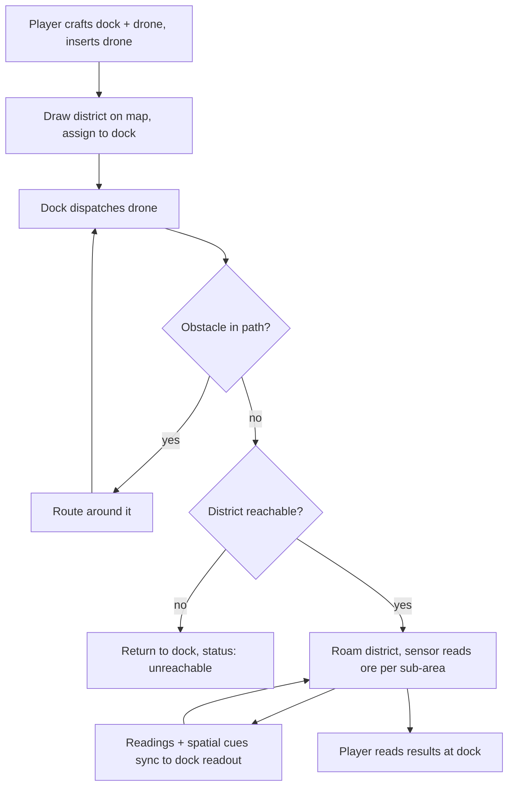

# Survey Drone (Advanced Electronics v1) - Plan

## Goal Capsule

- **Objective:** Ship v1 of the Advanced Electronics mod: a ground survey drone that autonomously roams a player-drawn map district, gathers ore data, and reports it — with enough spatial resolution to direct a dig site — through a readout on its dock.
- **Product authority:** Brainstorm dialogue (this doc) seeded by `docs/ideation/2026-07-10-advanced-electronics-mod-ideation.html`; user decisions override the ideation seed where they differ (ground rover replaces the flying-drone concept).
- **Open blockers:** None — the feasibility spike answered Q1–Q3 on 2026-07-12 (gate cleared; see Dependencies / Assumptions). Planning opens with the Q0 architecture KTD (Outstanding Questions).

---

## Product Contract

### Summary

A craftable ground drone — a custom server entity that borrows the animal system's navigation — surveys a district the player draws on the existing map interface and reports ore presence, density, and location cues on its dock's readout. The drone is itself a craftable item, paired to a dock by inserting it. v1 ships a single ore-density sensing component; release is private-server first, public release hardening comes later.

### Problem Frame

Mining in Eco is tedious manual labor, and the game offers no in-world way to learn where ore is beyond digging. The Advanced Electronics mod's thesis (established during ideation) is automation that plugs into Eco's economy and law systems rather than bypassing them. The hardest technical risk found during ideation is locomotion: the Eco ModKit exposes no client-side vehicle or pathfinding system, so any moving machine must get its movement from the server. The animal system is the one place in the game where pathfinding and autonomous behavior already exist — this v1 exists to prove a drone can be built on that foundation and deliver real survey value with the smallest possible slice.

### Key Decisions

- **Custom server entity borrowing animal navigation, not a reskinned animal.** The drone is its own server class that calls the pathfinding/steering machinery animals use, without the animal lifecycle. More server code than reskinning a deer, but no ecosystem baggage (population counts, predator reactions, hunting) and a clean base for the citizen-under-law model.
- **Ground rover, not flying drone.** Walking machines get terrain-aware movement from shipped navigation code; flight would have to be faked with server-side waypoint math and looks teleport-y under SyncPhysics snap rules.
- **District-based control through the existing map interface.** The player draws a survey district the same way districts are drawn for laws, then assigns it to the dock. Reuses a shipped UI; no custom client UI (none is possible — the ModKit exposes no custom UI system).
- **Dock readout, not report items.** Survey results render as text/gauge state on the dock object itself (server-synced string/float states driving the diegetic panel). Glanceable, inventory-free; tradeable survey-report items stay open for a later milestone.
- **Drone pairs to dock by containment.** The drone is a craftable item inserted into the dock; the dock dispatches its contained drone. Pairing needs no separate linking mechanic, and drones remain tradeable goods.
- **Owner attribution now, law enforcement later.** Drones are invulnerable to tool damage and animal attacks and roam freely (including across claims). Every drone action is recorded as attributable to its owner, but enforcement of town laws against drone behavior is deferred to the public-release milestone — v1 is a private server where owner and lawmaker are the same person, and law-actor hooks for non-player entities are unverified.
- **Survey data must direct a dig, not just describe a district.** The readout's value floor is spatial: at least one location cue per ore type (e.g., the densest surveyed sub-area), not a district-wide aggregate alone.
- **Private-server release first.** v1 tunes for the author's own server; config surface and balance presets for strangers' servers are a publish-milestone concern.

### Actors

- A1. **Drone owner** — the player who crafts the dock and drone, draws the survey district, and reads results.
- A2. **Survey drone** — autonomous server entity; navigates, senses, returns data. Not directly controllable.
- A3. **Drone dock** — WorldObject; home point, drone container, district assignment, readout surface.

### Requirements

**Drone entity and navigation**

- R1. The drone is a server-side entity that navigates terrain using the same pathfinding/steering machinery the animal system uses, without being an animal (no ecosystem participation: no population counting, no predator/prey interactions, not huntable).
- R2. The drone detects blocks and player-placed objects (tables, machines, furniture) in its path and navigates around them without colliding or clipping.
- R3. The drone is invulnerable to tool damage and animal attacks.
- R4. The drone free-roams: it may enter any player's claim or unclaimed land while traveling to or surveying within its district.
- R5. The drone's actions are recorded as attributable to its owner on the entity. (Enforcement of town laws against drone behavior is deferred to the public-release milestone — see Scope Boundaries.)

**Survey behavior and data**

- R6. The drone surveys only within the district assigned to its dock, and idles at or returns to the dock when no district is assigned.
- R7. The v1 sensor reports ore presence and density for the surveyed district, per ore type.
- R8. Survey output localizes ore well enough to direct a dig site: the readout carries at least one spatial cue per ore type (e.g., the district subdivided into cells, with the densest surveyed cell per ore surfaced).
- R9. The drone's ore-density sensing is implemented as a discrete sensing component. (A generalized pluggable-module architecture is deferred — see Scope Boundaries.)

**Dock and control**

- R10. The dock is a craftable WorldObject and the drone's home point; the drone is dispatched from and returns to it.
- R11. The drone is a craftable item; inserting it into a dock pairs it to that dock, and the dock dispatches its contained drone.
- R12. The player assigns a survey district to the dock by selecting an area drawn with the existing map/district interface.
- R13. Assigning a district takes effect immediately: a deployed drone re-paths to the newly assigned district from its current position.
- R14. Survey results render as a readout on the dock itself, using server-synced object state (text and gauge values) — no custom client UI.
- R15. The dock exposes the drone's status through server-synced state — idle / en-route / surveying / unreachable. When the drone cannot reach its assigned district, it returns to the dock and the status shows unreachable; when it cannot return, the status likewise shows unreachable.

**Client assets**

- R16. The mod ships client prefabs for the dock (with launch/return/working animation states and the readout surface) and the drone (with locomotion-appropriate animation), plus an item icon for the drone, following the ModKit's exact-name matching contract with the server mod.

### Key Flows

- F1. **Assign and dispatch**
  - **Trigger:** A1 inserts a crafted drone into the dock, draws a district on the map, and assigns it to the dock.
  - **Steps:** Dock validates assignment; dock dispatches its contained drone; drone paths to the district, avoiding obstacles en route; dock status shows en-route.
  - **Outcome:** Drone is surveying inside the district. **Covers R2, R4, R6, R10, R11, R12, R15.**
- F2. **Survey loop**
  - **Trigger:** Drone is inside its assigned district.
  - **Steps:** Drone roams the district; the ore-density sensing component accumulates readings per sub-area; readings sync to the dock as they update.
  - **Outcome:** Dock state reflects current survey data with spatial cues. **Covers R1, R7, R8, R9, R14.**
- F3. **Read results**
  - **Trigger:** A1 approaches the dock.
  - **Steps:** A1 reads the readout (ore types, density, densest sub-areas, coverage, drone status) directly off the dock object.
  - **Outcome:** A1 knows where to mine without any inventory or menu interaction. **Covers R8, R14, R15.**

### Acceptance Examples

- AE1. **Covers R2.** Given a player's table sits between the drone and its district, when the drone paths toward the district, then it routes around the table and never clips through it.
- AE2. **Covers R3.** Given another player strikes the drone with a pickaxe, or a wolf attacks it, then the drone takes no damage and continues its task.
- AE3. **Covers R4, R5.** Given the drone's route crosses another player's claim, then the drone crosses freely and its presence there is recorded as attributable to its owner.
- AE4. **Covers R6.** Given the dock has no assigned district, when the drone finishes its current task, then it returns to the dock and idles rather than roaming.
- AE5. **Covers R7, R14.** Given the drone has surveyed part of its district, when the owner inspects the dock, then the readout shows per-ore presence/density for the surveyed area — data the player could not know without digging.
- AE6. **Covers R8.** Given the drone has surveyed its district, when the owner reads the readout, then it names the densest surveyed sub-area per ore type — enough to choose a dig site without test-digging the whole district.
- AE7. **Covers R12.** Given the player has drawn a district on the map, when they select it on the dock, then the dock records the assignment and dispatches the drone.
- AE8. **Covers R13.** Given the drone is mid-survey, when the owner assigns a different district to the dock, then the drone immediately re-paths to the new district from its current position.
- AE9. **Covers R15.** Given the assigned district is unreachable by ground (e.g., across open water), when the drone fails to find a path, then it returns to the dock and the dock status shows unreachable.

### Scope Boundaries

Deferred for later milestones:

- Mining drones and any block extraction, new world-generation ores, processing chains, and the Advanced Electronics skill/XP tree.
- Law enforcement against drone behavior (and the legal-actor hook investigation): v1 records owner attribution only; treating the drone as a citizen under town law lands with the public-release milestone.
- The player-facing behavior-programming system and any generalized sensor-module architecture: v1 implements the ore-density sensor as a discrete component; module generality is deferred until a second module is actually scheduled.
- Additional sensors (terrain profile, surface resources, pollution readings).
- Tradeable survey-report items, fleet-size gating, and multi-drone coordination.
- Public-release hardening: config surface, balance presets, per-server tuning.

### Dependencies / Assumptions

Verified this session against the client repo (independent verifier, file:line confirmed):

- The ModKit exposes no client vehicle/locomotion system and no custom UI system; movement is server-driven (`SyncPhysics`), and object state syncs through WorldObject string/float state arrays — the readout, status, and animation hooks R14–R16 need exist.
- The ModKit's only animal-related client components are legacy stubs (`OldAnimalAnimationManager`, `OldAnimalInterpolateTransform` — empty partial classes over precompiled DLLs), and the ModKit docs expose no animal/moving-entity mod pipeline (items, world objects, block sets, emoji only). The drone's client rendering should therefore default to the SyncPhysics-on-WorldObject path; the animal-renderer branch is unlikely to be open to mod bundles.

Spike results — FINAL (three live runs, 2026-07-12, Eco 0.13.0.4 server; full evidence in `docs/spikes/2026-07-survey-drone-spike.md`; all evidence against `Eco.ReferenceAssemblies 0.13.0.4-beta-release-1024`):

- **Q1 — external animal puppeteering FAILS; brain-driven navigation WORKS.** Vanilla animals ignore every external navigation command (five levers tested); their own brain paths fine (flee test). R1 as originally worded ("borrowing animal navigation without being an animal") is not buildable. Two viable drone architectures, decided during planning as a KTD: (i) `AnimalEntity` subclass with a custom behavior and ecosystem opt-outs, or (ii) WorldObject mover with self-written navigation.
- **Q2 — server-driven WorldObject movement renders on the client: PASS.** Continuous movement confirmed. Note for implementation: the mod-facing `AddToTick`/`NextTickTime` surface never re-fires — the real dock/drone must tick from its own WorldObject component (vanilla `ElevatorComponent` pattern). Locomotion-animation state hooks remain open until a custom prefab exists.
- **Q3 — district data readable: PASS** (names + positional membership via `DistrictMap.GetDistrictAtWorldPos`). The district *picker* on the dock's object UI is unproven (0.11-era UI attribute gone in 0.13); chat-command district assignment is the working fallback for R12's interaction half.
- Obstacle avoidance (R2): exists inside the brain machinery (flee navigates terrain); for architecture (ii) it is self-implemented and unverified.

**Spike gate: CLEARED (2026-07-12).** Implementation planning may harden. Planning must open with the architecture KTD — subclass-with-behavior (i) vs self-navigated WorldObject (ii) — and reword R1 accordingly.

### Outstanding Questions

Resolved by the feasibility spike (2026-07-12 — see Dependencies / Assumptions above and `docs/spikes/2026-07-survey-drone-spike.md`):

- Q1. ANSWERED — external puppeteering fails; brain-driven navigation works. Drone architecture fork (subclass-with-behavior vs self-navigated WorldObject) goes to planning as its opening KTD.
- Q2. ANSWERED — server-driven WorldObject movement renders continuously; real mod ticks from its own component. Animation-state hooks remain a client-side open item until a custom prefab exists.
- Q3. ANSWERED — district data readable; picker UI unproven, chat-command assignment is the fallback.

Deferred to planning:

- Q0. Architecture KTD from Q1: `AnimalEntity` subclass with custom behavior (navigation for free, ecosystem opt-outs needed) vs WorldObject mover with self-written navigation (rendering proven, pathing on us). Reword R1 to match the chosen arm.

- Q4. Survey data model: sub-area/cell granularity, accuracy/probabilistic shape, and coverage tracking — whatever granularity is chosen must satisfy R8's spatial-cue floor.
- Q5. Readout format on the dock: which states map to text vs gauges, and how much fits the diegetic-panel constraint comfortably.

### Sources / Research

- `docs/ideation/2026-07-10-advanced-electronics-mod-ideation.html` — ranked ideation with grounding evidence; ideas 1 (dock architecture), 6 (progression), 7 (diegetic panels) feed this contract.
- Evidence dossiers (session scratch, verified quotes with file:line): WorldObject client surface, block sets, ModKit pipeline — `C:` temp paths recorded in the ideation doc's grounding section; key facts restated under Dependencies / Assumptions.
- External patterns considered: Vintage Story probabilistic prospecting (survey value without deterministic reveal); DJI-style dock-centric operation (retained for the dock, superseded for locomotion by the ground-rover decision).
