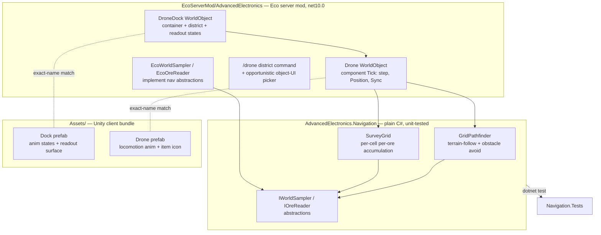
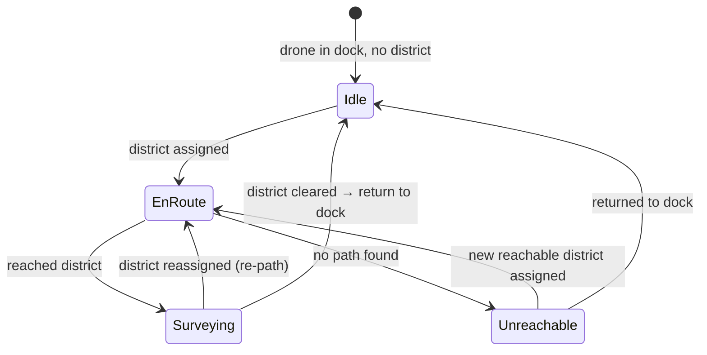

# Survey Drone (Advanced Electronics v1) - Plan

## Goal Capsule

- **Objective:** Ship v1 of the Advanced Electronics mod: a ground survey drone that autonomously roams a player-drawn map district, gathers ore data, and reports it — with enough spatial resolution to direct a dig site — through a readout on its dock.
- **Product authority:** Brainstorm dialogue (this doc) seeded by `docs/ideation/2026-07-10-advanced-electronics-mod-ideation.html`; the feasibility spike (`docs/spikes/2026-07-survey-drone-spike.md`) settled the architecture. User decisions override the ideation seed where they differ.
- **Product Contract preservation:** changed R1, the Summary, and two Key Decisions — reworded from "borrows the animal system's navigation" to "WorldObject mover with self-written navigation" per the spike verdict (external animal puppeteering fails; see Dependencies / Assumptions). No scope change: the drone does the same thing; only the mechanism the wording named is corrected. All other R/A/F/AE IDs unchanged.
- **Execution profile:** Server code (dotnet) compiles and its pure-logic core is `dotnet test`-covered; the in-game glue is verified by a documented manual protocol (Eco has no headless mod test harness). Client assets are Unity-Editor work verified by an Editor checklist, and by the Unity MCP tools once they register in the session.
- **Stop conditions:** Stop and surface (do not guess) if `Eco.ReferenceAssemblies` cannot restore, if a required Eco API the plan names is absent from the 0.13.0.4 surface, or if a client prefab cannot be name-matched to its server class.

---

## Product Contract

### Summary

A craftable ground drone — a custom server-side WorldObject that moves via a component tick and navigates with self-written terrain-following pathfinding — surveys a district the player draws on the existing map interface and reports ore presence, density, and location cues on its dock's readout. The drone is itself a craftable item, paired to a dock by inserting it. v1 ships a single ore-density sensing component; release is private-server first, public release hardening comes later.

### Problem Frame

Mining in Eco is tedious manual labor, and the game offers no in-world way to learn where ore is beyond digging. The Advanced Electronics mod's thesis (established during ideation) is automation that plugs into Eco's economy and law systems rather than bypassing them. The hardest technical risk found during ideation was locomotion: the Eco ModKit exposes no client-side vehicle or pathfinding system, so any moving machine must get its movement from the server. The feasibility spike resolved this — a server-moved WorldObject renders on the client, and vanilla animals cannot be externally puppeteered — so the drone is a WorldObject mover with navigation the mod writes itself.

### Key Decisions

- **Custom server WorldObject with self-written navigation, not a reskinned animal or an `AnimalEntity` subclass.** The spike proved external animal puppeteering fails (the brain overrides every external command) while a server-moved WorldObject renders continuously on the client. A WorldObject mover keeps every dependency on proven, ModKit-supported surface (rendering, component tick, the prefab pipeline) at the cost of writing the pathing — which for a ground rover is tractable and, crucially, unit-testable pure C#.
- **Ground rover, not flying drone.** Terrain-following movement is simpler to make legible and avoids the teleport-y look of faked flight under SyncPhysics snap rules.
- **District-based control through the existing map interface.** The player draws a survey district the same way districts are drawn for laws, then assigns it to the dock. Reuses a shipped UI; no custom client UI (none is possible — the ModKit exposes no custom UI system). The spike confirmed district data is readable server-side; the on-object picker is unproven, so a chat-command assignment is the guaranteed fallback.
- **Dock readout, not report items.** Survey results render as text/gauge state on the dock object itself (server-synced string/float states driving the diegetic panel). Glanceable, inventory-free; tradeable survey-report items stay open for a later milestone.
- **Drone pairs to dock by containment.** The drone is a craftable item inserted into the dock; the dock dispatches its contained drone. Pairing needs no separate linking mechanic, and drones remain tradeable goods.
- **Owner attribution now, law enforcement later.** Drones are invulnerable to tool damage and animal attacks and roam freely (including across claims). Every drone action is recorded as attributable to its owner, but enforcement of town laws against drone behavior is deferred to the public-release milestone — v1 is a private server where owner and lawmaker are the same person, and law-actor hooks for non-player entities are unverified.
- **Survey data must direct a dig, not just describe a district.** The readout's value floor is spatial: at least one location cue per ore type (the densest surveyed grid cell), not a district-wide aggregate alone.
- **Private-server release first.** v1 tunes for the author's own server; config surface and balance presets for strangers' servers are a publish-milestone concern.

### Actors

- A1. **Drone owner** — the player who crafts the dock and drone, draws the survey district, and reads results.
- A2. **Survey drone** — autonomous server entity; navigates, senses, returns data. Not directly controllable.
- A3. **Drone dock** — WorldObject; home point, drone container, district assignment, readout surface.

### Requirements

**Drone entity and navigation**

- R1. The drone is a server-side WorldObject that moves via its own component tick and navigates terrain with self-written pathfinding (no dependency on the animal brain), setting position/rotation and syncing to clients each tick.
- R2. The drone detects blocks and player-placed objects (tables, machines, furniture) in its path and navigates around them without colliding or clipping.
- R3. The drone is invulnerable to tool damage and animal attacks.
- R4. The drone free-roams: it may enter any player's claim or unclaimed land while traveling to or surveying within its district.
- R5. The drone's actions are recorded as attributable to its owner on the entity. (Enforcement of town laws against drone behavior is deferred to the public-release milestone — see Scope Boundaries.)

**Survey behavior and data**

- R6. The drone surveys only within the district assigned to its dock, and idles at or returns to the dock when no district is assigned.
- R7. The v1 sensor reports ore presence and density for the surveyed district, per ore type.
- R8. Survey output localizes ore well enough to direct a dig site: the readout carries at least one spatial cue per ore type (the district subdivided into cells, with the densest surveyed cell per ore surfaced).
- R9. The drone's ore-density sensing is implemented as a discrete sensing component. (A generalized pluggable-module architecture is deferred — see Scope Boundaries.)

**Dock and control**

- R10. The dock is a craftable WorldObject and the drone's home point; the drone is dispatched from and returns to it.
- R11. The drone is a craftable item; inserting it into a dock pairs it to that dock, and the dock dispatches its contained drone.
- R12. The player assigns a survey district to the dock by selecting an area drawn with the existing map/district interface.
- R13. Assigning a district takes effect immediately: a deployed drone re-paths to the newly assigned district from its current position.
- R14. Survey results render as a readout on the dock itself, using server-synced object state (text and gauge values) — no custom client UI.
- R15. The dock exposes the drone's status through server-synced state — idle / en-route / surveying / unreachable. When the drone cannot reach its assigned district, it returns to the dock and the status shows unreachable; when it cannot return, the status likewise shows unreachable.

**Client assets**

- R16. The mod ships client prefabs for the dock (with launch/return/working animation states and the readout surface) and the drone (with locomotion-appropriate animation), plus an item icon for the drone, following the ModKit's exact-name matching contract with the server mod.

### Key Flows

- F1. **Assign and dispatch**
  - **Trigger:** A1 inserts a crafted drone into the dock, draws a district on the map, and assigns it to the dock.
  - **Steps:** Dock validates assignment; dock dispatches its contained drone; drone paths to the district, avoiding obstacles en route; dock status shows en-route.
  - **Outcome:** Drone is surveying inside the district. **Covers R2, R4, R6, R10, R11, R12, R15.**
- F2. **Survey loop**
  - **Trigger:** Drone is inside its assigned district.
  - **Steps:** Drone roams the district; the ore-density sensing component accumulates readings per grid cell; readings sync to the dock as they update.
  - **Outcome:** Dock state reflects current survey data with spatial cues. **Covers R1, R7, R8, R9, R14.**
- F3. **Read results**
  - **Trigger:** A1 approaches the dock.
  - **Steps:** A1 reads the readout (ore types, density, densest cells, coverage, drone status) directly off the dock object.
  - **Outcome:** A1 knows where to mine without any inventory or menu interaction. **Covers R8, R14, R15.**

### Acceptance Examples

- AE1. **Covers R2.** Given a player's table sits between the drone and its district, when the drone paths toward the district, then it routes around the table and never clips through it.
- AE2. **Covers R3.** Given another player strikes the drone with a pickaxe, or a wolf attacks it, then the drone takes no damage and continues its task.
- AE3. **Covers R4, R5.** Given the drone's route crosses another player's claim, then the drone crosses freely and its presence there is recorded as attributable to its owner.
- AE4. **Covers R6.** Given the dock has no assigned district, when the drone finishes its current task, then it returns to the dock and idles rather than roaming.
- AE5. **Covers R7, R14.** Given the drone has surveyed part of its district, when the owner inspects the dock, then the readout shows per-ore presence/density for the surveyed area — data the player could not know without digging.
- AE6. **Covers R8.** Given the drone has surveyed its district, when the owner reads the readout, then it names the densest surveyed cell per ore type — enough to choose a dig site without test-digging the whole district.
- AE7. **Covers R12.** Given the player has drawn a district on the map, when they select it on the dock, then the dock records the assignment and dispatches the drone.
- AE8. **Covers R13.** Given the drone is mid-survey, when the owner assigns a different district to the dock, then the drone immediately re-paths to the new district from its current position.
- AE9. **Covers R15.** Given the assigned district is unreachable by ground (e.g., across open water), when the drone fails to find a path, then it returns to the dock and the dock status shows unreachable.

### Scope Boundaries

Deferred for later milestones:

- Mining drones and any block extraction, new world-generation ores, processing chains, and the Advanced Electronics skill/XP tree.
- Law enforcement against drone behavior (and the legal-actor hook investigation): v1 records owner attribution only; treating the drone as a citizen under town law lands with the public-release milestone.
- The player-facing behavior-programming system and any generalized sensor-module architecture: v1 implements the ore-density sensor as a discrete component; module generality is deferred until a second module is actually scheduled.
- Additional sensors (terrain profile, surface resources, pollution readings).
- Tradeable survey-report items, fleet-size gating, and multi-drone coordination.
- Public-release hardening: config surface, balance presets, per-server tuning.

#### Deferred to Follow-Up Work

- Promote the spike's diagnostic `/spike` commands into a supported debug surface, or delete them once the real mod's own telemetry replaces them (they stay as committed reference for now).
- The on-object district picker (map-interface selection directly on the dock UI): v1 ships the chat-command assignment; the picker is attempted opportunistically in U6 and dropped to follow-up if the 0.13 object-UI attribute surface doesn't support it cheaply.

### Dependencies / Assumptions

Verified this session against the client repo (independent verifier, file:line confirmed):

- The ModKit exposes no client vehicle/locomotion system and no custom UI system; movement is server-driven, and object state syncs through WorldObject string/float state arrays — the readout, status, and animation hooks R14–R16 need exist.

Spike results — FINAL (three live runs, 2026-07-12, Eco 0.13.0.4 server; full evidence in `docs/spikes/2026-07-survey-drone-spike.md`; all evidence against `Eco.ReferenceAssemblies 0.13.0.4-beta-release-1024`):

- **Q1 — architecture resolved to the WorldObject mover.** External animal puppeteering fails (five levers tested; the brain overrides every external command). The plan builds the self-navigated WorldObject arm; R1 reworded accordingly.
- **Q2 — server-driven WorldObject movement renders on the client: PASS.** Continuous movement confirmed. Implementation constraint: the mod-facing `IWorldObjectManager.AddToTick`/`NextTickTime` surface does not re-fire — the drone must tick from its own `WorldObjectComponent.Tick()` (vanilla `ElevatorComponent` pattern), setting `Position`/`Rotation` + `SyncPositionAndRotation()` each tick. Locomotion-animation state hooks remain open until a custom prefab exists.
- **Q3 — district data readable: PASS** (`Eco.Gameplay.Civics.Districts.DistrictMap.GetDistrictAtWorldPos`, registrar-managed). The on-object picker is unproven; chat-command assignment is the working fallback for R12's interaction half.
- **Environment:** reference assemblies target **net10.0**; game-version pin must match the server build (currently `0.13.0.4-beta-release-1024`). Eco 0.13 uses `System.Numerics.Vector3` (no `Eco.Shared.Math.Vector3`). Captured as a durable learning in `docs/solutions/best-practices/eco-013-server-driven-movement.md`.

**Unverified until implementation (self-written navigation, R2):** obstacle avoidance around player-placed WorldObjects and terrain step-height handling are the mod's own code; the spike proved only that brain-driven navigation handles terrain, not that a self-written pather does. U3 owns this risk and carries the plan's only real automated test suite.

**Tooling:** Unity MCP was configured mid-session but its tools had not registered in the running session at plan time. Client-asset units (U9–U11) name both an Editor/manual verification path and the Unity MCP checks to run once the tools are live.

### Sources / Research

- `docs/spikes/2026-07-survey-drone-spike.md` — feasibility spike: architecture verdict, the WorldObject-tick constraint, district-read API, and the manual protocol shape reused by this plan's in-game verification.
- `docs/solutions/best-practices/eco-013-server-driven-movement.md` — the proven movement path (component tick → `Position` → `SyncPositionAndRotation()`), the `AddToTick` dead end, and the net10 / version-pin / `Vector3` environment facts.
- `EcoServerMod/AdvancedElectronics.Spike/` — committed reference implementation of the movement, district-read, and command-registration patterns the real mod mirrors.
- `docs/ideation/2026-07-10-advanced-electronics-mod-ideation.html` — ranked ideation seed (dock architecture, diegetic panels).
- `Assets/EcoModKit/Docs/README.md` — ModKit content pipeline (world objects, items, block sets, bundles); the client-asset units follow its exact-name-matching contract.

---

## Planning Contract

### Key Technical Decisions

- **KTD1 — Real mod is a new `EcoServerMod/AdvancedElectronics/` project; the spike stays as reference.** The `AdvancedElectronics.Spike` project's `/spike` commands are throwaway diagnostics; promoting them wholesale violates the no-dead-end-code rule. The real mod is a clean sibling project reusing the spike's proven patterns (csproj shape, version pin, tick approach) by reference, not by inheritance. The spike remains committed as documentation of the API findings.
- **KTD2 — Navigation and survey-grid logic live behind a world-abstraction so they are unit-testable without Eco assemblies.** Define narrow interfaces (`IWorldSampler` for block/solidity/height queries at a position, `IOreReader` for ore-type-at-block) in a plain-C# library project. The pathfinder and the grid-survey accumulator depend only on those interfaces. The Eco mod implements them against the real world; the test project implements them against hand-built fake grids. This is what makes R2/R8 behavior provable in `dotnet test` — the repo's first automated test suite — despite Eco having no headless mod harness.
- **KTD3 — The drone ticks from its own `WorldObjectComponent.Tick()`, never the mod-facing `AddToTick`.** Forced by the spike: `AddToTick`/`NextTickTime` does not re-fire for mod callbacks. Each tick the component advances the pather one step, sets `Position`/`Rotation`, and calls `SyncPositionAndRotation()`. The dock is a WorldObject; the drone is a second WorldObject the dock spawns/moves, matching the proven `ElevatorComponent` shape.
- **KTD4 — District assignment ships as a chat command in v1; the on-object picker is opportunistic.** The spike proved district *reads* work but left the on-object picker unproven (the 0.11 UI attribute is gone in 0.13). v1's guaranteed path is a `/drone district <name>` style admin/owner command that resolves a `DistrictMap` entry and stores it on the dock. U6 spends a bounded attempt on an auto-generated object-UI selector; if it doesn't fall out cheaply, the picker drops to follow-up and the command remains the shipped mechanism.
- **KTD5 — Survey data model (resolves Q4): a fixed grid of cells over the district's bounding area, per-cell per-ore density accumulated from blocks the drone samples as it roams.** Each cell holds a per-ore-type running count of ore blocks sampled and total blocks sampled (coverage). "Densest cell per ore" (R8) is `argmax` over cells of ore-count/sampled-count. Cell size is a single tunable constant. Probabilistic shape is deferred — v1 reports observed density over sampled blocks, honestly labeled as coverage-limited.
- **KTD6 — Readout format (resolves Q5): text-first via `StringStates`, one gauge via a `FloatState`.** The dock's readout is text lines (`StringStates`): drone status, then per-ore `"<ore>: densest at <cellCoord>, ~<density>%"`. Coverage percentage is a single `FloatState` gauge. This fits the diegetic-panel constraint (no custom UI) and carries the R8 spatial cue in text.
- **KTD7 — Invulnerability and free-roam by construction (R3, R4); attribution stored on the entity (R5).** The drone WorldObject opts out of damage handling (no `IDamageable`/health surface) and has no claim-permission gate on movement. Owner is stored as a field on the drone/dock and stamped on any attributable action, without wiring Eco's law-enforcement hooks (deferred).

### High-Level Technical Design

Three projects; the pure-logic core is isolated from Eco so it can be tested.

### Assumptions carried into units

- The Eco world exposes block-type and solidity/height queries at a world position callable from a `WorldObjectComponent` tick (spike touched world reads for districts; the exact block-query API is confirmed in U3's first step against the restored assemblies — a stop-condition if absent).
- District geometry is enumerable to a bounding area for the survey grid (spike used `GetDistrictAtWorldPos` for point membership; U5 confirms an enumerable/bounds accessor exists, else it samples membership per cell-center).
- A WorldObject can be spawned and repositioned by another WorldObject's component (proven for movement in the spike; the spawn/containment pairing is exercised in U1).

### Sequencing

Phase A (foundations): U1 → U2 (needs U1) with U3 buildable in parallel (pure library). Phase B (survey): U4, U5 (needs U2), U8 (needs U2, U3, U4), U6 (needs U5, U8). Phase C: U7 (needs U1, U2). Phase D (client): U9, U10 (need U1 for names), U11 (needs U9, U10). Cap parallel work where server units touch shared world-query glue.

---

## Implementation Units

### U1. Mod project scaffold, dock + drone WorldObjects, containment pairing

- **Goal:** A new `EcoServerMod/AdvancedElectronics/` mod builds green and registers a craftable `DroneDock` WorldObject and a craftable `SurveyDrone` item/WorldObject; inserting the drone item into the dock pairs them.
- **Requirements:** R10, R11.
- **Dependencies:** none.
- **Files:** `EcoServerMod/AdvancedElectronics/AdvancedElectronics.csproj`, `EcoServerMod/AdvancedElectronics/ModRegistration.cs`, `EcoServerMod/AdvancedElectronics/DroneDock.cs`, `EcoServerMod/AdvancedElectronics/SurveyDrone.cs`, `.gitignore` (extend the `EcoServerMod/**` rules to the new project), `EcoServerMod/README.md` (add the new project).
- **Approach:** Mirror the spike csproj (net10.0, `EcoRefVersion` pin, `Local.props` deploy override). Dock is a `WorldObject` with a container/slot for the drone item; on insert, store the drone's identity and expose a "has drone" state. Reuse the spike's registration pattern. Match the Eco recipe/craftable conventions for the item and both world objects.
- **Patterns to follow:** `EcoServerMod/AdvancedElectronics.Spike/ModRegistration.cs` and `.csproj`; vanilla containered WorldObjects for the slot mechanic.
- **Test scenarios:** `Test expectation: none — scaffolding + Eco-bound registration; verified by build + the in-game insert check in Verification.`
- **Verification:** `dotnet build EcoServerMod/AdvancedElectronics` exits 0; csproj is git-tracked; in-game (manual protocol) crafting the dock and inserting the drone item shows the dock's "has drone" state.

### U2. Drone mover component — server-driven movement via component tick

- **Goal:** The drone moves under server control by stepping along a supplied path each `WorldObjectComponent.Tick()`, setting `Position`/`Rotation` and syncing to clients.
- **Requirements:** R1.
- **Dependencies:** U1, U3.
- **Files:** `EcoServerMod/AdvancedElectronics/DroneMoverComponent.cs`, `EcoServerMod/AdvancedElectronics/EcoWorldSampler.cs`.
- **Approach:** Per KTD3, drive movement from the component tick (never `AddToTick`). The component holds a current path (from U3's pathfinder) and advances one step per tick, writing `Position` + `Rotation` and calling `SyncPositionAndRotation()`. `EcoWorldSampler` implements U3's `IWorldSampler` against the live world (block solidity + ground height at a position). Use `System.Numerics.Vector3`.
- **Execution note:** Movement fidelity (smoothness, snap) is only observable in-game — carry the spike's timer/tick findings; verify against the manual protocol, not a unit test.
- **Patterns to follow:** the spike's proven `Position`/`SyncPositionAndRotation()` movement; vanilla `ElevatorComponent` for component-tick movement; `docs/solutions/best-practices/eco-013-server-driven-movement.md`.
- **Test scenarios:** `Test expectation: none for the Eco glue.` The path-consumption logic that is pure (advance-to-next-waypoint, arrival detection) is covered in U3's suite via the abstraction; the component itself is Eco-bound.
- **Verification:** Build green; in-game, a dispatched drone visibly walks a straight path to a target and stops on arrival (manual protocol).

### U3. Navigation library — terrain-following pathfinder + obstacle avoidance (unit-tested)

- **Goal:** A plain-C# `AdvancedElectronics.Navigation` project computes a walkable ground path from A to B that steps around solid blocks and player-placed obstacles and respects a max step-height, behind `IWorldSampler`/`IOreReader` abstractions — with a `dotnet test` suite proving the behavior.
- **Requirements:** R1, R2.
- **Dependencies:** none (pure library; consumed by U2, U5, U8).
- **Files:** `EcoServerMod/AdvancedElectronics.Navigation/AdvancedElectronics.Navigation.csproj`, `EcoServerMod/AdvancedElectronics.Navigation/IWorldSampler.cs`, `EcoServerMod/AdvancedElectronics.Navigation/GridPathfinder.cs`, `EcoServerMod/AdvancedElectronics.Navigation.Tests/AdvancedElectronics.Navigation.Tests.csproj`, `EcoServerMod/AdvancedElectronics.Navigation.Tests/GridPathfinderTests.cs`.
- **Approach:** Per KTD2, define `IWorldSampler` (is-solid, ground-height at a column) and the pathfinder as A* / greedy grid search over walkable columns with a configurable max step-height and an obstacle predicate. Return a waypoint list or a no-path result. Test project uses xUnit against hand-built fake grids.
- **Execution note:** Build this test-first — write the failing pathfinding test (straight path, wall detour, no-path) before the pathfinder, since this is the plan's one genuinely testable core and the R2 risk owner.
- **Patterns to follow:** standard grid A*; keep it dependency-free so it stays Eco-agnostic.
- **Test scenarios:**
  - Covers R2. Straight, unobstructed path returns a direct waypoint line on flat ground.
  - Covers R2. A wall of solid blocks between A and B yields a path that detours around it and never routes through a solid column.
  - Covers R2. A player-placed obstacle column (flagged via the obstacle predicate) is routed around identically to a solid block.
  - Covers R2. A step up within max step-height is walkable; a cliff exceeding max step-height is treated as impassable.
  - Covers AE9 (unit slice). B fully enclosed by impassable terrain returns an explicit no-path result (feeds U8's unreachable status).
  - Arrival detection: advancing along the returned waypoints reports "arrived" exactly when the final waypoint is reached.
- **Verification:** `dotnet test EcoServerMod/AdvancedElectronics.Navigation.Tests` passes; every scenario above has a named test.

### U4. District read + assignment (chat command; opportunistic picker in U6)

- **Goal:** The owner assigns a survey district to a dock by name via a command; the dock resolves and stores the `DistrictMap` entry and can answer "is world position P inside my district?".
- **Requirements:** R12.
- **Dependencies:** U1.
- **Files:** `EcoServerMod/AdvancedElectronics/DistrictAssignment.cs`, `EcoServerMod/AdvancedElectronics/DroneCommands.cs`.
- **Approach:** Per KTD4, a `/drone district <name>` command (owner/admin auth) resolves a district via the registrar (`DistrictMap`) and stores its id on the dock; membership tests use `GetDistrictAtWorldPos` (proven in the spike). Clearing the district (empty arg) returns the drone to idle.
- **Patterns to follow:** the spike's `SpikeDistrictsCommand` district-read code; the spike's `ChatSubCommand` registration.
- **Test scenarios:** `Test expectation: none — Eco-bound command + registrar read; verified in-game.` (Any pure id-storage/clear logic that can be extracted is covered incidentally in U8's reachability tests.)
- **Verification:** Build green; in-game, drawing a district and running the command stores it (dock reflects the assignment); an unknown name reports a clear error; clearing returns the drone to idle.

### U5. Ore-sensing component + grid-cell survey accumulation

- **Goal:** As the drone roams, an ore-sensing component samples blocks under/around it and accumulates per-cell per-ore density over a fixed grid covering the district; the densest cell per ore is queryable.
- **Requirements:** R7, R8, R9.
- **Dependencies:** U2.
- **Files:** `EcoServerMod/AdvancedElectronics.Navigation/SurveyGrid.cs`, `EcoServerMod/AdvancedElectronics.Navigation.Tests/SurveyGridTests.cs`, `EcoServerMod/AdvancedElectronics/OreSensorComponent.cs`, `EcoServerMod/AdvancedElectronics/EcoOreReader.cs`.
- **Approach:** Per KTD5, `SurveyGrid` (in the pure library, so it is tested) maps world positions to cells and accumulates per-ore counts + sampled totals; `DensestCell(oreType)` is `argmax` of ratio. `OreSensorComponent` (Eco side) calls `IOreReader` for blocks near the drone each survey tick and feeds `SurveyGrid`. Discrete component per R9 — no module abstraction.
- **Execution note:** Grid math is pure — extend U3's test project; write the cell-mapping and densest-cell tests before wiring the Eco sensor.
- **Patterns to follow:** U3's abstraction-behind-interface approach; the spike's block/world reads for the Eco reader.
- **Test scenarios:**
  - Covers R8. Ore sampled only in one cell makes that cell the densest for that ore.
  - Covers R8. Two cells with different ore ratios: densest-cell picks the higher ratio, not the higher raw count.
  - Covers R7. Multiple ore types accumulate independently; each has its own densest cell.
  - Coverage: sampling the same block twice does not double-count beyond the sampled-total (or is idempotent per the chosen sampling rule — name it).
  - Empty survey: densest-cell query with no samples returns a "no data" result, not a false cell.
  - World-position-to-cell mapping: positions on cell boundaries map deterministically (no gaps/overlaps).
- **Verification:** `dotnet test` passes the new SurveyGrid tests; in-game, roaming a seeded area updates the dock readout with plausible densest cells (manual protocol).

### U8. Drone lifecycle — dispatch, return, re-path, unreachable status

- **Goal:** The dock dispatches the drone to its district, the drone surveys, re-paths immediately on reassignment, returns to dock when the district is cleared, and reports `unreachable` when no path exists (to district or back).
- **Requirements:** R6, R13, R15.
- **Dependencies:** U2, U3, U4.
- **Files:** `EcoServerMod/AdvancedElectronics/DroneLifecycle.cs`, `EcoServerMod/AdvancedElectronics.Navigation/DroneStateMachine.cs`, `EcoServerMod/AdvancedElectronics.Navigation.Tests/DroneStateMachineTests.cs`.
- **Approach:** Extract the status state machine (Idle/EnRoute/Surveying/Unreachable, transitions per the HTD state diagram) into the pure library so transitions are tested; the Eco-side `DroneLifecycle` drives it from tick events and pathfinder results. Reassignment interrupts the current path and requests a new one from the drone's current position (R13). A no-path result (U3) drives the `unreachable` transition and a return attempt; a failed return also lands `unreachable`.
- **Execution note:** State transitions are pure and edge-heavy — test-first.
- **Test scenarios:**
  - Covers R6. No district assigned → state resolves to Idle and a survey tick performs no sampling.
  - Covers R13. Reassignment while Surveying transitions to EnRoute against the new district from the current position.
  - Covers AE9 / R15. Pathfinder returns no-path to the district → Unreachable, and a return-to-dock is attempted.
  - Covers R15. No-path on the return leg → status stays/returns to Unreachable rather than silently idling.
  - Covers R6. District cleared while Surveying → EnRoute back to dock → Idle on arrival.
- **Verification:** `dotnet test` passes the state-machine tests; in-game, the AE7/AE8/AE9 flows behave as specified (manual protocol).

### U6. Dock readout + status states (text + gauge), opportunistic object-UI picker

- **Goal:** The dock renders drone status and per-ore densest-cell survey lines as server-synced text state, plus a coverage gauge; a bounded attempt is made at an on-object district picker.
- **Requirements:** R14, R15, R8.
- **Dependencies:** U5, U8.
- **Files:** `EcoServerMod/AdvancedElectronics/DockReadout.cs`, `EcoServerMod/AdvancedElectronics/DroneDock.cs` (extend), `EcoServerMod/README.md` (record picker outcome).
- **Approach:** Per KTD6, push status + per-ore `"<ore>: densest at <cell>, ~<pct>%"` lines into `StringStates`, coverage into a `FloatState`, driven off U5's `SurveyGrid` and U8's state machine. Spend a bounded effort probing a 0.13 auto-generated object-UI selector for district choice; if it doesn't fall out cheaply, record the negative finding in the README and rely on U4's command (per KTD4 / Deferred to Follow-Up).
- **Patterns to follow:** the WorldObject string/float state arrays confirmed in the ideation dossiers; the spike's README picker-findings section.
- **Test scenarios:** `Test expectation: none — Eco state-sync + formatting glue; the underlying densest-cell/coverage values are covered by U5, and status by U8.` Add one pure test only if the line-formatting logic is nontrivial enough to extract.
- **Verification:** In-game, the dock shows live status transitions and, after survey, the densest-cell lines and coverage gauge matching what the drone sampled (manual protocol); picker outcome recorded in the README.

### U7. Invulnerability, free-roam, owner attribution

- **Goal:** The drone takes no tool or animal damage, crosses claims freely, and stamps its owner on attributable actions.
- **Requirements:** R3, R4, R5.
- **Dependencies:** U1, U2.
- **Files:** `EcoServerMod/AdvancedElectronics/SurveyDrone.cs` (extend), `EcoServerMod/AdvancedElectronics/DroneOwnership.cs`.
- **Approach:** Per KTD7, the drone WorldObject exposes no damage/health surface (so tool/animal damage has nothing to act on) and gates no movement on claim permissions. Owner is stored at craft/insert time and stamped on the entity; no law-enforcement hooks (deferred).
- **Test scenarios:** `Test expectation: none — behavior is the absence of damage/permission wiring; verified in-game per AE2/AE3.` Pure owner-stamping logic, if extracted, gets one assignment test.
- **Verification:** In-game (manual protocol), striking the drone with a tool and a wolf attacking both leave it unharmed (AE2); a route crossing a claim proceeds and is attributed to the owner (AE3).

### U9. Dock client prefab (Unity)

- **Goal:** A `DroneDock` client prefab exists with launch/return/working animation states and a readout surface, exact-name-matched to the server dock class.
- **Requirements:** R16.
- **Dependencies:** U1 (name match).
- **Files:** `Assets/Art/AdvancedElectronics/DroneDock.prefab` (+ `.meta`), dock mesh/material assets under `Assets/Art/AdvancedElectronics/`, scene wiring per the ModKit `ModkitPrefabContainer` pattern.
- **Approach:** Follow `Assets/EcoModKit/Docs/README.md` world-object flow (create → tag `ModObject` → add `WorldObject` component → prefab). Wire animation states for launch/return/working to the server-synced states from U6/U8. Readout surface renders the `StringStates`/`FloatState`.
- **Execution note:** Unity-Editor work — no headless build here. Verify via the Editor checklist and Unity MCP once its tools register.
- **Test scenarios:** `Test expectation: none — Unity asset; verified by Editor checklist + name-match validation (U11).`
- **Verification:** Prefab name equals the server dock class name exactly; animation states bind to the synced state names; renders in the Editor. Unity MCP (when available): confirm prefab exists, is `ModObject`-tagged, carries the `WorldObject` component, and its name matches.

### U10. Drone client prefab + item icon (Unity)

- **Goal:** A `SurveyDrone` client prefab with locomotion-appropriate animation and a 64×64 item icon, exact-name-matched to the server classes.
- **Requirements:** R16.
- **Dependencies:** U1 (name match).
- **Files:** `Assets/Art/AdvancedElectronics/SurveyDrone.prefab` (+ `.meta`), drone mesh/material, `Assets/Art/AdvancedElectronics/SurveyDrone_icon` (item icon, 64×64), unpacked from the ModKit item template.
- **Approach:** World-object flow for the drone body; item-icon flow (unpack ItemTemplate → rename → edit sprite) for the inventory item. Locomotion animation driven by movement/velocity state so server-driven motion reads as walking.
- **Execution note:** Unity-Editor work; Editor checklist + Unity MCP verification.
- **Test scenarios:** `Test expectation: none — Unity assets; verified by Editor checklist + name-match validation (U11).`
- **Verification:** Prefab and item names equal their server class names exactly; icon renders at 64×64; drone renders and animates in the Editor. Unity MCP (when available): confirm the prefab, tag, component, and name match, and that the icon asset resolves.

### U11. Asset bundle build + name-match validation

- **Goal:** The client assets build into a `.unity3d` bundle, and a validation step confirms every prefab/item name matches a server class name before the bundle ships.
- **Requirements:** R16.
- **Dependencies:** U9, U10.
- **Files:** `AssetBundles/` (build output, git-ignored), a name-match check (editor script or a documented `dotnet`/grep cross-check between `Assets/Art/AdvancedElectronics/` prefab names and `EcoServerMod/AdvancedElectronics/` class names).
- **Approach:** Use `Eco Tools > Mod Kit` to tag the AdvancedElectronics scene root and build the bundle (per ModKit docs). Add the DRC-style name cross-check the spike review recommended: export prefab/item names, diff against server class names, fail loudly on mismatch (the silent-failure seam between the two repos).
- **Execution note:** Bundle build is Editor-driven; the name cross-check can run headless (grep/dotnet) and belongs in the Verification Contract as an automatable gate.
- **Test scenarios:** `Test expectation: none for the bundle; the name cross-check is a scripted gate, not a unit test.`
- **Verification:** Bundle builds to `AssetBundles/`; the name cross-check reports zero mismatches between client prefab/item names and server class names. Unity MCP (when available): trigger/confirm the bundle build and enumerate bundled asset names for the cross-check.

---

## Verification Contract

| Gate | Command / method | Applies to | Blocking |
|---|---|---|---|
| Server mod compiles | `dotnet build EcoServerMod/AdvancedElectronics` | U1, U2, U4, U5, U6, U7, U8 | Yes |
| Navigation + survey + lifecycle logic | `dotnet test EcoServerMod/AdvancedElectronics.Navigation.Tests` | U3, U5, U8 | Yes — the plan's core behavioral gate |
| csproj tracked | `git check-ignore` on the new csprojs must exit non-zero | U1, U3 | Yes |
| Name-match cross-check | Scripted diff of `Assets/Art/AdvancedElectronics/` prefab/item names vs `EcoServerMod/AdvancedElectronics/` server class names | U11 | Yes — silent-failure seam |
| In-game flows (F1–F3, AE1–AE9) | Manual protocol on an Eco 0.13.0.4 server with the mod DLL in `Mods/UserCode` and the bundle installed — extend `docs/spikes/2026-07-survey-drone-spike.md`'s protocol shape | U2, U4, U6, U7, U8 | Out of CI — owner-run; record verdicts |
| Client assets render | Unity Editor checklist (prefab exists, `ModObject`-tagged, `WorldObject` component, name matches, renders) + Unity MCP checks once tools register | U9, U10, U11 | Out of CI — Editor-run |

No web/HTTP surface; no database. The automated gates are `dotnet build`, `dotnet test`, and the name cross-check; everything Eco-runtime- or Unity-Editor-bound is a documented manual/Editor gate, matching the spike's proven verification shape.

## Definition of Done

**Global:**

- `dotnet build` green on the mod; `dotnet test` green on the navigation/survey/lifecycle suite; name cross-check reports zero mismatches; new csprojs tracked.
- Every R1–R16 is advanced by a unit; R1 reworded per the spike; R5/R9 honor their deferrals (attribution-only, discrete-sensor).
- The manual in-game protocol is written (extending the spike report) and its AE1–AE9 verdicts recorded by the owner.
- No dead-end/experimental code left in the tree; the `AdvancedElectronics.Spike` project is either kept as clearly-labeled reference or removed — decided explicitly, not left ambiguous.
- Deferred items (law enforcement, module system, extra sensors, picker if it didn't land, tradeable reports, public config) remain out and are recorded as follow-up.

**Per-unit:** each unit's Verification line is satisfied. The three pure-library units (U3, U5, U8) have passing named tests for every listed scenario; the Eco-bound and Unity units have their build/Editor/manual verification recorded.

---

## Open Questions

Deferred to implementation (execution-time unknowns, not blockers):

- The exact Eco 0.13 block-type/solidity/ground-height query API for `EcoWorldSampler` (U2/U3) — confirmed against the restored assemblies in U3's first step; a stop-condition only if no such API exists.
- Whether district geometry exposes an enumerable bounds accessor for the survey grid, or U5 must sample membership per cell-center (U5 handles either).
- Whether a 0.13 object-UI attribute supports the on-object district picker cheaply (U6 probes; drops to the shipped command if not).
- Survey cell size and sampling cadence constants (KTD5) — tuned in-game against readability of the readout.
