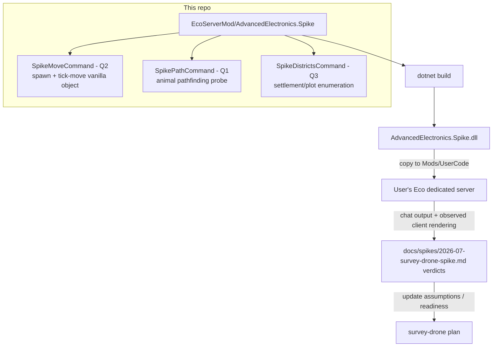

# Survey Drone Feasibility Spike - Plan

## Goal Capsule

- **Objective:** Build the server-mod spike that answers the three questions blocking `docs/plans/2026-07-11-001-feat-survey-drone-plan.md` (Q1 animal navigation from a custom entity, Q2 server-moved WorldObject rendering, Q3 district/settlement data + object-UI picker), plus the findings report that feeds the answers back.
- **Authority:** The survey-drone plan's Outstanding Questions define what the spike must answer; this plan defines how. External API facts below come from docs.play.eco / wiki.play.eco research and are treated as leads to verify, not ground truth.
- **Stop conditions:** Stop and surface (do not guess) if `Eco.ReferenceAssemblies` cannot be restored from NuGet, or if the reference assemblies lack the researched APIs entirely (wrong game-version pin — fix the pin, don't stub the API).
- **Execution profile:** Code is buildable and CI-checkable (`dotnet build`); the in-game halves of verification are a documented manual protocol the user runs on their Eco server — the spike cannot launch a game server in this environment.

---

## Product Contract

### Summary

A minimal Eco server mod (`EcoServerMod/AdvancedElectronics.Spike/`) exposing three chat-command probes — one per feasibility question — plus a findings report template. Each probe is independently runnable on a local Eco server; results are recorded in `docs/spikes/2026-07-survey-drone-spike.md` and update the survey-drone plan's assumptions.

### Problem Frame

The survey-drone plan is gated: implementation planning must not harden until the spike answers whether the chosen architecture (custom server entity borrowing animal navigation, SyncPhysics client rendering, district-based control) is buildable. External research sharpened the questions but cannot answer them — the answers live in the reference assemblies and on a running server.

### Requirements

**Spike project**

- R1. A server-mod project builds with `dotnet build` against the `Eco.ReferenceAssemblies` NuGet package, with the package version pinned in one place and documented as needing to match the target server's game build.
- R2. The build output deploys by copying the DLL to the server's `Mods/UserCode` directory; the project README documents the copy step (manual or MSBuild post-build with a local, git-ignored path override).
- R3. The spike project's `.csproj` is tracked in git despite the Unity-convention global `*.csproj` ignore.

**Probes**

- R4. Q2 probe: a chat command spawns a vanilla WorldObject instance and moves it along a small circular path each server tick via `Position`/`Rotation` + `SyncPositionAndRotation()`, with start/stop control — so client-rendered movement smoothness can be observed with zero custom client assets.
- R5. Q1 probe: a chat command exercises Eco's animal pathfinding toward a player-marked target and reports the outcome in chat — first attempting the navigation calls without a full animal lifecycle, falling back to driving a spawned vanilla animal if the API requires a live `Animal` instance. The probe also records whether pathing avoids player-placed WorldObjects.
- R6. Q3 probe: a chat command enumerates the settlements/deeds/plot-sets influencing the player's position (the server-side data behind map-drawn areas) and prints what a mod can read; the probe README records the object-UI picker pattern found (e.g., `ClientCanSelectAndAdd`) and whether a district/settlement picker is feasible on a WorldObject UI.
- R7. Each probe is manually runnable in isolation and reports its result via chat text (no client assets, no custom UI).

**Findings**

- R8. A findings report at `docs/spikes/2026-07-survey-drone-spike.md` carries a per-question verdict table (pass / partial / fail + evidence + implication for the survey-drone plan), pre-filled with the protocol steps and left blank where only a live server run can answer.

### Scope Boundaries

- No drone entity, no dock, no sensor, no district assignment feature — probes only.
- No Unity/client work: probes reuse vanilla prefabs and animals so nothing needs the Editor or bundle pipeline.
- No automated in-game tests: Eco has no headless test harness for mods; the Verification Contract separates build-time checks (automated) from the manual server protocol.
- The survey-drone plan itself is not edited by this spike's implementation; updating it with verdicts happens after the manual runs (the report template includes that checklist).

### Dependencies / Assumptions

- Assumes the target server runs Eco 0.11.x and a matching `Eco.ReferenceAssemblies` prerelease version exists on NuGet (research: version strings like `0.11.1.13-beta-release-887`). The pin is a property so the user can align it with their server build.
- Assumes the user has (or will install) a local Eco dedicated server for the manual protocol; nothing in this repo can run one.
- Assumes `dotnet` SDK (net8.0+; research suggests newer Eco builds target net10.0 — the TFM is a property next to the version pin).
- External research (docs.play.eco, wiki.play.eco) is unverified input: class names (`Eco.Simulation.Agents.Animal`, `Eco.Gameplay.Objects.WorldObject.SyncPositionAndRotation()`, `Eco.Gameplay.Settlements.Settlement`, `SettlementInfluenceUtils`, `Deed.CachedOwningSettlement`) are leads the implementation confirms against the actual reference assemblies.

---

## Planning Contract

### Key Technical Decisions

- **KTD1 — Spike lives in this repo under `EcoServerMod/`.** One repo carries both halves of the mod (Unity client project + server code); the server project sits outside `Assets/` so Unity never imports it. Alternative (separate repo) rejected: adds coordination overhead for a hobby project and splits the plan trail.
- **KTD2 — Q2 uses vanilla WorldObject instances, not a custom object.** A custom WorldObject class needs a name-matched client prefab (bundle pipeline, Editor work). Spawning and moving an existing vanilla object tests the server→client position sync with zero client assets — with two caveats the probe must respect: (a) the chosen vanilla object must have no bespoke client movement components in its prefab (the elevator has its own handling; picking it would test the elevator, not the sync path — verify the chosen object's prefab is plain), and (b) a vanilla-object pass answers only the motion-smoothness half of origin Q2; the locomotion-animation-via-state-hooks half is structurally unanswerable without a custom prefab and is carried forward as an open item, not a pass. Research confirms `Position { get; set; }` + `SyncPositionAndRotation()` on `WorldObject`, with `ElevatorComponent` as reference reading for how vanilla moves objects safely (not as the spawn target).
- **KTD3 — Q1 probes instance-level animal APIs, expecting no decoupled pathfinder.** Research found pathfinding only as instance methods on `Animal` (`GetPathTo`, `RequestPathAndUpdateState`), both requiring `AnimalSpecies` — no standalone static pathfinder in the public surface. The probe therefore measures *how much* animal lifecycle is required, in escalating order: (a) call navigation with a minimal/uninitialized instance, (b) drive a spawned vanilla animal's path externally, (c) verdict "subclass `AnimalEntity` required" (which revives the survey-drone plan's approach-A fallback). Each rung is a distinct finding for the report.
- **KTD4 — Version pin and TFM are single-point properties.** `EcoRefVersion` and `TargetFramework` live at the top of the `.csproj`; README documents how to read the server's build number and pick the matching NuGet prerelease.
- **KTD5 — Chat commands as the probe harness.** Standard Eco mod surface (`IChatCommandHandler`), zero UI work, results legible in the chat log. Commands namespaced `/spike ...` to avoid collisions.
- **KTD6 — "Districts" are probed as Settlements/plots.** Research indicates the old district concept consolidated into `Settlement` with plot-grid coverage (`HashSet<PlotPos>`), not polygons. The probe enumerates what actually exists; if the law-district drawing UI produces a different server-side artifact, the probe output will reveal it. This finding feeds the survey-drone plan's R12 (district assignment) wording.

### High-Level Technical Design

Directional guidance, authoritative for structure: three independent probe commands in one DLL; findings flow through the report back to the origin plan.

### Assumptions (headless-run scoping)

- The spike is repo-tracked work (not throwaway outside the repo) — chosen so the eventual server mod grows from the spike scaffold.
- Probe order and structure prioritize Q2 first (cheapest, highest confidence), then Q1 (hardest), then Q3 — but units are independent; no probe blocks another.
- The user's "district" intent from the survey-drone plan maps to whatever the map-drawing UI produces server-side; KTD6's enumeration probe resolves the vocabulary rather than assuming.

---

## Implementation Units

### U1. Server-mod project scaffold

- **Goal:** `EcoServerMod/AdvancedElectronics.Spike/` builds green with `dotnet build`.
- **Requirements:** R1, R2, R3.
- **Dependencies:** none.
- **Files:** `EcoServerMod/AdvancedElectronics.Spike/AdvancedElectronics.Spike.csproj`, `EcoServerMod/AdvancedElectronics.Spike/ModRegistration.cs`, `EcoServerMod/README.md`, `.gitignore` (append: negations `!EcoServerMod/**/*.csproj`, `!EcoServerMod/**/*.sln`; ignores `EcoServerMod/**/[Bb]in/`, `EcoServerMod/**/[Oo]bj/`, `EcoServerMod/**/Local.props` — the Unity template's `/[Oo]bj/` is root-anchored and covers neither dotnet output nor the machine-local props override).
- **Approach:** SDK-style csproj per the wiki pattern: `TargetFramework` and `EcoRefVersion` as top-of-file properties; `PackageReference Include="Eco.ReferenceAssemblies" Version="$(EcoRefVersion)"`; optional `CopyModToEco` post-build target gated on an `EcoModsDir` property supplied via a git-ignored `Local.props` import. `ModRegistration.cs` implements the mod-registration interface found in the reference assemblies (research: `IModKitPlugin`/`ModRegistration` pattern — confirm exact interface against the restored package). README documents version matching and the manual DLL copy.
- **Execution note:** First prove `dotnet restore` finds the pinned prerelease; if the exact version 404s, list available `Eco.ReferenceAssemblies` versions and pin the newest 0.11.x prerelease, recording the choice in the README. If no 0.11.x prerelease exists at all, or every available version lacks the researched APIs (`WorldObject.Position` setter, animal navigation members), that is the Goal Capsule stop condition — surface it; do not stub.
- **Patterns to follow:** wiki.play.eco "Getting Started with Eco Modding in Visual Studio" csproj shape (restated in Sources).
- **Test scenarios:** `Test expectation: none -- scaffolding; the verification is the build itself.`
- **Verification:** `dotnet build EcoServerMod/AdvancedElectronics.Spike` exits 0; `git status` shows the csproj tracked (not ignored).

### U2. Q2 probe — move a vanilla WorldObject (SpikeMove)

- **Goal:** `/spike move` spawns a vanilla WorldObject near the player and tick-moves it in a ~5m circle; `/spike stop` halts and despawns it.
- **Requirements:** R4, R7.
- **Dependencies:** U1.
- **Files:** `EcoServerMod/AdvancedElectronics.Spike/SpikeMoveCommand.cs`.
- **Approach:** Chat command handler; spawn via the WorldObject placement API — pick a small vanilla object with no placement requirements AND no bespoke client movement components in its prefab (per KTD2a; record the chosen object in the report). Read `ElevatorComponent` in the reference assemblies first as the moving-object precedent. Drive movement from a server-tick-affine callback: set `Position`/`Rotation`, call `SyncPositionAndRotation()` per update. The tick surface itself is a lead-to-verify (candidates: a plugin update loop such as `IThreadedPlugin`, Eco's periodic-action utilities, or a component tick) — updates must run on the server's tick thread, not a plain .NET timer thread; if no non-component tick surface is reachable, record that as its own finding (it would mean the real drone needs a component-based mover). Parameterize speed so the manual protocol can test slow (walk-speed) and fast movement against client interpolation/snap.
- **Technical design (directional):** command → spawns object, registers a tick-affine action advancing an angle; teardown on `/spike stop` or player disconnect.
- **Patterns to follow:** `ElevatorComponent` / `TrackPlacementComponent` in the reference assemblies (decompile/inspect for how vanilla moves WorldObjects safely).
- **Test scenarios:** `Test expectation: none -- probe harness; correctness is observed on a live server (manual protocol below), and Eco offers no headless mod test harness.`
- **Verification:** Build green. Manual protocol (report template): run on server, observe in client — (1) object visibly moves smoothly at walk speed, (2) fast speed reveals snap/teleport behavior or not, (3) chat logs position each second. Record verdict for Q2.

### U3. Q1 probe — animal navigation reachability (SpikePath)

- **Goal:** `/spike path` reports, in escalating rungs, how much animal lifecycle Eco requires before its pathfinding will navigate to a target.
- **Requirements:** R5, R7.
- **Dependencies:** U1.
- **Files:** `EcoServerMod/AdvancedElectronics.Spike/SpikePathCommand.cs`.
- **Approach:** KTD3's escalation: (a) attempt `GetPathTo`/`RequestPathAndUpdateState` (or whatever the restored assemblies actually expose) with the least possible setup, catching and reporting exceptions verbatim to chat — if rung (a) cannot even compile (no reachable navigation members), skip it and record the compile-level evidence; (b) spawn a vanilla animal (e.g., a tortoise) and attempt to command its path externally — instrument spawn success/failure SEPARATELY from pathing success/failure, so a spawn-harness failure (ecosystem preconditions, population culling) cannot masquerade as a pathfinding verdict; (c) report which rung succeeded. Include an obstacle sub-check: place the target behind a player-built obstacle and report whether the returned path routes around it. All findings print to chat for transcription into the report. Manual protocol note: probe commands require admin authorization on the server.
- **Execution note:** This unit is exploration-shaped — write the probe to *report* API reality rather than to pass; every caught exception is data.
- **Patterns to follow:** `Eco.Simulation.Agents.Animal` / `Eco.Gameplay.Animals.AnimalEntity` members discovered in the restored reference assemblies; `Tortoise` as the concrete species example.
- **Test scenarios:** `Test expectation: none -- probe harness; API reachability is compile-time checked by the build, behavior is manual-protocol territory.`
- **Verification:** Build green (compiling against the navigation APIs is itself rung-zero evidence). Manual protocol: run rungs on server, record which succeeded, whether paths avoid player objects, and the exception text of failures. Record verdict for Q1.

### U4. Q3 probe — settlement/plot enumeration (SpikeDistricts)

- **Goal:** `/spike districts` prints every settlement/deed whose influence covers the player's position, plus the plot-set size and sample coordinates — establishing what map-drawn area data a mod can read.
- **Requirements:** R6, R7.
- **Dependencies:** U1.
- **Files:** `EcoServerMod/AdvancedElectronics.Spike/SpikeDistrictsCommand.cs`, `EcoServerMod/README.md` (object-UI picker findings section).
- **Approach:** Before coding the query, locate the map-drawing UI's backing server type in the restored assemblies — search Civics/District/Zone namespaces, not just Settlements (Eco historically had a distinct district type; a Settlement-only query cannot reveal an artifact living in another registry, and empty output would masquerade as "no district exists"). Then enumerate EVERY area-shaped registry found (settlements, deeds, and any district/zone registry) for the player's position; print names, types, plot counts (research leads: `SettlementInfluenceUtils`, `Deed.CachedOwningSettlement`, `IAnnexable.PlotPosSet`). Separately, document in the README the object-UI picker pattern found in the assemblies (`ClientCanSelectAndAdd` on `Deed.Accessors` is the researched example) and whether a settlement/deed picker property on a WorldObject component looks feasible — code the picker only if it falls out cheaply; otherwise the written finding is the deliverable.
- **Test scenarios:** `Test expectation: none -- probe harness; data availability is proven by chat output on a live server.`
- **Verification:** Build green. Manual protocol: draw a district/claim area in-game via the map UI, run the command inside and outside it, record what the server sees. Record verdict for Q3 (data half) and the picker feasibility note (UI half).

### U5. Findings report template

- **Goal:** `docs/spikes/2026-07-survey-drone-spike.md` exists with the full manual protocol and an empty verdict table.
- **Requirements:** R8.
- **Dependencies:** U2, U3, U4 (protocol steps reference the implemented commands).
- **Files:** `docs/spikes/2026-07-survey-drone-spike.md`.
- **Approach:** Per-question sections: the question, the probe command(s), step-by-step protocol (including the admin-authorization prerequisite), blank verdict (pass/partial/fail), evidence field, and "implication for survey-drone plan" field. Q2's verdict row is split in two: motion smoothness (answerable by this probe) and locomotion-animation state hooks (marked structurally unanswerable without a custom prefab; carried to the origin plan as an open item). Q3's picker half caps at "partial (assembly-evidence only)" unless a live picker was demonstrated. Closing checklist: update `docs/plans/2026-07-11-001-feat-survey-drone-plan.md` assumptions with verdicts; note that its R12 remains a spike-class risk if only the paper picker finding was produced; if all answerable halves pass, the spike gate clears for planning with the two carried items recorded.
- **Test scenarios:** `Test expectation: none -- documentation.`
- **Verification:** Report exists, references the exact command names implemented, and its checklist names the origin plan path.

---

## Verification Contract

| Check | Command / method | Gate |
|---|---|---|
| Server mod compiles | `dotnet build "EcoServerMod/AdvancedElectronics.Spike"` | Exit 0 — required before ship |
| csproj tracked | `git check-ignore EcoServerMod/AdvancedElectronics.Spike/AdvancedElectronics.Spike.csproj` | Exit code 1 / no output = pass (path not ignored) — note inverted exit-code semantics vs the build check |
| Probe commands present | Grep built source for the three `/spike` command registrations | All three registered |
| In-game protocol | Manual, on the user's Eco dedicated server, per `docs/spikes/2026-07-survey-drone-spike.md` | Out of CI scope — user-run; verdicts recorded in the report |

No Unity/client checks: the spike deliberately touches nothing under `Assets/`.

## Definition of Done

- `dotnet build` green on the spike project; csproj and sources tracked in git.
- Three probe commands implemented, each independently runnable, each reporting via chat text.
- README documents version matching, deploy, and the object-UI picker finding.
- Findings report template written with protocols referencing the implemented commands and the update-origin-plan checklist.
- No dead-end experiment code left in the tree; probes are the only server code added.
- Manual server runs are explicitly NOT part of done for this plan — they are the user's next action, captured by the report.

---

## Sources / Research

- `docs/plans/2026-07-11-001-feat-survey-drone-plan.md` — origin; Q1–Q3 definitions and the spike gate.
- External research (docs.play.eco API docs, wiki.play.eco, NuGet) — load-bearing, unverified: `Eco.ReferenceAssemblies` prerelease versioning (`0.11.1.13-beta-release-887` style); csproj shape from "Getting Started with Eco Modding in Visual Studio"; `WorldObject.Position/Rotation` + `SyncPositionAndRotation()` + `ElevatorComponent` precedent; `Animal.GetPathTo`/`RequestPathAndUpdateState` requiring `AnimalSpecies` (no static pathfinder found); `Settlement`/`PlotPos`/`SettlementInfluenceUtils`/`Deed` influence APIs; `ClientCanSelectAndAdd` UI attribute example. All to be confirmed against the restored assemblies during implementation.
- Reference mod repos worth consulting if stuck: `github.com/sarogahtyp/eco_mod` (full server+mods tree), `github.com/StrangeLoopGames/EcoModKit`.
