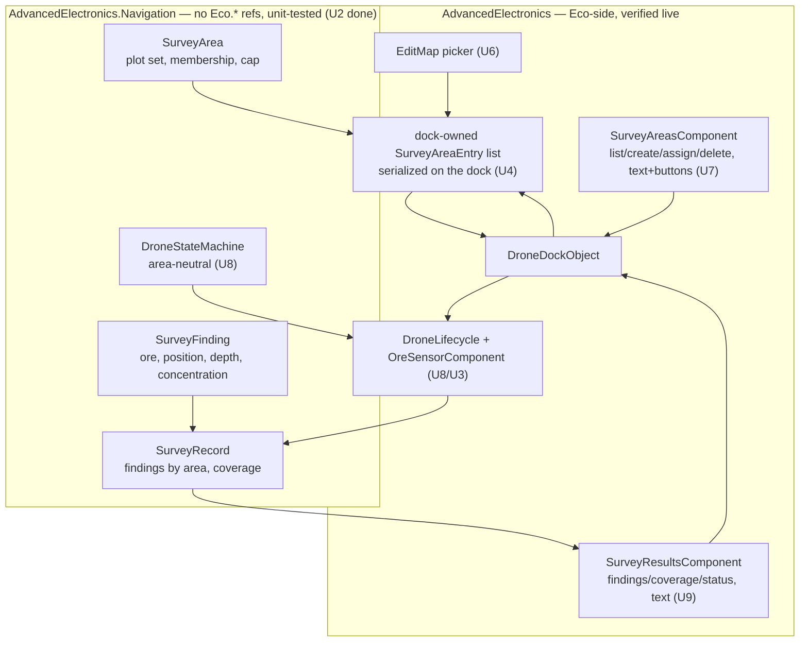
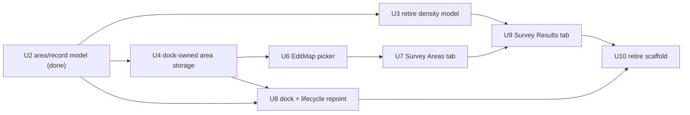

# Dock Survey Interface (Map-Editor Area Picker + Dock Tabs + Standardized Record) - Plan

## Goal Capsule

- **Objective:** Turn the survey drone from a proof of concept into something a player can
  actually use: draw a survey area from the dock using the game's own map-editing interface,
  read the results in a dock tab, and back it with a standardized record a future mining drone
  can consume.
- **Product authority:** This plan's Product Contract. It supersedes two earlier decisions —
  that district assignment was an acceptable interaction (it was a development scaffold, never
  the requested interface), and that a tooltip or chat command was an acceptable readout (they
  are debugging surfaces).
- **Implementation status (context, not a status field):** U1 and U2 are already built and
  committed — U2 as the tested model (`ac578df`), U1 as a live feasibility batch whose findings
  are now settled facts in Dependencies. The remaining work is U3, U4, U6–U10. U5 was cut.
- **Execution profile:** Server-side C# against Eco 0.13.0.4 reference assemblies, verified in
  live batches. No Unity/client-asset work — the tabs and the map-editor picker are
  server-driven and rendered by the stock client, which U1 confirmed works.
- **Stop conditions:**
  - **A live acceptance example fails twice for the same reason.** Batch the diagnosis; do not
    spend a restart per hypothesis (see `docs/solutions/workflow-issues/eco-mod-batched-live-testing.md`).
  - **The read-only text member for the results tab cannot be made to render (U9).** U1 showed
    a mod tab renders and buttons fire, but a `StringTitle` `LocString` did not display its
    text. If no stock text member renders read-only content, stop and re-plan the readout
    surface (world-space prefab text is the fallback) rather than shipping an empty tab.
- **Tail ownership:** Standalone — this plan's executor owns its own review and commits.

**Product Contract preservation:** **changed** by the U1 live findings and the two P0 decisions
(this revision). Changed IDs: R1 (reframed from "own map layer" to the map-editor picker), R2
(no passive overlay layer — engine-blocked, and scoped out), R2a (dropped — replaced by
dock-scoped area visibility), R1a and R3 (areas are now dock-owned, not reassignable between
docks). The record, readout, auth, and finding-precision requirements are unchanged. See the
Key Decisions and Dependencies sections for the evidence behind each change.

---

## Product Contract

### Summary

The dock opens the game's own **map-editing interface** — the same one district and deed
editing use — for the player to draw a survey area's plots; the mod stores the returned plots
itself, with no district, no civics object, and no passive map-overlay layer (the engine does
not let a mod add one, and showing survey areas on everyone's map is out of scope). Survey
areas are **owned by the dock** that created them: the dock gains a **Survey Areas** tab to
create, list, assign, rename and delete them, and a separate **Survey Results** tab. Both tabs
are text-and-button surfaces (a synced list of mod values is not renderable — see Dependencies).
Access is delegated to the dock's `PropertyAuthComponent`, so anyone the owner authorizes as a
consumer can direct the drone without being able to take the machine. The drone surveys the
assigned area and reports findings to the dock, which owns the record. Findings are stored at
finer-than-plot precision — ore type, location, depth, concentration — in a standardized form
designed from the start for two readers: the tab renders it for the player, and a future mining
drone consumes the same record to choose and travel to a dig site. Chat commands become
diagnostics only.

### Problem Frame

The drone works but delivers nothing usable. Results reach the player only through a chat
command, which is a debugging tool rather than an interface, and the advertised tooltip does
not render — so in practice the data is nowhere. Separately, assigning work requires the
player to draw a *district* first.

**Districts were a deliberate and correct development scaffold, not a mistake.** Borrowing an
existing drawn-region system let pathfinding, roaming, sampling and depth all be tested
without first building an assignment interface — real progress on the hard parts, unblocked.
The error would be shipping the scaffold as the interface. The district system exists for
civics and governance; making a player create one per survey couples the mod to an unrelated
system and is unreasonable as a repeat interaction. That is what this work replaces, and the
scaffold stays in place until the replacement is proven.

The original instinct was "the mod should own its own map layer." Live testing (U1) showed
that half of that is impossible and the other half unnecessary: the client's `OverlayManager`
hardcodes exactly the district and influence layers, so a mod cannot register a passive overlay
of its own — and showing survey areas on every player's map was never wanted anyway. What the
player actually needs is the *editing* interface to draw an area, which the engine exposes to
any caller (`player.EditMap`), and a place to read the results, which the dock tab provides.

### Key Decisions

- **The dock opens the game's map-editing interface to draw an area; there is no passive
  overlay layer.** (session-settled: user-directed — chosen over a mod-owned map layer once U1
  proved the client's `OverlayManager` only ever tracks districts and influence maps, and the
  user confirmed a passive display was out of scope.) `player.EditMap` opens the same plot
  editor district/deed editing uses; the mod reads back the drawn plots and stores them. Drawing
  works, the plot cap is enforced, and the plots return with coordinates — all confirmed live.
- **A survey area is owned by the dock that created it.** (session-settled: user-directed —
  chosen over player-owned or globally-shared areas: one auth domain is simpler and matches the
  crew scenario.) Areas are serialized data on the dock, not a mod-wide registry. The dock's
  `PropertyAuthComponent` governs who may see, create, assign, rename and delete them —
  uniformly, at `ConsumerAccess`. An area does not outlive its dock and is not reassignable to a
  different dock; when the dock is destroyed, its areas go with it. This reverses the earlier
  "first-class, dock-independent area" idea, which created an ownership question dock-scoped auth
  could not answer.
- **The dock exposes two tabs, both text-and-button.** A *Survey Areas* tab — a list of the
  dock's areas plus a create action — and a *Survey Results* tab showing findings. Both compose
  their content as formatted text, not a synced collection: U1 showed a `[SyncToView]` list of
  non-`View` values crashes the client. Separating the tabs keeps results uncluttered by
  administration, and an unassigned dock still has an obvious next action.
- **Access follows the engine's property system rather than reinventing one.** The dock carries
  `PropertyAuthComponent`. Anyone with `ConsumerAccess` on the dock may open its tabs, create
  and assign survey areas; only owners may pick the dock up; unauthorized players cannot
  interact at all. This deliberately diverges from the engine's own `Deed.EditInMap`
  (`OwnerAccess`) — a trusted crew member should redirect a drone without being able to steal
  the machine. Confirmed live: a `ConsumerAccess` RPC fired from a mod tab.
- **Results live in a dock tab.** The dock window is where an object's information belongs,
  alongside its existing tabs. The tooltip is abandoned — not merely because it did not render,
  but because it is not the right place for data the player studies and acts on.
- **The dock owns the survey record; the drone is a sensor that reports to it.** Accumulating on
  the drone loses everything when the drone is removed.
- **The findings record is session-scoped by design, not by omission.** The world already
  stores block data; persisting findings would duplicate it. Survey data is inherently
  transient: a player holds it in memory long enough to go mine, a mining drone consumes it
  immediately and routes, and once a location is mined its entry is stale. Survey *areas* are
  the exception and do persist with the dock — an area is an authored artifact, not an
  observation.
- **Standardized for both readers now.** The stored shape is designed for machine consumption
  from the start so a mining drone reads it without a migration, even though no mining drone
  exists yet.
- **Precision finer than a plot.** Selection happens in plots, but findings are addressed more
  precisely so a dig site is pinpointed rather than approximated. The tab rolls findings up into
  readable text while preserving the precise location for the machine reader.

### Actors

- A1. **Drone owner** — places the dock, authorizes others on it, creates survey areas, returns
  later, reads results, decides where to mine. The only actor who can pick the dock up.
- A1a. **Authorized crew member** (`ConsumerAccess` on the dock) — can create, assign, rename
  and delete the dock's survey areas and read both tabs, but cannot take the dock. The reason
  access is delegated to `PropertyAuthComponent` rather than restricted to the owner.
- A2. **Survey drone** — surveys the assigned area and reports findings to its dock.
- A3. **Drone dock** — owns its survey areas, the area assignment, and the survey record;
  presents the tabs.
- A4. **Mining drone (future)** — not built here; constrains the record's shape as its eventual
  reader.

### Requirements

#### Area authoring and storage

- R1. From the dock's Survey Areas tab the player can **create a new survey area** by opening
  the game's map-editing interface (`player.EditMap`) and drawing its plots — the same
  interaction as editing a district or a deed. The editor carries mod-authored title and hint
  text naming it as a survey area. No district or civics object is created. (Confirmed live in
  U1.)
- R1a. A survey area is **named and belongs to the dock that created it**. The Survey Areas tab
  lists the dock's areas, and a `ConsumerAccess` user can assign one to the drone, rename it, or
  delete it. Deleting the area the drone is assigned to unassigns the drone rather than silently
  breaking it. Areas are not reassignable to a different dock.
- R1b. A survey area is capped at a maximum plot count — on the order of a homestead, a few
  dozen plots, not a valley — enforced in the map editor via `EntryStatus.MaxArea` and
  re-validated server-side on the returned plots. The cap is a property of the drone tier, so a
  better drone surveys a larger area: the same progression axis as scan depth. (Cap enforcement
  confirmed live in U1.)
- R1c. Creating, assigning, renaming and deleting survey areas, and reading either tab, require
  `ConsumerAccess` on the dock. Picking the dock up requires owner access, per the engine's
  normal object behavior. Players with no authorization cannot interact with the dock at all.
  All of this is delegated to `PropertyAuthComponent`.
- R2. Survey areas are the dock's own stored data, drawn with the map editor but creating no
  district and touching no civics system. They are **not** shown as a passive map-overlay layer
  — the engine does not permit a mod to add one, and that display is a deliberate non-goal.
- R2a. A dock's survey areas are visible to anyone authorized on that dock (its Survey Areas
  tab), and to no one else. Visibility is dock-scoped, governed by the same
  `PropertyAuthComponent` as every other action — there is no separate per-player area registry.
- R9. Cancelling the map editor, or disconnecting while it is open, leaves the dock's areas and
  assignment unchanged and leaves no pending state behind. Only an explicit confirm creates or
  changes an area.

#### Assignment and surveying

- R3. The dock retains its assigned survey area as the drone's standing assignment, and a
  `ConsumerAccess` user can change it by assigning a different area from the list. The dock's
  areas and its assignment persist across a server restart (unlike the findings, per R8); after
  a restart the drone resumes surveying the same area and the results tab shows a fresh empty
  record for it, so the player never returns to a drone that sits idle looking broken. Restart
  resume is achieved by serializing the spawned drone's id and re-linking on load (see KTD10).
- R3a. Findings are recorded against the survey area that produced them. Reassigning the drone
  to a different area never destroys findings from the previous one; the results tab groups them
  by area and a machine reader can filter to the currently assigned one. This keeps R6's consumer
  from routing to a location outside the area the player currently cares about.
- R4. The drone surveys within the dock's assigned area and reports its findings to the dock.
- R8a. A dock holds at most one active survey drone. A drone whose dock no longer exists stops
  rather than accumulating findings it can never report.

#### The findings record

- R5. The dock stores survey findings at finer-than-plot precision, recording at minimum the ore
  type, the location, the depth below the surface, and how concentrated the ore is — the last so
  that both readers can rank a rich seam above a stray block rather than merely locating it.
- R6. The stored record is standardized and machine-readable, such that a future mining drone
  can select a target and route to it without a change to the format. This is an intent
  statement, deliberately not verifiable in this work — the consumer that would prove it is out
  of scope, so AE5 checks the record's shape and not its sufficiency.
- R8. Survey findings survive the drone being removed from the dock, and are not persisted across
  a server restart.

#### Readout

- R7. The dock presents a **Survey Results** tab showing findings in a form a player can act on
  — what was found, where, how concentrated, and how deep — as **formatted text**, plus a
  separate **Survey Areas** tab for creating, listing, assigning and deleting areas. An
  unassigned dock's Areas tab presents the create action prominently, so the feature is
  discoverable without the player knowing to look for it.
- R7a. The tab shows how much of the assigned area has been surveyed and whether the drone is
  currently surveying, so an empty result is legible as "nothing found here yet" rather than
  being indistinguishable from "not walked yet" or "drone broken".

### Key Flows

- F1. **Create an area.** A1 opens the dock's Survey Areas tab, chooses to create a new area,
  the map editor opens, A1 draws plots and confirms. **Outcome:** the area exists in the dock's
  list. No district is created. **Covers R1, R1b, R2.**
- F1a. **Assign an area.** A1 picks one of the dock's areas from the list and assigns it.
  **Outcome:** the dock holds that area and the drone begins surveying it. **Covers R1a, R3, R4.**
- F2. **Survey accumulates.** The drone roams the assigned area reporting findings; the dock's
  record grows. **Outcome:** the dock holds findings independent of the drone's presence.
  **Covers R4, R5, R8.**
- F3. **Read and decide.** A1 returns later, opens the dock, and reads the Survey Results tab.
  **Outcome:** A1 knows where and how deep to mine without using chat. **Covers R7.**

### Acceptance Examples

- AE1. **Covers R1, R2.** Given a world with no district anywhere, when A1 creates a survey area
  from the dock, then the map editor opens for plot drawing, the area is stored on the dock, and
  no district exists afterward. No survey overlay layer appears in the map's layer list.
- AE1a. **Covers R1a.** Given several of the dock's areas, when A1 assigns a different one, then
  the drone surveys that area; and when A1 deletes the area the drone is using, then the drone
  becomes unassigned rather than breaking.
- AE1c. **Covers R1c, R2a.** Given a dock inside owned property, when a player with
  `ConsumerAccess` opens it, then they can create, assign and delete the dock's areas and read
  both tabs but cannot pick the dock up; and an unauthorized player cannot interact with it or
  see its areas at all.
- AE2. **Covers R3, R3a.** Given an assigned area with findings, when A1 assigns a different
  area, then the drone surveys the new area, the earlier findings remain readable, and each
  finding is attributable to the area it came from.
- AE2a. **Covers R1b.** Given the map editor is open, when A1 draws more plots than the drone's
  tier allows, then the selection is capped rather than silently accepted. (Confirmed live in U1.)
- AE2b. **Covers R9.** Given an assigned area, when A1 opens the map editor and cancels or
  disconnects instead of confirming, then the dock's areas and assignment are unchanged.
- AE3. **Covers R7.** Given the drone has found ore, when A1 opens the dock's Survey Results tab,
  then the results are readable there as text — including depth — with no chat command used.
- AE4. **Covers R8.** Given accumulated findings, when A1 removes the drone from the dock, then
  the results remain readable in the tab.
- AE5. **Covers R5, R6.** Given findings for several ore types, then each carries a location more
  precise than its plot, a depth, and a concentration, in a single consistent shape.
- AE6. **Covers R3, R8.** Given accumulated findings, when the server restarts, then the dock
  still holds its areas and assignment and the drone resumes surveying it, while the findings
  record starts empty — the deliberate, documented behavior.
- AE7. **Covers R7a.** Given an area assigned but barely walked, when A1 opens the tab, then it
  distinguishes "surveyed, nothing found" from "not yet surveyed" and shows whether the drone is
  currently working.
- AE8. **Covers R8a.** Given a dock with a deployed drone, when the dock is destroyed, then the
  drone stops rather than continuing to accumulate findings it cannot report.

### Scope Boundaries

Out of scope for this work:

- The mining drone itself. Only the record it will read is guaranteed here.
- A passive map-overlay layer showing survey areas on the map (`M`). Engine-blocked for a mod
  and a deliberate non-goal — the interface is the dock tabs, not the world map.
- Reassigning an area between docks, and areas that outlive their dock. Areas are dock-owned by
  decision.
- Persisting *findings* across server restarts, and remembering which locations have already
  been mined — a later, more expensive mining automator's concern. (Survey *areas* persist with
  the dock; see R3.)
- Visual/art work on the objects, and the drone tier progression (deeper sensors, higher climb
  limits, larger area cap) already noted as a future axis. Only one tier's cap value is set here.

#### Deferred to Follow-Up Work

- A mod-owned crafting table. The dock and drone recipes stay on `ElectricMachinistTableObject`
  (an assumption carried in `DroneDock.cs`).

### Dependencies / Assumptions

This section is now **verified**, not speculative — U1 ran live (screenshots
`.references/screenshots/9`, batch L1). The findings below are facts the remaining units build
on.

**A mod cannot add a passive map-overlay layer.** The client `OverlayManager.Start()`
(`Client/Assets/Scripts/Overlays/OverlayManager.cs`) hardcodes exactly two overlay sources — the
`DistrictMapView` registrar and the influence-map manager — and is client engine code the mod's
asset bundle cannot replace. A server overlay would also need a client-side `IClientOverlay`
partial on a codegen-generated view type (`Client/Assets/Scripts/Overlays/Overlays.md`), which a
server-only mod ships none of. So R2's "no overlay layer" is a hard engine fact, not a choice.

**The map *editor* is reachable and works for a mod caller.** `player.EditMap(MapEditRequest)`
opens the stock plot editor (using `EditableOverlay`, a stock client type — a separate code path
from the overlay list). U1's `/spike editmap` opened it with mod-authored title/hint, enforced
`EntryStatus.MaxArea` (drew 4 of 40, "still left 36"), and returned the drawn plots with
coordinates. Built on the deed pattern: `AllowNewEntries = false`, one fixed entry,
`RelatedRegistrar` left unset. The returned overlay is a world-sized `Array2D<int>` the server
must diff and re-validate; client entry IDs are renumbered and must not be trusted.

**A mod-defined component tab renders, with two constraints.** U1 confirmed a
`WorldObjectComponent` with `[Serialized, CreateComponentTabLoc(...), HasIcon]` and
`Availability => WorldObjectComponentClientAvailability.UI` renders its own tab on the stock
dock, and a `[RPC(AccessType.ConsumerAccess), Autogen, UITypeName("BigButton")]` button rendered
and fired (auth enforced). The two constraints the results/areas tabs must respect:
  - **No synced collection of non-`View` values.** A `[SyncToView] IEnumerable<string>` (or of
    any mod value type) crashes the client — the element must be a `View` type. `DeedManagement`'s
    `IEnumerable<Deed>` works only because `Deed` has a generated client view; our finding/area
    types do not. Compose readouts and lists as **formatted text**, not synced collections.
  - **`StringTitle` `LocString` did not render read-only text.** In U1 the tab drew the button
    but showed no text from a `[SyncToView, UITypeName("StringTitle")] LocString`. U9 must find a
    stock member/`UITypeName` that renders a read-only text block, or fall back to world-space
    prefab text (the `SetAnimatedState` → `DockReadoutDisplay` path already ships in the bundle).

**Dock and component precedents:** `RealEstateDeskObject` (a plain `WorldObject` that opens the
map editor and shows a data tab) for the object shape; `DeedManagementComponent` for the tab
component shape; `DeedEditingUtil.EditInMap` for the picker call; `AreaBonusComponent` for the
`StringTitle`/`BigButton` `UITypeName` members. Every new component needs `[Serialized]` plus
`[HasIcon]`/`[NoIcon]` — see
`docs/solutions/runtime-errors/worldobjectcomponent-missing-attributes-empty-window.md`.

**Assumption still open:** whether a read-only text member renders in a mod tab (the U9 stop
condition). Everything else in this section is verified.

### Sources / Research

- `docs/plans/2026-07-11-001-feat-survey-drone-plan.md` — the original product contract, whose
  R12 asked for map-based area selection and R14 for a dock readout.
- `docs/solutions/best-practices/ship-the-readout-not-just-the-data.md` — a feature whose output
  the player cannot read is not shipped; this plan is its correction.
- `docs/solutions/workflow-issues/tracing-beats-theorising-on-invariant-failures.md` — why the
  overlay question was settled from client source, not a restart.
- `docs/solutions/workflow-issues/eco-mod-batched-live-testing.md` — the batching rule the live
  phases follow.
- `docs/solutions/conventions/eco-custom-worldobject-placement-requirements.md` — the
  `[Serialized]` + `[HasIcon]`/`[NoIcon]` requirement every new component must satisfy.
- U1 spike code — `EcoServerMod/AdvancedElectronics.Spike/SpikeEditMapCommand.cs` is kept as the
  working reference for the U6 picker call.

---

## Planning Contract

### Key Technical Decisions

- **KTD1. The client-render feasibility spike (U1) ran and is settled.**
  (session-settled: user-directed — chosen over specifying the client-facing units blind.) Result:
  mod tabs render, `ConsumerAccess` buttons fire, the map editor works for a mod caller; a passive
  overlay layer is impossible; a synced collection of non-`View` values crashes the client; a
  `StringTitle` `LocString` did not render text. These findings shape R1/R2/R7 and U6–U9.

- **KTD2. The findings record replaces the density grid rather than extending it.**
  (session-settled: user-directed — chosen over tuning `SurveyGrid`'s cell size: the 8-unit cell
  already equals one plot, so "finer than a plot" needs a new shape.) Done in U2 —
  `SurveyGrid`/`DensestCellResult` replaced by `SurveyArea`/`SurveyFinding`/`SurveyRecord`.

- **KTD3. Survey areas persist with the dock; findings do not.** (session-settled: user-directed.)
  Areas are serialized data on the dock (KTD11), so they survive a restart because the dock does;
  the findings `SurveyRecord` stays in memory and is never serialized.

- **KTD4. Access delegates to `PropertyAuthComponent` at `ConsumerAccess`.**
  (session-settled: user-directed — chosen over `OwnerAccess`, which the engine's own
  `Deed.EditInMap` uses: a crew member should redirect a drone without being able to take the
  machine.) No permission logic is authored in the mod; RPCs carry `[RPC(AccessType.ConsumerAccess)]`
  and the engine enforces. Confirmed live in U1.

- **KTD5. The area geometry model lives in the Eco-free `AdvancedElectronics.Navigation` project.**
  Eco has no headless mod test harness, so anything referencing `Eco.*` is untestable offline.
  Plot-set membership, the plot cap, the finding record and coverage arithmetic are pure logic.
  Done in U2 (64/64 tests). The Eco-side types wrap them.

- **KTD6. The drone state machine moves to area-neutral vocabulary.** `OnDistrictAssigned`,
  `OnDistrictCleared`, `TargetDistrictName` and `DroneTravelTarget.District` become area
  equivalents, with their tests renamed alongside, in U8. Rejected: keeping district names and
  swapping only the backing type — a smaller diff that leaves the abstraction lying.

- **KTD7. The district scaffold is retired in one final unit (U10), not incrementally.**
  (session-settled: user-approved.) The scaffold is the only working way to exercise the drone;
  keeping it until survey areas are proven live means a failed unit does not leave the mod with no
  assignment path.

- **KTD8. The map-editor picker follows the deed pattern.** `AllowNewEntries = false`, one fixed
  entry, `EntryStatus.MaxArea` for the plot cap, `RelatedRegistrar` left unset, and the returned
  overlay diffed and re-validated server-side. Confirmed working in U1; the spike command is the
  reference.

- **KTD9. Survey areas are owned by the dock; there is no mod-wide area registrar.**
  (session-settled: user-directed — chosen over player-owned or globally-shared areas: one auth
  domain, simpler, matches the crew scenario. Reverses the earlier "dock-independent area".) Areas
  are a serialized collection on the dock (or a dock component); the dock's `PropertyAuthComponent`
  governs all access and visibility; deleting the dock deletes its areas. This is why U4 stores
  areas on the dock rather than in a plugin registrar, and why there is no per-player filtering to
  build.

- **KTD10. Restart resume re-links the spawned drone by a serialized id, with a re-spawn fallback.**
  (session-settled: user-directed — chosen over re-spawning unconditionally.) The dock serializes
  the spawned drone WorldObject's id; on load it re-resolves the drone by that id and re-establishes
  the `HomeDock` link. **Residual risk:** this project has flagged WorldObject-reference/id
  serialization as unproven from the stripped assemblies. So the load path must degrade safely — if
  the id no longer resolves to a live drone (destroyed, or id not restored), and the storage slot
  still holds the drone item, re-spawn and re-link; if the slot is empty, clear the reference.
  Prove the id round-trips in the U8 live batch before relying on it.

- **KTD11. The readout is composed as formatted text, not a synced collection.**
  (Forced by KTD1's live finding.) U7's area list and U9's results are built as text plus buttons.
  U9 must first establish which stock text member renders read-only content in a mod tab (the U9
  stop condition); the world-space prefab-text path is the fallback if none does.

### High-Level Technical Design

Component topology after this plan. The Eco-free core (built in U2) is the testable half; the
map-overlay layer is gone.

Unit dependency graph (U1, U2 done; U5 cut):

### Assumptions

- The drone tier's plot cap is authored as a constant in this work; reading it from a
  tier/progression system is future work per Scope Boundaries.
- The dock can serialize a list of area entries and a drone id. Area-list serialization follows
  the existing `AssignedDistrictName` serialized-field precedent; the drone id is the KTD10
  residual risk to prove in the U8 batch.

### Sequencing

U2 is done. U3 and U4 follow it and are independent of each other. U6 (picker) needs U4's area
storage to write into. U7 (areas tab) needs U6. U8 repoints the drone onto areas and adds restart
resume. U9 (results tab) needs U3's record wiring and U7's tab pattern. U10 retires the scaffold
last, after U7/U8/U9 are proven live.

---

## Implementation Units

U1 and U2 are complete (see Goal Capsule). U5 was cut — a mod cannot add an overlay layer. The
units below are the remaining work; U-IDs are preserved (U5 intentionally absent).

| U-ID | Title | Key files | Depends on | State |
|---|---|---|---|---|
| U1 | Client-render feasibility spike | `AdvancedElectronics.Spike/Spike*` | — | done (live) |
| U2 | Survey area + finding model | `AdvancedElectronics.Navigation/Survey*` | — | done (`ac578df`) |
| U3 | Retire density model from sensor/readout | `OreSensorComponent.cs`, `DockReadout.cs` | U2 | pending |
| U4 | Dock-owned area storage | `SurveyAreaEntry.cs`, `DroneDock.cs` | U2 | pending |
| U6 | EditMap area picker from the dock | `SurveyAreaPicker.cs` | U4 | pending |
| U7 | Survey Areas tab (text + buttons) | `SurveyAreasComponent.cs` | U6 | pending |
| U8 | Dock assignment + lifecycle repoint + restart resume | `DroneDock.cs`, `DroneLifecycle.cs`, `DroneStateMachine.cs` | U2, U4 | pending |
| U9 | Survey Results tab (text) | `SurveyResultsComponent.cs` | U3, U7 | pending |
| U10 | Retire the district scaffold | `DistrictAssignment.cs`, `DroneCommands.cs` | U8, U9 | pending |

### U3. Retire the density model from sensor and readout

**Goal:** Move `OreSensorComponent` onto `SurveyRecord` and delete the `DockReadout` formatting
plus the dock's animated-state readout writes.

**Requirements:** R4, R5.

**Dependencies:** U2.

**Files:**
- `EcoServerMod/AdvancedElectronics/OreSensorComponent.cs` (modify)
- `EcoServerMod/AdvancedElectronics.Navigation/SurveyGrid.cs` (delete — deferred here from U2 so
  the tree kept building; the consumer migrates in this unit)
- `EcoServerMod/AdvancedElectronics.Navigation.Tests/SurveyGridTests.cs` (delete)
- `EcoServerMod/AdvancedElectronics/DockReadout.cs` (delete)
- `EcoServerMod/AdvancedElectronics/DroneDock.cs` (modify — drop `RefreshReadout` and the
  `Readout*` animated-state writes; keep `PushWorkingState`)

**Approach:** The sensor keeps its depth-scanning tick and its tier-owned `SurveyDepthBlocks`, but
reports each sample into a `SurveyRecord` owned by the dock rather than an internal grid. The
sample must carry the dock's currently-assigned area id at record time — attribution cannot be
reconstructed later; when no area is assigned, the sensor does not record. Delete `SurveyGrid` and
its tests in this unit (not U2): U2 left them so the Eco project kept building; the consumer
migrates here, so this is the safe point to remove them. The `Working` animation state stays — it
drives art, not data.

**Execution note:** This unit finishes the U2 migration — it deletes the old model whose only
remaining consumer is `OreSensorComponent`. Build must be clean with no residual `SurveyGrid` or
`DensestCell` reference in the tree.

**Patterns to follow:** the existing sensor tick and `SampleOffsets` cycling in
`OreSensorComponent.cs`; keep `EcoOreReader`'s prospectable-deposit filter unchanged.

**Test scenarios:** `Test expectation: none -- a wiring change between two types whose behavior is
covered by U2's suites and by live verification; it adds no logic of its own. (The area-id
attribution it introduces is exercised by U8's tests once assignment exists.)`

**Verification:** `dotnet build EcoServerMod/AdvancedElectronics` clean; `dotnet test` still green;
no `SurveyGrid`, `DensestCell`, or `DockReadout` reference remains anywhere in the tree.

### U4. Dock-owned area storage

**Goal:** The dock stores a serialized list of its survey areas, survivable across restart, with
create/rename/delete/enumerate operations — no mod-wide registrar (KTD9).

**Requirements:** R1a, R2a, R3.

**Dependencies:** U2.

**Files:**
- `EcoServerMod/AdvancedElectronics/SurveyAreaEntry.cs` (create — the Eco-side serialized entry:
  id, name, colour, plot set; projects to the pure-logic `SurveyArea` for membership tests)
- `EcoServerMod/AdvancedElectronics/DroneDock.cs` (modify — hold and serialize the area list;
  create/rename/delete/enumerate; the assigned-area id)

**Approach:** Areas live on the dock as a `[Serialized]` collection of `SurveyAreaEntry`, mirroring
the existing `AssignedDistrictName` serialized-field precedent — a plain serializable shape, not a
live object graph. Each entry carries a dock-local id, name, colour, and its plot coordinates. The
dock projects an entry to a pure-logic `SurveyArea` (U2) for membership tests. Deleting the
assigned area clears the assignment (R1a). Because areas belong to the dock, there is no ownership
field and no cross-dock visibility to filter — the dock's `PropertyAuthComponent` is the only gate
(R2a). Destroying the dock discards its areas with it.

**Execution note:** Serialization is the load-bearing risk. Prove an area round-trips across a
restart (plots and names intact) in the U8 live batch before the tab work is trusted; store the
plot set in a form whose serializability is not in question (e.g. a serialized list of plot
coordinates, not an engine map type).

**Patterns to follow:** `DroneDockObject.AssignedDistrictName`'s doc comment for why a serializable
id/name is stored rather than a live object reference; the same reasoning governs the area list and
the assigned-area id.

**Test scenarios:**
- Covers AE1a. Deleting the assigned area leaves the dock unassigned; deleting a non-assigned area
  leaves the assignment intact.
- Creating two areas with the same name keeps them distinct by id.
- Renaming an area leaves the assignment intact.
- (Pure-logic membership/cap is already covered by U2's `SurveyAreaTests`; this unit's own logic is
  the serialized CRUD, tested where the Eco-free projection is exercised.)

**Verification:** `dotnet build` clean; live restart (U8 batch) shows areas created before the
restart still present with their plots and names.

### U6. EditMap area picker from the dock

**Goal:** A `ConsumerAccess` user draws a new area's plots in the map editor and confirms, cap
enforced and cancellation safe; the drawn plots become a new `SurveyAreaEntry` on the dock.

**Requirements:** R1, R1b, R9.

**Dependencies:** U4.

**Files:**
- `EcoServerMod/AdvancedElectronics/SurveyAreaPicker.cs` (create — builds the `MapEditRequest`,
  awaits `EditMap`, validates and hands the plots to U4's storage)

**Approach:** Build a `MapEditRequest` per KTD8 — the exact shape U1's `SpikeEditMapCommand`
proved: `AllowNewEntries = false`, one fixed entry, `EntryStatus.MaxArea` set to the drone tier's
cap, mod-authored `MapHintTitle`/`MapHint`, `RelatedRegistrar` unset — and await `player.EditMap`.
On return, diff the world-sized `Array2D<int>` against what was sent, collect the plots painted with
the editable entry id, and re-validate the count server-side; never trust client entry IDs. A null
return (no client, cancelled, disconnected) leaves everything untouched. Register a logout handler
so an abandoned edit leaves no pending state. On a valid non-empty return, add a `SurveyAreaEntry`
to the dock (U4).

**Execution note:** `EditMap` is an async round trip that may never return. Write the
cancel/disconnect path first and prove it leaves prior state intact before wiring the success path.
The spike command already demonstrates the happy path end to end — port its request construction.

**Patterns to follow:** `EcoServerMod/AdvancedElectronics.Spike/SpikeEditMapCommand.cs` (the
proven call) and `DeedEditingUtil.EditInMap` (source original); `DistrictMap.OnMapEdited` for the
logout-during-edit handler and the extent of server-side re-validation.

**Test scenarios:**
- Covers AE2a. A returned overlay claiming more plots than the cap is rejected server-side, not
  just capped client-side.
- Covers AE2b. A null/cancelled return leaves the dock's areas and assignment unchanged.
- A returned overlay whose entry IDs differ from those sent still resolves to the intended plots.
- An empty selection creates no area.
- (These exercise pure validation logic where it can be isolated from the live `EditMap` call; the
  round-trip itself is a live check.)

**Verification:** Live (U7 batch) — drawing plots and confirming creates an area in the dock's
list; cancelling creates nothing; no district is created (AE1). Offline: `dotnet build` clean.

### U7. Survey Areas tab (text + buttons)

**Goal:** The dock's Survey Areas tab lists the dock's areas as text and offers create, assign,
rename and delete as buttons, gated at `ConsumerAccess`.

**Requirements:** R1, R1a, R1c, R2a, R7 (areas half).

**Dependencies:** U6.

**Files:**
- `EcoServerMod/AdvancedElectronics/SurveyAreasComponent.cs` (create)
- `EcoServerMod/AdvancedElectronics/DroneDock.cs` (modify — `[RequireComponent]`)

**Approach:** A `WorldObjectComponent` in the shape U1 proved: `[Serialized]`,
`[CreateComponentTabLoc, HasIcon]`, `Availability = UI`. The area list is rendered as **formatted
text** (KTD11 — a synced collection of area values crashes the client), and each action is a
`[RPC(AccessType.ConsumerAccess), Autogen, UITypeName("BigButton")]` method: create (delegates to
U6's picker), assign, rename, delete. With buttons unable to be per-row on a synced list, assign
and delete take the target area by id/index chosen through a stock selector member, or the tab
exposes an action per area via numbered buttons — settle the exact control against what U9's text
member finding allows. An unassigned dock surfaces the create action prominently (R7).

**Execution note:** This is the first shipping mod tab. Build it against the exact attribute set U1
proved (`AreaBonusComponent`/`DeedManagementComponent`), and confirm the area *text* renders before
adding the action buttons — the same read-only-text question U9 must answer applies to the area
list here too.

**Patterns to follow:** `AreaBonusComponent` for `StringTitle`/`BigButton` members and
`ConsumerAccess` RPCs; the U1 spike component (in git history at `d6a11bf~1`) for the exact proven
shape; `DeedManagementComponent` for constructor/`Destroy()` subscription hygiene.

**Test scenarios:**
- Covers AE1c. A `ConsumerAccess` player can invoke every area RPC; an unauthorized player is
  refused by the engine's auth check, not mod-side logic.
- Covers AE1a. Assigning an area sets the dock's assignment; deleting the assigned area clears it.
- A dock with no areas renders the create action rather than an empty tab.

**Verification:** Live — tab opens, lists the dock's areas as text, all four actions work, and the
auth boundary behaves for a second player (AE1c). Offline: `dotnet build` clean.

### U8. Dock assignment, lifecycle repoint, and restart resume

**Goal:** The drone takes its assignment from a dock-owned survey area instead of a district, the
state machine's vocabulary follows, and the dock↔drone link survives a restart.

**Requirements:** R3, R4, R8, R8a.

**Dependencies:** U2, U4.

**Files:**
- `EcoServerMod/AdvancedElectronics/DroneDock.cs` (modify — `AssignedSurveyAreaId` replacing
  `AssignedDistrictName`; owns the `SurveyRecord`; serialize the spawned drone id; re-link on load)
- `EcoServerMod/AdvancedElectronics/DroneLifecycle.cs` (modify — repoint the three district
  touchpoints at `SurveyArea`)
- `EcoServerMod/AdvancedElectronics.Navigation/DroneStateMachine.cs` (modify — KTD6 rename)
- `EcoServerMod/AdvancedElectronics.Navigation.Tests/DroneStateMachineTests.cs` (modify)
- `EcoServerMod/AdvancedElectronics/SurveyDrone.cs` (modify)

**Approach:** The dock stores a serialized assigned-area id (into its U4 area list) and holds the
in-memory `SurveyRecord`. The lifecycle's three district touchpoints — dispatch, roam-hop
membership, and the destination-resolution fallback — repoint at the dock's `SurveyArea`;
`ResolveDestinationInDistrict` becomes an area-plot enumeration; the roam loop's backoff and
pre-rejection stay. R8a: at most one drone per dock, and a drone whose dock is destroyed stops.
**Restart resume (KTD10):** serialize the spawned drone's id; on dock load, re-resolve the drone by
id and re-establish `HomeDock`; if the id does not resolve but the storage slot still holds the
drone item, re-spawn and re-link; if the slot is empty, clear. Assignment persists (serialized) so
the re-linked drone resumes; the findings record starts empty.

**Execution note:** Rename `District` → `Area` across the state machine and its tests in the same
change as the behavioral repoint — a half-renamed state machine is worse than either end state.
Prove the drone-id round-trip in this unit's live batch (KTD10 residual risk); if it does not
survive serialization, the re-spawn fallback must cover it.

**Patterns to follow:** `DistrictAssignment.IsPositionInAssignedDistrict` for re-resolve-by-id
discipline (do not cache a live area reference); `DroneLifecycle.TickSurveyRoam`'s backoff;
`DroneDockObject.OnDockStorageChanged`/`SpawnDrone` for the existing spawn path the re-link reuses.

**Test scenarios:**
- Covers AE6. Assignment survives a restart while the findings record starts empty; the drone
  resumes rather than idling. (State-machine/assignment portion offline; the id re-link is a live
  check.)
- Covers AE8. A drone whose dock is destroyed stops and records nothing further.
- Covers AE4. Removing the drone from the dock leaves the dock's findings intact.
- Assigning an area transitions the state machine to en-route with an area target; clearing it
  returns the drone to the dock.
- A roam hop landing outside the assigned area is rejected before a path is computed.
- The renamed state-machine suite passes with `Area` vocabulary.

**Verification:** `dotnet test` green with the renamed suite; live — assigning an area dispatches
the drone, a restart resumes it (drone re-linked or re-spawned), removing the drone preserves
findings.

### U9. Survey Results tab (text)

**Goal:** The dock's Survey Results tab renders findings a player can act on, plus coverage and
drone status, as formatted text.

**Requirements:** R7, R7a, R3a.

**Dependencies:** U3, U7.

**Files:**
- `EcoServerMod/AdvancedElectronics/SurveyResultsComponent.cs` (create)
- `EcoServerMod/AdvancedElectronics/DroneDock.cs` (modify — `[RequireComponent]`)

**Approach:** Same component shape as U7. The readout is **composed as one formatted text block**
(KTD11), not a synced collection: per-ore lines — ore type, best location, concentration,
shallowest depth — grouped by area (R3a), plus coverage and a working/idle indicator (R7a). The
open question this unit resolves first: **which stock member renders read-only text in a mod tab.**
U1 showed `StringTitle` did not; try the alternatives (a description/`LocString` member with a
different `UITypeName`, an auth-list-style text member, etc.). If none render, fall back to the
world-space prefab text path (`SetAnimatedState` → `DockReadoutDisplay`, already in the bundle) and
keep the tab for the area controls only — this is the U9 stop condition.

**Execution note:** Resolve the read-only-text-member question before building the full readout —
it is the last unverified client-render assumption and gates the whole results surface. Treat it
as a small live check at the top of the unit, not a discovery mid-build.

**Patterns to follow:** `AreaBonusComponent`'s text members for candidate `UITypeName`s;
`DroneDock.Tick`'s existing throttle for refresh cadence rather than syncing per tick;
`DockReadout` (before U3 deletes it) for the line-formatting logic worth preserving as the text
composer.

**Test scenarios:**
- Covers AE3. With findings present, the composed text exposes ore type, location, concentration
  and depth. (The composer is pure formatting over `SurveyRecord` — unit-testable in isolation.)
- Covers AE7. An assigned but barely-walked area composes as partially surveyed with the drone's
  working state, distinct from a fully-surveyed empty result.
- Covers AE2. Findings from a previously assigned area remain in the composed text, grouped
  separately, after reassignment.

**Verification:** Live — AE3 and AE7 readable in the dock window as text, no chat command used.
Offline: the text-composer unit tests pass; `dotnet build` clean.

### U10. Retire the district scaffold

**Goal:** Remove the superseded assignment path and readout surfaces now that survey areas are
proven live.

**Requirements:** R2 (completes it — no district code remains), R7.

**Dependencies:** U8, U9.

**Files:**
- `EcoServerMod/AdvancedElectronics/DistrictAssignment.cs` (delete)
- `EcoServerMod/AdvancedElectronics/DroneCommands.cs` (modify — drop `/drone district`, keep
  diagnostics)
- `EcoServerMod/AdvancedElectronics/DroneDock.cs` (modify — delete `SurveyReadoutTooltip` and the
  `Readout*` animated-state names; drop the `/drone district` reference from the item description)
- `EcoServerMod/AdvancedElectronics.Spike/SpikeEditMapCommand.cs` (delete — the U6 reference is no
  longer needed once U6 ships)

**Approach:** Delete rather than deprecate. Chat commands stay as diagnostics but lose the
assignment verb. Sweep for residual `Eco.Gameplay.Civics` imports in the shipping assembly — their
absence is the mechanical proof R2 holds.

**Execution note:** Do not start until U7/U8/U9 are observed working live. Deleting the scaffold
before its replacement is proven is the failure the Problem Frame guards against.

**Test scenarios:** `Test expectation: none -- deletion unit; behavior removed is superseded by
U7/U8/U9 coverage. Guarded by the residual-reference sweep in Verification.`

**Verification:** `dotnet build` and `dotnet test` clean; no `Eco.Gameplay.Civics` reference and no
`District` identifier remains under `EcoServerMod/AdvancedElectronics/`; the dock's item description
no longer instructs the player to use a chat command.

---

## Verification Contract

**Offline gates — run per unit, all must pass before a live batch:**

- `dotnet build EcoServerMod/AdvancedElectronics` — 0 errors.
- `dotnet test EcoServerMod/AdvancedElectronics.Navigation.Tests` — all green. The suite gains
  `SurveyAreaTests`/`SurveyRecordTests` (U2, done), loses `SurveyGridTests` (U3), gains a text-
  composer suite (U9), and renames the state-machine suite (U8); the count changes, so treat "all
  green" as the gate, not a fixed number.
- `./scripts/validate-name-match.sh` — the item/object/prefab naming triad still holds.
- Every new `WorldObjectComponent` carries `[Serialized]` and `[HasIcon]`/`[NoIcon]` — missing
  either renders the entire dock window empty.

**Live verification — batched, not per fix.** Each batch is one deploy (three DLLs +
`AdvancedElectronics.Navigation.dll`, one copy) and one restart. Read the newest `Logs/log_*.log`
for exceptions before concluding anything failed silently.

| Batch | After units | Answers |
|---|---|---|
| L1 | U1 | **Done.** Mod tab renders; `ConsumerAccess` button fires; `EditMap` picker draws/caps/returns plots; no synced collection; `StringTitle` text did not render. |
| L2 | U4, U6 | Areas created via the picker are stored on the dock and survive a restart with plots/names intact (AE1, AE1a, AE2a, AE2b). |
| L3 | U7, U8, U9 | Both tabs work; the results text renders (U9 stop condition resolved); auth holds for a second player; drone surveys an assigned area; restart re-links/re-spawns the drone and resumes (AE1a, AE1c, AE3, AE4, AE6, AE7, AE8). |
| L4 | U10 | Nothing regressed after the scaffold's removal. |

**Acceptance-example coverage.** AE5 is verified offline by U2's suite (done). AE3 and AE7's text
composer is unit-tested (U9) and confirmed live. AE1, AE1a, AE1c, AE2, AE2a, AE2b, AE4, AE6, AE8 are
verified live in L2–L3. AE2 and AE6 have both offline (U2/U8 tests) and live confirmation.

---

## Definition of Done

**Global:**

- Every requirement R1–R9 is implemented and verified, or explicitly recorded as blocked by the
  U9 read-only-text stop condition with the fallback taken.
- All offline gates pass on the final tree.
- Live batches L2–L4 have run and their results recorded. No requirement is claimed working on a
  passing unit test alone — this plan exists because that inference failed before.
- No `Eco.Gameplay.Civics` reference and no `District` identifier remains under
  `EcoServerMod/AdvancedElectronics/`.
- `SurveyGrid`, `DensestCellResult`, and `DockReadout` are gone, with no residual references.
- The U1 spike code is removed (`SpikeTabProbeComponent` already removed in `d6a11bf`;
  `SpikeEditMapCommand` removed in U10). No probe shape is left commented out.
- The U1 findings are captured in `docs/solutions/` so the next session does not re-derive them
  (mod tabs render; synced collections of non-`View` values crash; overlays are un-moddable;
  `EditMap` works via the deed pattern; `StringTitle` does not render read-only text).

**Per unit:** the unit's own Verification block passes, and its test scenarios exist as real tests
(or carry an explicit `Test expectation: none` with its stated reason — valid only for U3 and U10).
