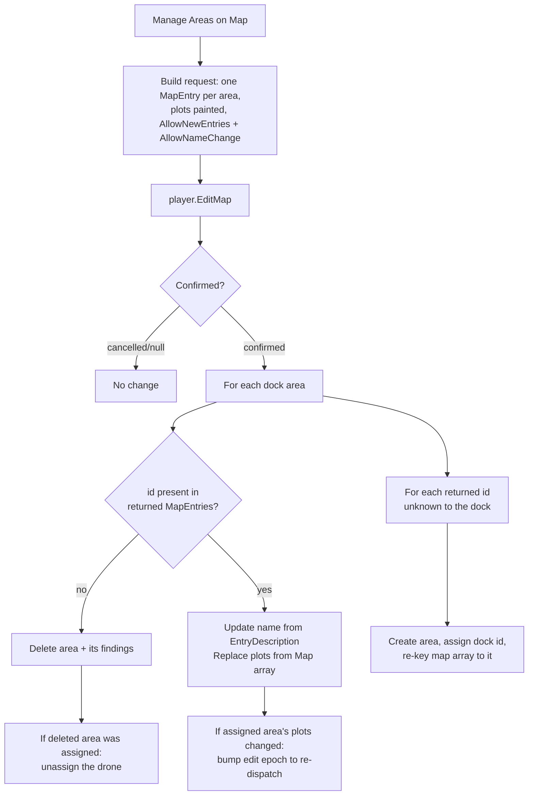

# Survey Tab UI Rework - Plan

## Goal Capsule

**Objective.** Make the Drone Dock's survey interface usable: eliminate the vertical button stack,
replace cycle-based selection with direct per-area selection, and move area management onto Eco's
native map editor so the interface reads as first-party rather than as a column of buttons.

**Product authority.** Solo maintainer, validated by live play.

**Active scope.** The dock's player-facing survey interface only — tab structure, controls, and how
text is grouped. What the drone detects, how it surveys, and where findings are stored are settled
and unchanged.

**Product Contract preservation.** Unchanged. Planning research closed one Outstanding Question
(area names *do* round-trip through the map editor) and resolved the other (Results shows every
area, so no selection control is needed) — both recorded as KTDs below rather than as edits to the
requirements.

**Open blockers.** None.

---

## Product Contract

### Summary

The single Survey tab becomes two: **Areas** (manage and assign) and **Results** (read). Area
creation, renaming, redrawing and deletion move into Eco's native map editor — the same mechanism
districts use — reached by one button. Assignment becomes one button per existing area, so the
player picks an area directly instead of cycling to it. The Results tab shows one area's findings at a
time, chosen with Prev/Next and independent of which area the drone is assigned to.

### Requirements

**R1 — Split the Survey tab into Areas and Results.**
Two tabs on the dock. **Areas** holds, top to bottom: the assignment line, the numbered area list,
the assign buttons, then the map-manager button — that order matters because the buttons are labelled
by position and are meaningless until the list that names them has been read. Member declaration
order in the component is what produces it. **Results** holds, top to bottom: the material-target
picker, the line naming the area being viewed, the Prev/Next selection buttons, then that area's
findings. Selection controls sit **above** the findings because findings are variable-length — bottom-
anchored controls would drift off-screen exactly when an area has many materials.

Neither tab requires scrolling at a typical area count.

**R2 — One assign button per existing area.**
The Areas tab shows a button per area the dock owns (`Assign Area 1`, `Assign Area 2`, …). Buttons
for positions with no corresponding area are hidden. Clicking an area's button assigns the drone to
it; clicking the button of the **already-assigned** area unassigns, so no separate Unassign button
exists. Button labels are static (position numbers, not area names) — the numbered list supplies the
names.

**R3 — A single line states the current assignment.**
The Areas tab shows the assigned area as one line, e.g. `Assigned: 2 — North Ridge`. Three states,
not two: assigned, unassigned, and **assigned-but-no-drone** — assignment does not require a drone to
exist, and the drone's status line lives on the Results tab, so without a third state the Areas tab
reports success while nothing happens in the world. The no-drone variant names the gap, e.g.
`Assigned: 2 — North Ridge (no drone — build and dock one to start surveying)`.

**R4 — Area management happens on the map.**
One `Manage Areas on Map` button opens Eco's map editor showing **all** of the dock's areas as named
entries at once. Creating, renaming, redrawing and deleting areas all happen there and are applied
on confirm. The tab carries no Create/Edit/View/Delete buttons.

**R5 — The Results tab shows one area at a time, chosen with Prev/Next.**
It renders the material-target picker (a compact collapsible row), a line naming the area being viewed
(`Viewing: 2 of 4 — North Ridge`, marked when it is the assigned one), Prev/Next buttons, and that
area's findings — per-material quantity, shallowest location, depth range, coverage, scanned depth and
median surface — plus the drone's status line as a footer. Two buttons is the whole control surface.

**Selecting is not assigning.** The Results cursor is independent of the drone's assignment, so any
area's findings can be read without dispatching the drone there — preserving the view-without-
assignment decoupling shipped in `c9d5f12`.

**R6 — Vertical button stacking is the thing being removed.**
Success is measured by controls that fit without scrolling, not merely fewer buttons. Prefer compact
single-line controls (picker rows, text lines) over buttons wherever a choice exists. A layout that
reintroduces a column of full-width buttons has failed this requirement even if it is otherwise
correct.

### Primary flow

1. Player opens the dock → **Areas** tab: numbered list of areas, one assign button each, and a line
   naming the currently assigned area.
2. To change what the drone works on: click that area's button. To stop it: click the assigned area's
   button again.
3. To create or change areas: `Manage Areas on Map` → the map editor opens with every area drawn and
   named → add, rename, redraw or delete → confirm.
4. To read findings: **Results** tab → Prev/Next to the area you care about → optionally narrow with
   the material picker. Viewing an area never changes what the drone is working on.

### Acceptance examples

- **AE1 — Direct assignment:** dock owns 3 areas → exactly 3 assign buttons show; clicking the second
  assigns the drone to area 2 and the line reads `Assigned: 2 — <name>`.
- **AE2 — Toggle off:** clicking the assigned area's own button unassigns; the line reads unassigned
  and the drone returns to dock.
- **AE3 — No stack:** with 3 areas, neither tab scrolls — Areas shows the list, 3 assign buttons and
  the map button; Results shows the picker and all three areas' findings.
- **AE4 — Map management:** `Manage Areas on Map` opens with all 3 areas visible and named; adding a
  fourth and deleting the first is reflected in the tab afterwards, with the fourth gaining its own
  button.
- **AE5 — Results shows one area:** the Results tab shows the picker, the `Viewing:` line, Prev/Next,
  and that area's findings. Cycling to another area changes the readout and does **not** change the
  drone's assignment.
- **AE6 — Beyond the pool:** creating more areas than the button pool supports leaves the extras
  listed and readable but not assignable from the tab.

### Key decisions

- **One button per area, not a cycle** (session-settled: user-directed — replaces Prev/Next, chosen
  over an editable number field and over map-based assignment). Scroll length from many areas is
  explicitly the player's own tradeoff.
- **Click-the-assigned-button to unassign** — removes a control rather than adding one.
- **Map editor as the area manager**, mirroring districts, which removes four buttons and gives
  direct visual selection.
- **Two tabs**, splitting manage from read.
- **Static button labels** — RPC buttons are declared at compile time, so labels cannot carry area
  names; the numbered list maps position to name.
- **Vertical button stacks are the defect being fixed** (session-settled: user-directed — "this is
  not a smartphone app"), not merely an inefficiency to reduce.

### Out of scope

- Custom client UI panels (not exposed by the ModKit).
- Any change to detection, sampling, findings storage, or the material-filter semantics.
- Humanising material names, and the map-overlay layer (still engine-blocked).

---

## Planning Contract

### Key technical decisions

- **KTD1 — Reconcile the edited map by mirroring `DistrictMap.OnMapEdited`.** The returned
  `IMapEntryOverlay` carries `Map` (an `Array2D<int>` of entry id per plot) and `MapEntries`
  (id → `MapEntry`, whose `EntryDescription` is the player-visible name). Reconciliation is therefore:
  entries absent from `MapEntries` were **deleted**; ids unknown to the dock are **new**; known ids
  get their name refreshed from `EntryDescription`, and their plots replaced **only when the plot set
  actually changed**. Client-assigned ids for new entries differ from the dock's own ids, so the map
  array must be re-keyed to dock ids before plots are read back — districts hit this exact problem and
  solve it the same way. (New entries arrive with negative temporary ids, so re-keying cannot collide
  with the dock's positive ids.)
- **KTD1a — Plot replacement is conditional; renaming never clears findings.** `SetPlots` clears
  findings unconditionally and `OnAreaEdited` bumps the re-dispatch epoch, so replacing plots as a
  matter of course on every known id would wipe every area's survey data on every confirm — including
  untouched areas and pure renames. Compare the returned plot set order-insensitively against the
  stored one and call `SetPlots`/`OnAreaEdited` only on a real difference; route name changes through
  `RenameSurveyArea`, which does not touch findings.
- **KTD2 — Area names round-trip, so renaming stays on the map.** `EntryDescription` is both sent and
  returned; districts rename from it. This closes the requirements doc's open question and means R4
  covers rename with no tab control.
- **KTD3 — Results shows one selected area, with its own Prev/Next cursor**
  (session-settled: user-directed — chosen over rendering every area). Rendering all areas at full
  detail meant scrolling past everything to reach the one you wanted, and the picker scrolled away
  with it; at 4-10 areas that is a wall of text. A dedicated view cursor keeps the tab to one screen.
  The cursor is separate from the drone's assignment, preserving the view-without-assignment
  decoupling shipped in commit `c9d5f12` (the plan describing it, `2026-07-26-001`, was implemented
  directly and remains requirements-only, so the commit is the reference). Two Prev/Next buttons are
  an accepted cost — the defect R6 targets is a column of buttons, not any button at all.
- **KTD4 — Per-area buttons are a fixed pool gated by `VisibilityParam`.** RPC methods are declared at
  compile time, so N buttons cannot be generated. Declare a pool of 10 `AssignAreaN` RPCs, each
  carrying `[RPC, VisibilityParam(nameof(AreaNExists))]`. The precedent is
  `Eco.Gameplay/Components/AreaBonusComponent.cs` — a **WorldObjectComponent** combining
  `[SyncToView] bool ShowInvestButton()` with `VisibilityParam` on a `BigButton` RPC, which is the
  exact shape needed here and largely settles feasibility bet 3 before the live test.
- **KTD4a — Visibility gates must be synced and pushed.** Each gate is a `[SyncToView]` bool, and
  `RefreshAreas()` must fire `Changed()` for all ten after any create, delete or assign. Without the
  push the client never re-evaluates, so a new area gains no button and a deleted one keeps its own
  until the dock is reopened — which reads as bet 3 failing and would trigger the fallback for no
  reason. `AreaBonusComponent` pushes its gate the same way.
- **KTD5 — Assignment is a toggle** (session-settled: user-directed — chosen over a separate Unassign
  button): `AssignAreaN` assigns unless that area is already assigned, in which case it clears.
- **KTD6 — Two tabs are two components.** A second `WorldObjectComponent` with its own
  `CreateComponentTabLoc` supplies the Results tab. An earlier attempt in this project did not
  register a second tab; if it fails again the fallback is one tab in management-then-results order,
  which costs layout but no behaviour.

### High-level technical design

Map reconciliation is the one non-obvious flow — every other unit is a straight edit. Directional
guidance, not implementation specification:

### Implementation units

#### U1. Multi-area map manager

**Goal.** Replace Create/Edit/View/Delete with one `Manage Areas on Map` button that opens every area
at once and reconciles the result.

**Requirements.** R4, R6. KTD1, KTD2.

**Dependencies.** none.

**Files.**
- `EcoServerMod/AdvancedElectronics/SurveyAreaPicker.cs` — rewrite: build a multi-entry request
  (one `MapEntry` per area, its plots painted with that entry id, `AllowNewEntries` true) and
  reconcile the returned overlay per KTD1/KTD1a. **Per-entry status is what enables editing:** give
  each area its own `EntryStatus` entry with `AllowNameChange = true`, `AllowDelete = true`,
  `Readonly = false` and `MaxArea = MaxAreaPlots`, and set `DefaultEntryStatus` to the same flags for
  player-created entries. `DefaultEntryStatus` alone is **not** sufficient — the client reads it only
  for ids absent from `EntryStatus`, and every dock area is present there. Request-level
  `AllowNameChange` governs only the overlay's own title, not entry renaming. **Zero-area case:** when
  the dock owns no areas, seed one empty placeholder entry named `Survey Area 1` so a freshly placed
  dock can still draw its first area — the map manager is the only creation path.
- `EcoServerMod/AdvancedElectronics/DroneDock.cs` — a reconcile entry point that applies creates,
  renames, plot replacements and deletes in one pass, reusing `DeleteSurveyArea` / `OnAreaEdited`
  so findings-clearing and re-dispatch keep their existing semantics.
- `EcoServerMod/AdvancedElectronics/SurveyAreasComponent.cs` — replace the four area buttons with one.

**Approach.** Mirror `DistrictMap.EditAsync` / `OnMapEdited` (Eco source, external to this repo).
Re-key new entries' ids in the map array before reading plots, or plots will be attributed to client
ids. Preserve existing per-area behaviour: deleting clears that area's findings and unassigns if it
was assigned; changing an assigned area's plots must bump the edit epoch so the drone re-dispatches
(the mechanism added in `DroneDock.OnAreaEdited`) — but only on a genuine plot change, per KTD1a.

**Re-validate the plot cap server-side.** After re-keying, count plots per dock id and skip the plot
change (or the creation) for any entry exceeding `MaxAreaPlots`, messaging the player — mirroring the
guards `SurveyAreaPicker` already applies on both existing paths. The client's `MaxArea` is a hint,
not a guarantee; an over-cap area otherwise reaches the drone's sweep unbounded and fails invisibly
until dispatch.

**Patterns to follow.** The existing single-entry request in `SurveyAreaPicker.BuildRequest`; the
plot-cap and painting logic already there.

**Test scenarios.**
- Covers AE4. Open with 3 areas → all 3 appear as named entries with their plots painted.
- New dock, 0 areas → the map opens with a drawable placeholder; confirming creates the first area,
  cancelling leaves 0 areas.
- Add a 4th entry on the map → a 4th area exists afterwards with the drawn plots and the typed name.
- Delete an entry → that area and its findings are gone; if it was assigned, the dock is unassigned.
- Rename an entry → the new name shows in the list, findings preserved (rename is not a redraw).
- Confirm with no geometry changed at all → every area's findings survive untouched and the drone
  does not re-dispatch.
- Redraw the assigned area's plots → its findings clear and the drone re-dispatches to the new shape.
- Draw an entry past the plot cap → the change is refused with a message, the stored area is unchanged.
- Cancel/close without confirming → no areas created, renamed, deleted, or redrawn.
- Two areas whose plots are edited in one session → both are updated, neither cross-contaminates.

**Verification.** Managing areas end-to-end requires no tab buttons other than the one; existing
per-area findings survive a rename and clear on a redraw.

#### U2. Per-area assign buttons

**Goal.** Replace Prev/Next/Assign/Unassign with one button per existing area plus a line naming the
assignment.

**Requirements.** R1 (ordering), R2, R3, R6. KTD3, KTD4, KTD4a, KTD5.

**Dependencies.** U1 (sequencing only — no behavioural dependency; both edit
`SurveyAreasComponent.cs`, so U1 lands first).

**Files.**
- `EcoServerMod/AdvancedElectronics/SurveyAreasComponent.cs` — in declaration order: the
  `Assigned: N — <name>` line (three states per R3), the numbered area list, a pool of 10
  `AssignAreaN` RPC buttons each gated by a `[SyncToView]` `AreaNExists` member, then the map button;
  delete the Prev/Next/Assign/Unassign RPCs and `TargetAreaId`.

**Approach.** Position N maps to the Nth area in the dock's list order. `AssignAreaN` resolves that
position, and assigns it unless it is already assigned, in which case it clears (KTD5). Visibility
members follow the `AreaBonusComponent` shape and are pushed via `Changed()` per KTD4a.

**Convert the results text in this unit, not U3.** `BuildResultsText` resolves its area through
`TargetAreaId`, which this unit deletes — that field currently serves double duty as both the
assignment target and the results selection. Assignment no longer needs a cursor (buttons address
areas directly), so replace it here with a **view cursor** that only drives the results readout, plus
its Prev/Next buttons and the `Viewing: N of M — <name>` line (KTD3). U3 then relocates that whole
block unchanged. Splitting it the other way leaves the intermediate commit either uncompilable or
showing a permanently empty readout.

**Execution note.** Verify the visibility binding hides a button live before building all ten — if it
does not bind, the pool renders at fixed size and out-of-range buttons must no-op with the list
saying so (the KTD4 fallback), which changes the text but not the structure.

**Patterns to follow.** `UserRoster` in the Eco source for `[RPC, VisibilityParam(...)]` on buttons;
the existing `[RPC(AccessType.ConsumerAccess), Autogen, UITypeName("BigButton")]` shape in this file.

**Test scenarios.**
- Covers AE1. 3 areas → exactly 3 buttons visible; clicking the 2nd sets the assignment and the line.
- Covers AE2. Clicking the assigned area's button clears the assignment and the drone returns.
- 0 areas → no assign buttons visible; the line reads unassigned.
- Assign with no drone docked → the line reports the assignment AND names the missing drone (R3).
- Create a 4th area on the map with the dock panel open → a 4th button appears without reopening
  (proves the `Changed()` push in KTD4a); deleting an area removes its button the same way.
- The results text shows one area with a working Prev/Next cursor; cycling it does not change which
  area the drone is assigned to.
- Covers AE6. 11+ areas → the 11th is listed but has no button; chat assignment still reaches it.
- Deleting the assigned area (via U1) leaves the line unassigned and no button orphaned.
- Positions re-map after a deletion: with areas 1,2,3 and 2 deleted, buttons 1 and 2 address the two
  remaining areas.

**Verification.** Assigning any area takes exactly one click with no scrolling at 3 areas.

#### U3. Split Areas and Results into two tabs

**Goal.** Move the findings readout, its selection cursor and the material picker to their own tab so
neither tab needs scrolling.

**Requirements.** R1, R5, R6. KTD3, KTD6.

**Dependencies.** U1, U2 (split last, so a registration failure does not block the button reductions).

**Files.**
- `EcoServerMod/AdvancedElectronics/SurveyResultsComponent.cs` (new) — second tab component carrying
  the material picker, the view cursor with its Prev/Next buttons and `Viewing:` line, and the
  findings text.
- `EcoServerMod/AdvancedElectronics/SurveyAreasComponent.cs` — drop the results/picker/cursor members.
- `EcoServerMod/AdvancedElectronics/DroneDock.cs` — `[RequireComponent]` for the new component, and
  refresh it from the dock tick alongside the existing tab refresh.

**Approach.** Relocate the results block built in U2 — cursor, Prev/Next, `Viewing:` line, findings —
into the new component unchanged. The viewed area's block carries its per-material quantity, shallowest
location and depth range, plus coverage, scanned depth and median surface, with the drone status as a
footer. **Filtered-empty state:** when the picker filters out everything in the viewed area, show a
"no matching materials in this area" line rather than an empty panel, pointing at the Material Targets
picker — never at a button that does not exist (the stale "Show All Materials" string is already
corrected). If the second tab does not register, fold both sections back into one component in
management-then-results order and record that in the plan's open questions rather than reworking
behaviour.

**Execution note.** Confirm the second tab actually registers before moving content into it; the
earlier attempt in this project silently did not appear.

**Patterns to follow.** The existing `[Serialized, CreateComponentTabLoc("Survey", true), HasIcon]`
component shape and its dock-driven `RefreshResults` call.

**Test scenarios.**
- Covers AE5. Results shows the picker, `Viewing:` line, Prev/Next and one area's findings.
- Covers AE3. With 3 areas, neither tab scrolls.
- Cycling Prev/Next changes the readout without changing the assignment; an unassigned dock can still
  read every area by cycling.
- The viewed area's `[assigned]` marker appears only on the assigned one.
- The material filter narrows the viewed area's materials; when it matches nothing there, the panel
  says so and points at the picker rather than at a button.
- A dock with no areas shows a clear empty state on both tabs rather than blank panels.
- An area deleted while it is the one being viewed → the cursor lands on a valid area rather than a
  blank or out-of-range readout.

**Verification.** Both tabs render, each fits without scrolling at 3 areas, and findings remain
visible with no drone assigned.

### Verification Contract

- `dotnet build EcoServerMod/AdvancedElectronics -c Release` — 0 errors.
- `dotnet test EcoServerMod/AdvancedElectronics.Navigation.Tests` — 68/68 (no Navigation change is
  expected; a regression here means a unit reached further than intended).
- Deploy `AdvancedElectronics.dll` to the test server's `Eco_Data\Server\Mods\UserCode` folder.
- Live (user authority): AE1–AE6 above, plus the three feasibility bets resolved explicitly —
  second tab registers, multi-entry map round-trips, button visibility binds.

### Definition of Done

R1–R6 satisfied — except where a feasibility bet's recorded fallback applies: bet 1's fallback relaxes
R1 to a single tab in management-then-results order, and bet 3's relaxes R2's hide-unused clause to a
capped visible pool. Build clean and Navigation tests green; deployed; area management happens on the
map; assignment is one click per area; findings are readable one area at a time without changing the
assignment; neither tab scrolls at a typical area count; each feasibility bet is either working or its
recorded fallback is in place.

### Feasibility bets

Each is testable in one restart and each degrades gracefully:

1. **A second mod component registers its own tab** (U3). An earlier attempt did not register.
   *Fallback:* one tab, management-then-results order.
2. **Multi-entry map editing round-trips** (U1). Districts rely on it, so it is expected to hold.
   *Fallback:* keep per-area editing via the existing single-entry picker, driven from the area list.
3. **`VisibilityParam` hides unused buttons** (U2). Largely de-risked: `AreaBonusComponent` is a
   WorldObjectComponent using this exact shape (KTD4). The residual risk is the `Changed()` push
   (KTD4a) — if buttons never re-evaluate, that is the sync, not the attribute.
   *Fallback:* a capped visible pool of **4** buttons — not 10 — with areas beyond it assigned via
   `/drone assignarea`. Ten always-visible buttons would rebuild the very column R6 defines as
   failure, and would do so even on a dock with one area, which the "many areas is the player's
   tradeoff" reasoning does not cover.

### Assumptions

- **Button pool cap: 6** (settled in play, not assumed). RPCs are compile-time methods so some ceiling
  must exist; six is a product choice sized to the motivating late-game setup — one area per resource
  (coal, iron ore, limestone, gold ore, copper ore), each in a different biome, which is five with one
  spare. Four would fit without scrolling but would not fit that setup. Areas beyond the pool remain
  visible and readable but are assignable only via `/drone assignarea`; raise the pool if mod users ask.
- Position-to-area mapping follows the dock's stored list order; deleting an area re-maps positions,
  which is acceptable because the numbered list is rendered from the same order.
- The map editor's plot cap applies per entry, as it does today for the single-entry request.

### Open questions

- Whether the map editor's empty-entry handling needs the equivalent of the district
  "delete empty districts?" prompt, or whether an area drawn with no plots should simply be dropped.
  Deferred to implementation — visible the first time an empty entry is confirmed.
- **Trim the Areas list to buy button room?** The list currently carries coverage and top material per
  area, which the Results tab now shows in full — so the summary partly duplicates it. Cutting the
  list to name plus plot count shortens it and leaves room for more assign buttons before the tab
  scrolls, at the cost of an at-a-glance overview. Worth judging against the real layout in play
  rather than on paper.
