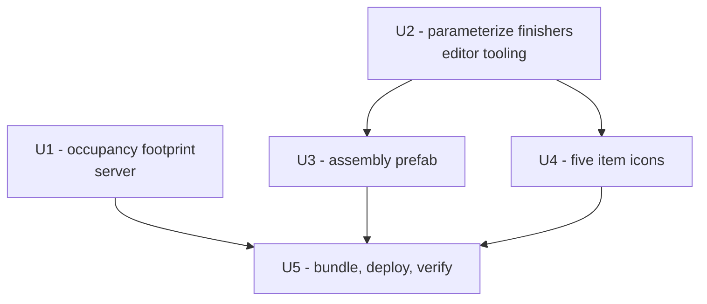

# Unity Placeholder Assets for the New Electronics Content - Plan

## Goal Capsule

**Objective.** Six new server-side types shipped without client counterparts. Give each one a
placeholder asset so the content is craftable, visible, and placeable in game.

**Product authority.** Solo maintainer, validated by live play.

**Active scope.** Client assets (icons, one world-object prefab) plus the one server-side gap that
would leave a new object unplaceable no matter what art exists. Recipes, balance, and real art are
out.

**Product Contract preservation.** N/A — direct planning, no upstream brainstorm.

**Open blockers.** None.

---

## Product Contract

### Summary

The mod gained a skill and its book/scroll, a research paper, a crafting table (Advanced Electronics
Assembly), and a battery, and the drone/dock recipes changed. Client assets exist for none of them,
so items show as missing icons and the crafting table cannot render. This plan adds
placeholder-grade assets at the same bar already shipped — untextured primitives and generated
flat-colour icons — and fixes the one server-side omission that would otherwise make the new
crafting table silently unplaceable.

The battery's **placed block** is deliberately deferred (session-settled). Its item icon ships here.

### Requirements

**R1 — Every new item has a name-matched icon.** Five items need one: the skill book, the skill
scroll, the research paper, the assembly item, and the battery item. An item with no matching client
asset renders as a missing-icon placeholder.

**R2 — The Advanced Electronics Assembly renders and can be placed.** It needs a world-object prefab
and a registered placement footprint. Both are required; either alone leaves it broken.

**R3 — Asset names match server type names exactly.** The client prefab/icon and the server class are
bound by name and nothing else; a mismatch fails silently and looks purely visual.

**R4 — Bundled objects ship disabled.** Any new prefab must have its root GameObject disabled, or
placed instances are invisible until the area re-streams.

**R5 — The changed drone and dock recipes still resolve.** They gained new ingredients; verify they
craft rather than assuming.

### Acceptance examples

- **AE1 — Icons:** each of the five items shows its placeholder icon in inventory and in the crafting
  UI, not a missing-texture placeholder.
- **AE2 — Placement:** the Advanced Electronics Assembly shows a placement ghost, places on open
  ground, and opens its crafting window.
- **AE3 — Immediate render:** a placed assembly is visible and interactable on approach, with no
  leave-and-return needed, and `Player.log` carries no "should start as DISABLED" warning.
- **AE4 — Name match:** `scripts/validate-name-match.sh` passes with the new types present.
- **AE5 — Battery:** the battery is craftable and usable as fuel from inventory. Placing one is
  out of scope and may render incorrectly.

### Out of scope

- **The battery's placed block** — needs a `BlockSet` (`BlockSetContainer` + a `VoxelEngine > BlockSet`
  asset), a pipeline this mod has never used. Session-settled: icon only this pass.
- **Real art.** Placeholder fidelity only, matching the existing cube/capsule and flat-colour icons.
- **Recipe balance, skill tiers, Ecopedia pages.** Several `// TODO` markers exist in the new server
  files; they are the author's, not this plan's.

---

## Planning Contract

### Key technical decisions

**KTD1 — Fix the missing placement footprint as part of this work.**
`AdvancedElectronicsAssemblyObject` has no `AddOccupancy<T>()` static constructor, while both
existing world objects (`DroneDockObject`, `SurveyDroneObject`) do. Per
`docs/solutions/conventions/eco-custom-worldobject-placement-requirements.md`, a hand-written mod
WorldObject must declare occupancy in code — vanilla AutoGen objects get it baked by a generator that
mod code does not run. Without it the object is silently unplaceable: no ghost, no error.

This is server-side and outside the literal "add Unity counterparts" ask, but the ask's purpose is
"to make them work", and assets alone would not achieve that. Including it is the difference between
a shippable outcome and a plan that delivers art for an object nobody can place.

**KTD2 — Parameterize the finishers rather than copy them per asset.**
`FinishItemIcon` hard-codes `const string itemName = "SurveyDroneItem"` and a single output path;
`FinishPrefab` is reached through two hard-coded menu wrappers. Five icons and one prefab is past the
point where copying is cheaper. Parameterize the existing methods and drive them from a small table
of type names, keeping the current behavior (tag, components, disabled root, container registration)
intact.

Rejected: hand-building each asset in the Editor. It repeats the naming step five more times, and
that step is exactly where the prefab finisher has already caused duplicate-asset damage
(`docs/solutions/logic-errors/prefab-finisher-writes-to-the-scene-object-name.md`).

**KTD3 — Battery ships icon-only** *(session-settled: user-directed — chosen over building the
BlockSet pipeline now: the block pipeline is unfamiliar and larger than the other six assets
combined; the item is independently useful as fuel)*.

**KTD4 — Reuse the existing placeholder material.**
`AdvancedElectronicsPlaceholder.mat` already exists and already satisfies the curved-shader
requirement in `docs/solutions/ui-bugs/modkit-prefab-materials-need-curved-shaders.md`. A new
primitive gets that material rather than Unity's default, which renders wrong in Eco.

### Assumptions

- **A1 — The skill itself needs no separate client asset.** `AdvancedElectronicsSkill` is covered by
  its book and scroll items. Unverified; U4 checks it in game and adds one if the skill tree shows a
  gap. Cheap to add later, cheap to check.
- **A2 — A cube is an acceptable stand-in for the crafting table**, as it is for the dock.

### Open questions

- **Q1 — `HousingComponent.HomeValue` points at vanilla `ElectronicsAssemblyItem.homeValue`,** not the
  new type's own `homeValue`. Possibly deliberate reuse, possibly a copy-paste artifact from the
  vanilla template this file was derived from. Flagged, not changed — it is a balance decision.

---

## High-Level Technical Design

Asset inventory, and what each server type binds to. Name match is exact, both directions.

| Server type | Kind | Client asset needed | Unit |
|---|---|---|---|
| `AdvancedElectronicsSkillBook` | `Item` | icon | U4 |
| `AdvancedElectronicsSkillScroll` | `Item` | icon | U4 |
| `EngineeringResearchPaperPostModernItem` | `Item` | icon | U4 |
| `AdvancedElectronicsAssemblyItem` | `WorldObjectItem` | icon | U4 |
| `BatteryItem` | `BlockItem` | icon | U4 |
| `AdvancedElectronicsAssemblyObject` | `WorldObject` | prefab + occupancy | U1, U3 |
| `BatteryBlock` | `PickupableBlock` | BlockSet — **deferred** | — |
| `AdvancedElectronicsSkill` | `Skill` | assumed none (A1) | U4 verify |

U1 is server-side and independent of the Unity work — it can land first and separately.

---

## Implementation Units

### U1. Register the assembly's placement footprint

**Goal:** Make `AdvancedElectronicsAssemblyObject` placeable.

**Requirements:** R2

**Dependencies:** none

**Files:**
- `EcoServerMod/AdvancedElectronics/AdvancedElectronicsAssembly.cs`

**Approach:** Add a static constructor calling `AddOccupancy<AdvancedElectronicsAssemblyObject>` with
a `BlockOccupancy` list. Mirror `DroneDock.cs` — it carries the pattern and a comment explaining why
mod objects need it. Footprint should match the table's intended size; a 1x1x1 is acceptable for a
placeholder if the real dimensions are not settled, but note the choice so the prefab in U3 is built
to the same size.

**Patterns to follow:** the static constructor in `DroneDock.cs`, including its explanatory comment.

**Test scenarios:**
- `dotnet build` succeeds.
- Existing suite still passes (68/68) — this touches a type the suite does not cover, so the check is
  for regressions, not new coverage.
- Live: the item produces a placement ghost on open ground and places successfully (AE2).

**Verification:** The object places in game. Before this unit, it does not.

---

### U2. Parameterize the prefab and icon finishers

**Goal:** Make the Editor tooling take a type name rather than hard-coding one.

**Requirements:** R1, R3

**Dependencies:** none

**Files:**
- `Assets/Art/AdvancedElectronics/Editor/AdvancedElectronicsBuildTools.cs`

**Approach:** `FinishItemIcon` currently hard-codes `itemName` and its output path; generalize both to
parameters and add a menu command per new item, or a single command driven by a name table. Keep
every existing behavior: the `ModObject` tag, `HighlightableObject` + `BoxCollider`, the
disabled-root save added for R4, and `ModkitPrefabContainer` registration.

Preserve the guard against the known finisher defect — the tool derives the asset name from the scene
GameObject, which previously produced duplicate prefabs under the wrong name. Naming must come from
the parameter, not from whatever is selected in the scene.

**Execution note:** This is Editor tooling with no runtime behavior; prefer verifying by running the
commands and inspecting the produced assets over writing test scaffolding.

**Test scenarios:** `Test expectation: none -- Editor-only tooling with no runtime behavior; U3 and
U4 exercise it directly and their output is the proof.`

**Verification:** Running a finisher for a named type produces an asset at
`Assets/Art/AdvancedElectronics/<TypeName>.<ext>` with the correct name, and re-running it is
idempotent rather than creating a duplicate.

---

### U3. Advanced Electronics Assembly world-object prefab

**Goal:** A placeholder prefab that renders and is interactable.

**Requirements:** R2, R3, R4

**Dependencies:** U2

**Files:**
- `Assets/Art/AdvancedElectronics/AdvancedElectronicsAssemblyObject.prefab` (new)
- `Assets/DroneScene.unity` (scene root + container registration)

**Approach:** Build a primitive sized to the U1 footprint, assign
`AdvancedElectronicsPlaceholder.mat`, and run the parameterized finisher against the exact server
type name `AdvancedElectronicsAssemblyObject`. The finisher handles the tag, collider,
`HighlightableObject`, disabled root, and container registration.

The object declares many `[RequireComponent]`s (crafting, power, housing, rooms) — those are
server-side and need nothing in the prefab. Only the visual and the interaction collider are client
concerns.

**Patterns to follow:** `DroneDockObject.prefab` as the shape reference.

**Test scenarios:**
- `scripts/validate-name-match.sh` passes with the new prefab present (AE4).
- Live: the placed object is visible and interactable on approach without leaving and returning (AE3).
- Live: `Player.log` contains no `should start as DISABLED` line naming the new object (AE3).
- Live: interacting opens the crafting window rather than an empty one.

**Verification:** AE2 and AE3 both hold.

---

### U4. Placeholder icons for the five new items

**Goal:** Every new item shows an icon rather than a missing-texture placeholder.

**Requirements:** R1, R3

**Dependencies:** U2

**Files:**
- `Assets/DroneScene.unity` — five new GameObjects under the `Items` root, named **exactly**
  `AdvancedElectronicsSkillBook`, `AdvancedElectronicsSkillScroll`,
  `EngineeringResearchPaperPostModernItem`, `AdvancedElectronicsAssemblyItem`, `BatteryItem`
- `Assets/Art/AdvancedElectronics/<TypeName>_icon.png` (five new sprite files)

**Approach:** Run the parameterized icon finisher once per type name. Distinct flat colours per item so
they are distinguishable in inventory at a glance — the point of a placeholder is telling items apart,
not looking good. Each becomes a child of the scene's `Items` root, following `SurveyDroneItem`.

**The name-matched artifact is the scene GameObject, not the PNG.** Items are never saved as their own
prefab files — per the ModKit's item flow they are unpacked GameObjects living inside the scene under
`Items`, and that GameObject's name is what binds to the server type. The `_icon.png` is just the
sprite assigned to its foreground and its filename carries no binding. Getting the PNG name right
while the GameObject name is wrong produces a silent missing-icon failure.

Note the `Items` root is disabled in the scene, and its children inherit that; this is correct and
must not be "fixed". Watch for a stray copy landing at scene root rather than under `Items` — that has
happened before and is what left an object enabled in the bundle.

**Test scenarios:**
- `scripts/validate-name-match.sh` passes for all five (AE4).
- Live: each item shows its icon in inventory and in the crafting UI (AE1).
- Live: the battery is craftable and burns as fuel (AE5).
- Live: check whether the skill tree shows an icon gap for `AdvancedElectronicsSkill`; if it does,
  add a sixth icon (A1).

**Verification:** AE1 holds for all five, and A1 is resolved either way.

---

### U5. Bundle, deploy, and live-verify

**Goal:** Get the assets into the running server and confirm the whole set works.

**Requirements:** R1, R2, R4, R5

**Dependencies:** U1, U3, U4

**Files:** none — build and deploy only.

**Approach:** Build the server DLL (auto-deploys via the git-ignored `Local.props`), rebuild the
bundle through **Eco Tools > Mod Kit > Build Current Bundle**, and copy the `.unity3d` to the test
server's mod folder. Restart and walk the acceptance examples.

Both halves are required: a bundle rebuild without the DLL leaves the occupancy fix out, and a DLL
without a bundle rebuild leaves the assets out.

Before asking for the restart, confirm the artifacts landed in the tree that actually runs and that
the DLL contains the new types — a copy to the wrong install succeeds silently.

**Execution note:** Batch the whole set into one restart and walk all acceptance examples in that
session rather than restarting per asset.

**Test scenarios:**
- `dotnet build` clean; existing suite green.
- `scripts/validate-name-match.sh` passes (AE4).
- Live: AE1, AE2, AE3, AE5 all hold.
- Live: craft a Survey Drone and a Drone Dock with the changed recipes (R5) — they gained
  ingredients and were not previously exercised.
- `Player.log` has no `should start as DISABLED` lines and no new exceptions.

**Verification:** Every acceptance example passes in one session.

---

## Verification Contract

| Gate | How |
|---|---|
| Build | `dotnet build EcoServerMod/AdvancedElectronics` — 0 errors |
| Tests | existing suite green (68/68 at time of writing) |
| Name match | `scripts/validate-name-match.sh` exits 0 |
| Deploy landed | new type names present in the deployed DLL; bundle timestamp current |
| Live | AE1-AE5 walked in one session; `Player.log` clean of DISABLED warnings and new exceptions |

## Definition of Done

- The five new items show placeholder icons in game (AE1).
- The Advanced Electronics Assembly places, renders on approach, and opens its crafting window
  (AE2, AE3).
- `scripts/validate-name-match.sh` passes (AE4).
- The battery crafts and burns as fuel (AE5).
- The changed drone and dock recipes still craft (R5).
- The battery's placed block remains deferred, recorded as such rather than half-built.

---

## Risks & Dependencies

- **The occupancy footprint in U1 and the prefab size in U3 must agree.** A prefab visually larger
  than its registered footprint places wrong and looks like a rendering bug. Settle the size in U1 and
  build U3 to it.
- **Unity is the bottleneck.** U3 and U4 need the Editor; the bundle build opens a native save dialog
  that cannot be scripted. Plan on the maintainer driving those steps.
- **The finisher has a history of writing assets under the wrong name.** U2 must take the name from
  its parameter, and U3/U4 should confirm the produced filenames before bundling.

## Sources & Research

- `docs/solutions/conventions/eco-custom-worldobject-placement-requirements.md` — the missing
  `AddOccupancy` finding behind KTD1.
- `docs/solutions/ui-bugs/bundled-mod-objects-must-ship-disabled.md` — R4.
- `docs/solutions/ui-bugs/modkit-prefab-materials-need-curved-shaders.md` — KTD4.
- `docs/solutions/logic-errors/prefab-finisher-writes-to-the-scene-object-name.md` — the naming
  guard in U2.
- `docs/solutions/workflow-issues/verify-the-deploy-landed-before-asking-for-a-restart.md` — the
  deploy check in U5.
- `docs/solutions/workflow-issues/eco-mod-batched-live-testing.md` — one restart, all examples.
- `Assets/EcoModKit/Docs/README.md` — scene roots, item template flow, and the BlockSet pipeline the
  deferred battery block would need.
