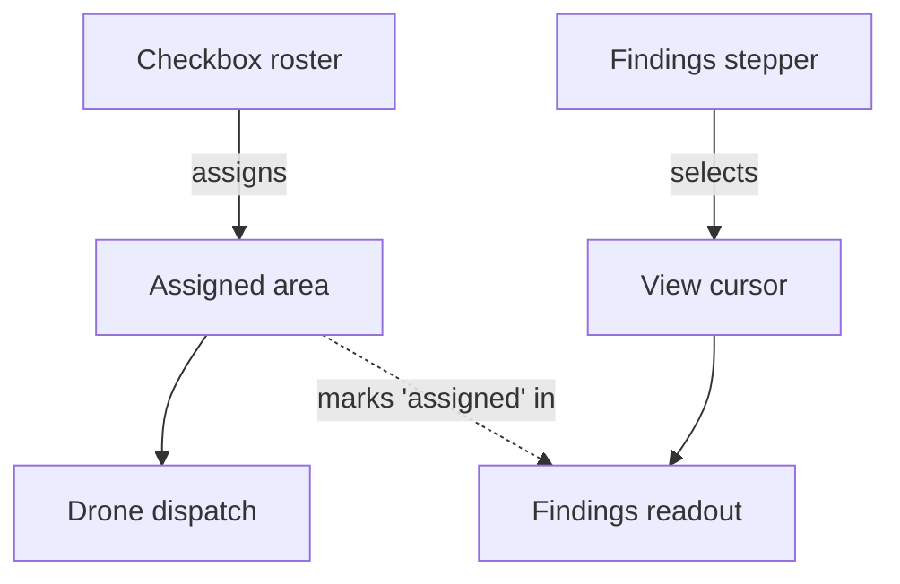
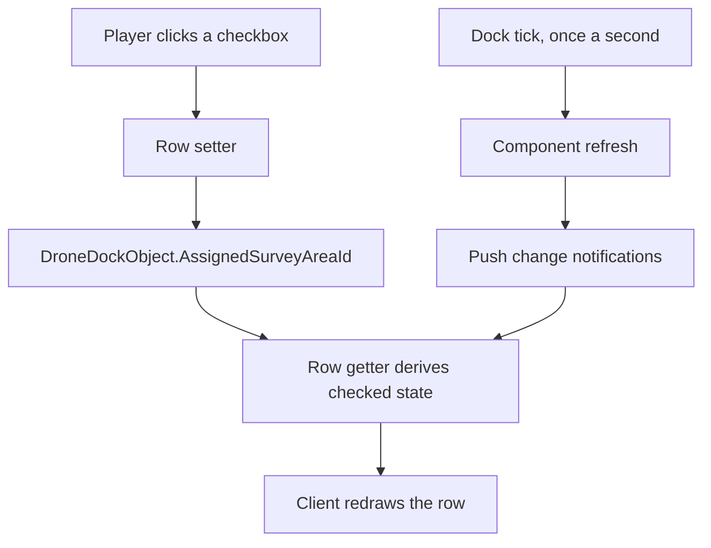

# Merged Survey Tab - Plan

## Goal Capsule

- **Objective.** Replace the drone dock's Areas and Results tabs with one Survey tab, using controls that cost a third of the vertical space the current buttons do.
- **Product authority.** Live play on the maintainer's test server. Panel-length judgements come from what a player sees, not from what compiles.
- **Open blockers.** None. Save compatibility and pool size are settled (KD7, KD8). The remaining questions need a live probe and are answerable during planning.

---

## Product Contract

### Summary

One Survey tab on the drone dock replaces Areas and Results. A checkbox per survey area assigns the drone; a stepper selects which area's findings are shown. The two controls stay independent, so reading one area's findings never dispatches the drone there.

### Problem Frame

The dock uses `BigButton` as a list primitive, and it is not one. `BigButton` is the panel's commit control — the OK at the bottom of a screen. Its size is fixed, it cannot be grouped horizontally, and it is designed to appear once. Every property that makes it a good commit button makes it a bad repeated element, so a column of them is the affordance used against its purpose rather than a layout that happens to be tall.

The cost is the symptom. Measured against live client screenshots, one renders roughly 120 px wide by 70 px tall, centred, with about 400 px of dead panel on each side. A standard two-column row is 22 px, so each button occupies 3.2 rows and leaves the horizontal axis empty — which is exactly what a control meant to be alone at the bottom of a panel would do.

The Areas tab spends six of them on assignment. At the pool's full size that is 420 px of a 605 px viewport, 69% of everything a player sees without scrolling, given over to the one thing they came to do and positioned below a text block whose height grows with the number of areas it describes. At six areas the panel measures 652 px and the last button falls off-screen. The Results tab is not over budget at 306 px, but 140 px of it is two commit buttons moving a cursor by one, sitting between the line naming the current area and the findings that line describes.

A prior rework responded to the live verdict that the ladder was bad, and it helped: management moved to the map editor, findings moved to a second tab. It reduced the number of buttons without questioning whether a button was the right control. The vocabulary already carries controls built for repetition — `Boolean` for a per-object toggle, `Int32` for a cursor — and they cost 22 px because that is what a list element is supposed to cost.

### Key Decisions

- **KD1. One merged tab rather than two shorter ones.** The split was made to halve two over-long panels. Once assignment and navigation stop using `BigButton`, neither panel is over-long, so the split stops paying for itself and costs a tab switch between choosing an area and reading what is in it. (session-settled: user-directed — chosen over keeping two tabs, over steppers alone, and over a checkbox roster alone, after seeing all three drawn at measured size.)

- **KD2. Assignment is a checkbox per area, not a button per area.** `Boolean` is a repeatable list control; `BigButton` is a commit control used once. One control per object is already the recorded principle, and a checkbox is the vocabulary's element for it. It also keeps the list and the control as the same element, so the player is not mapping a position number onto a button label.

- **KD3. The findings cursor is a stepper, not a pair of buttons.** A stepper is a two-direction cursor in one row, and cursors are what it is for. Previous and Next as commit buttons is two single-use controls doing a job neither was built for, and they separate the "which area" line from the findings.

- **KD4. `BigButton` is reserved for genuine commit actions, at most one per panel.** The merged tab keeps exactly one — opening the map manager. Nothing repeated, positional, or cursor-shaped uses it. This is the rule the redesign is actually applying; the row-cost arithmetic is how the misuse shows up on screen, not the reason it is wrong.

- **KD5. Assignment and viewing stay independent controls.** This preserves the decision made in `docs/plans/2026-07-26-001-feat-decouple-survey-viewing-plan.md`. The merge puts both cursors on one screen, which is the confusion the tab split was defending against, so the panel must make the distinction visible through grouping.

- **KD6. Every editable member pushes its own change notification.** A member declared as an auto-property persists a write and never updates on screen until the window is reopened. Converting actions into state edits means each control needs an explicit backing field and a raised notification, or it renders dead. This is a per-member cost the current button design does not pay.

- **KD7. Placed docks from an earlier version are allowed to break.** No migration ships with this change. The mod is alpha and unreleased in practice, so the cost of building migration machinery now is not repaid by anyone it would protect. Migration becomes real once the mod is in use and an update has to preserve existing worlds — tracked separately, not deferred inside this plan. (session-settled: user-directed — chosen over a save migration and over a compatibility shim: the burden is not justifiable yet.)

- **KD8. The control pool stays at six.** The row-cost argument for raising it holds, but the recorded sizing rationale — one area per resource in a late-game setup, five plus a spare — has not changed, and a larger pool is a product claim about how players work, not a consequence of cheaper rows. Raise it when mod users ask. (session-settled: user-directed — chosen over raising it now: no evidence the workflow needs more.)

- **KD9. Build on verified templates only.** The SLG wiki surfaced attributes and a custom-prefab path that could change these constraints. None of it is built here; it is recorded in Scope Boundaries and Outstanding Questions.

### Requirements

**Panel layout**

- R1. The dock exposes a single survey tab in place of the Areas and Results tabs.
- R2. At the supported area count the panel fits the visible panel height without scrolling.
- R3. Assignment and findings are visually separated by a header row, so a player can tell which control does which.
- R4. Controls whose position must not move — the map manager — are declared above anything whose height varies with area count.

**Assignment**

- R5. Each existing survey area renders as one checkbox row.
- R6. Checking a row assigns the drone to that area; checking a different row moves the assignment; unchecking the checked row unassigns.
- R7. At most one row is checked at a time, and a change is visible on screen without reopening the window.
- R8. A row with no backing area does not render.
- R9. Areas beyond the control pool stay assignable by chat command, and the panel says so when the pool is exceeded.
- R10. The panel states what the drone is currently doing, and distinguishes "assigned but no drone exists" from "assigned and working".

**Findings**

- R11. A cursor selects which area's findings are shown.
- R12. Moving the cursor never changes what the drone is assigned to.
- R13. The panel names the viewed area, its position in the list, whether it is the assigned one, and its coverage.
- R14. Findings for an area remain readable while the drone is elsewhere or docked.
- R15. The material filter stays a single-row picker.

**Compatibility**

- R16. The release notes state that drone docks placed before this update will not survive it, so a server owner reads the consequence before installing rather than discovering it on a world.

The dotted edge is the only influence assignment has on the readout: it labels the viewed area when the two happen to coincide. No edge runs from the view cursor back to assignment, and that absence is R12.

### Key Flows

- F1. Assign an area
  - **Trigger:** Player opens the dock with at least one survey area drawn.
  - **Steps:** Player reads the roster; checks the row for the area they want; the drone begins work there.
  - **Outcome:** Exactly one row is checked, and the drone status line reflects the new target.
  - **Covers R5, R6, R7, R10.**

- F2. Read a different area's findings while the drone works
  - **Trigger:** Drone is surveying area 2; player wants to see what area 4 already produced.
  - **Steps:** Player moves the findings cursor to 4; the readout switches to area 4's recorded findings.
  - **Outcome:** The drone is still on area 2. The checked row has not moved.
  - **Covers R11, R12, R13, R14.**

- F3. Exceed the control pool
  - **Trigger:** Player has drawn more areas than the panel has checkbox rows.
  - **Steps:** Panel renders rows up to the pool and states that the remainder are assigned by chat command.
  - **Outcome:** Every area stays reachable; the panel does not grow past its budget.
  - **Covers R8, R9.**

### Acceptance Examples

- AE1. **Covers R7.** Given area 2 is checked, when the player checks area 4, then area 2 shows unchecked and area 4 shows checked, without the window being reopened.
- AE2. **Covers R6.** Given area 4 is checked, when the player unchecks it, then no area is checked and the drone reports no assignment.
- AE3. **Covers R12.** Given area 2 is assigned and the cursor is on area 2, when the player moves the cursor to area 5, then the drone remains on area 2 and area 2's row stays checked.
- AE4. **Covers R8, R11.** Given no areas exist, then no checkbox rows render and the findings region tells the player to draw an area on the map.
- AE5. **Covers R13.** Given the cursor is on an area that is also the assigned one, then the panel says so on the same line that names it.
- AE6. **Covers R2.** Given the supported number of areas all exist and all have findings, then the panel does not scroll.

### Success Criteria

- The merged panel measures under the visible panel height at the supported area count, against the current 652 px for Areas alone at six areas.
- No control renders dead: every checkbox and stepper reflects its new value on screen without the window being reopened.
- A player can assign an area and read a different area's findings without switching tabs.

### Scope Boundaries

**Deferred for later**

- Save migrations. Not built here and not built for this change; the work belongs to the first update that has to preserve a world people are actually playing on.
- The wiki attribute family — ordering, read-only rendering, per-viewer visibility, large text surfaces. Recorded in Outstanding Questions as probes, not built here.
- Custom Unity view prefabs bound by GameObject name. If they work for mods, the vertical-stack budget stops being a constraint at all, which would make this plan's arithmetic obsolete rather than wrong. Not attempted here.
- Item and skill icon replacement.
- Drone fuel, and the drone's own empty component pane.
- The missing placement ghost for the dock and the assembly.

**Not a goal**

- Recovering the horizontal axis through autogen. Every autogen template renders as one row; the axis is unavailable without the custom-prefab path above.
- Rendering a dynamically sized list. Repeatedly attempted, blocked by a client type-reconstruction gap. The fixed control pool exists because of it.

### Dependencies and Assumptions

- Panel geometry is assumed proportional to the window, not fixed in pixels. Measurements came from two client screenshots at different window sizes and stayed consistent relative to the panel, but this was not tested at a third size.
- `Boolean` and `Int32` are assumed to keep behaving as they did in the template probe: rendering, persisting, and — with an explicit backing field — refreshing live.
- Findings already persist per area and survive the drone moving on. This plan changes how they are reached, not how they are stored.
- The temporary showcase component is detached, not deleted, and is the vehicle for the probes in OQ1 and OQ2.

### Outstanding Questions

**Deferred to planning**

- OQ1. Can a row's label be set at runtime rather than derived from the member name? This decides whether each checkbox carries its area's name and coverage, or reads "Area 3" with a separate text list restored below it. The second shape still fits the budget; it is not as clean. Needs a live probe.
- OQ2. Can a numeric range bound be something other than a compile-time constant? Does not change the pool, which is fixed at six by KD8, but decides whether the findings cursor is capped by the same number or reaches every area.

### Sources and Research

- `docs/ideation/2026-07-31-dock-ui-palette.html` — the measured palette, both tabs as they stand, and the three options this plan chose from. Contains the geometry every number here rests on.
- `docs/solutions/design-patterns/vertical-stack-only-ui-design.md` — the layout rules and the record of what live play rejected.
- `docs/solutions/runtime-errors/autogen-template-binding-contract.md` — which templates bind how, and the three ways they fail.
- `docs/solutions/conventions/eco-server-only-mod-client-rendering-surfaces.md` — what renders at all from a server-only mod.
- `docs/plans/2026-07-26-001-feat-decouple-survey-viewing-plan.md` — where viewing and assignment were separated.
- `docs/plans/2026-07-26-003-feat-survey-tab-ui-rework-plan.md` — the prior rework this one supersedes.
- `EcoServerMod/AdvancedElectronics/SurveyAreasComponent.cs`, `EcoServerMod/AdvancedElectronics/SurveyResultsComponent.cs` — the two tabs being merged.
- `EcoServerMod/AdvancedElectronics/UIShowcaseComponent.cs` — the template probe, detached at `EcoServerMod/AdvancedElectronics/DroneDock.cs:87`.

---

## Planning Contract

Product Contract changed: the tab-name Outstanding Question was removed, because KTD5 answers it from text the mod already ships. No requirement, flow, or acceptance example was altered.

### Key Technical Decisions

- KTD1. Checkbox state is derived from the dock's assigned-area id, not stored per row. The getter reads whether that row's area is the assigned one; the setter toggles assignment. R7's "at most one checked" stops being bookkeeping the code has to maintain and becomes a property of having one source of truth. It also means the member must not be `[Serialized]` — there is nothing to persist, and persisting a computed value would put a stale copy beside `DroneDockObject.AssignedSurveyAreaId`.

- KTD2. The one-second readout tick reconciles the view; it never assigns member values. `DroneDock.RefreshReadout()` calls into both tabs every second, so any member the tick writes is in a race with the player clicking it. The tick pushes change notifications only. This is the same hazard `SurveyResultsComponent.ApplyPickerSelection` already guards, and KTD1 removes most of it by leaving nothing for the tick to write.

- KTD3. The binding shape is probed on an isolated tab before it reaches the dock's own. An editable member whose setter is unreachable disconnects every player with `Missing RPC call Set<Prop>`, and the derived-bool shape needs an attribute combination — sync and RPC generation without serialization — that nothing in this project has run. A `WorldObjectComponent` gets its own tab, so a failed probe costs that tab and nothing else.

- KTD4. Roster text and cursor arithmetic move into `AdvancedElectronics.Navigation`. It is the only part of this change automated tests can reach — the components depend on Eco types and the test project deliberately does not. The split mirrors the existing `SurveyFinding` / `OreFindingSnapshot` pair.

- KTD5. The tab is called Survey. `DroneDockItem`'s description already tells players to "draw and assign a survey area from the dock's Survey tab", so the name is in shipped text and any other choice would contradict it.

- KTD6. No save migration and no compatibility shim ships with this change (inherits KD7).

- KTD7. The control pool stays at six (inherits KD8).

### Assumptions

- A `[SyncToView, Autogen, AutoRPC]` member without `[Serialized]` generates a reachable setter for a mod component. Documented as separable in SLG's UI system page and confirmed separable in the attribute source; never exercised here. U1 tests it, and the fallback below applies if it fails.
- `Boolean` and `Int32` behave as the template probe recorded: rendering, accepting input, and refreshing live when the setter raises the change notification.
- Panel geometry is proportional to the window rather than fixed in pixels (carried from the Product Contract).

### Risks

| Risk | Consequence | Mitigation |
|---|---|---|
| The derived-bool attribute shape does not generate a reachable setter | Clicking a checkbox disconnects every connected player | U1 probes it on the showcase tab first. Fallback: store a bool per row with the known-good `[Serialized, Eco]` shape and reconcile against the dock in the tick, accepting the bookkeeping KTD1 was avoiding |
| Row labels cannot be set at runtime | Rows read "Area 3"; the text list returns below them, costing about 162 px | Still inside budget at roughly 406 px. U1 settles it before U3 commits to a shape |
| The tick races the player's click | A checkbox flickers or reverts | KTD2. U5 watches for it specifically, since it is invisible in a build and obvious in play |
| Placed docks fail to load after the update | A world with docks in it breaks | Accepted by KTD6. U4 makes it a stated consequence rather than a surprise |

---

## High-Level Technical Design

The write path is the part of this change most likely to be built wrong, because it has two writers a second apart and only one of them is the player.

The tick reaches the view only through the notification edge. It has no edge into the assigned area, which is what keeps it from overwriting a click that landed in the same second — and it is why the rows hold no state of their own (KTD1, KTD2).

The material picker is the exception and stays as it is: it genuinely owns its value, so `ApplyPickerSelection` writes into the dock and carries an explicit guard against rewriting during a tick. That guard is the shape to copy if U1 forces the fallback, where rows would own state again.

---

## Implementation Units

### U1. Probe the binding unknowns on the showcase tab

- Goal: settle the three unknowns that decide U3's shape, in one restart.
- Requirements: none directly; unblocks R5, R6, R7, R11.
- Dependencies: none.
- Files: `EcoServerMod/AdvancedElectronics/UIShowcaseComponent.cs`, `EcoServerMod/AdvancedElectronics/DroneDock.cs`
- Approach: re-attach the showcase component (one commented line). Add three probe members: a bool whose value derives from another property and whose setter has no backing field, declared with sync, autogen, and RPC generation but not serialization; a member carrying a runtime-label attribute against one carrying only the default humanised member name; and a numeric stepper whose bound comes from a non-constant expression. Keep every probe on the showcase component so a failure costs that tab alone.
- Patterns to follow: the existing probe members in the same file, and the A/B shape it already uses to isolate one variable per pair.
- Execution note: the probe is the proof. Deploy, click each control, and read the client log at `%USERPROFILE%\AppData\LocalLow\Strange Loop Games\Eco\Player.log` — the client's own crash dialog renders off-screen, so the trace on disk is the only readable evidence.
- Test expectation: none — this unit produces knowledge, not behaviour. No code path survives into the shipped tab.
- Verification: each probe member renders; clicking the derived bool changes the value it derives from and does not disconnect the client; the runtime-label member shows its intended text or demonstrably does not; the non-constant bound either compiles and renders or fails at compile time. Record all three outcomes in the plan before starting U3.

### U2. Move the readout formatter into the navigation core and grow it

- Goal: make the parts of the panel that can be tested, testable — and fix the existing case where that was claimed but never true.
- Requirements: R9, R13.
- Dependencies: none — runs in parallel with U1.
- Not this unit: R10's drone-status line stays in the component. It reads `SpawnedDrone` and `DroneLifecycle`, so it cannot cross into an Eco-free assembly.
- Files: `EcoServerMod/AdvancedElectronics.Navigation/DockReadout.cs` (moved), `EcoServerMod/AdvancedElectronics/DockReadout.cs` (delete), `EcoServerMod/AdvancedElectronics.Navigation.Tests/DockReadoutTests.cs` (new), `EcoServerMod/AdvancedElectronics/DroneCommands.cs`
- Approach: `DockReadout` already carries the Eco-free formatting and documents itself as testable without a server, but it sits in the mod project while the test project references only `AdvancedElectronics.Navigation` — so nothing has ever tested it. Move it across, change its namespace, and add a using at the two call sites. Then extend it with what the merged panel needs: the roster line for one area, the viewing line, and the overflow notice. Cursor clamping joins it — index arithmetic over a count, no Eco dependency. The component keeps the Eco types and calls in.
- Patterns to follow: `EcoServerMod/AdvancedElectronics.Navigation/SurveyFinding.cs` and its serialized mirror `OreFindingSnapshot` — the same Eco-free-core, Eco-facing-shell split, with the core on the side the tests can reach.
- Execution note: test-first. This is the only unit with automated coverage available, so the tests are the specification rather than a check afterwards.
- Test scenarios:
  - Roster line for a surveyed area names position, name, plot count, coverage, and top finding.
  - Roster line for an unsurveyed area reads "not surveyed yet" and carries no finding.
  - Roster line for a surveyed area whose findings are all filtered out reads "nothing matching" rather than "not surveyed".
  - The assigned area's line is marked; no other line is.
  - Covers R9. With more areas than the pool, the overflow notice names the chat command; with fewer or equal, it is absent.
  - Covers R13. The viewing line names position, total, area name, and assigned state.
  - Cursor clamping: forward from the last index wraps to the first; backward from the first wraps to the last.
  - Cursor clamping with a count of zero returns zero rather than throwing or going negative.
  - Cursor clamping after the count shrinks below the current index returns the new last index.
  - `FormatOreLine` with a finding that has no data returns the "no data yet" form; with a single-depth finding it reads "N blocks deep" rather than a range. These cover behaviour that already shipped and has never been tested.
- Verification: `dotnet test EcoServerMod/AdvancedElectronics.Navigation.Tests` passes, including the new cases. The existing suite still passes unchanged. `DockReadout` no longer appears under `EcoServerMod/AdvancedElectronics/`.

### U3. Replace both survey tabs with one merged component

- Goal: one Survey tab doing what Areas and Results did.
- Requirements: R1, R2, R3, R4, R5, R6, R7, R8, R9, R10, R11, R12, R13, R14, R15.
- Dependencies: U1, U2.
- Files: `EcoServerMod/AdvancedElectronics/SurveyComponent.cs` (new), `EcoServerMod/AdvancedElectronics/SurveyAreasComponent.cs` (delete), `EcoServerMod/AdvancedElectronics/SurveyResultsComponent.cs` (delete), `EcoServerMod/AdvancedElectronics/DroneDock.cs`
- Known references to update, verified by search: `DroneDock.cs:59-60` (the two `[RequireComponent]` attributes), `DroneDock.cs:598-601` (`RefreshReadout`), and a doc comment in `EcoServerMod/AdvancedElectronics.Navigation/DockReadout.cs` naming the old tab. Nothing else in `EcoServerMod/` mentions either component.
- Approach: one component declaring, in render order — the map manager button, a drone status line, a section header, the checkbox roster, a second section header, the findings cursor, the material picker, and the findings readout. Checkbox getters and setters run through the dock's assignment per KTD1. The material picker moves across unchanged, including its projection into the dock's filter and the guard that stops the tick rewriting it. `DroneDock` drops two `[RequireComponent]` attributes and gains one, and `RefreshReadout` calls the single component. Delete both old components in the same change: an intermediate state with three survey tabs has two writers for the assigned area.
- Patterns to follow: declaration-order and gating shape from the component being replaced; `VisibilityParam` over a synced bool for row gating; the change-push list in `RefreshAreas` for what the tick must notify.
- Execution note: verification is live. Nothing here is unit-testable, so favour a small number of deliberate in-game checks over a large build-only surface.
- Test scenarios: none automated — the component depends on Eco types the test project deliberately excludes. The extracted logic is covered by U2; everything else is covered by U5's live checks.
- Verification: `dotnet build EcoServerMod/AdvancedElectronics` succeeds; no reference to the deleted components remains anywhere in `EcoServerMod/`; the dock declares exactly one survey component.

### U4. State the save break in the packaged release notes

- Goal: a server owner learns that placed docks will not survive this update before installing it, not after.
- Requirements: R16.
- Dependencies: none.
- Files: `scripts/package-release.sh`
- Approach: the packaged README already carries an alpha block leading with the absence of save migrations. Make this update's specific consequence explicit there — docks placed by an earlier version do not load — and add it to the known-issues list. The wording is the deliverable; the mechanism already exists.
- Test expectation: none — documentation change with no behaviour.
- Verification: read the generated `README.txt` out of the built archive rather than reviewing the script that writes it. The two are not the same check, and the difference has bitten this project before.

### U5. Live-verify the merged tab

- Goal: confirm in play what no build can confirm.
- Requirements: R1, R2, R6, R7, R12.
- Dependencies: U3.
- Files: none — deploy and play.
- Approach: build the bundle and both DLLs, deploy, place a dock on a fresh world, draw six areas — the pool's full size, where the panel is tightest — and work through the flows. Batch every check into one restart.
- Execution note: watch specifically for the tick racing a click. It cannot appear in a build and is obvious within seconds of play.
- Test scenarios:
  - Covers F1 / AE1. Check one area, then another; the first clears without the window being reopened.
  - Covers AE2. Uncheck the checked area; the drone reports no assignment.
  - Covers F2 / AE3. With the drone working area 2, move the cursor to area 5; the drone stays on area 2 and area 2's row stays checked.
  - Covers AE4. On a dock with no areas, no checkbox rows render and the findings region says to draw one.
  - Covers AE5. Put the cursor on the assigned area; the panel says so on the line naming it.
  - Covers AE6 / R2. With six areas all carrying findings, the panel does not scroll.
  - Covers F3. Draw a seventh area; the overflow notice appears and the chat command still assigns it.
  - Leave the dock open for a minute without touching it; no control flickers or reverts.
- Verification: every scenario above observed, screenshots captured, and no exception in either the server log or the client's `Player.log`.

---

## Verification Contract

| Gate | Command or action | Applies to |
|---|---|---|
| Server build | `dotnet build EcoServerMod/AdvancedElectronics` | U1, U2, U3, U5 |
| Navigation tests | `dotnet test EcoServerMod/AdvancedElectronics.Navigation.Tests` | U2 |
| Packaged README | Read `README.txt` out of the built archive, not the script | U4 |
| Live play | Deploy, place a dock, run U5's scenarios | U1, U3, U5 |

No automated coverage exists for the survey components and none can be added without an Eco-dependent test host. U2 is the boundary: logic that can move behind it is tested, and what stays is verified in play. Do not read a green build as evidence that a tab renders — every UI defect this project has hit compiled cleanly.

---

## Definition of Done

- One Survey tab on the drone dock; the Areas and Results components no longer exist in the source tree.
- Checking an area assigns the drone to it, checking another moves the assignment, unchecking clears it, and only one row is ever checked.
- The findings cursor moves independently of assignment.
- The panel does not scroll at six areas with findings on all of them.
- `dotnet build EcoServerMod/AdvancedElectronics` and `dotnet test EcoServerMod/AdvancedElectronics.Navigation.Tests` both pass.
- The packaged README states that docks placed by an earlier version will not load.
- U1's three probe outcomes are recorded in this plan, and the probe members are removed from the shipped component.
