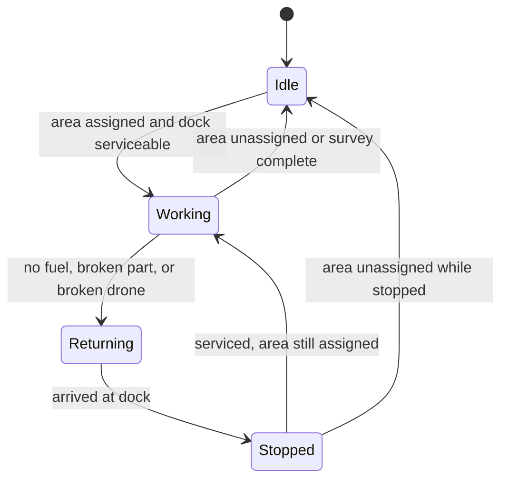
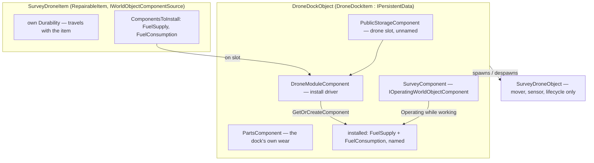
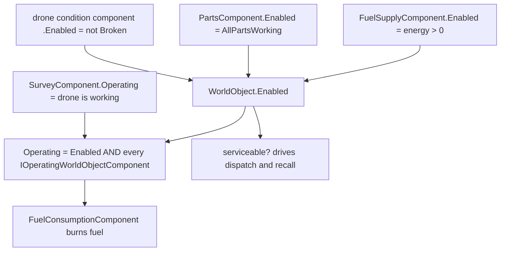

# Dock Owns the Drone's Components - Plan

## Goal Capsule

- **Objective:** Retarget the mod to Eco 0.14, then make the survey drone a module of the Drone Dock in Eco's own sense of the word — the drone item declares the components it brings, the dock installs them while it is slotted, and an unserviceable dock recalls its drone until it is fixed.
- **Product authority:** The maintainer, testing on a live server. Every behavioural claim about the running game is theirs to confirm; claims about engine mechanics are cited to the Eco server source in Sources.
- **Open blockers:** None. The version retarget is a decided prerequisite, not a blocker — see KTD0 and U0.

**Product Contract preservation:** changed — R3, R5, R7, R8, R17 and a new R18, on the maintainer's direction after research surfaced Eco's module system and established that it exists only in 0.14. See KTD0 and KTD1.

---

## Product Contract

### Summary

The Drone Dock carries the player-facing components, but the drone item is what supplies them. Slotting a drone installs its fuel supply onto the dock, configured by the drone; pulling the drone out uninstalls them and refuses while fuel remains. The dock keeps its own parts, degrading like any machine, while the drone carries its own condition on the item the way a tractor attachment does. The drone's world object becomes a dumb mover that opens nothing. An empty tank or a broken part recalls the drone and blocks dispatch until it is serviced.

### Problem Frame

The drone was built as a second interactable object and never worked as one. It carries `FuelSupplyComponent`, `FuelConsumptionComponent`, `PartsComponent`, and `StandaloneAuthComponent`, and its window renders no tabs at all — so fuel has never been loadable and the parts have never been visible. The empty pane has been an open defect since it was first seen (task #37).

None of that state survives anything. The drone is spawned by `WorldObjectManager.ForceAdd` and destroyed by `DestroyPermanently`, so it never touches Eco's pickup path — the only path that transfers component state onto an item. The dock has the same defect more quietly: it carries `PartsComponent`, but `DroneDockItem` does not implement `IPersistentData`, so picking up a worn dock and putting it back resets its parts to full.

The cost shape is that maintenance is currently free. Fuel is unobtainable, wear is unrecorded, and a drone is a one-time crafting cost with no running cost — which removes the reason the Advanced Electronics tree exists and makes every later drone inherit the same hole.

<!-- ce-section: work-relationships -->
### How This Work Fits Together

This plan owns one thing: giving the survey drone real running costs, structured so later drones inherit the structure rather than re-implementing it. The breakdown below is the current understanding, not a committed roadmap.

- Mining drone
  - Depends on this work only for the module contract. Once the dock installs whatever a slotted drone declares, a mining drone ships as a different item with a different `ComponentsToInstall` list and needs no dock change.
  - Still to decide: whether one dock accepts several drone types or each type gets its own.
- Cargo behaviour
  - Can proceed independently. A drone that needs a cargo hold declares one; the v14 steam truck module system is the reference shape, and this plan adopts its mechanism rather than waiting for it.
- Drone orphaning across restarts (task #44)
  - Shares the dock's despawn path with this work and can proceed independently of it.

### Key Decisions

- **The dock is the only object the player interacts with.** (session-settled: user-directed — chosen over giving the drone its own interactable surface: a dock is an orthodox placed world object with an item behind it, and the drone is not, so every vanilla mechanism the mod needs already works on the dock and none work on the drone.)

- **The drone supplies its components rather than the dock declaring them.** (session-settled: user-directed — chosen over statically declaring fuel, parts and cargo on the dock, after research surfaced `IWorldObjectComponentSource`.) The player-facing story that these are the drone's stats becomes literally true in the engine. See KTD1.

- **The drone stops being interactable at all.** (session-settled: user-approved — chosen over leaving the empty pane in place.) Eco's base `WorldObject` carries `[Tag("Usable")]` and the interact key is gated on that tag, so unsetting it is the vanilla mechanism, with `BaseRampObject` as precedent.

- **Condition splits the way a tractor's does.** (session-settled: user-directed — chosen over putting all wear in one place.) The dock has its own `PartsComponent` that degrades like any machine; the drone carries its own durability on the item, the way every vehicle module does. Neither needs custom persistence.

- **An empty tank or a broken part recalls the drone.** (session-settled: user-directed — chosen over wear-and-display-only and over stopping in place: stopping in place produces a drone stranded far from home, indistinguishable from the orphan bug already under investigation.)

- **The dock burns Liquid Fuel.** (session-settled: user-directed — chosen over reviving the deferred battery: the battery is a whole item to resurrect, and it lands on the skill graph that previously caused a stack-overflow cycle.)

### Requirements

**The drone world object**

- R1. `SurveyDroneObject` carries no fuel supply, fuel consumption, parts, or auth component.
- R2. Interacting with a drone in the world opens no window and offers no interaction.
- R4. Removing the drone from the dock still despawns its world object.

**The drone item**

- R3. The drone item carries its own durability and its own declared component set. *(Changed: it was "a plain stackable item". Durability items sort into three quality bands that do not merge, so drones stack only with drones in similar condition.)*
- R18. The drone item's durability decreases while its drone is working, and travels with the item between docks. *(New.)*
- R5. Slotting a drone installs a fuel supply on the dock, configured by the drone to accept Liquid Fuel; removing the drone uninstalls it. *(Changed: the dock no longer declares the fuel supply itself.)*
- R7. A drone may declare a cargo hold, and the dock installs it the same way. No drone in this release declares one. *(Changed: the dock no longer carries an always-present empty cargo component.)*
- R8. A drone cannot be removed while any component it installed still holds items.
- R19. A drone cannot be removed unless it is fully docked. A player who wants it back unassigns it and waits for it to come home. *(New. This reverses the existing "removal is always allowed" rule — see KTD8.)*

**Dock components**

- R6. The dock's own parts list is unchanged from what it carries today, and degrades while the dock works.

**Running cost and gating**

- R9. Fuel is consumed, dock parts wear, and drone durability decreases only while the drone is working — travelling to an area or surveying it. The return leg to the dock costs none of the three, so a shortage can never strand the drone it recalled.
- R10. A dock with an empty tank, a broken part, or a broken drone is not serviceable: it recalls its drone and dispatches no further work until it is refuelled or repaired.
- R11. A drone returning to its dock that cannot path there progressively relaxes its movement constraints — greater climb height, then hovering over obstacles, then clipping through them — and teleports to the dock as a last resort. A return leg never fails.
- R12. The survey panel names the reason a drone is not dispatching, distinguishing no fuel, broken parts, and a broken drone from no assignment.
- R13. Refuelling or repairing a stopped dock resumes the assigned survey without discarding findings already recorded for that area.

**Pickup and persistence**

- R14. A dock item retains its parts wear across being picked up and placed again.
- R15. Picking up a dock returns its fuel and its drone item to the player before the dock item itself.
- R16. When the player cannot carry everything the dock holds, the pickup fails without destroying anything.

**Compatibility**

- R17. The release requires Eco 0.14 and states so; it does not load on 0.13. The notes also state that docks and drones placed before this version must be removed and re-crafted. *(Changed: the version requirement is new.)*

### Key Flows

- F1. Fuelled dispatch
  - **Trigger:** The player slots a drone, loads fuel into the tank that appears, and assigns an area.
  - **Steps:** Slotting the drone installs its fuel supply on the dock; the dock spawns the drone world object; the drone travels to the area and surveys it; fuel drains, dock parts wear, and drone durability drops while it works.
  - **Outcome:** Findings accumulate against the area, and the panel shows the drone working.
  - **Covered by:** R3, R5, R9, R18

- F2. Running dry mid-survey
  - **Trigger:** The tank empties, a dock part breaks, or the drone's durability hits zero while the drone is away.
  - **Steps:** The dock stops offering work; the drone abandons the sweep and travels home, relaxing its movement constraints as far as it must to get there; it parks and idles. The panel says which of the three stopped it.
  - **Outcome:** The area keeps whatever coverage and findings it had. The player refuels, repairs, or swaps the drone, and work resumes on the same area.
  - **Covered by:** R10, R11, R12, R13

- F3. Moving a drone to another dock
  - **Trigger:** The player pulls a worn drone out of one dock and slots it into another.
  - **Steps:** Removal is refused until the drone is home and its tank is empty; once both hold, the drone comes out carrying its durability, its fuel supply uninstalls, and the first dock's tank disappears. Slotting it into the second dock installs a fresh tank.
  - **Outcome:** The drone is as worn as it was; the dock it left keeps its own parts wear, which was never the drone's.
  - **Covered by:** R5, R8, R18, R19

- F4. Picking up a loaded dock
  - **Trigger:** The player hits a dock with a hammer while it holds fuel and a drone.
  - **Steps:** Fuel and the drone item move to the player's inventory; the drone's world object despawns; the dock item goes to the player carrying its parts wear.
  - **Outcome:** Placing that dock elsewhere restores the worn parts. Survey areas are not preserved — they are discarded with the dock, as they are today.
  - **Covered by:** R4, R14, R15, R16

### Acceptance Examples

- AE1. Recall preserves progress
  - **Covers R10, R13.**
  - **Given** a drone has surveyed 40% of its assigned area,
  - **When** the dock's tank empties and the drone returns home,
  - **Then** the area still reports 40% coverage and its findings, and refuelling sends the drone back to finish the rest rather than restarting from zero.

- AE2. A stopped dock explains itself
  - **Covers R12.**
  - **Given** an area is assigned and the dock has no fuel,
  - **When** the player opens the survey panel,
  - **Then** the assignment still reads as assigned and the panel names fuel as the reason — it does not present the area as unassigned.

- AE3. A broken part blocks dispatch
  - **Covers R9, R10.**
  - **Given** the drone is parked at a dock with no area assigned and a broken dock part,
  - **When** the player assigns an area,
  - **Then** the drone does not leave, and no fuel is consumed.

- AE4. Pickup with a full inventory
  - **Covers R15, R16.**
  - **Given** a dock holds fuel and a drone, and the player has one free inventory slot,
  - **When** the player tries to pick the dock up,
  - **Then** the pickup is refused, nothing is destroyed, and the dock stays placed with its contents.

- AE5. Worn dock parts survive relocation
  - **Covers R14.**
  - **Given** a dock whose parts have worn to 60%,
  - **When** the player picks it up and places it somewhere else,
  - **Then** the new dock's parts read 60%, not full.

- AE6. A recall with no route home
  - **Covers R11.**
  - **Given** a drone is recalled from a spot it can no longer path back from — the terrain between it and the dock was built over or dug out while it worked,
  - **When** it attempts the return leg,
  - **Then** it relaxes its movement constraints far enough to complete the trip, teleporting home if nothing else works, and comes to rest only at the dock.

- AE7. A loaded drone will not come out
  - **Covers R8.**
  - **Given** a docked drone whose installed fuel supply still holds a stack of biodiesel,
  - **When** the player tries to pull the drone from the slot,
  - **Then** the removal is refused with a message, and it succeeds once the tank is emptied.

- AE9. A working drone cannot be pulled out
  - **Covers R19.**
  - **Given** a drone is out surveying an assigned area,
  - **When** the player tries to take it from the dock's slot,
  - **Then** the removal is refused with a message telling them to recall it first, and it succeeds once the area is unassigned and the drone has parked.

- AE8. Wear travels, dock wear does not
  - **Covers R18.**
  - **Given** a drone worn to 70% sitting in a dock whose own parts are at 50%,
  - **When** the player moves that drone to a brand-new dock,
  - **Then** the drone still reads 70% and the new dock's parts read full.

### Scope Boundaries

**Deferred for later**

- The mining drone, and any cargo hold. R7 makes the dock able to install one; no drone in this release declares one.
- Reviving the battery as an electric fuel source.
- Rebalancing which parts the dock requires.
- Save migrations, deferred across the mod (task #38).
- Making an unreachable area obvious in the panel (task #45) and the two assignment-cursor improvements (tasks #46, #47), even though R12 touches the same panel copy.
- Outbound unreachability. R11's constraint relaxation applies to the return leg only. A drone that cannot reach an assigned area still reports unreachable and waits for the player to change it, which is what task #45 is about surfacing.

**Outside this work's shape**

- Making the drone a placeable world object with an item behind it. The drone is a module, not a placeable.
- Fixing drone orphaning across restarts (task #44). This work sits on the same despawn path and must not make it worse, but does not fix it.

---

## Planning Contract

### Key Technical Decisions

- KTD0. **Retarget the mod to Eco 0.14 before anything else.** (session-settled: user-directed — chosen over shipping a static-component version on 0.13 and migrating later, and over hand-rolling dynamic installation on 0.13.) The module system does not exist in `Eco.ReferenceAssemblies 0.13.0.4-beta-release-1024`: `IWorldObjectComponentSource`, `ComponentInstallation`, `IDeclaresMayHaveComponents`, and `ComponentSourceRestriction` are all absent from `Eco.Gameplay.dll`, verified against the package the project resolves. `GetOrCreateComponent` and `RemoveComponent` are present, so raw dynamic installation would compile — but without `IDeclaresMayHaveComponents` there is nothing to declare installed components to save/load validation, which is the piece that keeps them from being stripped on load. Everything else this plan needs is present in 0.13 and unchanged in 0.14: `IOperatingWorldObjectComponent`, `RepairableItem`, `DurabilityItem`, `IPersistentData`, `PartsComponent`, and `TagAttribute.Unset`.

- KTD1. **Adopt Eco's module system for the drone–dock relationship.** (session-settled: user-directed — chosen over statically declaring the components on the dock: the static version needed a second named storage, an always-empty cargo component, and dock changes for every future drone.) The drone item implements `IWorldObjectComponentSource`, declaring what it installs, how each component is configured, and when it may be uninstalled. A dock-side driver installs on slot and uninstalls on removal. `SteamTruckFlatbedItem` and `TruckFlatbedItem` in `Server/Mods/__core__/Items/TruckFlatbedAttachments.cs` are the reference shape.

- KTD2. **The dock needs its own driver; only `ModularVehicleComponent` is vehicle-bound.** The install machinery is generic — `WorldObject.GetOrCreateComponent(Type, name, configure)` and `RemoveComponent(...)` are public — but the component that drives it requires `VehicleComponent`. The dock gets a small equivalent that mirrors `ModularVehicleComponent`'s install/uninstall, its deferral past the inventory lock, and its `IDeclaresMayHaveComponents` implementation.

- KTD3. **Condition splits: dock parts on the dock, drone condition on the item.** Uninstalling a component destroys its state — `RemoveComponent` drops and destroys with no persistent-data capture — so an installed `PartsComponent` would lose its wear every time the drone came out. Vanilla never hits this because no attachment installs a stateful component; module condition lives on the item as `RepairableItem` durability. Following that split means neither half needs custom persistence.

- KTD4. **Serviceability rides `WorldObject.Enabled`.** `Enabled` is false when any component is disabled; `FuelSupplyComponent.Enabled` is `energy > 0` and `PartsComponent.Enabled` is `AllPartsWorking`. The drone's own durability is folded in by a component reporting `Enabled => !droneItem.Broken`. No bespoke flag.

- KTD5. **Fuel burns off `Parent.Operating`, gated by one interface.** `FuelConsumptionComponent.Tick` consumes only when `Parent.Operating`, and `Operating` is `Enabled` AND every `IOperatingWorldObjectComponent` reporting true. `SurveyComponent` implements that one-property interface, returning whether the drone is currently working. Fuel then burns on exactly the right ticks with no custom consumption code.

- KTD6. **The return leg's escalation ladder is pure logic.** `GridPathfinder` takes `maxStepHeight` as a constructor argument. The ladder — retry with a larger climb height, then straight-line, then teleport — lives in the Eco-free navigation project with unit tests; only the teleport tier touches Eco.

- KTD8. **Removal now requires the drone to be docked, reversing a deliberate earlier rule.** (session-settled: user-directed.) `DespawnDrone` currently documents the opposite: *"Removing the item is always allowed (never blocked): a drone that is out roaming can glitch, strand, or fail to path home, so removal is treated as 'reset' rather than 'recall'."* That reasoning was correct while stranding was possible. R11's escalation ladder removes stranding — a return leg can no longer fail — so the escape hatch is no longer needed and the gate is safe. It also makes the install/uninstall ordering question moot: no live drone world object can exist while components are being torn off, because removal cannot happen until the drone is home. Delete the old comment when implementing rather than leaving it to contradict the code, and say why in its place.

- KTD7. **The drone slot stays unnamed.** `GetComponent(Type, name)` matches on name as well as assignability, and the dock's drone-slot lookups pass `name = null`. Installed components must therefore be named, as the flatbed names its storage. Nothing in the code enforces this; it is load-bearing for three existing call sites.

### High-Level Technical Design

Who owns what, and what installs where:

The serviceability chain, which is entirely vanilla once the pieces are attached:

---

## Implementation Units

### U0. Retarget the mod to Eco 0.14

- **Goal:** The mod compiles and boots against 0.14, with a reproducible source for its reference assemblies.
- **Requirements:** R17
- **Dependencies:** none — everything else depends on this
- **Files:** `EcoServerMod/AdvancedElectronics/AdvancedElectronics.csproj`, `EcoServerMod/AdvancedElectronics/Local.props`, `EcoServerMod/AdvancedElectronics.Navigation/AdvancedElectronics.Navigation.csproj`, `scripts/package-release.sh`
- **Approach:** `Eco.ReferenceAssemblies` has no 0.14 package yet, and the Steam server ships as a single-file bundle with its assemblies embedded, so neither is a reference source. Build them from the local Eco checkout instead — it is on `staging` at `v0.13.0.4-beta-860-g07370cde25` and carries the `playtest-0.14.0.0` merges. **Pin the commit**: `staging` moves daily, and a mod tracking a moving branch has no reproducible build. Record the pinned SHA in `Local.props` alongside the assembly path so the reference source is visible without reading the csproj. Then fix whatever compile breakage the version jump produces — unknown until attempted, which is why this is its own unit. Swap the nuget `PackageReference` for direct assembly references or project references, whichever the built output supports. Update the release archive name from `eco0.13.0.4` to the 0.14 identifier.
- **Also in this unit:** repoint the deploy target. The Steam install's server tree becomes the live-test server and the 0.13 game tree is being removed, so every tracked reference to the old path is stale — the deploy script, and `docs/solutions/conventions/document-the-path-you-actually-deploy-to.md`, which currently records the opposite rule. Land those in the same commit; a stale deploy path fails silently and costs a full restart cycle to notice. Keep the machine-local path itself out of tracked files.
- **Execution note:** Do this first and land it as its own commit before touching any behaviour. A retarget mixed with feature work makes every subsequent failure ambiguous between "the API moved" and "the new code is wrong" — the exact confusion that cost a bisect earlier in this mod's history.
- **Patterns to follow:** `Local.props` already isolates machine-local paths from the tracked csproj; keep the checkout path there, not in a tracked file (`docs/solutions/security-issues/machine-local-paths-leaked-into-a-public-repo.md`).
- **Test scenarios:**
  - The navigation test project still passes all 91 existing tests after the retarget — it references no Eco types, so any failure there means the retarget broke the toolchain rather than the API surface.
  - The mod assembly compiles with no new warnings.
  - Live: the 0.14 server boots with the mod loaded and no startup exception.
- **Verification:** Clean build, 91 tests green, server boots on 0.14.

### U0b. Clear the stale mod from the Steam tree

- **Goal:** No 0.13-built mod sits in the 0.14 server's mod folder.
- **Requirements:** none — hazard cleanup
- **Dependencies:** none
- **Files:** none tracked; this is a deploy-environment action
- **Approach:** `Eco_Data/Server/Mods/AdvancedElectronics/` in the Steam install holds `AdvancedElectronics.dll` and `AdvancedElectronics.Navigation.dll` built against 0.13. Remove them before the first 0.14 boot. They arrived by a wrong-tree deploy back when that tree was the decoy; now that it is the live target, they are a stale binary in the server that matters. A 0.13-built mod loading against a 0.14 engine is the failure this whole retarget exists to avoid.
- **Test scenarios:** `Test expectation: none — environment cleanup.`
- **Verification:** The folder is empty or absent before U0's boot check.

### U1. Strip the drone world object and silence it

- **Goal:** `SurveyDroneObject` becomes a mover with no player-facing surface.
- **Requirements:** R1, R2
- **Dependencies:** U0
- **Files:** `EcoServerMod/AdvancedElectronics/SurveyDrone.cs`
- **Approach:** Remove the `FuelSupplyComponent`, `FuelConsumptionComponent`, `PartsComponent`, and `StandaloneAuthComponent` attributes and the matching `Initialize` configuration, leaving mover, sensor, and lifecycle. Add `[Tag("Usable", Unset = true)]` to suppress the interact affordance. Delete the `fuelTagList` field — it moves to the item in U2.
- **Patterns to follow:** `BaseRampObject` in `Server/Mods/__core__/Items/Roads.cs` for the tag-unset shape.
- **Test scenarios:** `Test expectation: none — component and tag declarations have no unit-testable surface.` Live verification only: interacting with a drone opens nothing, and the server logs no component error on spawn.
- **Verification:** A freshly spawned drone renders in the world, moves, and cannot be opened.

### U2. Make the drone item a module

- **Goal:** The drone item carries its own condition and declares the components it brings.
- **Requirements:** R3, R5, R7, R18
- **Dependencies:** U1
- **Files:** `EcoServerMod/AdvancedElectronics/SurveyDrone.cs`
- **Approach:** `SurveyDroneItem` derives `RepairableItem` and implements `IWorldObjectComponentSource`. `ComponentsToInstall` returns a named `FuelSupplyComponent` configured with the Liquid Fuel tag list and slot count, plus a named `FuelConsumptionComponent`, with `canUninstall` on the fuel supply requiring an empty inventory. Name every installation `nameof(SurveyDroneItem)` so dock lookups stay unambiguous (KTD7). Declare no cargo component — R7 is satisfied by the mechanism existing, not by shipping an unused hold.
- **Patterns to follow:** `TruckFlatbedItem` in `Server/Mods/__core__/Items/TruckFlatbedAttachments.cs` — named installations, `configure` calling `Initialize`, `canUninstall` on emptiness. `VehicleToolItem` in `Server/Eco.Gameplay/Items/VehicleToolItem.cs` for the item-side shape.
- **Test scenarios:** `Test expectation: none — declarations only.` Live: a crafted drone shows a durability value in its tooltip, and two drones of differing condition do not merge into one stack.
- **Verification:** The drone item tooltip shows durability, and the mod compiles with the item declaring its installations.

### U3. Build the dock's module driver

- **Goal:** Slotting a drone installs its components on the dock; removing it uninstalls them, and removal is refused unless the drone is docked and its components are empty.
- **Requirements:** R5, R8, R15, R16, R19
- **Dependencies:** U2
- **Files:** `EcoServerMod/AdvancedElectronics/DroneModuleComponent.cs` (new), `EcoServerMod/AdvancedElectronics/DroneDock.cs`
- **Approach:** A new `WorldObjectComponent` implementing `IDeclaresMayHaveComponents`. It resolves the slotted item from the dock's unnamed `PublicStorageComponent`, and on change installs or uninstalls that item's declared components via `GetOrCreateComponent` / `RemoveComponent`. Installation must not run under the inventory lock — mirror `ModularVehicleComponent`'s `syncPending` deferral to the next tick. `ExpectedComponents` yields every declared `(Type, Name)` so validation does not strip dynamically installed components on load.

  Two restrictions gate the drone slot. `ComponentSourceRestriction` honours each installation's `canUninstall`, which covers R8. A second restriction covers R19 by refusing removal unless the drone is home — the lifecycle already knows this, and per KTD8 it is what makes the uninstall path safe: no live drone world object can exist while its components are being torn off. With that gate in place the dock's existing `OnDockStorageChanged` and this driver can both subscribe to the storage event without an ordering hazard, because the removal case they would have raced on cannot occur.

  **Install is all-or-nothing.** `Configure` calls each component's `Initialize`, and a throw partway through the list would leave some components attached and some not — a dock that looks like a rendering bug rather than an initialization failure, which this mod has already paid for once. Track what has been attached during an install, remove it on failure, refuse the slotting, and surface the error to the player rather than logging it silently.
- **Execution note:** This is the unit where a mistake is least visible — a driver that silently fails to install produces a dock with no fuel tab. Log install and uninstall at info level for the first live round.
- **Patterns to follow:** `ModularVehicleComponent.SyncComponentInstallation`, `InstallComponentsFrom`, `UninstallComponentsFrom`, `ExpectedComponents`, and the `ComponentSourceRestriction` class, all in `Server/Eco.Gameplay/Components/ModularVehicleComponent.cs`. `docs/solutions/runtime-errors/initialize-exception-leaves-a-half-built-worldobject.md` for why the failure path matters more than its likelihood.
- **Test scenarios:** `Test expectation: none offline — the component API has no test harness in this repo.` Live:
  - Slotting a drone makes a Fuel tab appear; removing it makes the tab disappear.
  - Removal is refused while fuel remains in the tank.
  - Covers AE9. Removal is refused while the drone is away surveying, and succeeds once it has returned.
  - A component whose `Configure` throws leaves no partial install: the slotting is refused, the player is told, and the dock keeps exactly the components it had before.
  - A restart with a drone slotted leaves the fuel tab and its contents intact.
- **Verification:** All five live checks above.

### U4. Wire serviceability and the dispatch gate

- **Goal:** An unserviceable dock recalls its drone, refuses to dispatch, and says why.
- **Requirements:** R9, R10, R12, R13
- **Dependencies:** U3
- **Files:** `EcoServerMod/AdvancedElectronics/SurveyComponent.cs`, `EcoServerMod/AdvancedElectronics/DroneLifecycle.cs`, `EcoServerMod/AdvancedElectronics/DroneDock.cs`
- **Approach:** `SurveyComponent` implements `IOperatingWorldObjectComponent`, returning true while the paired drone is `EnRoute` or `Surveying` — the same condition `PushWorkingState` already computes. Add a small component reporting `Enabled => !droneItem.Broken` so a broken drone disables the dock alongside fuel and parts. The lifecycle gains an explicit dispatch gate reading the dock's serviceable state rather than nulling the assignment token, so R12's panel copy can name the reason while the assignment still reads as assigned. On becoming unserviceable while working, the lifecycle begins the existing return-to-dock leg.
- **Patterns to follow:** `DroneLifecycle.cs:138-145` already runs "assignment cleared while working → return to dock"; the gate reuses that transition rather than adding a state. `VehicleComponent` for an `IOperatingWorldObjectComponent` implementation.
- **Test scenarios:** `Test expectation: none for the wiring.` Live: assign an area with an empty tank and the drone does not leave; empty the tank mid-survey and the drone returns; the panel names fuel, parts, and drone condition distinctly; refuelling resumes the same area with its coverage intact.
- **Verification:** All four live checks above, in one session.

### U5. Drive the three wear channels

- **Goal:** Fuel, dock parts, and drone durability all decrease while the drone works, and only then.
- **Requirements:** R9, R18
- **Dependencies:** U4
- **Files:** `EcoServerMod/AdvancedElectronics/DroneDock.cs`
- **Approach:** Fuel needs no code — `FuelConsumptionComponent.Tick` burns whenever `Parent.Operating`, which U4 made true exactly while the drone works. Dock parts and drone durability do need a driver: from the dock's existing `Tick`, when working, call `ConsumeDurabilityAccumulated` on the parts component and `UseDurability` on the slotted drone item, both scaled by elapsed hours. Exclude the return leg from all three — the lifecycle's travel target distinguishes it.
- **Execution note:** Rates are assumptions, not decisions — see Assumptions. Put them in named constants so the live test can move them without hunting.
- **Patterns to follow:** `VehicleComponent.cs:173` and `PowerGridComponent.cs:197` for `ConsumeDurabilityAccumulated(user, TimeUtil.SecondsToHours(deltaTime) * ratePerHour)`.
- **Test scenarios:** `Test expectation: none — tick-driven accumulation has no offline harness.` Live: fuel drops while working and holds steady while idle and while returning; dock parts drop over a long survey; drone durability drops and is still lower after moving it to another dock.
- **Verification:** All three channels move while working and hold while idle.

### U6. Escalate the return leg rather than stranding

- **Goal:** A recalled drone always reaches its dock.
- **Requirements:** R11
- **Dependencies:** U0 — otherwise independent of U1-U5
- **Files:** `EcoServerMod/AdvancedElectronics.Navigation/ReturnEscalation.cs` (new), `EcoServerMod/AdvancedElectronics.Navigation.Tests/ReturnEscalationTests.cs` (new), `EcoServerMod/AdvancedElectronics/DroneMoverComponent.cs`, `EcoServerMod/AdvancedElectronics/DroneLifecycle.cs`
- **Approach:** A pure policy type in the navigation project describing the ladder: attempt N with a climb height, then a straight-line path ignoring terrain, then teleport. It exposes the next tier given the current one and whether a tier is the final fallback; it holds no Eco types. `DroneMoverComponent`'s `MaxStepHeight` stops being a `const` and becomes a per-attempt parameter, so the mover can rebuild its `GridPathfinder` at a higher climb height on retry. The lifecycle drives the ladder only on the dock-bound leg; outbound failures keep reporting `Unreachable` unchanged.
- **Execution note:** Start from the failing case — a unit test that walks the ladder to its final tier — before touching the mover.
- **Patterns to follow:** `GridPathfinder`'s constructor already takes `maxStepHeight`; the existing navigation types are Eco-free and unit-tested, which is why the policy belongs there.
- **Test scenarios:**
  - Covers AE6. The ladder advances through every tier in order and reports the last one as final.
  - A ladder starting at its final tier reports no further tier.
  - Climb heights increase monotonically across tiers.
  - The policy is independent of world state — same input, same tier sequence.
  - Live: a drone walled in behind fresh terrain still reaches its dock.
- **Verification:** New unit tests pass alongside the existing 91; the live walled-in case comes home.

### U7. Make the dock item carry its parts wear

- **Goal:** A dock keeps its parts condition across pickup and replacement.
- **Requirements:** R14
- **Dependencies:** U0
- **Files:** `EcoServerMod/AdvancedElectronics/DroneDock.cs`
- **Approach:** `DroneDockItem` implements `IPersistentData` with a serialized, view-synced `PersistentData` property. That is the entire opt-in — Eco's pickup path then collects every component's persistent data onto the item and restores it on placement. Note the side effect: the dock item stops stacking, which is correct once docks differ in condition.
- **Patterns to follow:** `ExcavatorItem` in `Server/Mods/__core__/AutoGen/Vehicle/Excavator.cs:49-51`.
- **Test scenarios:** `Test expectation: none — a one-line interface implementation.` Covers AE5 live: wear a dock's parts, pick it up, place it, read the parts tab.
- **Verification:** Parts read the same after relocation.

### U8. State the break in the release notes

- **Goal:** Players know this build needs Eco 0.14, and that old docks and drones must go.
- **Requirements:** R17
- **Dependencies:** U0-U7
- **Files:** `scripts/package-release.sh`
- **Approach:** Lead the alpha block with the game-version requirement — this build does not load on 0.13, which is a harder compatibility statement than any previous release made. Then extend the known-issues block: docks and drones from earlier versions will not gain the new components and must be re-crafted, and a drone now carries its own condition. Update the archive name to the 0.14 identifier if U0 has not already.
- **Patterns to follow:** The 0.0.3 release notes already carry a version-specific warning block in the same script.
- **Test scenarios:** `Test expectation: none — release note text.`
- **Verification:** The built archive's README carries the warning, read from inside the archive.

---

## Assumptions

- **Fuel rate.** Vanilla comparisons: Truck 250, Excavator 275, Industrial and Combustion Generator 75. The drone currently carries the Excavator's 275, inherited by copying rather than chosen. This plan starts at the generator band, on the reasoning that a drone creeps and idles rather than doing heavy work. Tune from there.
- **Dock parts wear rate and drone durability rate.** No vanilla analogue is close enough to copy, since no vanilla attachment wears passively. Start low enough that a full survey costs a visible but small fraction of condition, and adjust after one long live session.
- **The module system works for a non-vehicle host.** Every piece is generic — `GetOrCreateComponent`, `RemoveComponent`, `ComponentInstallation`, `ComponentSourceRestriction` — and only `ModularVehicleComponent`, the driver, requires `VehicleComponent`. But every shipped user of the mechanism is a vehicle. If installation misbehaves, that gap is the first thing to check.
- **The pinned 0.14 build matches the released one.** The mod is developed against a `staging` checkout while 0.14 is still changing. Re-verify before any public release; see Risks.
- **Component changes DO retrofit — corrected 2026-08-14.** This plan was written believing placed objects keep whatever components they were created with, and R17 was justified by that. The engine re-validates every persisted object's component list on every server load, adding what the class now requires and removing what it no longer does — and a removed component takes its contents with it. Re-read R17 against `docs/solutions/conventions/requirecomponent-is-re-enforced-on-every-server-load.md` before implementing it.

## Risks

- **0.14 is unreleased and moving.** The reference assemblies come from a `staging` checkout that changes daily, and the maintainer expects release next week with the API still subject to change. An API this plan depends on could shift under it — most damagingly `ComponentInstallation`'s shape, which KTD1 is built on. *Mitigation:* pin the commit in U0, and re-verify the four module-system types against the released package before the first public release rather than assuming the pinned build matches it.
- **The retarget's compile breakage is unmeasured.** 860 commits separate the pinned SHA from the 0.13.0.4 tag. U0 exists as its own unit precisely because that cost is unknown; if it turns out large, the honest response is to land U0 alone and re-plan the rest against what survived.
- **Deploy target inverts.** The Steam tree becomes the live-test server and the 0.13 game tree is being removed — the exact reverse of the rule this mod has followed until now, and wrong-tree deploys fail silently. Every tracked reference to the old path is now stale. *Mitigation:* U0 updates the deploy script and the deploy-path doc in the same commit as the retarget, per `docs/solutions/conventions/document-the-path-you-actually-deploy-to.md`.
- **This release cannot ship to 0.13 players at all.** Unlike the 0.0.3 break, which asked players to remove old objects, this one asks them to be on a different game version. That is a mod.io compatibility statement, not a migration note.

## Open Questions

**Deferred to Implementation**

- Whether the drone-condition component that folds `Broken` into the dock's `Enabled` is worth its own type, or whether `SurveyComponent` can report it — depends on whether one component can cleanly own both `Enabled` and `Operating` for different reasons.
- Whether removing the drone's auth component changes who may act on the drone world object, given it is no longer interactable and was never hammer-removable.
- How the panel phrases three distinct stop reasons within the row budget the survey tab already spends.

---

## Verification Contract

Most of this plan is verifiable only on a running server. The mod has no test harness for Eco components, and the component API cannot be exercised offline. That is a property of the work, not a gap in the plan — only U6 has logic that can be tested without a deploy.

| Gate | Applies to | Signal |
|---|---|---|
| `dotnet build` against 0.14 reference assemblies | U0 | Compiles; the pinned SHA is recorded in `Local.props` |
| `dotnet test` on the navigation test project | U0, U6 | 91 existing tests still pass after the retarget; new escalation tests pass alongside them |
| Live: 0.14 server boots with the mod | U0, U0b | No startup exception; no stale mod in the target tree |
| `dotnet build` on the mod project | U1-U8 | Clean build, no warnings introduced |
| Live: slot and unslot a drone | U2, U3 | Fuel tab appears and disappears; removal refused while loaded or while the drone is away |
| Live: force a configure failure | U3 | Slotting refused, player told, no partial install left behind |
| Live: restart with a drone slotted | U3 | Fuel tab and contents survive |
| Live: assign with an empty tank | U4 | Drone does not leave; panel names fuel |
| Live: empty the tank mid-survey | U4, U5 | Drone returns home; coverage preserved; refuel resumes |
| Live: long survey | U5 | All three wear channels move; none move while idle |
| Live: move a worn drone between docks | U2, U5 | Condition travels; the old dock's parts stay its own |
| Live: wall a working drone in | U6 | It reaches the dock anyway |
| Live: pick up and replace a worn dock | U7 | Parts read the same |

## Definition of Done

- The mod builds against pinned 0.14 reference assemblies, with the SHA recorded, and the stale 0.13 binary is gone from the Steam tree.
- Every requirement R1-R19 is either satisfied or explicitly deferred in Scope Boundaries.
- The navigation test project passes, including the new escalation tests.
- The mod builds clean and the 0.14 server boots with the mod loaded.
- Every live gate in the Verification Contract has been run in at least one session and its result recorded.
- The release archive's README carries the compatibility warning, verified from inside the archive.
- Task #37 is closed by R1 and R2; task #44 is untouched and still open.

---

## Sources & Research

Engine behaviour is cited from the local Eco source checkout, on `staging` at `v0.13.0.4-beta-860-g07370cde25` — the 0.14 line. Paths are relative to that tree, not this repo. **The module-system citations below do not exist in 0.13**, which is what KTD0 turns on.

Version probe, run against the package the project currently resolves (`Eco.ReferenceAssemblies 0.13.0.4-beta-release-1024`, `lib/net10.0/Eco.Gameplay.dll`): `IWorldObjectComponentSource`, `ComponentInstallation`, `IDeclaresMayHaveComponents`, and `ComponentSourceRestriction` are absent. `GetOrCreateComponent`, `IOperatingWorldObjectComponent`, `RepairableItem`, `DurabilityItem`, `IPersistentData`, `ItemPersistentData`, and `PartsComponent` are present, as is `TagAttribute.Unset` in `Eco.Core.dll`.

**The module system** (0.14 only)

- `Server/Eco.Gameplay/Items/IWorldObjectComponentSource.cs:12-32` — `ComponentsToInstall` and `ComponentInstallation.For<T>(name, configure, canUninstall, proxyInteractions)`.
- `Server/Eco.Gameplay/Components/ModularVehicleComponent.cs:211-265` — the install driver: deferral past the inventory lock, install, uninstall, and `ExpectedComponents`. Only this component is vehicle-bound.
- `Server/Eco.Gameplay/Components/ModularVehicleComponent.cs:275-300` — `ComponentSourceRestriction`, which refuses removal while `canUninstall` says no.
- `Server/Mods/__core__/Items/TruckFlatbedAttachments.cs:15-26` — a working example: named installations, `configure` calling `Initialize`, `canUninstall: c => c.Inventory.IsEmpty`.
- `Server/Eco.Gameplay/Objects/WorldObjectComponent.cs:157-160,229-236` — `GetOrCreateComponent` and `RemoveComponent`, both public and generic. `RemoveComponent` destroys the component without capturing its state, which is why condition cannot live on an installed component.

**Component resolution and naming**

- `Server/Eco.Gameplay/Objects/WorldObjectComponent.cs:182-189` — `GetComponent` matches on assignability AND name; the default `name = null` is why the drone slot must stay unnamed.
- `Server/Eco.Gameplay/Objects/WorldObjectUtil.cs:41-53` — `RequireComponentAttribute(Type, string name)`, "For objects that have multiple components of the same type."
- `Server/Eco.Gameplay/Objects/WorldObject.cs:464,495` and `WorldObjectComponent.cs:203` — the name reaches the instance.

**Fuel, wear, and the enabled chain**

- `Server/Eco.Gameplay/Components/FuelConsumptionComponent.cs` — burns only while `Parent.Operating`; doubles the rate when parts are not working.
- `Server/Eco.Gameplay/Objects/WorldObject.cs:292-319` — `Enabled` from every component, `Operating` from `Enabled` plus every `IOperatingWorldObjectComponent`.
- `Server/Eco.Gameplay/Objects/WorldObjectComponent.cs:35` — `IOperatingWorldObjectComponent { bool Operating { get; } }`.
- `Server/Eco.Gameplay/Components/VehicleComponent.cs:173`, `PowerGridComponent.cs:197` — the parts-wear driver shape.
- `Server/Eco.Gameplay/Objects/WorldObjectManager.cs:393` — ticking is gated on `Initialized`, not `Enabled`, so a disabled dock keeps ticking and the recall still runs.
- `Server/Eco.Gameplay/Items/DurabilityItem.cs:13-31` — item durability and the three quality bands that keep differing-condition items from merging.

**Pickup and persistence**

- `Server/Eco.Gameplay/Objects/WorldObjectUtil.cs:343-361` — components picked up before the object; a partial move blocks the object pickup; the post-effect collects persistent data.
- `Server/Eco.Gameplay/Items/PersistentData.cs:59-77` — collect and assign.
- `Server/Eco.Gameplay/Items/WorldObjectItem.cs:61` — an `IPersistentData` item stops stacking.
- `Server/Mods/__core__/AutoGen/Vehicle/Excavator.cs:49-51` — the opt-in shape.
- `Server/Eco.Gameplay/Components/Storage/StorageComponent.cs:102-118` — storage contents move to the player during pickup.

**Interaction**

- `Server/Eco.Gameplay/Objects/WorldObject.cs:62` and `Server/Eco.Gameplay/Interactions/Interactors/HandsInteractor.cs:64` — the base object carries `[Tag("Usable")]` and the interact key is gated on it. `Server/Mods/__core__/Items/Roads.cs:28` unsets it.

**In this repo**

- `EcoServerMod/AdvancedElectronics/SurveyDrone.cs` — the drone's current component set and the reasoning behind each attachment.
- `EcoServerMod/AdvancedElectronics/DroneDock.cs` — storage wiring, spawn and despawn, and the tick that drives the readout.
- `EcoServerMod/AdvancedElectronics/DroneLifecycle.cs:128-150` — the existing return-to-dock path.
- `EcoServerMod/AdvancedElectronics/DroneMoverComponent.cs:46,75` — `MaxStepHeight` as a const, and the pathfinder built from it.
- `EcoServerMod/AdvancedElectronics.Navigation/GridPathfinder.cs:67` — `maxStepHeight` as a constructor argument.
- `docs/solutions/conventions/requirecomponent-is-re-enforced-on-every-server-load.md` — why component changes reach objects already placed, in both directions.
- `docs/solutions/runtime-errors/initialize-exception-leaves-a-half-built-worldobject.md` — why a failing `Configure` during install is worth logging loudly.
