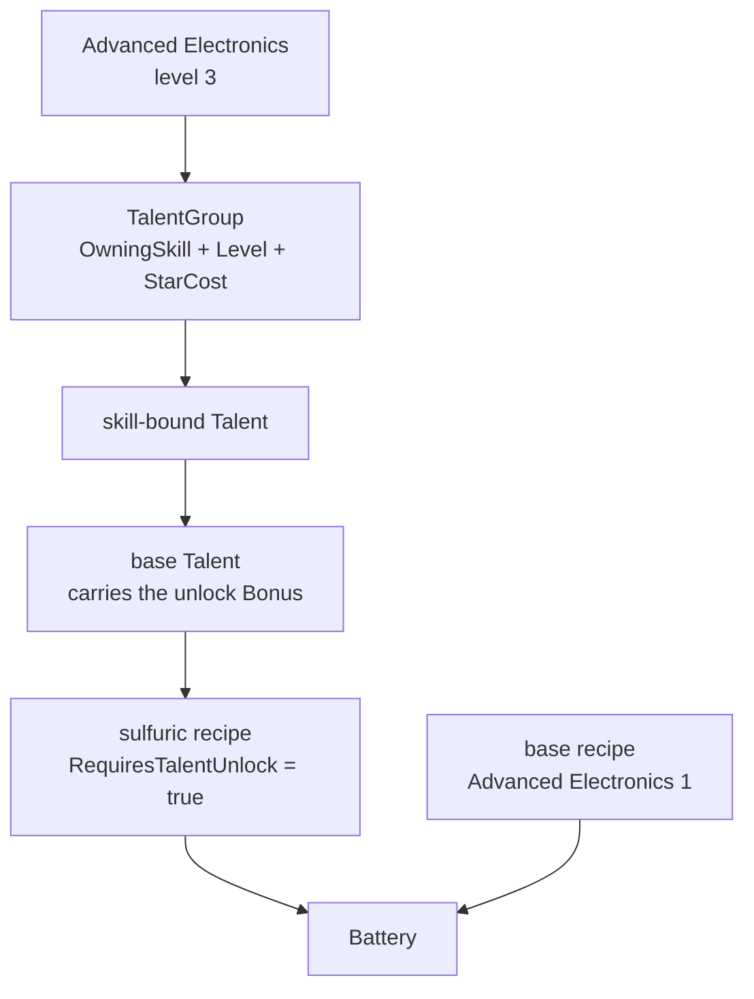
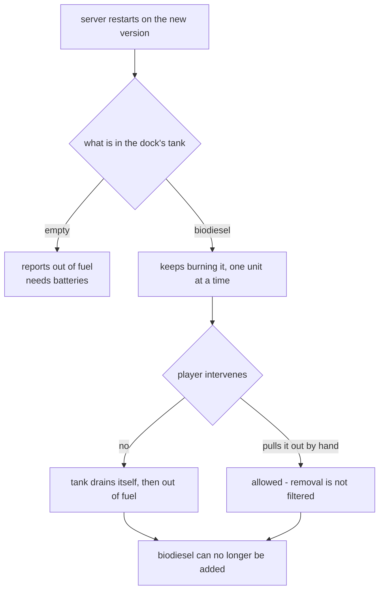

# Battery and Electric Fuel - Plan

## Goal Capsule

- **Objective:** Give the survey drone its own fuel. The mod ships a craftable Battery, the drone stops burning liquid fuel and burns batteries instead, and the Electronics Assembly — where both Battery recipes are made — lists the Advanced Electronics Upgrade among the modules it accepts.
- **Product authority:** This plan owns the Battery item, the Electric Fuel tag, the talent that unlocks the metal-saving recipe, the Electronics Assembly override, the release plumbing that override needs, and the correction of comments and learnings this plan's findings falsify. It does not own the drone's burn rate, the dock's fuel slot count, or any Unity asset work.
- **Execution profile:** Live-verified, not unit-tested. Items, recipes, tags, and talents all need the Eco engine, which `EcoServerMod/AdvancedElectronics.Navigation.Tests` cannot reference. Each unit's test scenarios are live-server checks, and they are written to be run in one server session rather than one restart per unit.
- **Stop conditions:** Stop and ask if the module refuses to slot into a stock Electronics Assembly (U4's premise fails), or if the talent group does not appear for a character already past Advanced Electronics 3 (U3's retroactivity assumption fails).
- **Tail ownership:** `ce-work` owns build, live verification, and commits. Packaging a release is out of scope for this plan beyond editing the release text in U7.

---

## Product Contract

### Summary

The drone runs on Batteries the player crafts at the Electronics Assembly, replacing the biodiesel and gasoline it burns today. A talent at Advanced Electronics level 3 unlocks a second Battery recipe that trades metal for sulfuric acid. Both recipes sit at the Electronics Assembly, which is what makes the Advanced Electronics Upgrade worth slotting there.

### Problem Frame

The drone burns `"Liquid Fuel"` — the vanilla tag on biodiesel and gasoline — because that was the only fuel available when the dock's fuel components were wired up. The mod's own source says so: `EcoServerMod/AdvancedElectronics/SurveyDrone.cs:80-83` records that the Battery "would have supplied an Electric Fuel tag, but the battery is deferred; a fuel tag no item carries leaves the dock unfuelable."

So the drone, the mod's whole reason to exist, is powered by a mid-game commodity from a different tech branch. A player who has climbed to Advanced Electronics to build an autonomous surveyor keeps it running on the same fuel as a truck. Nothing about the drone's operating cost belongs to the mod, which means nothing about it can be tuned, gated, or made interesting.

A Battery item already exists in `EcoServerMod/AdvancedElectronics/Battery.cs.deferred`, written against a table that has since been removed from the build. Its icon already ships inside `AssetBundles/AdvancedElectronics.unity3d`. The work is finishing it, not starting it.

### Key Decisions

- **Battery is an inventory item, not a placeable block.** (session-settled: user-approved — chosen over keeping `BlockItem<BatteryBlock>`: the mod's scene ships an empty `BlockSetContainer`, so a placed battery block would draw nothing, and vanilla's Charcoal, Board, Paper, and Strange Fuel are all non-block fuel items.) Governs R1. The deferred file inherited its block half from the Biodiesel template, where the block is a liquid barrel and carries meaning a battery does not have. Dropping it also keeps the feature clear of the asset bundle, which cannot be rebuilt while drone art is in progress.

- **One battery buys one hour of drone operation.** (session-settled: user-directed — chosen over the deferred 80,000 J value: refuelling should be a routine errand, not a chore.) Governs R2, R3. At the dock's current burn rate this is 270,000 J. With a stack size of five, the dock's two fuel slots hold ten batteries — about ten hours of surveying before anyone has to think about it again.

- **Battery weight is sized to the player's pack, not to the Biodiesel template.** Governs R4. The deferred file carried Biodiesel's 30 kg barrel weight, which alone fills a player's entire carry capacity of 30 kg. A battery weighs 1 kg, matching Charcoal, so a full dock load of ten is a third of a default pack.

- **The recipe trades iron concentrate for copper concentrate.** (session-settled: user-directed.) Governs R5. This also moves the recipe's derived garbage from iron scrap to copper scrap, since craft waste comes from each ingredient's salvage cost rather than from anything the recipe declares.

- **Both Battery recipes register at the Electronics Assembly, and that is what justifies the module there.** (session-settled: user-directed — chosen over leaving the sulfuric recipe's table unstated.) Governs R5, R17. The Battery recipes' ingredient quantities are skill-scaled, so the Advanced Electronics Upgrade reduces them. The upgrade's own recipe uses constant quantities and is unaffected, so without the Battery recipes the table would host nothing the module could act on.

- **The sulfuric variant is a talent unlock, not a second item or a second tier.** (session-settled: user-directed — chosen over deferring it to a later release: it outputs the same Battery, so it needs no icon, no scene object, and no bundle rebuild.) Governs R10, R11, R12, R13, R19. It is modelled on Etching Techniques in the Electronics skill, and its purpose is to reduce the metal a battery costs.

- **The sulfuric recipe uses equal parts of two acids and halves the metal.** (session-settled: user-directed.) Governs R10, R13. Two nitric acid and two sulfuric acid against one copper concentrate, versus the base recipe's four nitric acid and two concentrate. The equal-parts framing comes from research on acid pairs reducing metal content in batteries; whether the chemistry generalises is beside the point, since the recipe's job here is to give Advanced Electronics a progression choice that fits the materials the tier already has. The variant is cheaper on nitric acid as well as metal, so after the talent it is the recipe a player will use — the base recipe's role is to serve players who have not spent the star, not to remain competitive.

- **Learning the talent costs one star.** (session-settled: user-directed — chosen over overriding `StarCost` to 0: every vanilla talent costs a star, and the same pool buys specialties.) Governs R18.

- **The Electronics Assembly gets a UserCode override even though slot admission does not need one.** (session-settled: user-directed — chosen over dropping the override or verifying live first: the user reaffirmed it after the finding was surfaced.) Governs R14, R15. Module admission is by slot tag against the item's own tags, which the module already satisfies; the override's effect is that the module appears in the table's accepted-modules tooltip. The cost is a second verbatim copy of upstream source to re-derive on every Eco update.

- **No code migrates fuel left in a dock across the update.** (session-settled: user-approved — chosen over moving or refunding it: the mod is alpha and the engine handles the case gracefully on its own.) Governs R16. A tag restriction filters what may be *added* to a tank, not what may be burned from it, so a dock carries on burning its leftover biodiesel until it is spent.

### Requirements

**The Battery item**

- R1. Battery is an inventory item with no placeable block form.
- R2. One battery holds enough energy for one hour of continuous drone operation.
- R3. Battery stacks to five, so the dock's two fuel slots hold ten batteries and about ten hours of surveying.
- R4. A player can carry a full dock load of batteries in one trip without filling their pack.
- R5. Battery is crafted at the Electronics Assembly from nitric acid, copper concentrate, and plastic, gated on Advanced Electronics level 1.

**Fuelling the drone**

- R6. A dock fitted with the survey drone accepts only items tagged Electric Fuel. Liquid fuel no longer works.
- R7. Battery is the only item carrying the Electric Fuel tag.
- R8. A player loads batteries by the same paths any fuel uses: selecting one and interacting with the dock, or dragging it into the fuel slot from the panel.
- R9. Nothing about the drone's burn rate, slot count, or existing out-of-fuel behaviour changes.

**The metal-saving recipe**

- R10. A second Battery recipe trades metal for sulfuric acid and produces the same item.
- R11. A player who has not learned the talent cannot contribute labor to the sulfuric recipe.
- R12. The talent exists only to unlock that recipe and grants no other bonus.
- R13. The base recipe stays available and ungated, so a player who has not learned the talent can always craft batteries.
- R18. Learning the talent costs one star, at Advanced Electronics level 3.
- R19. The sulfuric recipe stays listed at the Electronics Assembly before the talent is learned, carrying an engine-rendered note that names the talent that unlocks it.

**Module access at the Electronics Assembly**

- R14. The Electronics Assembly lists the Advanced Electronics Upgrade among the modules it accepts.
- R15. That listing comes from a UserCode override of the vanilla Electronics Assembly, installed by the same script that installs the Robotic Assembly Line's.
- R17. The sulfuric recipe registers at the Electronics Assembly too, so both Battery recipes sit at the table the module plugs into.

**Compatibility**

- R16. The release notes tell players what happens to fuel left in a dock across the update, and that no fuel-related action is required before updating.

### Key Flows

- F1. Fuel a dock with batteries
  - **Trigger:** A player with batteries in their pack approaches a Drone Dock whose tank is empty.
  - **Steps:** The player selects a battery, interacts with the dock, and the battery moves into the fuel tank. Dragging from the panel into the fuel slot does the same thing. The tank immediately pulls one battery out of the slots and begins burning it.
  - **Outcome:** The dock becomes serviceable and the drone can be dispatched.
  - **Covered by:** R1, R6, R7, R8

- F2. Unlock the metal-saving recipe
  - **Trigger:** A player reaches Advanced Electronics level 3 and spends a star on the Sulfuric Battery talent.
  - **Steps:** The talent's unlock bonus names the sulfuric recipe, which becomes contributable at the Electronics Assembly. It was listed before the unlock, marked with the talent it needs.
  - **Outcome:** The player can craft batteries for less metal, and can still craft them the original way.
  - **Covered by:** R10, R11, R12, R13, R18, R19

### Acceptance Examples

- AE1. Biodiesel is refused, battery is accepted
  - **Covers R6, R7.**
  - **Given** a Drone Dock with a survey drone slotted and an empty fuel tank,
  - **When** a player tries to put biodiesel into the tank and then tries a battery,
  - **Then** the biodiesel is refused and the battery goes in.

- AE2. Fuel left in a tank across the update burns off
  - **Covers R6, R16.**
  - **Given** a dock that held biodiesel before the update,
  - **When** the server restarts on the new version and the drone works,
  - **Then** the dock keeps running on that biodiesel until it is spent, then reports itself out of fuel; the spent tank is empty, the drone can be removed, and biodiesel can no longer be added.

- AE3. The sulfuric recipe cannot be worked before the talent
  - **Covers R11, R13, R19.**
  - **Given** a player at Advanced Electronics level 3 who has not spent a star on the talent,
  - **When** they open the Electronics Assembly recipe list,
  - **Then** both Battery recipes are listed, the sulfuric one names the talent it needs, and labor cannot be contributed to it. After the talent is learned, it can.

- AE4. A full dock runs a working day
  - **Covers R2, R3.**
  - **Given** a dock with both fuel slots filled with batteries,
  - **When** the drone surveys continuously,
  - **Then** it runs for roughly ten hours before the dock reports itself out of fuel, and the existing recall behaviour takes over unchanged.
  - **Verified over live play, not in one session.** Ten hours of continuous surveying does not fit the single-session walk below. This example is settled by watching real player runs over several days and revisiting the fuel value then; it is deliberately not a gate on shipping.

- AE5. The module slots into the Electronics Assembly
  - **Covers R14, R17.**
  - **Given** a placed Electronics Assembly and a crafted Advanced Electronics Upgrade,
  - **When** the player slots the module and opens a Battery recipe,
  - **Then** the module is accepted, the table's accepted-modules tooltip names it, and the Battery recipe's ingredient quantities are lower than without it.

### Scope Boundaries

- No Unity or asset-bundle work. The Battery icon is already in the committed scene and the shipped bundle; nothing in this plan needs the bundle rebuilt, which keeps it clear of the drone art in progress.
- No migration code for fuel left in a dock. The engine drains it gracefully; the release note is informational.
- No change to the drone's burn rate, the dock's fuel slot count, or its serviceability and recall behaviour.
- No Ecopedia pages for the Battery. U1 corrects the category the recipe points at; creating the page itself stays out.
- No second talent to pair with the sulfuric unlock. Vanilla skills offer two talents per level; this one offers one, and that is accepted for now.
- Comment and learning corrections are limited to the six files U6 names. No broader `docs/solutions/` sweep.
- `EcoServerMod/AdvancedElectronics/HarvestDrone.cs` is out of scope. It is an untracked test copy of the survey drone used to exercise the new drone assets, and it keeps its own `"Liquid Fuel"` list.

#### Deferred to Follow-Up Work

- Retiring `EcoServerMod/UserCode/AutoGen/WorldObject/RoboticAssemblyLine.override.cs`. The research behind KTD4 applies to it equally, but removing something that currently works is separate from adding its sibling.
- Shelving `HarvestDrone.cs` from the build before a release, so players do not get a craftable drone with no client asset.
- The pre-existing `scripts/validate-name-match.sh` failure on `HarvestDroneObject`.

---

## Planning Contract

### Product Contract preservation

Changed: R6 narrowed to "a dock fitted with the survey drone" (the fuel tag lives on the drone item, and the out-of-scope harvest drone carries its own); R11 and R16 corrected against engine behaviour; R14 and R15 reframed from granting access to producing a tooltip listing; R17, R18, R19 added — R17 user-directed during planning, R18 and R19 forced by engine findings. R19 is split out of R11's original wording and R11 keeps the core intent.

### Key Technical Decisions

- KTD1. **Drop `BatteryBlock` entirely rather than keeping it unregistered.** Instantiates the Product Contract's item-not-block decision (session-settled: user-approved — chosen over keeping `BlockItem<BatteryBlock>`: no BlockSet ships, so a placed block would draw nothing). Governs R1. `scripts/validate-name-match.sh` deliberately excludes `PickupableBlock` from its Item regex, so deleting the type trips nothing — but the justification comment at that exclusion becomes wrong and is U6's to fix.

- KTD2. **Keep the skill overload on every Battery ingredient.** `IngredientElement(Type, float, Type skill)` builds a `ModuleModifiedValue` (`DynamicValueType.Efficiency`); the `(Type, float, bool)` overload builds a `ConstantValue` that no bonus can touch. This is the whole mechanism behind R17 — switch an ingredient to the bool overload and the upgrade module silently stops reducing it.

- KTD3. **Model the talent on Etching Techniques: three types plus one recipe flag.** A base `Talent` subclass carrying the unlock `Bonus`, a `TalentGroup` binding skill and level, and a skill-bound subclass **of that base talent** naming the group. The inheritance is load-bearing: `BonusManager.FindUnlockingTalents` skips `Base == true`, so a skill-bound type deriving straight from `Talent` would be learnable and unlock nothing. `RequiresTalentUnlock = true` on the recipe hides nothing by itself — it gates labor contribution; the talent's `Recipes` set is what ungates it. Governs R11, R19. Vanilla splits the bonus half into a hand-written partial; this mod is one assembly, so both halves live in one file.

- KTD4. **Write the Electronics Assembly override even though slot admission does not need it.** (session-settled: user-directed — chosen over dropping it or gating it on a live check: the user reaffirmed after the finding was surfaced.) Governs R14, R15. `AllowPluginModulesAttribute.Tags` and `.ItemTypes` reach one consumer in the engine, an item tooltip; slot admission matches the item's own tags. The module already advertises the table from its side — `PluginModule.Initialize` maps every module to every station carrying the attribute, so its "Plugs Into" tooltip names the Electronics Assembly today. The override adds a second listing from the table side rather than the only one. The override therefore buys the tooltip listing. Its cost is not only the per-Eco-update re-derivation of upstream source: it also pulls in the vendored whole-file override (U4), the deploy script's generalization (U5, which exists for no other reason), the install-text extension in U7, and the override-integrity gate. Whoever re-derives it next should know that is the whole trade for a tooltip listing.

- KTD5. **Generalize `scripts/deploy-usercode-overrides.sh` to a list before adding the second override.** It hardcodes one path today, so a second tracked override would never install and the failure would be silent. Follows from KTD4; without it R15 cannot hold.

- KTD6. **No migration code — a tag restriction is an intake filter, not a contents filter.** Governs R16. `TagRestriction` overrides only `MaxAccepted`; burning reads the inventory directly and removal goes through `MaxPickup`, which nothing overrides. Leftover biodiesel therefore burns off and is always removable by hand.

- KTD7. **Verification is live-server only, batched into one session.** `EcoServerMod/AdvancedElectronics.Navigation.Tests` references only `AdvancedElectronics.Navigation`, which has no Eco dependency — nothing in this plan is reachable from it. Each unit's test scenarios are live checks, and the Verification Contract groups them so the whole plan needs one restart rather than one per unit.

### High-Level Technical Design

The talent unlock is a chain rather than a switch. Nothing on the recipe names the talent; the binding runs the other way, and the recipe's own flag only makes it gateable.

The migration is the one genuinely branching behaviour, and it is benign because the tag filter never touches burning or removal.

### Risks & Dependencies

- **U4's premise is unverified.** The module is expected to slot into a stock Electronics Assembly with or without the override. If it refuses, the override is doing more than the tooltip and KTD4's framing is wrong — stop and re-plan rather than assuming.
- **Talent retroactivity is assumed, not proven.** A character already past Advanced Electronics 3 should see the new group offered. Nothing in the engine's learn path checks current level, so this depends on the skill page listing groups at or below the player's level. AE3's live check covers it.
- **Adding `[SalvageCost]` to `BatteryItem` would change every recipe that consumes it.** The deferred file declares none; leave it that way unless the effect on downstream garbage is intended.
- **A truncated override deletes the table it overrides.** The whole-file copy is load-bearing, and `deploy-usercode-overrides.sh` guards it with a line-count check. U5 must keep that guard when it generalizes the script.

### Sources & Research

Repo:

- `EcoServerMod/AdvancedElectronics/Battery.cs.deferred` — the existing Battery item, block, and both recipes, written against a table since removed from the build.
- `EcoServerMod/AdvancedElectronics/SurveyDrone.cs:80-83` — the fuel tag list and the note recording why it is liquid fuel today.
- `EcoServerMod/AdvancedElectronics/AdvancedElectronics.cs:34-71` — the skill, its level cap, and the absence of any talent.
- `EcoServerMod/AdvancedElectronics/AdvancedElectronicsUpgrade.cs:83-86` — the note explaining why the module is irrelevant to its own recipe, which is the first half of KTD2's reasoning.
- `EcoServerMod/UserCode/AutoGen/WorldObject/RoboticAssemblyLine.override.cs` — the override this one copies.
- `scripts/deploy-usercode-overrides.sh` — hardcoded to one override path.
- `docs/solutions/conventions/recipe-garbage-is-derived-from-ingredients-not-declared.md` — why swapping an ingredient moves the recipe's waste.
- `docs/solutions/conventions/usercode-cannot-name-a-mod-dll-type.md` — why the override matches on a tag; its opening premise is what U6 corrects.
- `docs/solutions/conventions/auditing-content-derived-from-autogen-templates.md` — the residue sweep U1 runs, whose worked example is this very file.
- `docs/solutions/runtime-errors/a-mod-recipe-that-closes-a-cycle-in-the-skill-graph.md` — the skill-cycle check the Verification Contract re-runs.
- `docs/solutions/conventions/eco-server-only-mod-client-rendering-surfaces.md` — establishes that an attribute-form tag reaches the client, which is what `SurveyMaterials.cs:15-20` contradicts.

Eco 0.14 engine and vanilla content (outside this repo, under the Eco source checkout and the dedicated server's `__core__` mod):

- `Server/Eco.Gameplay/Components/Storage/FuelSupplyComponent.cs` — `Initialize` builds the tag restriction; `LoadFuel` burns the first non-empty stack with no tag check.
- `Server/Eco.Gameplay/Items/InventoryRelated/InventoryRestrictions.cs` — `FuelRestriction` reads the `[Fuel]` attribute; `ModuleSlotRestriction` matches the item's own tags; `PermanentModuleRestriction` makes a slotted module unremovable.
- `Server/Eco.Gameplay/Items/Recipes/IngredientElement.cs` — the two constructor families behind KTD2.
- `Server/Eco.Gameplay/Modules/AllowPluginModulesAttribute.cs` and `Server/Eco.Gameplay/Systems/NewTooltip/TooltipLibraryFiles/ItemTooltipLibrary.cs` — the attribute and its single consumer.
- `Server/Eco.Gameplay/Skills/Talent.cs` — `TalentGroup.StarCost` defaults to 1 and is virtual.
- `Server/Eco.Gameplay/Items/WorkOrder.Labor.cs` — the only functional consumer of `RequiresTalentUnlock`.
- `Mods/__core__/AutoGen/Item/Charcoal.cs` — a vanilla non-block fuel item, the template for the Battery.
- `Mods/__core__/AutoGen/Benefit/EtchingTechniques.cs` and `Mods/__core__/Benefits/EngineerProfession.cs` — the three-type talent shape and where the bonus half lives.
- `Mods/__core__/AutoGen/Recipe/EtchedAdvancedCircuit.cs` — the recipe side of a talent-gated recipe.
- `Mods/__core__/AutoGen/WorldObject/ElectronicsAssembly.cs` — the table being overridden.

---

## Implementation Units

### U1. Un-defer the Battery as an inventory item

- **Goal:** A craftable Battery exists, with no block form, registered at the Electronics Assembly.
- **Requirements:** R1, R2, R3, R4, R5. Instantiates KTD1 and KTD2.
- **Dependencies:** none.
- **Files:**
  - `EcoServerMod/AdvancedElectronics/Battery.cs` (renamed from `Battery.cs.deferred`)
- **Approach:**
  1. Rename the file to `.cs`. The csproj uses default SDK globs, so no `<Compile Include>` is needed.
  2. Change `BatteryItem` from `BlockItem<BatteryBlock>` to `Item` and delete `BatteryBlock`. Keep `DisplayNamePlural`; drop `CanStickToWalls`, which only exists on the block-item base.
  3. Set `[Fuel(270000)]`, `[MaxStackSize(5)]`, `[Weight(1000)]`. Keep `[Tag("Fuel")]` and `[Tag("Electric Fuel")]` as attributes — per `docs/solutions/conventions/eco-server-only-mod-client-rendering-surfaces.md` and the correction U6 step 2 makes, an attribute-form tag reaches the client while runtime registration does not.
  4. Change the recipe's table from `AdvancedElectronicsAssemblyObject` to `ElectronicsAssemblyObject`. The old type is `<Compile Remove>`d, so leaving it is a compile error, not a runtime one.
  5. Swap `IronConcentrateItem` for `CopperConcentrateItem`, keeping the skill overload on every ingredient.
  6. Change `[Ecopedia("Blocks", "Electronics", subPageName: "Battery Item")]` to `[Ecopedia("Items", "Electronics", subPageName: "Battery Item")]`. "Blocks" came from the Biodiesel template; "Items" is the category this mod's other non-placeable items already use.
  7. Delete the commented-out `SulfuricAcidItem` ingredient and its `// TODO: v14 item` from the **base** recipe. That ingredient has already been moved to the alternative recipe, so what is left in the base recipe is residue. The base recipe's ingredients are nitric acid, copper concentrate, and plastic (R5); sulfuric acid belongs only to `SulfuricBatteryRecipe` in U3.
- **Patterns to follow:** `Mods/__core__/AutoGen/Item/Charcoal.cs` for the non-block fuel item shape. The recipe skeleton already in this file — keep the two `ModsPreInitialize`/`ModsPostInitialize` partials and declare no `garbages:`.
- **Execution note:** Run the AutoGen residue sweep before the first build — `docs/solutions/conventions/auditing-content-derived-from-autogen-templates.md` names this exact file as its worked example, and a `*`-anchored `[A-Za-z]*Biodiesel[A-Za-z]*` grep is what catches it.
- **Test scenarios:**
  - Build succeeds with no reference to `AdvancedElectronicsAssemblyObject` or `BatteryBlock` remaining.
  - A grep for `[A-Za-z]*Biodiesel[A-Za-z]*` over the file returns nothing.
  - Live: the Battery appears in the Electronics Assembly recipe list for a character at Advanced Electronics 1, and not below it.
  - Live: crafting one yields a Battery whose tooltip shows 1 kg and a stack of 5, and whose recipe panel shows copper scrap rather than iron scrap in its garbage row.
- **Verification:** `dotnet build EcoServerMod/AdvancedElectronics -c Release` reports 0 errors, and the Battery is craftable in-game.

### U2. Switch the survey drone to Electric Fuel

- **Goal:** The dock burns batteries and refuses liquid fuel.
- **Requirements:** R6, R7, R8, R9.
- **Dependencies:** U1 — flipping the tag before the Battery exists leaves the dock unfuelable.
- **Files:**
  - `EcoServerMod/AdvancedElectronics/SurveyDrone.cs`
- **Approach:** Change `fuelTagList` from `{ "Liquid Fuel" }` to `{ "Electric Fuel" }`. Nothing else moves: `FuelSupplyComponent.Initialize` rebuilds its tag restriction from this list on every install, and the dock's stop-reason logic keys off `fuel.Enabled` regardless of which tag filled the tank.
- **Test scenarios:**
  - Live: with a drone slotted, biodiesel is refused by the fuel tank and a battery is accepted (AE1).
  - Live: the dock's fuel-type line reads "Electric Fuel" without any string being edited — it is derived from this list.
  - Live: assigning an area dispatches the drone and it burns down the battery; removing all fuel returns the dock to its out-of-fuel stop reason with the assignment intact.
  - Live: a dock that held biodiesel before the update keeps burning it, then reports out of fuel and accepts batteries (AE2).
- **Verification:** The drone surveys on battery power, and the recall-on-empty behaviour is unchanged from before the switch.

### U3. Add the talent and the sulfuric recipe

- **Goal:** A second Battery recipe exists at the Electronics Assembly, gated behind a one-star talent at Advanced Electronics 3.
- **Requirements:** R10, R11, R12, R13, R17, R18, R19. Instantiates KTD3.
- **Dependencies:** U1.
- **Files:**
  - `EcoServerMod/AdvancedElectronics/Battery.cs`
- **Approach:**
  1. Un-comment `SulfuricBatteryRecipe`, register it at `ElectronicsAssemblyObject`, and apply the same iron-to-copper swap as the base recipe.
  2. Set `this.RequiresTalentUnlock = true;` on it.
  3. Add three types: a base `Talent` subclass with `Base => true`, `TalentType => typeof(CraftingTalent)`, and a `Bonus` whose cause is `CraftBonusCause { Action = BonusAction.Unlock, Recipes = { typeof(SulfuricBatteryRecipe) } }` with effect `BonusEffectOverride { Value = 1f }`; a `TalentGroup` setting `Talents`, `OwningSkill = typeof(AdvancedElectronicsSkill)`, and `Level = 3`; and a skill-bound talent with `Base => false` naming that group. The skill-bound type must derive from the **base talent subclass**, not from `Talent` — `BonusManager.FindUnlockingTalents` skips every talent with `Base == true`, so the skill-bound type carries the unlock `Bonus` only by inheriting the base constructor. Vanilla gets this from `ElectronicsEtchingTechniquesTalent : EtchingTechniquesTalent`.
  4. Put `[LocDisplayName]` and `[LocDescription]` on the group, not the talent. Leave `StarCost` and `MaxTalentLevel` at their defaults.
- **Patterns to follow:** `Mods/__core__/AutoGen/Benefit/EtchingTechniques.cs` for the three-type shape, `Mods/__core__/Benefits/EngineerProfession.cs:234-244` for the bonus, `Mods/__core__/AutoGen/Recipe/EtchedAdvancedCircuit.cs:70` for the recipe flag. Nothing registers explicitly — talents and groups are discovered by reflection, so `ModRegistration.cs` is untouched.
- **Test scenarios:**
  - Live: at Advanced Electronics 1, only the base recipe can be worked; the sulfuric one is listed and names the talent it needs (AE3).
  - Live: the talent group appears on the skill page at level 3 and costs one star.
  - Live: after learning it, labor can be contributed to the sulfuric recipe, and the base recipe still works.
  - Live: a character already past level 3 before this build sees the group offered — the retroactivity assumption in Risks.
  - The skill-cycle grep from `docs/solutions/runtime-errors/a-mod-recipe-that-closes-a-cycle-in-the-skill-graph.md` returns clean, and the server reaches "Initializing skills" without a stack overflow.
- **Verification:** Both recipes are craftable by a talented character, only the base one by an untalented character, and the server boots.

### U4. Add the Electronics Assembly module override

- **Goal:** The Electronics Assembly's accepted-modules tooltip names the Advanced Electronics Upgrade.
- **Requirements:** R14, R15. Instantiates KTD4.
- **Dependencies:** U5 — without the generalized script this file is tracked and never installed. U1 — AE5 needs a Battery recipe at the Electronics Assembly to observe the module's effect.
- **Files:**
  - `EcoServerMod/UserCode/AutoGen/WorldObject/ElectronicsAssembly.override.cs` (new)
- **Approach:** Copy the vanilla `AutoGen/WorldObject/ElectronicsAssembly.cs` from the dedicated server's `__core__` byte-for-byte, then add `Tags = new[] { "AdvancedElectronicsUpgrade" },` to the `[AllowPluginModules(...)]` attribute on the item class. Name no mod type anywhere in the file — UserCode compiles against engine assemblies only, and a mod type name is a boot-time compile failure.
- **Patterns to follow:** `EcoServerMod/UserCode/AutoGen/WorldObject/RoboticAssemblyLine.override.cs`, which is the same edit on the sibling table.
- **Test scenarios:**
  - The override's line count matches the `__core__` file it was derived from.
  - The file contains no identifier from the mod assembly.
  - Live: the server boots without a UserCode compile error.
  - Live: the Advanced Electronics Upgrade slots into a placed Electronics Assembly, the table's tooltip lists it, and a Battery recipe's ingredient quantities drop (AE5).
- **Verification:** The server boots, the module slots, and the tooltip names it.

### U5. Generalize the override deploy script

- **Goal:** The deploy script installs every tracked override, not one hardcoded path.
- **Requirements:** R15. Instantiates KTD5.
- **Dependencies:** none.
- **Files:**
  - `scripts/deploy-usercode-overrides.sh`
- **Approach:** Replace the single `REL` and `MODULE_TAG` pair with iteration over the tracked overrides under `EcoServerMod/UserCode/`. Keep the `--refresh` path and its line-count guard per override — the guard is what stops a truncated copy from deleting the table it replaces. The existing `sed` that inserts the tag works unchanged on the vanilla Electronics Assembly, which has the same attribute shape.
- **Test scenarios:**
  - Running the script with both overrides present installs both, and reports each by name.
  - `--refresh` regenerates both from a server's `__core__` and rejects a truncated result.
  - Running it with one override present still works — the generalization does not require two.
- **Verification:** Both override files land in the live server's `Mods/UserCode/` tree and the server boots.

### U6. Correct the comments and docs this work falsifies

- **Goal:** No comment or learning left in the tree argues for the behaviour this plan removes.
- **Requirements:** none directly — this protects R6 and R14 from being undone by a future reader.
- **Dependencies:** U1, U2 — and U4 for steps 4 to 6 only, which rest on a premise U4's live check could disprove.
- **Files:**
  - `EcoServerMod/AdvancedElectronics/SurveyDrone.cs`
  - `EcoServerMod/AdvancedElectronics/SurveyMaterials.cs`
  - `EcoServerMod/AdvancedElectronics/AdvancedElectronicsUpgrade.cs`
  - `scripts/validate-name-match.sh`
  - `scripts/deploy-usercode-overrides.sh`
  - `docs/solutions/conventions/usercode-cannot-name-a-mod-dll-type.md`
- **Approach:**
  1. `SurveyDrone.cs:80-83` argues for liquid fuel on the grounds that the battery is deferred. Replace it with what the tag is now and why.
  2. `SurveyMaterials.cs:15-20` attributes an empty material picker to mod tags never reaching the client. That attribution was retracted on 2026-08-01 — an attribute-form tag does reach the client — and believing it would rule out the route the Battery depends on. Correct the attribution; the observed symptom was real.
  3. `scripts/validate-name-match.sh` justifies excluding `PickupableBlock` on the grounds that the battery's placed block is deferred. The block is gone; restate the exclusion on its own terms.
  4. `docs/solutions/conventions/usercode-cannot-name-a-mod-dll-type.md` opens on the premise that a table only accepts modules its own `[AllowPluginModules]` names. That is not true in 0.14. Correct the premise without weakening the doc's actual lesson, which is about the UserCode compile boundary and still holds.
  5. `scripts/deploy-usercode-overrides.sh`'s header comment makes the same claim about why an override exists. Correct it to say admission is by the module's own slot tag and the override buys the table's accepted-modules tooltip listing.
  6. `EcoServerMod/AdvancedElectronics/AdvancedElectronicsUpgrade.cs:36-39` says accepting the module "needs a UserCode override of that AutoGen file". Correct it the same way.

  Steps 4 to 6 are contingent on U4's live check: if the module refuses to slot into a stock Electronics Assembly, the original premise stands and none of these three corrections may land. Steps 1 to 3 are unblocked.
- **Execution note:** These are corrections to arguments, not deletions. Each replaced comment should say what changed, or the next reader restores the old behaviour on the comment's authority.
- **Test scenarios:**
  - A grep for `Liquid Fuel` across `EcoServerMod/AdvancedElectronics/` returns only `HarvestDrone.cs`, which is out of scope.
  - No file in the tree still claims a table accepts only the modules its `[AllowPluginModules]` names.
  - No remaining comment in the tree claims a mod-registered tag cannot reach the client without distinguishing attribute form from runtime registration.
  - `docs/solutions/` frontmatter validation still passes on the edited doc.
- **Verification:** Each of the six files states the current behaviour, and none argues for the removed one.

### U7. Update the release text

- **Goal:** The release notes describe the fuel change and what happens to existing docks.
- **Requirements:** R16.
- **Dependencies:** U1, U2, U3, U4, U5.
- **Files:**
  - `scripts/package-release.sh`
- **Approach:** Add a section describing the Battery, the fuel switch, and the talent. State that fuel left in a dock burns off on its own and no action is required *for fuel* before updating — the earlier draft of this plan told players to drain their tanks, which the engine makes unnecessary. Leave the existing backup and save-migration warnings alone; they cover a different concern this plan did not examine. Extend the INSTALL step that names the Robotic Assembly Line override so it covers both. Do not clear `dist/`; the script already scopes its cleanup to `dist/stage`.
- **Test scenarios:**
  - The INSTALL section names both overrides and matches what U5's script actually installs.
  - The update section states no pre-update action is required.
  - A dry run of the script leaves existing archives in `dist/` untouched.
- **Verification:** The release text matches the shipped behaviour, and previous archives survive.

---

## Verification Contract

| Gate | Command | Applies to | Pass signal |
|---|---|---|---|
| Build | `dotnet build EcoServerMod/AdvancedElectronics -c Release` | U1, U2, U3 | 0 errors, 0 warnings |
| Regression tests | `dotnet test EcoServerMod/AdvancedElectronics.Navigation.Tests` | all | 84 passing, unchanged — nothing in this plan adds coverage here |
| Name match | `bash scripts/validate-name-match.sh` | U1 | No mismatch other than the pre-existing `HarvestDroneObject` one |
| Skill cycle | the grep pair in `docs/solutions/runtime-errors/a-mod-recipe-that-closes-a-cycle-in-the-skill-graph.md` | U3 | clean |
| Template residue | `[A-Za-z]*Biodiesel[A-Za-z]*` over `EcoServerMod/AdvancedElectronics/Battery.cs` | U1 | no hits |
| Override integrity | line count of each `.override.cs` against its `__core__` source | U4, U5 | equal |

The name-match gate currently reports `FAIL` on `HarvestDroneObject`, which is untracked work-in-progress unrelated to this plan. Capture that baseline before starting; the requirement is no *new* mismatch, not a clean run. `scripts/package-release.sh` does not run this validator, so packaging is not blocked by it.

**Live verification, one server session.** Deploy once, then walk the checks in order rather than restarting per unit:

1. Craft a Battery at the Electronics Assembly at Advanced Electronics 1; check weight, stack size, and the copper scrap in its garbage row.
2. Offer biodiesel and then a battery to a dock with a drone slotted (AE1).
3. Assign an area, confirm the drone works and burns down the battery, then empty the tank and confirm the out-of-fuel stop reason and intact assignment.
4. On a dock that held biodiesel before the update, confirm it keeps burning and then reports out of fuel (AE2).
5. At level 3 without the talent, confirm both recipes are listed and only the base one is workable; learn the talent and confirm the sulfuric one becomes workable (AE3).
6. On a character already past level 3, confirm the talent group is offered.
7. Slot the Advanced Electronics Upgrade into a placed Electronics Assembly, confirm the tooltip lists it and a Battery recipe's quantities drop (AE5).

## Definition of Done

**Global**

- Every gate in the Verification Contract passes, with the name-match baseline honoured.
- All seven live checks have been run in one session and their outcomes recorded.
- No comment or learning in the tree argues for liquid fuel, a battery block, or attribute-tag invisibility.
- No dead-end or experimental code from abandoned approaches remains in the diff — in particular, no unregistered `BatteryBlock`, no commented-out recipe left behind by U3, and no partially generalized loop in the deploy script.
- `dist/` still contains every archive it held before the work started.

**Per unit**

| Unit | Done when |
|---|---|
| U1 | Battery is craftable at the Electronics Assembly, has no block form, and its numbers match R2-R4 |
| U2 | The dock refuses liquid fuel, accepts batteries, and its recall behaviour is unchanged |
| U3 | Both recipes exist; the sulfuric one is listed but unworkable until a one-star talent is learned at level 3 |
| U4 | The server boots and the Electronics Assembly's tooltip names the module |
| U5 | Both overrides install from one script run, with the line-count guard intact |
| U6 | All six files state current behaviour |
| U7 | The release text describes the fuel change and requires no pre-update action for fuel |
