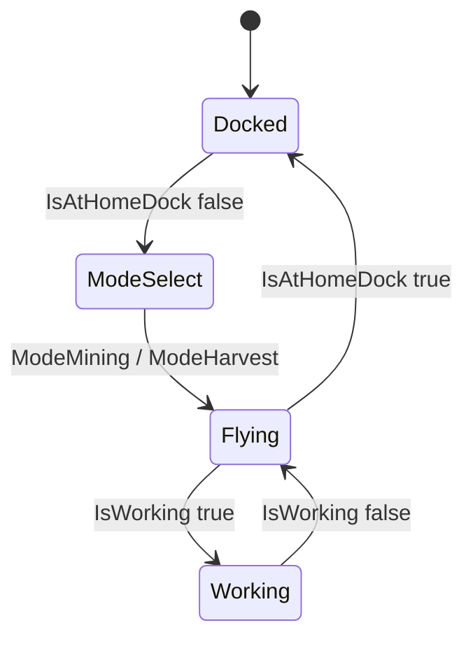
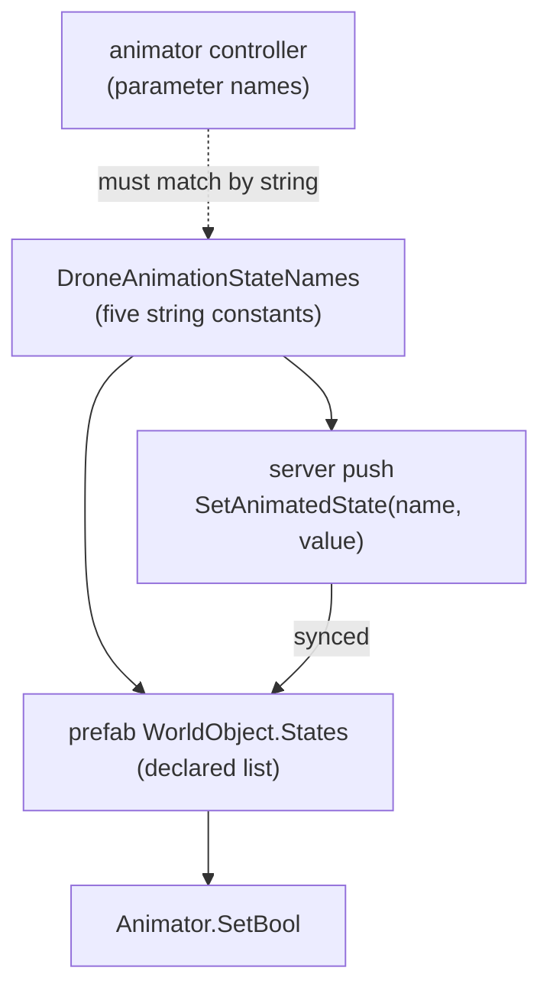

# Drone Animation and Dock Footprint - Plan

## Goal Capsule

- **Objective:** Make the client show the truth about two things it currently gets wrong — which animation a drone plays, and how much space the Drone Dock occupies.
- **Product authority:** The drone's animation state machine is owned by the model designer and is not up for redesign; this work supplies the values it already expects. Dock sizing is the user's call, anchored to the rule in R12.
- **Execution profile:** Server changes are unit-tested in the dependency-free navigation project. Prefab and occupancy changes have no unit-test surface and are proven in game against the Acceptance Examples.
- **Stop conditions:** Stop and ask if implementing R5 would require editing the animator controller, or if the dock's 16-block footprint turns out to make placement fail on ordinary terrain.
- **Tail ownership:** The implementer owns the server build, the test run, and `scripts/validate-name-match.sh`. Bundle rebuild, deploy, and the in-game checks are the user's — Unity is not scriptable from the agent side here.
- **Open blockers:** None.
- **Product Contract preservation:** Changed — R1, R2, R4, R5, R6 and Key Decisions KD3, KD6. A document review proved three original decisions false against the animator controller and the navigation code: `Operating` gates the blades layer's only exit from stopped, so it must be pushed; and an `IsAtHomeDock` derived from assignment never becomes true again after a completed survey, because the assignment outlives it. The product intent behind each survives — five names instead of four, position instead of assignment — but the requirement text moved, so this is a change, not a restructure.

---

## Product Contract

### Summary

The server pushes the five booleans the drone's animator controller actually reads, so a drone spins up out of its dock when assigned, flies out, plays its mining or harvest loop on station, and settles back to fully stopped when home. The Drone Dock's placement ghost, collider, and reserved occupancy all become the same 4x4 pad the mesh already depicts.

### Problem Frame

Three separate contracts in this mod are joined only by matching strings, and nothing checks any of them.

The drone's animator has never received a single value. Its controller declares `IsAtHomeDock`, `ModeMining`, `ModeHarvest`, `IsWorking`, and `Operating`; the server pushes `State_Docked`, `State_Unassigned`, `State_Assigned`, `State_Flying`, `State_Working`, `Drone_Mining`, and `Drone_Harvest`. The two sets do not overlap at all. Because a name that no consumer matches is silently ignored rather than reported, the drone renders and moves correctly while animating nothing, and no log line anywhere says so.

The same invisible-mismatch shape produced a second, unrelated failure. `WorldObject.size` is the block footprint the client draws as a placement ghost. It was derived once from a Unity Plane primitive — 10 units square, scaled five times — and left at 50 x 1 x 50 when the mesh was later replaced with a platform-shaped cube. The dock therefore previews a 2,500-block hologram, collides as a 4 x 0.5 x 4 box, and reserves a single block in the world. Each number is used by a different system, so no two of them are ever compared.

The cost is diagnostic, not just cosmetic. Both failures present as "the thing looks wrong in game" with a clean build, a clean server log, and nothing to search for.

### Key Decisions

- KD1. **The animator controller is the vocabulary owner.** The server and the client relay adopt the controller's five parameter names and their meanings rather than renaming parameters in Unity. (session-settled: user-approved — chosen over renaming the controller's parameters: the controller's names are clearer, and it keeps edits out of the tool where the risk is highest.) Governs R1, R5.
- KD2. **A drone's tool is fixed by its class.** (session-settled: user-directed — chosen over a per-instance value settable at runtime: a class constant cannot desync, needs no persistence, and needs no save migration.) Governs R7, R8.
- KD3. **`IsAtHomeDock` means the drone is physically home, not merely unassigned.** Its false edge is what starts mode-select and spin-up. Derived from position rather than assignment because an assignment outlives the survey that completes it — a drone that finishes its area and flies home stays assigned, so an assignment-derived flag would never go true again. (session-settled: user-directed — the "not dispatched" intent is preserved; only the signal it reads changed.) Governs R2.
- KD4. **The dock is sized from the drone, not from a fixed number.** (session-settled: user-directed — the dock must read as a pad the drone lands on.) Governs R10, R12.
- KD5. **The animation state machine is designer-owned and out of bounds.** This work supplies inputs to the existing graph and does not add, remove, or re-route states.
- KD6. **`Operating` starts the propeller layer and must be driven.** The blades layer's `00_Docked` state has exactly one exit, gated on `Operating == true`, leading to `14_Propeller_Start`; `IsAtHomeDock` gates only the return to stopped. Leaving it unpushed freezes the blades forever. Governs R4, R6.

### Requirements

**Drone animation contract**

- R1. The server pushes exactly five boolean animation states to each drone: `IsAtHomeDock`, `IsWorking`, `ModeMining`, `ModeHarvest`, `Operating`.
- R2. `IsAtHomeDock` is true whenever a drone is at its dock and stationary, whatever its assignment state.
- R3. `IsWorking` is true for the whole period a drone is on station within its assigned area, including while it repositions between plots.
- R4. Propellers start when `Operating` becomes true and stop when `IsAtHomeDock` becomes true — the two transitions the blades layer actually gates on.
- R5. The five names are declared in exactly one place, and the server push, the prefab's declared state list, and the controller's parameters all derive from that declaration.
- R6. `Operating` is pushed as the negation of `IsAtHomeDock`, so the blades spin whenever the drone is away from its dock.

**Drone tool identity**

- R7. Each drone class declares which arm it uses; the value is constant for that class and is never persisted.
- R8. The Survey Drone and the Mining Drone use the mining arm; the Harvester Drone uses the harvest arm.
- R9. `ModeMining` and `ModeHarvest` are never both true and never both false.

**Dock footprint**

- R10. The Drone Dock occupies 4 x 1 x 4 world blocks.
- R11. The placement ghost, the interaction collider, and the reserved world occupancy all describe the same volume.
- R12. The dock's footprint is larger than the footprint of the drone that docks there.
- R13. A returning drone parks at the centre of the dock's pad.

### Key Flows

- F1. One assignment cycle, dock to dock
  - **Trigger:** A player assigns a survey area to a dock holding a paired drone.
  - **Actors:** The player, the dock, the drone.
  - **Steps:** The drone leaves the fully-stopped docked state; the controller selects the arm matching the drone's class; the drone spins up and flies to the area; on arrival it plays its work loop; when the area is finished it returns to the flying loop; on arriving home it returns to fully stopped and its propellers halt.
  - **Outcome:** The animation played at each moment matches what the drone is doing.
  - **Covered by:** R1, R2, R3, R4, R8.

### Acceptance Examples

- AE1. Assignment starts the spin-up
  - **Covers R2.**
  - **Given** a paired drone sitting in its dock with no area assigned,
  - **When** the player assigns an area,
  - **Then** the drone leaves the fully-stopped state and begins its mode-select and take-off sequence, before it has moved.
- AE2. Arrival starts the work loop
  - **Covers R3.**
  - **Given** a drone flying toward its assigned area,
  - **When** it reaches the area,
  - **Then** it plays the work loop, and keeps playing it while hopping between plots inside that area.
- AE3. The arm matches the drone
  - **Covers R8, R9.**
  - **Given** a Harvester Drone and a Survey Drone both working,
  - **Then** the Harvester plays the harvest loop and the Survey Drone plays the mining loop, and neither plays both.
- AE4. Coming home stops everything
  - **Covers R2, R4.**
  - **Given** a drone returning to its dock,
  - **When** it arrives and has no further assignment,
  - **Then** it returns to the fully-stopped state and its propellers stop.
- AE5. The ghost tells the truth
  - **Covers R10, R11.**
  - **Given** a player holding a Drone Dock item,
  - **When** the placement preview appears,
  - **Then** it covers 4 x 4 blocks, matching the volume the placed dock reserves and the mesh the player then sees.

### Scope Boundaries

- Real harvesting and mining behaviour. The Harvester and Mining drones remain copies of the Survey Drone that differ only in which animation they play.
- Changing a drone's tool while the game runs, whether by player action or by an installed module.
- Any change to the animation graph itself, per KD5.
- Replacing the placeholder dock model. R12 is written as a rule so it survives that replacement.
- Growing the drone's own server occupancy to match its model, per KTD7.

#### Deferred to Follow-Up Work

- Cleaning up the `Old*` prefabs under `Assets/Art/AdvancedElectronics/Prefabs/`. Harmless today — their root GameObjects are named `Old*` too, so nothing collides — but they accumulate.

<!-- ce-section: work-relationships -->
### How This Work Fits Together

This plan owns one area: making the client render the truth about a drone's animation and a dock's footprint. The breakdown below is how the surrounding work is currently understood, not a committed roadmap.

- Restoring a loadable mod — removing `[Serialized]` from computed properties in `EcoServerMod/AdvancedElectronics/DroneLifecycle.cs` and `SurveyComponent.cs`.
  - **Enables** this plan: nothing here is observable until the mod loads. Already done, and deliberately not a requirement below.
- Real harvesting and mining behaviour for the Harvester and Mining drones.
  - **Depends on** this plan for the tool identity in R7, which it would extend from a rendering fact into a behavioural one.
  - **Still to decide:** whether tool identity stays a class constant once behaviour differs.
- Replacing the placeholder dock model.
  - **Shares** the sizing rule in R12, which is written to survive it.
  - Would revisit R13, which the user flagged as provisional.
- Learning Unity alongside the work.
  - **Can proceed independently of** this plan; it produces no artifact and constrains no requirement.

### Dependencies and Assumptions

- The animator controller at `Assets/Art/AdvancedElectronics/Animators/HRVSTR_Animator_Controller.controller` is authored and owned by the model designer. Its parameters and transitions are inputs to this work, not outputs of it.
- A drone whose path home has failed plays the flying loop, because neither `IsAtHomeDock` nor `IsWorking` is true in that state. This falls out of R2 and R3 rather than being chosen; it is called out because a stranded drone hovering is a visible behaviour nobody specified.
- The HRVSTR model measures 3.5 x 1 x 2.75 world units, so a 4 x 4 pad contains it with roughly half a block of margin on its long axis. R12 holds today but is tight; a later dock model with less margin breaks it silently.

### Outstanding Questions

All resolved during planning. See KTD1 (single declaration), KTD4 (occupancy shape), and KTD5 (park point).

### Sources

- `Assets/Art/AdvancedElectronics/Animators/HRVSTR_Animator_Controller.controller` — the five declared parameters and the transitions they gate; `Operating` gates none.
- `Assets/Art/AdvancedElectronics/DroneAnimatorStates.cs` — the client relay that turns declared bool states into animator parameter writes.
- `EcoServerMod/AdvancedElectronics.Navigation/DroneAnimationState.cs` — the current seven-boolean projection, which no consumer matches.
- `EcoServerMod/AdvancedElectronics/DroneLifecycle.cs` — the status machine the five bools derive from, and the push site.
- `EcoServerMod/AdvancedElectronics/DroneDock.cs` — the dock's registered occupancy, its item's `SideAttachedContext(Down)` placement contract, and the park position.
- `Assets/Art/AdvancedElectronics/Prefabs/DroneDockObject.prefab` — the stale `size: {x: 50, y: 1, z: 50}` driving the oversized ghost, against a mesh scaled 4 x 0.5 x 4.
- `docs/solutions/conventions/eco-custom-worldobject-placement-requirements.md` — the naming triad, `AddOccupancy` registration, and why a zero or wrong `size` breaks placement silently.
- `docs/solutions/logic-errors/prefab-finisher-writes-to-the-scene-object-name.md` — the prior failure from the same finisher.

---

## Planning Contract

### Key Technical Decisions

- KTD1. **One constant class owns the five names; every consumer derives from it.** The server constants are authored once, the prefab's declared state list is stamped from the client relay's array, and the relay's array mirrors the server constants by review. (session-settled: user-approved — inherits KD1.) Governs R1, R5.
- KTD2. **The projection stays in the dependency-free navigation project.** `DroneAnimationState` keeps no Eco reference, so the whole animation contract stays unit-testable without a running server — the only alternative proof is watching a drone in game and judging an animation by eye. Governs R1, R2, R3, R9.
- KTD3. **Tool identity is an interface member on the drone WorldObject.** `DroneLifecycle` reads it through `this.Parent`, which is typed as a `WorldObject`, so a per-class constant needs a shared surface to be readable at all. Mirrors `IDroneOwnable`, added for the same reason. Governs R7, R8.
- KTD4. **The dock registers sixteen explicit `BlockOccupancy` entries.** `AddOccupancy` takes a list of cells and the item's `SideAttachedContext(Down)` derives its attachment check from that same list, so an explicit 4x4 grid is both the registration and the ground-contact contract. Governs R10, R11.
- KTD5. **The park point moves to the pad centre.** The current `+1.5` X offset assumed a one-block dock and now lands inside the pad's own footprint. (session-settled: user-directed — recorded as provisional pending a real dock model.) Governs R13.
- KTD6. **The finisher recomputes `size` on every run.** It currently derives the footprint only when `size` is zero, which is why a Plane-derived 50 survived the swap to a platform mesh. Recomputing unconditionally is what makes R11 hold across future mesh edits rather than once. Governs R11.
- KTD7. **The drone's server occupancy stays one block while its prefab footprint matches its model.** (session-settled: user-directed — chosen over growing the occupancy to the model's extent: the pathfinder and the spawn both treat the drone as a point, and twelve reserved blocks would change what can be routed and where a drone can appear.) Governs R12.
- KTD8. **The pathfinder's endpoint exemption widens from one column to the destination's whole registered occupancy.** A sixteen-cell dock is otherwise unreachable and un-leavable by its own drone: `EcoWorldSampler.IsObstacleAt` treats every `Occupied` column as blocked, and `GridPathfinder` exempts only the goal column — an exemption written when the dock was that one column. (session-settled: user-directed — chosen over parking beside the pad or reserving a single block under a 4x4 mesh: both keep navigation untouched, but the first makes the pad decorative and the second reinstates the ghost-versus-reality gap this plan exists to close.) Governs R10, R13.

### High-Level Technical Design

The five names are a source-of-truth fan-out. One declaration feeds three consumers that never validate each other — which is the failure this plan closes.

The dotted edge is the one nothing enforces: the controller is authored in Unity and agrees with the constants only by review. KTD1 makes the other three derive from one place so that dotted edge is the single remaining manual match, instead of three.

### Risks

- **Docks already placed in a save claim one block, not sixteen.** Occupancy is registered per type at load, so growing it retroactively widens what every existing dock reserves. A dock built flush against a neighbour or a cliff will overlap terrain or another object that was legal when it was placed. This lands on the live-test save at the next deploy, not at release, and overlapping occupancy produces no ghost, no error, and no log line. U4 therefore loads the existing save and records what happens before any further placement testing; the migrate-or-refund-or-accept decision is then made with an observation rather than a guess.
- **Sixteen-cell ground contact is stricter than one.** `SideAttachedContext(Down)` checks attachment against every registered cell, so the dock now needs a flat 4x4 to place at all. A smaller pad is not the escape route: R12 and the drone's 3.5-unit long axis rule out anything under 4x4. If the check proves too strict in ordinary terrain, the fallback is a documented flat-ground placement requirement, and the Goal Capsule's stop condition applies.

### Sequencing

U1 establishes the five-name contract, so U2 and U3 both depend on it. U5 changes the finisher that U3 and U4 both re-run, so it lands before either. U6 lands before U4, because a 4x4 dock its drone cannot path into is not testable. The resulting order is U5 and U6 first, then U1, U2, U3, U4.

Note that U5 changes what any later finisher run writes: once the zero-guard is gone, U3's prefab regeneration also recomputes each drone's `WorldObject.size`. That is intended per KTD7, but it means a U3 diff carries footprint changes an animation-names unit did not otherwise advertise.

---

## Implementation Units

### U1. Rewrite the animation projection to the controller's five booleans

- **Goal:** Replace the seven-boolean projection nothing consumes with the five the controller declares.
- **Requirements:** R1, R2, R3, R5, R6, R9. Covers KTD1, KTD2.
- **Dependencies:** None.
- **Files:**
  - `EcoServerMod/AdvancedElectronics.Navigation/DroneAnimationState.cs` — modify
  - `EcoServerMod/AdvancedElectronics.Navigation.Tests/DroneAnimationStateTests.cs` — modify
  - `EcoServerMod/AdvancedElectronics/DroneLifecycle.cs` — modify the push site
- **Approach:**
  1. Replace the seven constants in `DroneAnimationStateNames` with the five the controller declares: `IsAtHomeDock`, `IsWorking`, `ModeMining`, `ModeHarvest`, `Operating`.
  2. Reshape `DroneAnimationState` to those five properties. `From` takes the lifecycle status, whether the mover is advancing, whether the drone is physically at its dock, and whether this drone uses the harvest tool.
  3. Derive `IsAtHomeDock` from the existing `DroneLifecycle.IsAtHomeDock()` proximity test combined with the drone being stationary — not from whether an area is assigned, per KD3.
  4. Derive `Operating` as the negation of `IsAtHomeDock`, per R6.
  5. Leave `DroneLifecycle`'s change-gated push loop and its placement above the early returns unchanged; only the projected values change.
- **Patterns to follow:** The existing change-gated push in `DroneLifecycle.RefreshAnimationStates` and the `AsNamedValues` pairing already in `DroneAnimationState`.
- **Test scenarios:**
  - Covers AE1. At the dock and stationary yields `IsAtHomeDock` true; once dispatched and away from the dock it is false.
  - Covers AE2. On station and stationary yields `IsWorking` true; on station and repositioning keeps `IsWorking` true.
  - En route to the area yields `IsWorking` false and `IsAtHomeDock` false.
  - En route back to the dock yields both false.
  - Back at the dock after a completed survey — assignment still set — yields `IsAtHomeDock` true. This is the case an assignment-derived flag would get wrong.
  - Recalled for lack of fuel and home again yields `IsAtHomeDock` true.
  - Unreachable yields both false, pinning the stranded-drone behaviour recorded in Assumptions.
  - `Operating` equals the negation of `IsAtHomeDock` in every case above.
  - `AsNamedValues` returns exactly five entries, each name distinct, and each value equal to its property.
- **Verification:** `dotnet test` in `EcoServerMod/AdvancedElectronics.Navigation.Tests` passes with the rewritten suite; `dotnet build` in `EcoServerMod/AdvancedElectronics` reports 0 errors.

### U2. Give each drone class a tool identity

- **Goal:** Let a drone declare which arm it carries so the projection can route `ModeMining` against `ModeHarvest`.
- **Requirements:** R7, R8, R9. Covers KTD3.
- **Dependencies:** U1.
- **Files:**
  - `EcoServerMod/AdvancedElectronics/DroneOwnership.cs` — modify, adding the tool interface beside `IDroneOwnable`
  - `EcoServerMod/AdvancedElectronics/SurveyDrone.cs` — modify
  - `EcoServerMod/AdvancedElectronics/MiningDrone.cs` — modify
  - `EcoServerMod/AdvancedElectronics/HarvesterDrone.cs` — modify
  - `EcoServerMod/AdvancedElectronics/DroneLifecycle.cs` — modify, reading the tool through `this.Parent`
- **Approach:**
  1. Declare a small interface carrying the drone's tool as a read-only member. Both drone-facing interfaces exist for the same reason — `this.Parent` is a `WorldObject`, so per-class members are unreachable without one.
  2. Implement it on all three drone object classes as a constant expression, never a stored field, per R7.
  3. Read it in `RefreshAnimationStates` and pass it into the projection. A drone that does not implement it defaults to the mining arm, so a future drone that forgets the interface animates rather than freezing.
  4. Remove the stray `ModeHarvest` fields left on `SurveyDroneObject` and `HarvestDroneObject` — both are superseded by this interface and would otherwise be a second, contradicting source.
- **Patterns to follow:** `IDroneOwnable` in `EcoServerMod/AdvancedElectronics/DroneOwnership.cs` — same shape, same justification, declarative only.
- **Test scenarios:**
  - Covers AE3. A drone using the mining arm yields `ModeMining` true and `ModeHarvest` false; the harvest arm yields the inverse.
  - The two mode booleans are never equal, across every lifecycle status.
  - Mode values do not change with lifecycle status — only the tool decides them.
- **Verification:** `dotnet build` reports 0 errors; the mode scenarios pass; grep confirms no remaining `ModeHarvest` field on any drone class.

### U3. Point the client relay and the drone prefabs at the five names

- **Goal:** Make the client half of the contract use the same five strings the server now pushes.
- **Requirements:** R1, R4, R5.
- **Dependencies:** U1.
- **Files:**
  - `Assets/Art/AdvancedElectronics/DroneAnimatorStates.cs` — modify
  - `Assets/Art/AdvancedElectronics/Editor/AdvancedElectronicsBuildTools.cs` — modify the drone table
  - `Assets/Art/AdvancedElectronics/Prefabs/SurveyDroneObject.prefab` — regenerate via the finisher
  - `Assets/Art/AdvancedElectronics/Prefabs/MiningDroneObject.prefab` — regenerate via the finisher
  - `Assets/Art/AdvancedElectronics/Prefabs/HarvestDroneObject.prefab` — regenerate via the finisher
- **Approach:**
  1. Replace the relay's name array with the five names, in the same order as the server constants.
  2. Leave the relay's existing behaviour alone — it already skips parameters the controller does not declare, resolves hashes once, and self-wires in `Awake`. Correct its doc comment, which still says the controller declares seven booleans.
  3. Add `SurveyDroneObject` and `MiningDroneObject` to the `SharedChassisDrones` table. Today it holds only `HarvestDroneObject`, so **Finish All Drone Prefabs** reaches one of the three prefabs this unit lists and the other two keep their current state lists. The survey drone was held out of that table earlier to avoid replacing shipped capsule art; it now uses the HRVSTR chassis like the others, so the reason has lapsed.
  4. Re-run **Eco Tools > Advanced Electronics > Finish All Drone Prefabs** so every prefab's declared state list is re-stamped from the relay's array. Do not hand-edit the prefab YAML; the finisher is what keeps the two in step.
  5. Check the result: `SurveyDroneObject.prefab` currently declares `ModeHarvest`, which contradicts R8. All three prefabs must end up declaring the same five names, with the drone's class — not its prefab — deciding which mode is true.
- **Patterns to follow:** `DockReadoutDisplay`'s self-wiring shape, which `DroneAnimatorStates` already mirrors.
- **Test scenarios:** Test expectation: none — this unit is a string-table change plus regenerated prefab assets, and Unity assets have no test surface in this repo. Its proof is AE1 through AE4 in game.
- **Verification:** **Report Duplicate Bundle Object Names** reports no duplicates; `bash scripts/validate-name-match.sh` reports PASS; each drone prefab's declared state list shows the five names in the Inspector.

### U4. Correct the dock's footprint and park position

- **Goal:** Make the ghost, the collider, and the reserved occupancy describe the same 4x4 pad, and park the drone on it.
- **Requirements:** R10, R11, R12, R13. Covers KTD4, KTD5.
- **Dependencies:** U5 (the finisher owns `size` once its zero-guard is gone), U6 (the dock is unreachable until the exemption widens).
- **Files:**
  - `EcoServerMod/AdvancedElectronics/DroneDock.cs` — modify the static occupancy registration and the park position
  - `EcoServerMod/AdvancedElectronics/DroneLifecycle.cs` — modify the return targeting and the arrival radius
  - `Assets/Art/AdvancedElectronics/Prefabs/DroneDockObject.prefab` — regenerate `WorldObject.size` via **Finish Dock Prefab**
- **Approach:**
  1. Register sixteen `BlockOccupancy` cells covering the 4x4 grid at y=0, replacing the single origin cell.
  2. Set the prefab's `size` to the same 4 x 1 x 4. The collider already matches the mesh and needs no change.
  3. Move the park point from its `+1.5` X offset to the pad's centre, on the pad's top surface.
  4. Retarget the ordinary return leg at the park point. `BeginReturnToDock` and the non-teleport rungs of `TryReturnAt` path to `HomeDock.Position`, so today only spawn and the teleport rung use `DroneParkPosition` — without this, R13 cannot be observed on the normal path.
  5. Widen `DockArrivalRadius` past the pad's diagonal. It is `2f`, measured from the dock anchor, and sized for a one-block dock; a drone stopping on the far side of a 4x4 pad would fail the arrival test and route into Unreachable at its own dock.
  6. Leave `DroneDockItem.GetOccupancyContext` untouched — it derives from `GetOccupancyInfo`, so it follows the new registration automatically.
  7. Leave the collider at the mesh's 4 x 0.5 x 4. R11's "same volume" is a footprint claim about the X/Z plane; the half-block height is the mesh being a pad, not a disagreement.
- **Execution note:** Placement is the risky part. Verify the dock still places on ordinary ground before moving on — `SideAttachedContext(Down)` now requires ground under all sixteen cells, not one.
- **Patterns to follow:** The multi-cell `AddOccupancy` registrations in the reference mods cited in `docs/solutions/conventions/eco-custom-worldobject-placement-requirements.md`.
- **Test scenarios:** Test expectation: none — occupancy registration and prefab fields have no unit-test surface here. Proof is AE5 plus the placement check in the Execution note.
- **Verification:** `dotnet build` reports 0 errors; in game the placement ghost covers 4x4, the dock places on flat ground, and a returning drone parks on the pad rather than beside it.

### U5. Stop the prefab finisher re-deriving a stale footprint

- **Goal:** Make the finisher recompute `size` every run so a mesh change can never leave a stale footprint behind.
- **Requirements:** R11. Covers KTD6.
- **Dependencies:** None.
- **Files:**
  - `Assets/Art/AdvancedElectronics/Editor/AdvancedElectronicsBuildTools.cs` — modify
- **Approach:**
  1. Drop the zero-guard around the `size` derivation so it recomputes from the encapsulating renderer bounds on every run.
  2. Log the previous and new values when they differ, so a surprising change is visible in the Console rather than silent.
  3. Leave the ceil-to-whole-blocks and minimum-of-one behaviour as-is — those are correct; only the run-once condition was wrong.
- **Patterns to follow:** The existing shader-verification and duplicate-name reporting in the same file — both report rather than assume.
- **Test scenarios:** Test expectation: none — this is Editor-only tooling with no test surface in this repo. Its proof is the two-run check below.
- **Verification:** The first run after the change logs corrected sizes for every prefab currently holding a stale value — the dock at `50 x 1 x 50`, the survey drone at `4 x 2 x 3`, and the mining and harvest drones at zero. A second run immediately after logs no change. The Editor assembly compiles with no errors in the Unity Console.

### U6. Widen the pathfinder's endpoint exemption to a whole footprint

- **Goal:** Let a drone path into and out of a dock that occupies more than one cell.
- **Requirements:** R10, R13. Covers KTD8.
- **Dependencies:** None. Must land before U4 is testable in game.
- **Files:**
  - `EcoServerMod/AdvancedElectronics.Navigation/GridPathfinder.cs` — modify
  - `EcoServerMod/AdvancedElectronics/DroneMoverComponent.cs` — modify the destination call
  - `EcoServerMod/AdvancedElectronics/EcoWorldSampler.cs` — modify the comment that documents the single-column assumption
  - `EcoServerMod/AdvancedElectronics.Navigation.Tests/GridPathfinderTests.cs` — modify
- **Approach:**
  1. Replace the single-column `exemptGoalObstacle` flag with a set of exempt columns, so both the pre-check and the A* neighbour test consult it.
  2. Have the mover pass the destination object's registered occupancy as that set, rather than a bare boolean.
  3. Exempt the start columns too. A drone parked inside the pad must be able to take its first step out, which the goal-only exemption never covered.
  4. Update the comment at the top of `EcoWorldSampler.IsSolidAt`, which states the exemption exists "so the pathfinder's endpoint exemption can let the drone leave its own column and enter the dock's" — written when the dock was one column.
- **Execution note:** This is the mod's navigation core. Add the failing tests before changing `FindPath`, so the regression surface is visible before it moves.
- **Patterns to follow:** The existing `exemptGoalObstacle` plumbing through `DroneMoverComponent.SetDestination`, which already carries a destination-is-occupied signal end to end.
- **Test scenarios:**
  - A path whose goal lies inside a multi-cell occupied footprint is found.
  - A path whose start lies inside a multi-cell occupied footprint is found.
  - A path from one interior cell of a footprint to another is found.
  - An occupied column that belongs to no exempt footprint still blocks, so the widening does not make the drone walk through arbitrary objects.
  - A single-cell destination behaves exactly as before, proving no regression for the assembly and other one-block objects.
- **Verification:** `dotnet test` passes including the new pathfinder scenarios; a drone dispatched from and returned to a 4x4 dock completes both legs in game without entering Unreachable.

---

## Verification Contract

| Gate | Command or action | Applies to | Pass signal |
|---|---|---|---|
| Server build | `dotnet build` in `EcoServerMod/AdvancedElectronics` | U1, U2, U4, U6 | `0 Error(s)` |
| Unit tests | `dotnet test` in `EcoServerMod/AdvancedElectronics.Navigation.Tests` | U1, U2, U6 | all pass, no skips |
| Animation names | the five `DroneAnimationStateNames` constants, `DroneAnimatorStates.BoolStateNames`, each drone prefab's `States` array, and the controller's declared parameters all carry the same five names | U1, U3 | no name present in one source and absent from another |
| Object-name binding | `bash scripts/validate-name-match.sh` | U3, U4 | `PASS` |
| Bundle duplicates | Eco Tools > Advanced Electronics > Report Duplicate Bundle Object Names | U3 | no duplicates reported |
| Finisher recompute | Run **Finish All Drone Prefabs** twice in succession | U5 | first run logs corrected sizes; second logs none |
| Existing-save load | Load the live-test save containing a dock placed under the one-block footprint | U4 | loads; overlap or displacement observed and recorded |
| Live behaviour | Deploy the mod DLLs and rebuilt bundle, restart, play AE1–AE5 | all | each Acceptance Example observed |

The Animation names gate has no script today — `scripts/validate-name-match.sh` checks WorldObject and Item class names against asset filenames and never reads animation state names, so it cannot detect the mismatch this plan exists to fix. Extending it to cover the five names is the intended mechanization of R5 and turns the design section's dotted edge into a real check.

The live gate is the only proof for U3 and U4. Unity assets have no test surface in this repo, and the animation contract's client half cannot be exercised without a running client.

---

## Definition of Done

**Global**

- Every gate in the Verification Contract passes.
- AE1 through AE5 are each observed in game.
- The server pushes no state name the animator controller does not declare, and each drone prefab's declared state list holds exactly the five pushed names.
- No abandoned or experimental code from this work remains in the diff.

**Per unit**

- U1 — the projection exposes exactly the five names; the rewritten test suite passes, including the completed-survey and fuel-recall cases for `IsAtHomeDock`.
- U2 — all three drone classes declare a tool; the mode booleans are provably mutually exclusive; both superseded `ModeHarvest` fields are gone.
- U3 — the relay's array, the drone table in the finisher, and all three drone prefabs' declared state lists carry the same five names as the server constants; no prefab declares a mode its class contradicts.
- U4 — ghost and reserved occupancy both describe 4 x 1 x 4 and the collider matches the mesh footprint; the dock places on ordinary ground; a returning drone parks on the pad by walking, not only by teleport; the existing save's dock behaviour is recorded.
- U5 — the finisher recomputes `size` on every run, logs the change on the first run and nothing on the second.
- U6 — a drone paths into and out of a sixteen-cell dock; single-cell destinations behave exactly as before.
