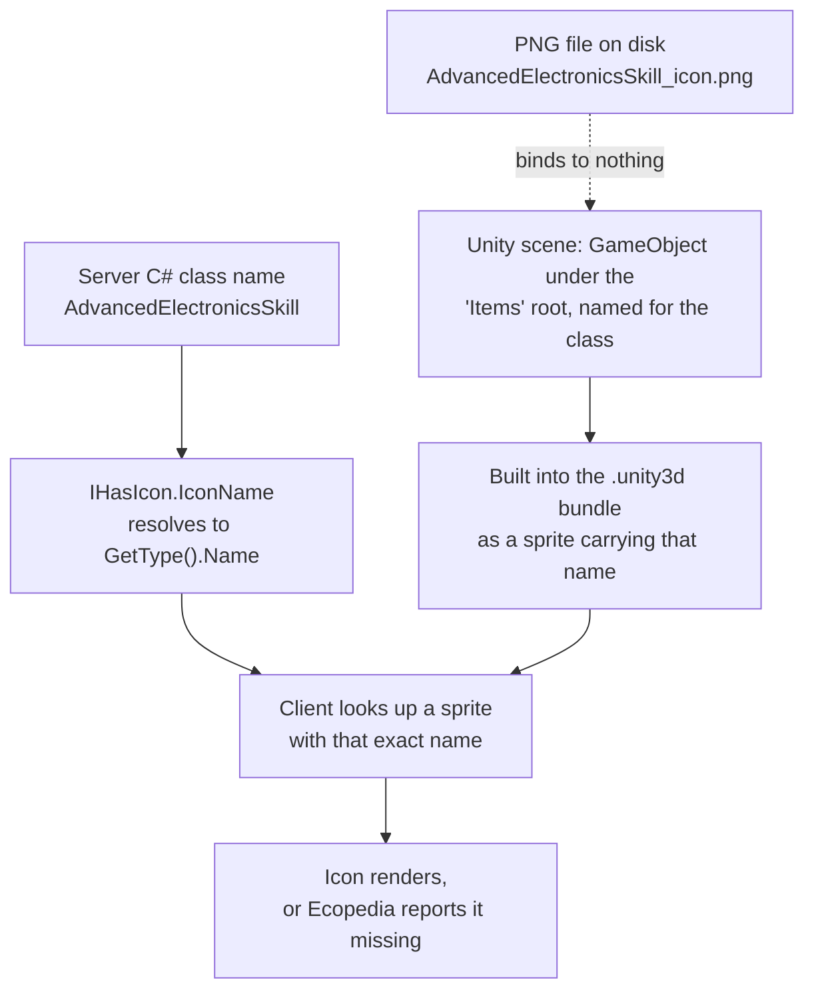

# Advanced Electronics Tech-Tree Icons - Plan

## Goal Capsule

- **Objective.** Give all four Advanced Electronics tech-tree entries — the skill, its skill book, its skill scroll, and the Engineering Research Paper Post Modern — a working, verified, documented icon path, using placeholder art.
- **Product authority.** The maintainer, whose acceptance signal is what the running client draws. Final artwork is not this plan's scope.
- **Open blockers.** None. The one unresolved technical question (whether the ModKit's icon enumeration requires a `[HasIcon]` attribute) is answerable during planning by reading the engine source.

---

## Product Contract

### Summary

Extend the mod's existing placeholder-icon command to cover all four Advanced Electronics tech-tree entries, prove the icons bind to the right classes in a running client, and write the mechanism down. Placeholder art ships; real artwork is a separate later pass.

### Problem Frame

The mod declares four tech-tree entries that a player sees as pictures: `AdvancedElectronicsSkill`, `AdvancedElectronicsSkillBook`, `AdvancedElectronicsSkillScroll`, and `EngineeringResearchPaperPostModernItem`. Three have flat 64×64 placeholder PNGs generated on 30 July. The skill has no icon asset at all. None have been verified in a running client — `Bundle, deploy, and live-verify` has been open since the day the placeholders were made.

The mechanism itself was never written down, and two of the beliefs the team held about it were wrong. A repo task points at an `Icons.md` that has never existed in this repository; the file lives only in Strange Loop Games' internal wiki checkout. And the "templating" remembered as an icon-authoring aid is the tech-tree T4 transform, which generates C# class declarations from a spreadsheet and emits no icon metadata whatsoever.

The cost is not player-visible breakage. The base game itself ships with missing icons, so a missing icon degrades quietly rather than failing. The cost is that nobody can tell whether these four work, what would make them work, or whether a future entry will silently repeat the problem — and the one binding failure mode is invisible by construction. An icon bound to the wrong class renders perfectly and looks like success.

### Key Decisions

- KD1. **Pipeline correctness before art quality.** (session-settled: user-directed — chosen over release polish, over fixing the "looks broken" symptom, and over an Ecopedia-first pass: the mechanism has to be understood and repeatable before artwork is worth commissioning.) Governs R1, R2, R8, R9.
- KD2. **Borrowed vanilla art stays local and never enters a commit.** (session-settled: user-directed — chosen over dropping borrowing entirely, over committing it as an interim, and over drawing originals now: keeps the licence surface clean while still allowing side-by-side comparison against the real game.) Governs R6.
- KD3. **This work rides the pending Unity batch rather than taking its own trip.** (session-settled: user-directed — chosen over an immediate isolated trip: Editor access and server restarts are scarce, and several other items already need the same session.) Governs R7.
- KD4. **Each placeholder gets a distinct fill colour.** (session-settled: user-approved — identical placeholders prove an icon is present but cannot prove it bound to the right class, and a mis-bound icon is indistinguishable from success.) Governs R4.
- KD5. **Placeholders are generated at 128×128 to match vanilla's atlas rects.** (session-settled: user-approved — matching vanilla costs one constant and removes size as a variable when comparing against the real game.) Governs R3.
- KD6. **No `_FG` background-less variants for the skill, book or scroll.** Vanilla ships none for those three classes, so producing them would be building for an unconfirmed requirement. The research paper is a separate question; see Outstanding Questions.

### The binding chain

The dotted edge is the trap. The PNG filename is a human convenience only; the GameObject's name is the sole thing the server and client agree on. A correct filename beside a wrong GameObject name produces a missing icon that looks purely cosmetic.

### Requirements

**Icon coverage**

- R1. All four tech-tree entries resolve an icon in a running client: the skill, the skill book, the skill scroll, and the research paper.
- R2. The skill is included on equal terms with the three items, having previously been absent from the mod's icon set entirely.

**Placeholder art**

- R3. Generated placeholders are 128×128.
- R4. Each of the four carries a fill colour visually distinct from the other three, with the class-to-colour mapping recorded in the source that generates them.
- R5. The generating command reports which entries it produced on this run, so a run that silently skipped one is distinguishable from a run that covered everything.

**Borrowed reference art**

- R6. Vanilla artwork used for visual comparison exists only in an ignored working location. It never reaches a commit, the release archive, or any tracked file.

**Verification**

- R7. Icon work reaches the Editor and the server as part of the already-pending Unity batch, not as a separate session or deploy.
- R8. The client's own report of missing icons is the acceptance signal, checked against all four class names at once rather than by inspecting icons one at a time.

**Documentation**

- R9. The mechanism is written into the repository's learnings so a future entry can be given an icon without rediscovering it: what binds to what, what does not bind, and where the authoritative specification actually lives.
- R10. The existing repo task that directs a reader to an `Icons.md` inside this repository is corrected, since no such file exists here.

### Key Flows

- F1. Adding an icon to a new tech-tree entry
  - **Trigger:** A new skill, book, scroll or item is declared in the server assembly and needs a picture.
  - **Steps:** Register the class name in the mod's icon table with a fill colour; run the Editor command, which creates the scene object under the `Items` root, names it for the class, and assigns the generated sprite; build the bundle; deploy; read the client's missing-icon report.
  - **Outcome:** Either the class no longer appears in the missing-icon report, or it does and the name mismatch is localised to one of the three places a name is written.
  - **Covered by:** R1, R2, R5, R8

- F2. Comparing a placeholder against the real game
  - **Trigger:** Someone wants to judge how the placeholder reads next to vanilla art at the same size.
  - **Steps:** Extract the relevant vanilla sprite into the ignored working location; compare; discard or leave it in place.
  - **Outcome:** A visual judgement is possible without any borrowed artwork becoming part of the repository or a release.
  - **Covered by:** R6

### Acceptance Examples

- AE1. Every entry resolves
  - **Covers R1, R2, R8.**
  - **Given** the batch has been deployed and a world with the mod loaded is running,
  - **When** the client's missing-icon report is read,
  - **Then** none of the four class names appear in it.

- AE2. A mis-binding is caught rather than mistaken for success
  - **Covers R4.**
  - **Given** all four placeholders carry distinct fill colours and the mapping is recorded,
  - **When** the four are viewed together,
  - **Then** an icon that rendered under the wrong entry is identifiable from colour alone, without reading any log.

- AE3. Borrowed art cannot escape
  - **Covers R6.**
  - **Given** vanilla artwork has been extracted for comparison,
  - **When** the working tree is inspected and a release archive is produced,
  - **Then** neither contains any borrowed artwork.

### Scope Boundaries

- Final or custom artwork for any of the four. Placeholders are the deliverable; art is a later, separate pass.
- `_FG` background-less variants for the skill, book and scroll (see KD6).
- Icon atlas baking. The bake pipeline is first-party tooling and is not available to mods.
- Regenerating any tech-tree C# from the spreadsheet transform. The four classes already exist and are not being re-derived.
- The other items sharing the pending Unity batch. This plan rides that batch; it does not own or re-scope its contents.
- Icons for any mod content outside these four entries. The five existing item placeholders are already generated and are untouched here.

### Dependencies and Assumptions

- The pending Unity batch happens. Nothing in this plan lands before it, by choice (KD3).
- Editor access is a finite grant rather than a standing connection, which is why the work is batched and why the generating command must be runnable in one invocation.
- A skill is an item as far as icons are concerned. This is verified in the engine source, not assumed.
- The client reports missing icons by class name in a single enumerated list, making one deploy sufficient to answer for all four.

### Outstanding Questions

**Resolve Before Planning**

None.

**Deferred to Planning**

- Does the ModKit's icon enumeration require a `[HasIcon]` attribute on a mod's types? The engine's item interface resolves an icon name with no attribute, but the ModKit plugin's enumeration path appears to filter on the attribute and fall back differently when the interface is absent. If the attribute turns out to be required for mod-supplied types, all four classes need it. Answerable by reading the plugin source.
- Should the research paper get an `_FG` variant? Vanilla gives research papers one and gives skills, books and scrolls none. Whether a mod needs to match that is unestablished.
- Which of the four are actually missing today. The only log evidence predates the placeholders by more than a week, so current state is unknown until the batch deploys. This may shrink the work but cannot be resolved in advance.
- How vanilla artwork is extracted for comparison. It exists only as rects inside a baked atlas, addressable by coordinates in the atlas metadata; no loose per-class file exists for any skill, book, scroll or research paper.

### Sources and Research

Evidence gathered during this brainstorm. Paths inside the mod repository are repo-relative; paths inside the Eco source checkout are relative to that checkout's root.

- `Assets/Art/AdvancedElectronics/Editor/AdvancedElectronicsBuildTools.cs:64` — the icon table; `:166` — the `Finish All Item Icons` menu command; `:256` — the per-item finisher; `:246-250` — the comment stating the PNG filename carries no binding and the GameObject name is the only thing bound.
- `Assets/Art/AdvancedElectronics/Sprites/Icons/` — nine existing 64×64 placeholders; no file for the skill.
- `Assets/EcoModKit/Prefabs/ItemTemplate.prefab` and `IconTemplate.prefab` — each carries a `Background` and a `Foreground` child with sprites already assigned; the mod supplies the foreground.
- `Assets/EcoModKit/Docs/` — contains only `README.md`. There is no `Icons.md` anywhere in this repository. `README.md:8` is written for Eco 0.9.6 and predates the Addressables migration, so its asset-loading guidance does not describe the version this mod targets.
- Eco source checkout, `Server/Eco.Gameplay/Items/IHasIcon.cs:11` — the icon name resolves to the type name, requiring no attribute.
- Eco source checkout, `Server/Eco.Gameplay/Skills/Skill.cs:36` and `Server/Eco.Gameplay/Items/Item.cs:29` — a skill derives from item, and item implements the icon interface. Skills, books, scrolls and research papers are one mechanism, not four.
- Eco source checkout, `Server/Mods/__core__/AutoGen/Tech/Electronics.cs` — the vanilla Electronics skill, book and scroll carry no icon-related attribute of any kind.
- Eco source checkout, `Content/Art/UI/Icons/UI_Icons_Baked_0.png.meta` — vanilla ships `ElectronicsSkill`, `ElectronicsSkillBook` and `ElectronicsSkillScroll` as atlas rects with no `_FG` twin, while research-paper items do carry `_FG` twins.
- Eco source checkout, `Content/Art/UI/Skills/UI_Skill_Icons.png.meta` — profession-tier art only. There is no per-specialty sprite, so no vanilla emblem exists to borrow for the skill itself.
- Eco source checkout, `Content/Art/UI/Icons/IndividualIcons/` — 130 loose files, none of them a skill, book, scroll or research paper.
- `.references/Mods/` — no third-party mod in the reference set ships a loose image file; mod icons live inside compiled bundles.
- `.references/Logs/1.txt:759` — the client's enumerated missing-icon report; `:960` — the per-icon lookup failure. Both predate the placeholder generation and describe an earlier state.
