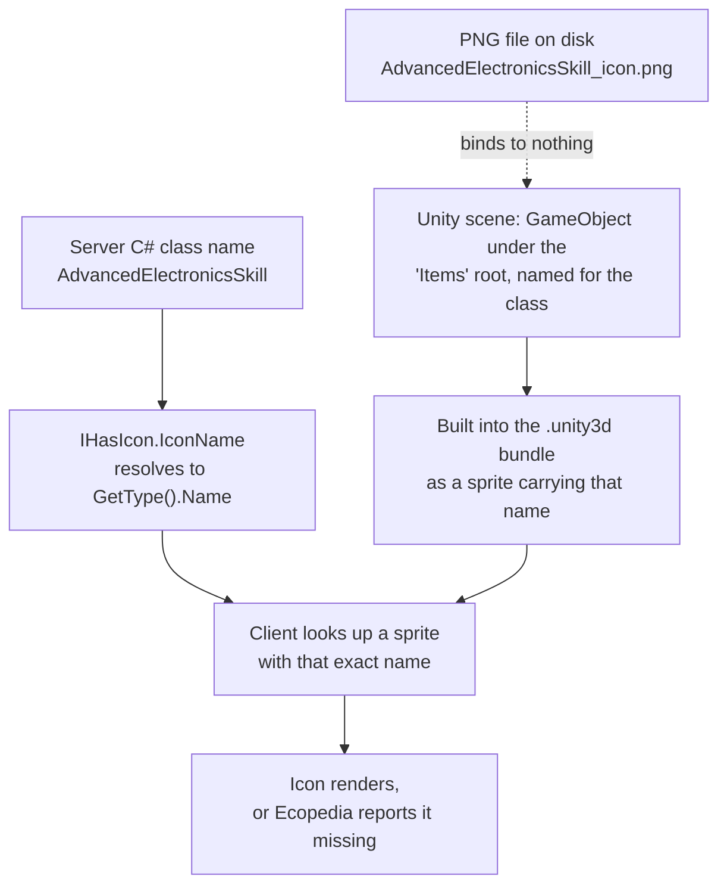
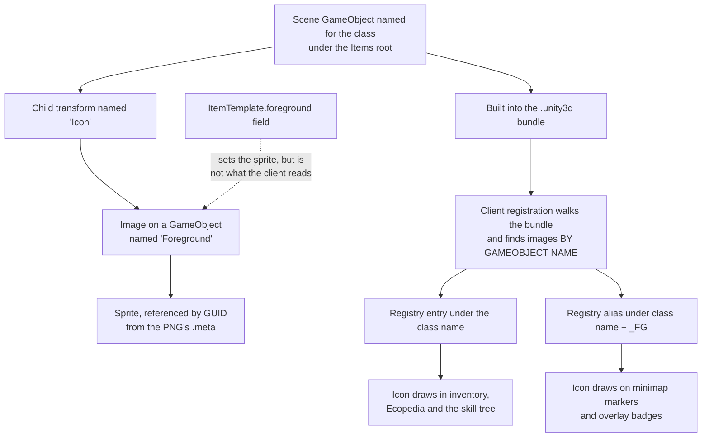
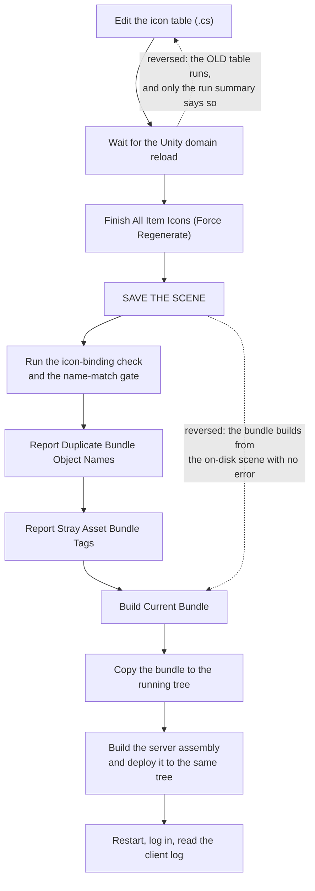

# Advanced Electronics Tech-Tree Icons - Plan

## Goal Capsule

- **Objective.** All four Advanced Electronics tech-tree entries — the skill, its skill book, its skill scroll, and the Engineering Research Paper Post Modern — draw an icon in a running client, and the mechanism that makes them do so is written down and checkable.
- **Means.** Extend the mod's existing placeholder-icon command to cover the fourth entry, add a pre-deploy check that proves each icon binds to its own class, and make the client's enumerated missing-icon report able to speak for all four (KTD2, KTD3).
- **Product authority.** The maintainer, whose acceptance signal is what the running client draws. Final artwork is not this plan's scope.
- **Execution profile.** One Unity Editor invocation and one server restart, both scarce. Every gate is written beforehand and runs inside that invocation, after the scene is saved and before the bundle is built (KTD5, KTD8).
- **Stop conditions.** Stop and ask if the client's enumerated report still omits an entry after U1 lands, or if the binding check reports anything once U3's rows are in place.

---

## Product Contract

**Product Contract preservation:** restructured, plus one addition and two changes. R1–R3 and R5–R10 are unchanged in meaning and keep their IDs. R11 is added from planning (a binding check that runs before the bundle is built, confirmed during scoping). R4 is widened from "distinct from the other three" to "distinct from every entry in the icon table", because the mis-binding it exists to catch is not confined to the four. KD7 and KD8 are added to record two scoping decisions made during planning; KD8 brings `MiningDroneItem`'s existing mis-binding into scope, which the brainstorm's boundaries had left out. R8's stated mechanism is preserved but was found to require a server-side precondition, delivered by U1 — see KTD3.

### Summary

Extend the mod's existing placeholder-icon command to cover all four Advanced Electronics tech-tree entries, prove the icons bind to the right classes before deploying rather than after, and write the mechanism down. Placeholder art ships; real artwork is a separate later pass.

### Problem Frame

The mod declares four tech-tree entries that a player sees as pictures: `AdvancedElectronicsSkill`, `AdvancedElectronicsSkillBook`, `AdvancedElectronicsSkillScroll`, and `EngineeringResearchPaperPostModernItem`. Three have flat 64×64 placeholder PNGs generated on 30 July. The skill has no icon asset at all. None have been verified in a running client — `Bundle, deploy, and live-verify` has been open since the day the placeholders were made.

The mechanism itself was never written down. A repo task points at `Icons.md` without naming the tree that holds it, and the file is not in this repository — it is the Eco wiki checkout's, at `../../Eco.wiki/Icons.md`, 453 lines. And the "templating" remembered as an icon-authoring aid is the tech-tree T4 transform, which generates C# class declarations from a spreadsheet and emits no icon metadata for the classes in question.

The cost is not player-visible breakage. The base game itself ships with missing icons, so a missing icon degrades quietly rather than failing. The cost is that nobody can tell whether these four work, what would make them work, or whether a future entry will silently repeat the problem — and the one binding failure mode is invisible by construction. An icon bound to the wrong class renders perfectly and looks like success.

That failure is not hypothetical. `MiningDroneItem` renders the Survey Drone's placeholder today: both scene objects reference sprite GUID `b29fd48c15da025469d279d689ca1c52`, the mining drone has no row in the icon table and no PNG of its own, and `scripts/validate-name-match.sh` passes.

### Key Decisions

- KD1. **Pipeline correctness before art quality.** (session-settled: user-directed — chosen over release polish, over fixing the "looks broken" symptom, and over an Ecopedia-first pass: the mechanism has to be understood and repeatable before artwork is worth commissioning.) Governs R1, R2, R8, R9.
- KD2. **Borrowed vanilla art stays local and never enters a commit.** (session-settled: user-directed — chosen over dropping borrowing entirely, over committing it as an interim, and over drawing originals now: keeps the licence surface clean while still allowing side-by-side comparison against the real game.) Governs R6.
- KD3. **This work rides the pending Unity batch rather than taking its own trip.** (session-settled: user-directed — chosen over an immediate isolated trip: Editor access and server restarts are scarce, and several other items already need the same session.) Governs R7.
- KD4. **Each placeholder gets a distinct fill colour.** (session-settled: user-approved — identical placeholders prove an icon is present but cannot prove it bound to the right class, and a mis-bound icon is indistinguishable from success.) Governs R4.
- KD5. **Placeholders are generated at 128×128 to match vanilla's atlas rects.** (session-settled: user-approved — matching vanilla costs one constant and removes size as a variable when comparing against the real game.) Governs R3.
- KD6. **No `_FG` background-less variants are authored for any of the four.** Vanilla ships none for the skill, book or scroll, and the mod's registration path already publishes a `_FG` alias from the same foreground sprite, so the research paper's variant costs nothing and needs no asset. Governs R1.
- KD7. **Borrowed reference art uses the nearest vanilla sibling where no counterpart exists.** (session-settled: user-directed — chosen over dropping borrowing and over borrowing only for the book and scroll: vanilla has no per-specialty skill emblem and no PostModern research paper, and a stand-in still answers the size and readability question the comparison exists for.) Governs R6.
- KD8. **`MiningDroneItem`'s existing mis-binding is fixed as part of this work.** (session-settled: user-directed — chosen over recording it as a follow-up and carrying it as a permanent exception in the binding check: the fix is one table row and a regeneration run, and an exception outlives the bug it excuses, hiding any later regression on that entry behind the same clause.) Governs R4, R11.

### The binding chain

The dotted edge is the trap. The PNG filename is a human convenience only; the GameObject's name is the sole thing the server and client agree on. A correct filename beside a wrong GameObject name produces a missing icon that looks purely cosmetic.

### Requirements

**Icon coverage**

- R1. All four tech-tree entries resolve an icon in a running client: the skill, the skill book, the skill scroll, and the research paper.
- R2. The skill is included on equal terms with the three items, having previously been absent from the mod's icon set entirely.

**Placeholder art**

- R3. Generated placeholders are 128×128.
- R4. Each of the four carries a fill colour visually distinct from the other three and from every other entry in the icon table, with the class-to-colour mapping recorded in the source that generates them.
- R5. The generating command reports which entries it produced on this run, so a run that silently skipped one is distinguishable from a run that covered everything.

**Borrowed reference art**

- R6. Vanilla artwork used for visual comparison exists only in an ignored working location. It never reaches a commit, the release archive, or any tracked file.

**Verification**

- R7. Icon work reaches the Editor and the server as part of the already-pending Unity batch, not as a separate session or deploy.
- R8. The client's own report of missing icons is the acceptance signal, checked against all four class names at once rather than by inspecting icons one at a time.
- R11. Each of the four is proved to bind to its own icon asset before the bundle is built and the server restarts, rather than after.

**Documentation**

- R9. The mechanism is written into the repository's learnings so a future entry can be given an icon without rediscovering it: what binds to what, what does not bind, and where the authoritative specification actually lives.
- R10. The existing repo task citing `Icons.md` names the tree that holds it, so a reader can find the guidance instead of concluding it is missing.

### Key Flows

- F1. Adding an icon to a new tech-tree entry
  - **Trigger:** A new skill, book, scroll or item is declared in the server assembly and needs a picture.
  - **Steps:** Register the class name in the mod's icon table with a fill colour; run the Editor command, which creates the scene object under the `Items` root, names it for the class, and assigns the generated sprite; run the binding check; build the bundle; deploy; read the client's missing-icon report.
  - **Outcome:** One of three, and they are now distinguishable — the class no longer appears in the missing-icon report; or it does, and the name mismatch is localised to one of the three places a name is written; or the binding check names it before the batch is spent.
  - **Covered by:** R1, R2, R5, R8, R11

- F2. Comparing a placeholder against the real game
  - **Trigger:** Someone wants to judge how the placeholder reads next to vanilla art at the same size.
  - **Steps:** Crop the relevant vanilla sprite out of the baked atlas into the ignored working location; compare; discard or leave it in place.
  - **Outcome:** A visual judgement is possible without any borrowed artwork becoming part of the repository or a release.
  - **Covered by:** R6

### Acceptance Examples

- AE1. Every entry resolves
  - **Covers R1, R2, R8.**
  - **Given** the batch has been deployed and a world with the mod loaded is running,
  - **When** the client's missing-icon report is read,
  - **Then** none of the four class names appear in it.

- AE2. A mis-binding is caught rather than mistaken for success
  - **Covers R4, R11.**
  - **Given** every placeholder carries a distinct fill colour and the mapping is recorded,
  - **When** the binding check runs before the bundle is built,
  - **Then** any entry whose sprite is not its own icon file is named, and no entry is named.

- AE3. Borrowed art cannot escape
  - **Covers R6.**
  - **Given** vanilla artwork has been extracted for comparison,
  - **When** the working tree is inspected and a release archive is produced,
  - **Then** neither contains any borrowed artwork.

### Scope Boundaries

- Final or custom artwork for any of the four. Placeholders are the deliverable; art is a later, separate pass.
- Authored `_FG` background-less variants (see KD6).
- Icon atlas baking. The bake pipeline is first-party tooling and is not available to mods.
- Regenerating any tech-tree C# from the spreadsheet transform. The four classes already exist and are not being re-derived.
- The other items sharing the pending Unity batch. This plan rides that batch; it does not own or re-scope its contents.
- Icons for any mod content outside these four entries and `MiningDroneItem`, beyond what the binding check reports.

#### Deferred to Follow-Up Work

- **`scripts/validate-name-match.sh` reverse-direction noise.** The gate already emits fifteen `NOTE` lines. This work adds at least one more.

### Dependencies and Assumptions

- The pending Unity batch happens. Nothing in this plan lands before it, by choice (KD3).
- Editor access is a finite grant rather than a standing connection, which is why the work is batched and why the generating command must be runnable in one invocation.
- A skill is an item as far as icons are concerned. Verified: `Skill` derives from `Item`, `Item` carries `[HasIcon]`, and every read of that attribute inherits.
- The client's mod-icon registration finds images by child GameObject name (`Icon` → `Foreground`), not by the `ItemTemplate` component's serialized fields. The ModKit template supplies that hierarchy, so the existing finisher works — but the dependency is undocumented and unenforced.
- The deploy target is whatever `EcoModsDir` in the git-ignored `EcoServerMod/AdvancedElectronics/Local.props` resolves to. That path is never written into a tracked file or a commit message.

### Outstanding Questions

- Whether the client's enumerated report actually names a `Skill` once the skill has both an Ecopedia page and an icon. The report walks Ecopedia pages and takes each page's icon name from its declaring type, so it should — but no captured log contains a skill, so it is unproven until the batch deploys. If it does not, the skill falls back to the per-lookup warning raised when its skill-tree node is opened.

### Sources and Research

Evidence gathered during this brainstorm and the planning research that followed. Paths inside the mod repository are repo-relative; paths inside the Eco source checkout are relative to that checkout's root; the wiki checkout is named explicitly.

**Mod repository**

- `Assets/Art/AdvancedElectronics/Editor/AdvancedElectronicsBuildTools.cs:64` — the icon table, nine rows, `AdvancedElectronicsSkill` absent; `:166` — the `Finish All Item Icons` menu command, which reports a bare `Finished {done}/{length}` count; `:246-250` — the comment stating the PNG filename carries no binding and the GameObject name is the only thing bound; `:310-322` — the generator returns an existing sprite before it reaches `const int size = 64`, so changing that constant regenerates nothing.
- `Assets/Art/AdvancedElectronics/Scenes/AdvancedElectronicsScene.unity` — ten item GameObjects under a disabled `Items` root; no `AdvancedElectronicsSkill`. `SurveyDroneItem_icon`'s GUID is referenced twice, by `SurveyDroneItem` and by `MiningDroneItem`.
- `Assets/EcoModKit/Prefabs/ItemTemplate.prefab` and `Assets/EcoLibs/Utils/MiscUtils/ItemTemplate.cs` — the template supplies an `Icon` child holding `Background` and `Foreground` images; the component's `fullImage` field is unset on all ten items.
- `scripts/validate-name-match.sh:106-111` — item discovery is a hardcoded base-class allowlist that omits `Skill`, so `AdvancedElectronicsSkill` is neither checked nor required; `:163` — items may satisfy the gate through a scene GameObject name.
- `scripts/package-release.sh:96-99` — the staleness guard globs `*.cs`, `*.prefab`, `*.mat`, `*.png` and omits `*.unity`, the one file that carries every item icon's binding; `:117-125` — only two DLLs, the bundle, and the licences are staged; `:326` — the release notes already claim item and skill icons are placeholders, which is not yet true of the skill.
- `EcoServerMod/AdvancedElectronics/AdvancedElectronics.cs:34` — `AdvancedElectronicsSkill : Skill`; `:30`, `:76` — the skill and book carry `[Ecopedia]`; `:82` — the scroll carries none.
- `EcoServerMod/AdvancedElectronics/EngineeringResearchPaperPostModern.cs:86` — the research paper carries `[Ecopedia]`.
- `.references/Logs/1.txt:759` — the client's enumerated missing-icon report, six names, all items; `:960` — the per-icon lookup failure. Both predate all four classes.
- `.gitignore:119` — the leading-dot rule that makes `.references/` an ignored working location outside `Assets/`, where Unity never imports it.

**Eco source checkout**

- `Server/Eco.Gameplay/Items/Item.cs:28` — `Item` itself carries `[HasIcon]`; `Server/Eco.Gameplay/Skills/Skill.cs:34` — `Skill` derives from it and declares no icon attribute of its own.
- `Server/Eco.Core/Controller/ControllerMarshalerService.cs:362-365` — the icon flag is read with inheritance, so every subclass of `Item` carries it; `:412-418` — an absent attribute falls back to the type name.
- `Client/Assets/UI/Scripts/Ecopedia/EcopediaManager.cs:85-90` — the enumerated report walks Ecopedia categories, pages and subpages only, never the item or skill lists.
- `Server/Eco.Gameplay/EcopediaRoot/EcopediaManager.cs:145` — a page's icon name is its declaring type's name, which is how a class reaches that report at all.
- `Client/Assets/Scripts/Mods/ModBundleManager.cs:896-915` — mod icon registration finds a child named `Icon` and images named `FullImage` and `Foreground` by GameObject name, and publishes a `_FG` alias plus, when no `FullImage` exists, the plain name from the foreground sprite; `:795` — a second, load-time report enumerating all icon-bearing classes, gated behind quality-assurance mode.
- `Client/Assets/UI/Scripts/Icons/IconManager.cs:177` — the per-lookup warning, raised lazily on first draw and once per name per session.
- `Content/Art/UI/Icons/UI_Icons_Baked_0.png` and its `.meta` — a single 8192×8192 atlas; `ElectronicsSkill`, `ElectronicsSkillBook` and `ElectronicsSkillScroll` are 128×128 rects with no `_FG` twin, while every research-paper item has one. Vanilla has no PostModern tier and no per-specialty skill emblem.
- `Client/Assets/Editor/EcoTools/UI/UISpriteBaker.cs:58` — the 128-pixel icon constant, confirming KD5.

**Eco wiki checkout**

- `../../Eco.wiki/Icons.md` — 453 lines, the authoritative icon specification: 128×128 square (`:104`), `_FG` as the background-less suffix (`:113`), the type name as the default icon name (`:166`), and the confirmation that the icon attribute may sit on a parent class (`:168`). It documents the first-party Addressables and atlas-bake pipeline only; the bundle path this mod uses appears nowhere in it. It is not in this repository, which is why a task citing it by bare filename read as citing something missing.

---

## Planning Contract

### Key Technical Decisions

- KTD1. **Regenerate placeholders in place behind a force flag, never by deleting the PNG.** The scene references each sprite by the GUID held in its `.meta`; deleting the pair re-mints the GUID and leaves the scene's image reference dangling, and deleting only the PNG leaves an orphan `.meta` whose re-import behaviour is not guaranteed. Rewriting the same file preserves the GUID and the reference survives. Advances R3.
- KTD2. **Binding is proved by resolving each item's sprite GUID back to its own icon file, not by looking at colours.** Colour distinctness (KD4) tells a human that two entries differ; it cannot tell anyone which entry an icon belongs to, and it only fires after a deploy. A GUID resolution is exact, headless, and runs inside the Editor session once the scene is saved — before the bundle is built and the restart is spent. (session-settled: user-directed — chosen over relying on distinct fills alone: the check is what surfaced the `MiningDroneItem` mis-binding, which colour inspection had not caught in three weeks of shipping.) Advances R11, R4.
- KTD3. **The skill scroll gains an Ecopedia page so one enumerated report answers for all four.** The report walks Ecopedia pages; a class with no page can never appear in it, so R8's "all four at once" is otherwise unachievable and AE1 would pass for the scroll vacuously. (session-settled: user-directed — chosen over checking the scroll by eye and over the quality-assurance-gated load-time report: it makes the signal complete rather than working around an incomplete one, at the cost of diverging from vanilla, whose scroll also has no page.) Governs R8.
- KTD4. **Extend the existing name-match gate's discovery allowlist rather than adding a parallel checker.** The gate already resolves items through scene GameObject names; it omits `Skill` from its base-class alternation, which is why it is blind to the one class this work adds. One alternation entry makes R2 checkable headlessly. Advances R2.
- KTD5. **The Editor work is one invocation in a fixed order, and saving the scene before building the bundle is the ordering that must not be reversed.** The bundle builder refuses only a never-saved scene; a scene saved once and dirty since builds silently from its on-disk copy, producing a current-looking bundle with none of the new content. Advances R7, and instantiates KD3.
- KTD8. **Source edits and Editor runs are separate units; every command that needs the Editor lives in the one invocation.** The icon command produces the scene objects and the PNGs, so no unit that depends on those artifacts can be called headless. Splitting the tool's source changes from the run that exercises them is what lets the headless gates be written and reviewed in advance while still executing inside the single grant. Advances R7, R11.
- KTD6. **The icon-run summary enumerates entry names, not a count.** A count against a table length reads identically whether every entry was produced or every entry was skipped, and the generator's short-circuit makes skipping the common case. Advances R5.
- KTD7. **`MiningDroneItem` gets its own table row rather than a carve-out in the binding check.** A check that is red on arrival gets ignored, and a check with a permanent exception gets trusted too far — the exception outlasts the bug and then conceals any fresh regression on the same entry. Giving it a row costs one line and a regeneration run, and leaves the check with no exceptions to explain. Instantiates KD8, advances R11, R4.

### Assumptions

- The Ecopedia attribute placement for the scroll follows the book's shape (`Items` category, skill-book grouping). If the scroll belongs under a different Ecopedia grouping, the choice of grouping does not affect whether it becomes enumerable.
- The pending Unity batch has not yet run. If it has, this work needs its own Editor trip and KD3's rationale no longer applies.

### High-Level Technical Design

**How an icon actually reaches the screen.** The Product Contract's binding chain describes the name agreement. This is the registration path underneath it, and it carries a dependency nothing in the repo enforces: the client finds images by child GameObject name, not through the `ItemTemplate` component's fields.

The dotted edge is why the finisher works at all: it assigns `ItemTemplate.foreground.sprite`, and that happens to be the image sitting on a GameObject named `Foreground`. Rename that child and every icon silently stops registering while the Inspector still looks correct.

**The one-invocation order.** Two adjacent pairs corrupt state silently when reversed; the rest merely waste the trip.

### Sequencing

U1 through U6 are source changes and can land in any order beforehand — none of them runs the Editor. What they produce is reviewable in advance: a server attribute, two extended gates, the icon tool's new rows and force path, a packaging fix, and extracted reference art.

The Editor-dependent half all belongs to U7: running the icon command, which is what actually creates the skill's and the mining drone's PNGs and the skill's scene object, then saving the scene, then running the two gates against the result, then building the bundle (KTD8). So the gates are *written* before the batch and *pass* inside it. Between U2 and U7 the name-match gate is red, and U4's binding check reports the mining-drone mis-binding — both are correct readings of a tree where the work has not run yet, not regressions.

U8 can be written at any point but should land after U7 so it records what was observed rather than what was expected.

---

## Implementation Units

### U1. Make the skill scroll enumerable by the client's icon report

**Goal:** All four class names can appear in the client's enumerated missing-icon report, so one log read is a complete acceptance signal.

**Requirements:** R8 (per KTD3)

**Dependencies:** none

**Files:**
- `EcoServerMod/AdvancedElectronics/AdvancedElectronics.cs` — the scroll declaration

**Approach:**
1. Add an Ecopedia attribute to `AdvancedElectronicsSkillScroll`, following the shape the skill book above it already uses.
2. Leave the skill, book and research paper untouched — all three already carry one.

Note in the code why the attribute is there: it is not decoration, it is what makes the class visible to the client's enumerated report. Without that note the next reader will match it against vanilla's scroll, which has no page, and remove it.

**Patterns to follow:** the skill book's attribute at `EcoServerMod/AdvancedElectronics/AdvancedElectronics.cs:76`.

**Test scenarios:**
- The mod assembly builds with zero errors.
- The existing suite stays green.
- Covers AE1. Live: the scroll has an Ecopedia page reachable from the skill book's, and the scroll's name is eligible to appear in the enumerated report.

**Verification:** The scroll has an Ecopedia page and the build is clean.

---

### U2. Teach the name-match gate about skills

**Goal:** `AdvancedElectronicsSkill` is checkable headlessly, so R2 stops depending on a live client.

**Requirements:** R2 (per KTD4)

**Dependencies:** none

**Files:**
- `scripts/validate-name-match.sh` — the item-type discovery alternation

**Approach:**
1. Add a `Skill` alternative to the base-class alternation that discovers item types, sitting alongside the existing `SkillBook<` and `SkillScroll<` entries and matching a bare `: Skill` declaration without colliding with them.
2. Update the surrounding comment, which currently explains which base classes are covered and why.

The gate will then require a scene GameObject named `AdvancedElectronicsSkill`, which the icon command creates during U7's Editor session. Expect the gate red from U2 until that run; that is the check working, not a regression to chase.

**Execution note:** Prove the discovery works by breaking it on purpose — rename the skill's scene object, confirm the gate goes red, restore it. A gate that discovers nothing passes everything, and this file has that history.

**Patterns to follow:** the existing alternation and its explanatory comment block at `scripts/validate-name-match.sh:100-111`.

**Test scenarios:**
- The gate's reported list of server item types now includes `AdvancedElectronicsSkill`.
- The gate's reported lists are otherwise unchanged — no type gained or lost.
- Deliberately renaming the skill's scene GameObject turns the gate red, and restoring it turns it green.
- The gate does not newly fail on any pre-existing type.

**Verification:** The skill appears in the discovered-type list, and a deliberate break is detected.

---

### U3. Teach the icon tool the missing entries, the vanilla size, and a named run summary

**Goal:** The icon tool can produce every missing placeholder at the vanilla size and say which entries it touched. This unit changes the tool only — the command that exercises it runs in U7's Editor session, and that is where the PNGs and the skill's scene object actually appear (KTD8).

**Requirements:** R2, R3, R4, R5 (per KTD1, KTD6, KTD7, KTD8)

**Dependencies:** none

**Files:**
- `Assets/Art/AdvancedElectronics/Editor/AdvancedElectronicsBuildTools.cs` — the icon table, the generator, the force affordance, and the run summary

**Approach:**
1. Add an `AdvancedElectronicsSkill` row to the icon table with a fill colour distinct from the other three tech-tree entries and from the rest of the table. The existing set is already crowded in the warm and light range — parchment, near-white, amber, orange — so pick from the cool or saturated end.
2. Add a `MiningDroneItem` row for the same reason (KTD7). It has a scene object but no row, so it currently renders the Survey Drone's sprite; give it a fill clearly separable from that teal-blue, since those two are the pair a reader is most likely to confuse.
3. Raise the generated size to 128 and give the generator a force path that rewrites an existing PNG in place rather than returning it untouched. Preserve the GUID: rewrite the file, do not delete and recreate it. The force path must re-import the asset and re-load the sprite after rewriting the bytes, exactly as the creation path already does — rewriting bytes alone leaves the in-memory sprite and the bundled texture at the old size while the file on disk reports the new one.
4. Expose force as its own menu command — `Finish All Item Icons (Force Regenerate)` — beside the existing non-force one, rather than as a code-level flag. The operator gets one Editor grant and follows the ordering diagram as a script, so the step has to name a command they can actually find.
5. Change the run summary from a count to an enumeration — which entries were created, which were rewritten, which were skipped and why.

The generator's early return is the reason the size constant alone changes nothing; the force path is what makes R3 real for the entries that already have files.

**Patterns to follow:**
- The table's own comment convention, which documents each colour and states that the key is the server class name.
- `Report Stray Asset Bundle Tags` in the same file, for a report that partitions findings and stays quiet when there is nothing to say.
- The standing log prefix and the "save the scene, then rebuild the bundle" tail that every finisher already emits.

**Test scenarios:** these describe what the tool must do when U7 runs it; the only ones checkable while writing this unit are the last two.
- Covers AE2. The force command creates exactly two new PNGs — the skill and the mining drone — and rewrites the other nine.
- Every PNG under the icon folder is 128×128 afterwards, and so is the texture inside the rebuilt bundle — a file-on-disk check alone cannot tell the two apart.
- Each regenerated PNG keeps the GUID it had before, and no scene sprite reference becomes unset.
- The run summary names the skill and the mining drone as created and the others as rewritten.
- The non-force command writes no files and says so.
- The mining drone's scene object stops referencing the survey drone's sprite once its own row exists.
- The table has eleven rows, and both new menu commands appear under the mod's Eco Tools submenu.
- The fill colours in the table are pairwise distinguishable at thumbnail size across all rows, and the mining drone's is clearly separable from the survey drone's.

**Verification:** Eleven rows, a force command distinct from the non-force one, a summary that names entries, and a generator that re-imports what it rewrites.

---

### U4. Prove each icon binds to its own asset, before the bundle is built

**Goal:** A headless check names any item whose sprite is not its own icon file, so a mis-binding is caught while the Editor session is still open and before the restart is spent.

**Requirements:** R11, R4 (per KTD2, KTD7, KTD8)

**Dependencies:** none to write it; it passes clean only after U7 runs the icon command

**Files:**
- `scripts/validate-icon-binding.sh` — new
- `Assets/Art/AdvancedElectronics/Scenes/AdvancedElectronicsScene.unity` — read only
- `Assets/Art/AdvancedElectronics/Sprites/Icons/` — read only

**Approach:**
1. For each item GameObject under the scene's `Items` root, reach its sprite the way the client does — through a child named `Icon`, then an image on a child named `Foreground` — and resolve that image's sprite GUID back to the icon file that owns it. Walk the scene's object graph to do this. Unity writes components before the objects that own them and every item carries a second image on its `Background` child, so neither line order nor proximity attributes a sprite correctly, and the shared background must be excluded by position in the hierarchy rather than by its identifier.
2. Report three distinct failures: a sprite that resolves to another entry's file; a sprite reference that is unset; and a missing or renamed `Icon` or `Foreground` child. The third matters because the traversal cannot produce a GUID for it at all, so without its own branch it is a silent skip inside the one check written to make silent skips visible — and because a renamed child is the break that stops every icon registering while the Inspector still looks correct.
3. Derive the expected entry set from the icon table's own rows rather than a fixed number, and report any table row with no scene object as well as any scene object with no row. A literal count goes stale the moment an entry is added, which is how a discovery assertion gets deleted as noise.
4. Exit non-zero on any of the three failures.

The GUID-to-file mapping is the whole check: sprite references in the scene are GUIDs, and each icon's `.meta` declares which file owns that GUID. Two GameObjects resolving to one file is exactly the shape of the mining-drone bug U3 fixes.

**Execution note:** Write the check first and run it against the tree as it stands, before U3's new rows land. It must report the mining-drone mis-binding on that run; a check that has never once fired has not been shown to work.

**Patterns to follow:** `scripts/validate-name-match.sh` — its pass/fail contract, its `NOTE` versus `MISMATCH` distinction, and its habit of printing what it discovered so an empty discovery is visible rather than silent.

**Test scenarios:**
- Covers AE2. Run against the current tree, before the icon command has ever run: the mining drone is reported as resolving to the survey drone's file.
- Run inside U7 after the scene save: every entry resolves to its own file and the check exits zero with nothing reported and no exception recorded.
- Pointing an item's sprite at another item's icon file turns the check red.
- Clearing an item's sprite reference entirely turns the check red with a distinct message from the mis-binding case.
- Renaming an item's `Foreground` child turns the check red with a third, distinct message.
- A table row with no scene object, and a scene object with no table row, are each reported.
- The check reports what it discovered, so a discovery set that silently shrinks is visible — the failure mode this repo has already been bitten by.

**Verification:** The check fires on the real bug before the icon command has run, exits clean inside U7 with no exceptions, and turns red for an injected mis-binding, an injected empty reference, and a renamed child.

---

### U5. Make the packaging staleness guard see the scene

**Goal:** A release cannot be cut from a bundle that predates a scene edit.

**Requirements:** R1

**Dependencies:** none

**Files:**
- `scripts/package-release.sh` — the staleness guard's file-type glob

**Approach:** Add the Unity scene extension to the guard's list of file types that invalidate a stale bundle. The scene is the artifact that carries every item icon's binding, and it is the one type the guard does not look at, so a scene edited after the last bundle build ships as if nothing had changed.

**Test scenarios:**
- Touching the scene file after the bundle makes the packaging script refuse.
- The refusal names the scene file.
- The force override still works, since a checkout rewrites modification times and false positives are expected.
- A tree with a bundle newer than everything still packages.

**Verification:** A scene newer than the bundle fails the run closed.

---

### U6. Extract vanilla reference art into an ignored location

**Goal:** A side-by-side comparison against real game art is possible, with no borrowed pixel reaching a commit or a release.

**Requirements:** R6 (per KD2, KD7)

**Dependencies:** none

**Files:**
- `.references/VanillaIcons/` — new, git-ignored, outside `Assets/`
- `docs/guides/` — a short extraction note, or a section in the U8 learning

**Approach:**
1. Crop the wanted rects out of the single baked atlas in the Eco source checkout. The rects live in the atlas's sibling `.meta`; they are 128×128 and use a bottom-left origin, so the vertical coordinate must be flipped against the atlas height before a top-left tool can use it.
2. Take the vanilla Electronics skill, skill book and skill scroll for the three that have counterparts, and the nearest siblings for the two that do not — a Modern-tier engineering research paper for the PostModern paper, and the generic skills emblem for the specialty skill (KD7).
3. Write the destination outside `Assets/`. Anywhere under `Assets/` gets imported by Unity, generates a tracked `.meta` candidate, trips the packaging staleness guard, and becomes eligible to enter the bundle as a scene dependency — which is the single route by which borrowed art could reach a release.
4. Record the recipe rather than the output. The extracted files are disposable; the coordinate convention and the flip are what someone will need again.

Do not grep the atlas meta's name-to-id table for rect names — it retains stale entries for sprites that no longer exist, including `_FG` names with no corresponding sprite.

**Test scenarios:**
- Covers AE3. `git status` is clean of the extracted files, and they are absent from the tracked file list.
- A packaged release archive contains no borrowed image.
- The extraction location is outside `Assets/` and matched by an existing ignore rule.
- Each extracted crop is 128×128 and shows the intended icon, not a neighbouring rect — an off-by-one in the vertical flip lands on the sprite above or below.

**Verification:** The comparison is possible and nothing borrowed is tracked or shipped.

---

### U7. The Editor batch, the bundle, the deploy, and the live read

**Goal:** The assets reach the running server in one invocation and one restart, and the acceptance signal is read.

**Requirements:** R1, R2, R7, R8 (per KD3, KTD5)

**Dependencies:** U1, U2, U3, U4, U5, U6

**Files:**
- `Assets/Art/AdvancedElectronics/Scenes/AdvancedElectronicsScene.unity` — gains the skill's item object, and the mining drone's sprite reference moves to its own icon
- `Assets/Art/AdvancedElectronics/Sprites/Icons/AdvancedElectronicsSkill_icon.png` and `MiningDroneItem_icon.png` — created by the run; the other nine rewritten at 128×128
- `AssetBundles/AdvancedElectronics.unity3d` — rebuilt, git-ignored
- the deployed mod assembly and bundle, outside the repo

**Approach:**
1. Run the ordered sequence in the High-Level Technical Design's second diagram, in one Editor session. The domain reload must complete before the force command runs, or the previous table runs and only the summary says so. This run is what creates the two new PNGs and the skill's scene object (KTD8).
2. Save the scene before building the bundle. The builder rejects only a never-saved scene, so a dirty scene produces a current-looking bundle with none of the new content and no error anywhere.
3. With the scene saved, run the icon-binding check and the name-match gate against the result. Both are headless and both were written before the batch; this is the moment they can finally pass, and it is the last point at which a mis-binding costs nothing but a re-run. Do not build the bundle while either is red.
4. Run the duplicate-name and stray-tag reports before building. A duplicate name in the bundle hangs every client indefinitely at the loading screen with a clean server log; a stray asset-bundle tag splits the bundle and nothing renders.
5. Confirm the bundle build actually happened. Its save dialog returns silently on cancel — no log line, no error — and it remembers a machine-local path that may point at a retired server tree.
6. Build the mod assembly and get it onto the same tree, alongside the bundle. This step is easy to lose because the rest of the sequence happens inside the Editor and this one does not — but the scroll's Ecopedia page is a server-side change, so a restart without it answers nothing.
7. Confirm the artifacts landed in the tree that runs before asking for a restart, and that exactly one copy of the bundle exists anywhere beneath the server's mods directory. A second copy in any subfolder aborts startup and names the innocent one.
8. After the restart, read the client log's enumerated missing-icon report once, against all four names.

Both halves are required. A bundle rebuild without the server assembly leaves the scroll's Ecopedia page out; the assembly without a bundle leaves the icons out.

**Execution note:** Batch the whole set into one restart and walk every acceptance example in that session. The enumerated report is emitted at login; the per-icon warning is raised lazily on first draw, so the skill tree node, the Ecopedia pages and a crafting or inventory view each need to be opened for it to speak.

**Test scenarios:**
- Covers AE1. The client's enumerated report names none of the four.
- Covers AE1. Each of the four draws its own placeholder colour, matching the recorded mapping, in the Ecopedia and in the skill tree.
- No per-icon lookup warning names any of the four after their surfaces have been opened.
- The client log carries no duplicate-key failure and no new exception.
- The mod's other items still draw, so the bundle did not split.
- The mining drone and the survey drone draw visibly different icons, which they do not today.
- The deployed server assembly contains the scroll's Ecopedia page, and exactly one bundle exists beneath the mods directory.

**Verification:** Every acceptance example passes in one session, and the four names are absent from the enumerated report.

---

### U8. Write the mechanism down

**Goal:** A future entry can be given an icon without rediscovering any of this.

**Requirements:** R9, R10

**Dependencies:** U7

**Files:**
- `docs/solutions/architecture-patterns/` — a new learning
- `CONCEPTS.md` — the Name Match entry, if the registration path adds precision it does not carry
- `scripts/package-release.sh` — the release-note line about placeholder icons

**Approach:**
1. Record what binds and what does not: the class name, the scene GameObject, the `Icon` and `Foreground` child names the client actually reads, and the PNG filename that binds nothing.
2. Record where the authoritative specification lives — the wiki checkout, named by its tree — and record that it documents the first-party atlas pipeline only, so it explains the format but not the path a mod uses.
3. Record the two report paths and what each can and cannot see: the enumerated report walks Ecopedia pages, so a class with no page is invisible to it; the per-icon warning fires lazily on first draw.
4. Satisfy R10 by putting the wiki's tree in a durable in-repo location. The task that cited it bare lives in an external tracker, so a pointer there does not survive; the learning and the modding-reference line in the project instructions do.
5. Correct the release note that already claims skill icons are placeholders — true only once this work lands.

Cite a source file, a log line, or an observed run for every claim. This store has a recorded habit of documents corroborating each other rather than the code, and this learning will be cited by the glossary and by future plans within weeks.

**Test scenarios:** Test expectation: none — documentation. The check is that every claim in the learning names its evidence, and that a claim proved by reading source is not written as though it were proved by watching it run.

**Verification:** A reader can add an icon to a new entry from the learning alone, and the wiki's tree is findable from inside the repository.

---

## Verification Contract

| Gate | How |
|---|---|
| Build | `dotnet build EcoServerMod/AdvancedElectronics` — 0 errors |
| Tests | `dotnet test EcoServerMod/AdvancedElectronics.Navigation.Tests` — suite green |
| Name match | `scripts/validate-name-match.sh` exits 0, and its discovered-type list includes `AdvancedElectronicsSkill` |
| Icon binding | `scripts/validate-icon-binding.sh` exits 0 with nothing reported |
| Placeholder size | every PNG under `Assets/Art/AdvancedElectronics/Sprites/Icons/` is 128×128, and so is the texture in the rebuilt bundle |
| Borrowed art | `git status` clean of extracted art; the packaged archive contains none |
| Packaging | `scripts/package-release.sh` refuses when the scene is newer than the bundle |
| Bundle sanity | duplicate-name and stray-tag reports clean before the build; exactly one bundle beneath the server's mods directory |
| Live | the client's enumerated report names none of the four; no per-icon warning for any of them after their surfaces are opened; no new exception |

## Definition of Done

- All four tech-tree entries draw an icon in a running client (R1, R2, AE1).
- Every generated placeholder is 128×128 with a recorded, distinct fill (R3, R4).
- The icon command reports which entries it produced (R5).
- The binding check runs green with nothing reported and no exceptions carried, and the mining drone draws its own icon rather than the survey drone's (R11, AE2).
- No borrowed artwork is tracked or shipped (R6, AE3).
- The work rode the pending Unity batch rather than its own trip (R7).
- The mechanism is written into `docs/solutions/` with evidence for every claim, and the wiki's tree is named from inside the repository (R9, R10).
- The release note about placeholder icons is true.
- Any exploratory scripts or extracted art that did not become part of the deliverable are removed from the working tree.

---

## Risks & Dependencies

- **Every failure in this area looks cosmetic.** A wrong binding renders perfectly, a missing icon degrades to a placeholder the base game also shows, and a stale bundle reports success at every step. This is why U4 exists and why the acceptance signal is a log line rather than a glance.
- **The Editor grant and the restart are single-shot.** A wrong order inside the batch costs the whole trip. The two corrupting reversals are named in the design, and the gates run inside the session — after the scene save, before the bundle build — so a mis-binding costs a re-run rather than the restart.
- **The enumerated report has never been observed naming a skill.** U1 makes the scroll eligible and the skill already has a page, but no captured log contains a skill of any kind. If the report stays silent about the skill after U7, the per-icon warning raised when its skill-tree node is opened is the fallback signal, and the plan's assumption about page-derived enumeration needs correcting rather than working around.
- **The client reads images by child GameObject name.** Nothing in the repo enforces the `Icon` and `Foreground` hierarchy the ModKit template supplies. A future template change or a renamed child breaks every icon at once, silently, with the Inspector still looking correct. U8 records it; nothing checks it.
- **The mining-drone fix rides the same single restart as everything else.** Bringing it into scope (KD8) means its icon is unverified until that one trip, alongside the four tech-tree entries. It is one more row in a run that already regenerates every placeholder, so the added risk is small — but it is not free, and a failure there is as invisible as the bug it replaces.
