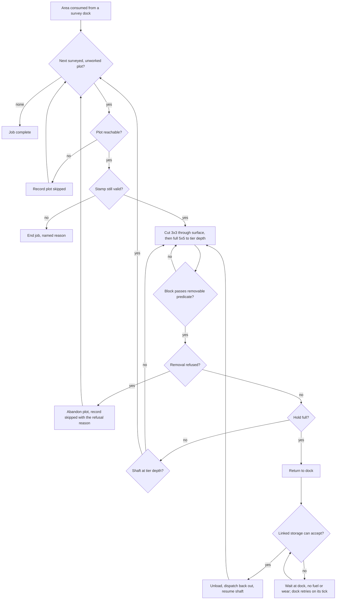
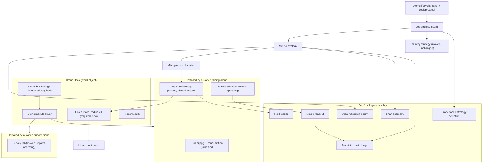
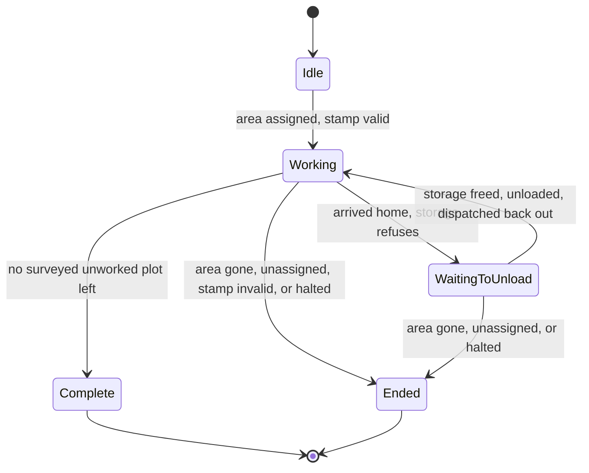

# Mining Drone - Plan

## Goal Capsule

- **Objective.** A mining drone that a Drone Dock dispatches to a surveyed Drone Area published by a survey dock, working it plot by plot: opening a 3x3 shaft at the surface, hollowing the full 5x5 plot beneath it to the depth its tier reaches, and hauling everything it breaks home into storage linked to the dock.
- **Product authority.** This plan owns area-assigned mining, the survey-to-mining data path it depends on, and the slotted-drone visibility rule for both dock tabs. Choosing *what* to mine — the material whitelist and everything hanging off it — plus backfilling and the fence pass are named in How This Work Fits Together and are not active scope.
- **Authority hierarchy.** Product behaviour is owned by the R-IDs; implementation mechanism is owned by the KTD-IDs within the constraints of the Rs they cite. A unit overrides neither. Key Decisions and Acceptance Examples illustrate and govern; they do not amend.
- **Execution profile.** Decision logic is written test-first in the Eco-free `AdvancedElectronics.Navigation` assembly. Eco-coupled glue carries no unit tests and is proven in one batched live deploy, per `docs/solutions/workflow-issues/eco-mod-batched-live-testing.md`.
- **Stop conditions.** Stop and ask rather than guess when: the engine refuses to let a mod construct an authorized removal carrying an offline citizen (KTD1 is then invalid); the dock's link radius cannot reach enough storage to make unattended running real (A8); the excavation tag cannot be applied to a mod-owned item (U4's fallback applies and R20 slips); or live testing shows a worked plot leaves unstable or unreachable ground.
- **Tail ownership.** Standalone `ce-work` owns branch, commits, and PR. There is no CI gate for this repo — `dotnet test` plus a batched live deploy is the whole verification surface.
- **Before U14.** U14 refactors `DroneLifecycle`, which is the mod's most valuable and least reversible code. Commit a clean tree before starting it.

---

## Product Contract

**Product Contract preservation.** Changed, with the user's confirmation across this planning session and an interactive review pass:

- R14 — corrected. Its text said the block test keys on minable and excavatable "not on the absence of block forms", which contradicted its own unit and would have let the drone remove a wall built from minable stone. The engine tests block forms *first*, so the requirement now states the full predicate in the engine's precedence order.
- R26 — corrected twice. The requirement first named the Store as an extended-radius precedent, then wrongly demoted it. The Store does initialize its link above the default; the radius is now 20 with the Store and waste sorters named.
- R27, R33, R34, R39, R40, R41 — reshaped by the review. The retry mechanism, the stamp's grain, the plant rule, the access level, and the survey-freshness mechanism all changed once the engine behaviour behind them was checked.
- R44, R45 — added, user-directed. The survey tab gains the same slotted-drone visibility rule the Mining tab has, which pulls previously-deferred work into scope and forces the dock's operating state off the survey component.
- R35 through R38, R42, R43 — added. These are the invariants that keep the authorization control from being disabled by a one-line slip, plus the emergency halt and the storage-beneficiary rule.
- A2, A4, A5, A8, A11, A12 — corrected against the engine source.
- Outstanding Questions — the deferred questions that had answers now carry them; three open items remain.

Everything else is unchanged in meaning and ID.

### Summary

Give the Drone Dock a second job. A survey dock draws and surveys a Drone Area; a mining dock then consumes that area and turns it into worked ground — travelling to each surveyed plot, cutting a 3x3 opening through the surface, removing the whole 5x5 below it down to its tier depth, keeping everything it breaks, and emptying into linked storage each time it comes home. It reuses the survey drone's area, assignment, and traversal machinery rather than growing a parallel system.

### Problem Frame

The survey drone answers where the material is and then stops. A player reading its findings still has to go dig, which puts a human back in the loop at exactly the point the mod exists to remove one.

This delivery removes the digging and the translation step with it: a mining dock reads the survey dock's own area rather than making the player redraw it by hand. What it does not remove is choosing *what* comes out — the drone takes everything in the shaft, because the material whitelist is deferred.

The setting shapes what "enough" means here. This is end-game content for a late-season server, where most players have gone quiet or burned out and the scarce input is labor, not ore. A machine that converts electricity into materials without a human is filling a hole rather than flooding a market. Speed is therefore not the value; running unattended is. That reframes the failure mode: a drone that halts and waits for a player to empty it has not mined slowly, it has stopped being a drone.

The pace of unattended running is set by the storage a player provisions. Keeping every block means a plot yields about 359 blocks and a full forty-plot area about 14,400 — between roughly 14,000 and 57,000 items depending on the mix of rock and soil. The drone never gives up when storage fills, but it makes no progress until space appears, so unattended running lasts exactly one storage-fill; after that, clearing linked storage by hand is a recurring cost for every subsequent fill and every subsequent area. Backfilling is the deferred work that removes that chore rather than merely reducing it, which is what makes it the most valuable of the deferred areas.

Unattended and irreversible is a combination that raises the stakes on being wrong. A player digging by hand who strays onto a neighbour's deed is stopped by the game and noticed by the neighbour. A drone doing it runs for hours while nobody is online, and nothing it removes can be put back. That is why the authorization requirements in this plan are stated as invariants a reviewer can check rather than as intentions.

### Key Decisions

- KD1. **Area-assigned mining only; material targeting is a separate delivery.** (session-settled: user-directed — chosen over shipping both at once: gets a working mining drone out soonest, and the targeting layer's requirements are guesses until the mining loop is real.) Governs R10, R11, R12, R17.
- KD2. **One area type for both drones, renamed "Drone Area" in player-facing text only.** (session-settled: user-directed — chosen over a separate Mining Area entity: mining inherits a proven system and nothing persisted has to migrate.) Governs R1, R4.
- KD3. **The v1 drone keeps every block it breaks.** (session-settled: user-directed — chosen over an ore-only or backfilling drone: "unwanted" has no meaning until a whitelist exists, so backfill belongs with the layer that defines it.) Governs R15, R24.
- KD4. **Shaft depth is a drone-tier property with no player control.** (session-settled: user-directed — chosen over a player-set target depth: keeps depth on the progression track and leaves nothing to misconfigure.) Governs R12.
- KD5. **The hold is narrated as the drone's and unloads only on arrival home.** (session-settled: user-directed — chosen over the dock owning cargo or the drone unloading remotely: keeps the same fiction fuel already uses, where the dock hosts what the player is told is the drone's.) Governs R23, R24, R25.
- KD6. **Fuel and drone wear are the entire cost of mined material.** (session-settled: user-directed — chosen over a yield penalty or a skill gate: out-producing a mining crew is the intended outcome on a thin late-season server, not a balance failure.) Governs R15, R28.
- KD7. **A separate Mining tab, present only while a mining drone is slotted.** (session-settled: user-directed — chosen over one tab whose meaning changes with the drone: it gets its own row budget instead of fighting the survey rows.) Governs R29, R30, R31.
- KD8. **Authorization is judged per position and covers settlement law, not just property.** (session-settled: user-directed — chosen over one check for the whole area: a drone that routes around deeds or civics would be the mod's worst possible bug.) Governs R21.
- KD9. **The drone filters blocks before submitting, so built blocks are left standing.** (session-settled: user-directed on the outcome, user-approved on the mechanism — chosen over widening the permission test to cover deconstruction: restricting what the drone touches closes the structure-demolition hole more simply than authorizing it to do more. The engine picks the removal action from the block type, so the restriction only holds as a pre-submission test, not as an intent.) Governs R14.
- KD10. **The authorization subject is the citizen who assigned the area.** (session-settled: user-directed — chosen over the dock's current owner and over the ownership snapshot taken when the drone was slotted: the citizen who issued the order is the one accountable for it. The stamp is taken at assignment, which happens after the dock is already placed under its owner, and reassignment re-stamps it.) Governs R18, R19, R33, R40, R43.
- KD11. **Yield is the flat vanilla rate — four items per minable block, one per excavatable block.** (session-settled: user-directed — chosen over committing to a single rate or reproducing a randomised draw: the flat rates are what the game actually grants, unaffected by tool, vehicle tool, or talent.) Governs R15.
- KD12. **The hold does not travel between docks.** (session-settled: user-directed — chosen over building inventory persistence across removal: the drone must be emptied before it can be taken out, mirroring the rule fuel already enforces, which keeps new engine work out of this delivery.) Governs R23.
- KD13. **The 3x3 restriction applies at the surface layer only; everything below is mined to the full plot width.** (session-settled: user-directed — chosen over a uniform 3x3 shaft: the narrow opening exists to leave a rim for a later fence, and there is no reason to leave material standing underground.) Governs R11.
- KD14. **Full storage never stops the dock; the drone waits at home and keeps trying to unload, at no running cost.** (session-settled: user-directed — chosen over adding a storage stop reason: this is how a crafting table's work order already behaves when its output is full. A waiting drone is not working, so it burns no fuel and accrues no wear, which is what keeps the wait genuinely indefinite instead of ending in an empty tank.) Governs R27.
- KD15. **Only a dock holding a survey drone may draw or edit Drone Areas; a mining dock consumes one.** (session-settled: user-directed — chosen over letting both dock kinds edit a shared area, and over holding two drones in one dock: authoring belongs to the drone that produces the data, and a mining dock that never redraws cannot collide with the area type's clear-on-edit behaviour. The two-drone dock was considered and rejected because every new drone kind would reopen the question of how many of which kinds a dock holds.) Governs R2, R3, R6.
- KD16. **A plot must be surveyed before it can be mined, and re-mined only after a fresh survey.** (session-settled: user-directed — chosen over leaving mining ungated: it is what protects irreversible work from being repeated, and consuming a survey dock's area removes the obstacle that originally deferred it.) Governs R8, R9, R41.
- KD17. **Both dock tabs are lent by their drone and appear only while it is slotted; the dock's operating state comes from whichever tab is installed.** (session-settled: user-directed — chosen over leaving the survey tab's visibility rule deferred: hiding that tab is what forces the operating role off it, and the two changes cannot ship apart without a release where a mining drone silently burns no fuel.) Governs R29, R44, R45.
- KD18. **A plant over removed ground is destroyed and yields nothing.** (session-settled: user-directed — chosen over capturing the plant's yield into the hold: digging out the block beneath a plant is not harvesting, so no plant items are produced and no yield is calculated. A law against harvesting still applies to the action, which is why the action is still raised.) Governs R34.

<!-- ce-section: work-relationships -->
### How This Work Fits Together

This plan owns **area-assigned mining**, the survey-to-mining data path the survey gate depends on, and the slotted-drone visibility rule for both tabs. The breakdown below is how the surrounding work is understood today, not a committed roadmap; a later plan may revise, split, merge, or discard any of it.

- **Material whitelist and targeting** — the player names which materials are wanted, and the drone chooses which permitted areas to work.
  - Depends on this plan: there is no mining loop to filter until one exists.
  - Enables the deferred stop-early rule (a shaft ends when the wanted material runs out) and include/exclude across areas.
- **Backfilling unwanted spoil** — returning what the whitelist rejects to the pit.
  - Depends on the whitelist: "unwanted" is undefined without it.
  - The highest-value deferred area, because it is what converts a machine that runs for one storage-fill into one that runs unattended.
  - Still to decide: this splits in two. Diggable material such as dirt goes back as itself, while rock has no placeable form and must first be converted to its crushed form, the transformation dynamite already performs.
- **Fence pass on the rim** — placing a barrier on the one-block margin this plan leaves, so vehicles cannot fall into a worked plot.
  - Depends on this plan: the rim only exists once shafts do.
- **The harvester drone** — a third drone against the same dock, already stubbed.
  - Inherits two things this plan builds: the job-strategy seam (KTD3) and the cargo hold. The removal service is deliberately *not* on that list — KTD15 scopes it to mining, and the harvester's own plan decides whether to extract a shared one.
  - Also inherits the tab-visibility rule, so its tab appears only while it is slotted.

### Key Flows

- F1. Working a consumed area
  - **Trigger:** A mining drone is slotted, the dock is assigned an area published by a survey dock, and the dock is serviceable.
  - **Steps:** The drone selects a surveyed, unworked plot in the area; it travels there, and an unreachable plot is recorded as skipped; on arrival it re-checks the stamp; it cuts the centre 3x3 through the plot's surface and removes the full 5x5 beneath, down to tier depth, testing each block and submitting a removal only for ground that passes the removable predicate; it moves to the next plot.
  - **Outcome:** Every surveyed plot in the area is either worked or recorded as skipped, with the skip reason known.
  - **Covered by:** R3, R8, R10, R11, R12, R13, R14, R15, R17, R18, R19, R21, R22, R31, R33, R34, R35, R36, R38
- F2. Coming home to unload
  - **Trigger:** The hold fills while the drone is working a plot.
  - **Steps:** The drone returns to the dock; on arrival at the dock — not on proximity — the hold's contents move into storage linked to the dock and resolved through the stamped citizen; the drone is dispatched back out to the plot it left and resumes from where it stopped. If no linked storage will accept the load, the drone waits at the dock and the dock keeps retrying on its own tick, at no running cost, rather than ending the job.
  - **Outcome:** The hold is empty and the shaft continues, with no player action.
  - **Covered by:** R23, R24, R25, R26, R27, R43
- F3. Ending a job before it finishes
  - **Trigger:** The player unassigns the area; the survey dock that owns the area is picked up; the assigning citizen loses access to the mining dock or to the source survey dock; or an administrator halts mining.
  - **Steps:** The job ends and the drone returns home; the worked-and-skipped record and the hold are left intact; the panel names which cause ended it.
  - **Outcome:** No further ground is removed, and nothing already gathered is lost.
  - **Covered by:** R6, R7, R33, R39, R42



### Requirements

**Area authoring and assignment**

- R1. Areas are called Drone Areas in every player-facing surface, both tabs included, sourced from one shared display name; the rename does not extend to code or persisted names, so no save migration is required.
- R2. Only a dock holding a survey drone may draw or edit a Drone Area.
- R3. A mining dock works an area published by a survey dock and never draws or edits one itself.
- R4. The existing area limits apply unchanged — ten areas per dock, forty plots per area.
- R5. A mining dock has one assigned area at a time.
- R6. A mining job ends with a named reason when the area it consumes is confirmed gone, which is what happens when the survey dock that owns it is picked up. A reference that merely fails to resolve on a given tick is not confirmation and does not end the job.
- R7. Unassigning the area ends the job in progress, leaving the worked-and-skipped record and the hold intact.
- R39. A mining dock may select an area only from a survey dock on which the assigning citizen holds the access level named in R40, and the selection control offers only such docks. Losing that access ends the job with a named reason.

**Survey gate**

- R8. A plot may not be mined until it has been surveyed.
- R9. A plot that has been mined becomes mineable again only after a new survey of it.
- R41. Each plot carries two persisted stamps from one monotonic counter: when it was last surveyed, and when it was last mined. A plot is mineable when its surveyed stamp is newer than its mined stamp. Both survive a server restart, and an absent stamp reads as never — so an unsurveyed plot is never mineable and no migration is required.

**Mining behaviour**

- R10. The drone works the area one plot at a time, travelling between plots, in the same discrete manner the survey drone already uses.
- R11. In each plot the drone removes the centre 3x3 columns of the surface layer — each column's own topmost block, since terrain is not flat — and the full 5x5 of the plot everywhere below that.
- R12. Shaft depth is fixed by the slotted drone's tier and is not player-configurable; the v1 tier reaches 15 blocks, matching the survey drone's sensor reach.
- R13. A plot the drone cannot reach is skipped and the job continues, never stalling.
- R14. The drone tests each block before acting and submits a removal only for ground that passes this predicate, evaluated in this order: the block is not form-bearing, not tree debris, not empty, not a world-object block, not contained inside another world object, not blocked by tree roots, not a ramp — and then is minable or excavatable. Form-bearing wins over minable, which is what keeps a wall built from minable stone standing. A block failing the predicate raises no action at all, and removals are never routed through a helper that selects the action from the block type.
- R15. A broken block yields the flat vanilla rate: four items for a minable block, one for an excavatable block, unaffected by tool, vehicle tool, or talent, and with no drone-specific modifier.
- R16. A plot already cut to full depth is recorded as worked without being dug again.
- R17. A job is complete when every surveyed plot in the area has been worked or recorded as skipped.
- R34. A plant standing in the block above removed ground is destroyed and produces nothing. Digging out the block beneath a plant is not harvesting, so no plant item is granted and no yield is calculated. The engine's plant action is still raised so a law governing it still applies — a settlement that forbids the action stops the drone exactly as it stops a citizen.
- R38. A block is re-read and re-tested against R14's predicate immediately before its removal is performed, and the removal fails if the block changed after it was classified.

**Authorization**

- R18. The authorization subject is the citizen who made the current assignment, stamped when the area is assigned and re-stamped on every reassignment.
- R19. Each block removal is submitted through the game's action pipeline and abandoned if the pipeline refuses it, carrying that citizen and a mod-owned mining-arm tool bearing the same excavation tag vanilla mining tools carry. The submission raises the same action set a citizen digging by hand raises — the dig-or-mine action and the block-pickup action the engine adds for every removed block.
- R20. The mining arm is registered as an item a law editor offers under the excavation tag. Enforcement equivalence with a citizen digging by hand holds for laws, taxes, and records keyed on the citizen, the action, the block, or the location; a law that enumerates specific tools does not match the arm until a curator adds it, and a law with no tool filter applies unchanged.
- R21. Authorization is evaluated at each position rather than once per area, and covers settlement law as well as private-property authorization. This is the primary control; every other authorization requirement is defence in depth around it.
- R22. A plot abandoned part-way records the refusal reason the pipeline actually returned, rather than assuming authorization was lost.
- R33. The assignment's citizen stamp is re-checked when the drone arrives at each plot. A job whose stamped citizen no longer holds the R40 access level on the mining dock ends with a named reason instead of continuing on the stale stamp.
- R35. A removal is submitted with no pack flags set, with no action in the pack waiving authorization, with the engine's own action types rather than derived or mod-defined ones, without overriding any action's declared access level, performed rather than previewed, and carrying one dig-or-mine action — with its own position — for every position the pack deletes.
- R36. A removal refuses itself if any action in its pack carries no citizen, or if the pack's authorized-action count does not equal the number of positions it would delete. The engine treats a citizen-less action as automated and authorizes it unchecked, and it authorizes actions rather than deletions, so the mod fails closed on both counts where the engine fails open.
- R37. A citizen with a permission-ignoring tool selected may not be stamped, and a job whose stamped citizen has one selected ends with a named reason. Such a citizen is authorized on every deed in the world, and unlike a player at a keyboard a stamped citizen carries that state while offline and unattended.
- R40. The stamp is taken from the acting player the engine supplies to the assignment call. No client-writable member carries a citizen, and one access level — full access, the level the dig-or-mine action itself declares — gates the assignment call, R33's re-check, and R39's source-dock filter.
- R42. An administrator can halt every mining job on the server without a release. The halt is persisted, survives a restart, and is checked before every dispatch and every plot arrival. This is a safety control over irreversible terrain change, not the balance lever KD6 rejected.

**Cargo and unloading**

- R23. The hold belongs to the drone, and the drone cannot be removed from a dock while the hold holds anything — the same rule the fuel tank already enforces.
- R24. The drone returns to the dock when its hold fills, and is dispatched back out to resume the shaft it left afterwards. A drone sitting at the dock with an unfinished job is a dispatch condition, not a terminal state.
- R25. The hold's contents move into storage linked to the dock, and only on arrival at the dock — never on proximity and never while the drone is away.
- R26. The Drone Dock gains a link surface of its own with a connection radius of 20 blocks rather than the engine's default of 9, so enough storage to absorb an area's output can be reached. Twenty is the vanilla Store's radius, shared with the waste sorters, and is the largest any vanilla object takes.
- R27. When no linked storage will accept the load — including when none is linked at all — the drone keeps the material and waits at the dock while the dock retries on its own throttled tick, the way a crafting table's work order holds its output. A waiting drone is not working: it burns no fuel and accrues no wear. Linking a container or freeing space in an existing one is the recovery, and the panel says so. Full storage is never a stop reason.
- R43. Linked storage is resolved through the stamped citizen, so the party accountable for a removal is the party who receives it.

**Running costs**

- R28. Mining burns Electric Fuel on the same terms as surveying, and the existing rules for recall and for a return leg always being possible apply unchanged to a laden drone.

**Dock panel**

- R29. Each dock tab is present only while its own drone is slotted, delivered as one of the components that drone installs — the Mining tab with a mining drone, the Survey tab with a survey drone.
- R44. A dock holding a mining drone shows no Survey tab, and a dock holding a survey drone shows no Mining tab. A dock holding neither shows neither.
- R45. The dock reports itself as operating from whichever drone tab is installed, so fuel and wear are driven by the slotted drone's own tab rather than by one drone kind's tab being permanently present.
- R30. The Mining tab carries the assigned area and the survey dock it came from, the stamped citizen by name, a job status covering at least working, waiting to unload, and complete, the current stop reason directly beneath that status, job progress, and the remaining headroom in linked storage.
- R31. Progress distinguishes plots worked from plots skipped, and surfaces skip reasons as one composed line rather than a row per category, across a fixed set: unreachable, not authorized by property, not authorized by settlement law, obstructed, and other. "Obstructed" means the drone reached the plot but the ground would not come out — a block the predicate rejects or a pretest failure. "Other" is the explicit fallback for a refusal that matches no known category, so the counts always sum.

**Shipping**

- R32. Shipping restores the mining drone's recipe registration, which is withheld today only because the drone has no mining behaviour.

### Acceptance Examples

- AE1. Hold fills mid-shaft
  - **Covers R24, R25.**
  - **Given** the drone is partway down a shaft and its hold fills,
  - **When** it returns to the dock and the linked storage accepts the load,
  - **Then** the hold empties, the drone is dispatched back out, and it resumes the same shaft at the depth it left, with no player action and no restart of the plot.
- AE2. Nowhere to put the material
  - **Covers R27, R30.**
  - **Given** a dock whose linked stores are all full, or which has no linked storage at all,
  - **When** the drone arrives home with a full hold,
  - **Then** the load stays in the hold, the drone waits while the dock keeps retrying on its tick, it burns no fuel and accrues no wear, the panel shows it waiting and names linking or freeing storage as the fix directly beneath the status, and the shaft resumes on its own once a store can accept.
- AE3. A plot the assigning citizen may not mine
  - **Covers R18, R21, R31.**
  - **Given** an assigned area whose plots include one under a settlement law forbidding mining,
  - **When** the drone reaches that plot in sequence,
  - **Then** the plot is skipped, the job continues to the next plot, and the composed skip line counts it under settlement law.
- AE4. Area of entirely off-limits plots
  - **Covers R17, R30, R31.**
  - **Given** an assigned area where no plot passes the authorization test,
  - **When** the job runs to its end,
  - **Then** the status reads complete while progress shows zero plots worked and every plot skipped, so the outcome is legible as a finished but unproductive run rather than one still under way.
- AE5. A player's wall stands inside the area
  - **Covers R14.**
  - **Given** a plot containing a wall built from minable stone within the shaft footprint,
  - **When** the drone works that plot,
  - **Then** no removal is submitted for the wall's blocks at all, and the wall is left standing while the natural ground around and beneath it is removed — the wall's material being minable does not matter, because it is form-bearing.
- AE6. An unsurveyed plot inside the area
  - **Covers R8, R31, R41.**
  - **Given** an area the survey drone has only partly swept,
  - **When** the mining drone works it, including after a server restart mid-area,
  - **Then** only surveyed plots are mined and unsurveyed ones are left untouched until a survey covers them.
- AE7. The survey dock is removed mid-job
  - **Covers R6.**
  - **Given** a mining job running against an area published by a survey dock,
  - **When** that survey dock is picked up and its areas are destroyed,
  - **Then** the mining job ends with a reason naming the lost area, the drone returns home, and the hold's contents are kept.
- AE8. The dock changes hands mid-job
  - **Covers R33.**
  - **Given** a running job whose stamped citizen has since lost access to the mining dock,
  - **When** the drone next arrives at a plot,
  - **Then** the job ends with a reason naming the lost access, the drone returns home, and no block is removed under the stale stamp.
- AE9. Ground under a crop
  - **Covers R34.**
  - **Given** a surface block inside the shaft footprint with a plant growing in the block above it, on ground the citizen may mine,
  - **When** the drone removes that block,
  - **Then** the plant is destroyed, the hold receives the block's own yield and no plant item, and where a settlement law forbids the plant action the removal is refused instead.
- AE10. Deed access revoked mid-job without touching the dock
  - **Covers R21.**
  - **Given** a running job whose stamped citizen is removed from a deed inside the assigned area, with no change to the mining dock,
  - **When** the drone next submits a removal on that deed,
  - **Then** that removal is refused, the plot is abandoned and counted under property, and the job continues to plots the citizen may still mine.
- AE11. A block appears where the drone was about to dig
  - **Covers R38.**
  - **Given** a plot the drone is actively shafting,
  - **When** a player places a block into a position the drone has already classified but not yet removed,
  - **Then** the removal fails rather than deleting the new block, and the new block is left standing.
- AE12. Swapping drones swaps tabs
  - **Covers R29, R44, R45.**
  - **Given** a dock holding a survey drone,
  - **When** the survey drone is withdrawn and a mining drone slotted in its place,
  - **Then** the Survey tab disappears, the Mining tab appears, and the dock still burns fuel while the mining drone works.

### Scope Boundaries

Deferred for later:

- The material whitelist that decides which materials are wanted, and the include/exclude of areas that goes with it.
- Backfilling unwanted spoil, and crushing rock into a placeable form so it can be backfilled at all.
- Ending a shaft early once the wanted material has run out.
- Placing a fence on the rim a worked plot leaves behind.
- Any curator-facing lever over drone *output*. None ships here, so the only response to a balance complaint is a new release. R42's halt is deliberately not that lever: it stops mining entirely and tunes nothing, and it exists because the terrain change is irreversible and the authorization path cannot be unit-tested.

Accepted for this delivery:

- A worked plot is permanent and unguarded: no backfill and no rim fence ship here, so the terrain change cannot be reversed from inside the mod.
- Natural ground beneath a standing structure is removed. The drone never deconstructs anything, but a build can be left over a void, so the protection is "the drone does not demolish", not "builds are unaffected".
- Plants over worked ground are destroyed and yield nothing (KD18). A player who plants over ore loses the crop and gets no compensating item.
- Drone removals count toward contracts and work parties, because the engine passes every performed action through them. A player can have a drone fulfil a paid mining contract while offline.
- Drone removals raise the world's player-activity signal at the worked position. Batching keeps this to roughly one signal per shaft layer, but the signal is real.

#### Deferred to Follow-Up Work

- Giving the mining arm its own animation state on the drone prefab. The Unity-side work is independent of the server behaviour this plan lands, and the arm defect already in flight is separate work this plan neither owns nor waits on.
- Writing a mining-drone manual protocol under `docs/protocols/`, following the shape of the survey-drone protocol.
- Moving the harvest drone off its inherited ore-sensor requirement. U14 makes job selection explicit, which exposes that the harvest drone currently runs surveys; fixing it belongs with the harvester's own delivery.

### Dependencies / Assumptions

- A1. A world object can push material out into storage linked to it, with no player present. Verified: the link component exposes linked-inventory resolution taking an alias rather than a player session, and the vanilla sorting, recycling, and filtering components all add items into linked containers resolved through an alias. R25 and R43 rest on this. The Drone Dock has no link surface of its own today — only the mod's assembly object does — which is why R26 exists.
- A2. R18 through R22 rest on the engine's dig-or-mine game action. It carries a single action location from which the deed and the settlement scope are derived; the plot-list contract belongs to sibling actions such as the explosion and deconstruct actions. The per-position rule in R21 is met by authorizing each position rather than by handing the action a list of plots. Verified. A mod plot and an engine property plot are both 5 blocks on a side and share an origin, so one plot cannot straddle two deeds — which is what makes plot-level abandonment in R22 coherent.
- A3. A broken block's item conversion is reachable without a player context, and grants four items for a minable block and one otherwise. Verified against the engine's own removal helper, where the minable count is the engine's rubble-per-block constant. Also verified: a refused inventory add fails the pack before the block is deleted, so a full hold cannot silently destroy material. Underpins R15.
- A4. Block removal can be driven with no player at the controls, but not through any engine path that takes a multiblock context. Those paths derive the acting citizen from an online player session, and the engine's authorization manager returns success immediately for an action with no citizen. **Property authorization is therefore bypassed totally.** Settlement law is not bypassed the same way — laws are selected from the action's location, so a law with no citizen-keyed condition still fires; only law conditions that test the citizen degrade. The property half is the hole, and it is complete. The citizen must instead be set directly, which the engine permits: the action-filling helper has a public overload taking a citizen rather than a session, and the pack's action, post-effect, change-set, and perform entry points are all public. Verified. KTD1 is the consequence, and R35 and R36 are the invariants that keep it.
- A5. A world object can hold a pending push and retry without any stop state. Verified with a correction: a vanilla work order does auto-deposit into linked inventories with no player present and holds its output when they refuse — but it retries from its own periodic update, not from the link component's change event. That event fires only when a container is linked, unlinked, or has its input/output flag toggled, never when a linked container's contents change. R27 therefore retries from the dock's tick, which is the same surface that already refreshes the panel.
- A6. The unsupported lip left by hollowing the full plot width beneath a 3x3 surface opening is stable. Verified: no block-support, stability, or collapse system exists in the engine, so the deferred fence pass has no collapse risk to design around. Underpins R11.
- A7. The late-season thesis behind KD6: on a server where players have mostly gone quiet, labor is scarcer than ore, so a machine that out-produces a mining crew helps the economy. The falsifier is observable: curator or player reports that ore prices have collapsed, that mining work has become pointless, or that bulk stone and soil are saturating storage and local trade on a populated server — watched through the curator-sentiment channel `STRATEGY.md` already names. Three further signals belong on that watch list, each a consequence of R36 making the drone look like a citizen: contracts and work parties being fulfilled by drone, the player-activity layer reading as occupied where nobody is, and statistics tables growing by roughly 14,400 rows per area. The spoil signal matters as much as the ore one, because with no whitelist this version's dominant output is stone and dirt. Because no output lever ships, the only available response is a new release carrying the yield dial that was considered and rejected here.
- A8. One area's output must fit in storage linkable from the dock. Unmeasured, and the plan's largest open risk. Note the reach is the **sum** of both objects' radii, not the dock's alone: at 20, the dock links a storage chest (5) at 25 blocks and a lumber stockpile (16) at 36. Live testing measures reachable container count on that basis, recording which container types were used, against the 14,000–57,000 item range a full area produces. If it falls short, the indefinite wait becomes the normal end of every job rather than an edge case.
- A9. A settlement law that enumerates specific tools will not match the mining arm until a curator adds it, because tool filters match by exact item membership and the excavation tag only governs what the law editor offers. R20 states the consequence; operators with pre-existing mining laws must re-author them. **Unverified in one direction:** the law editor's tag filter was confirmed, but not the comparison performed at evaluation time. If evaluation matches by tag, existing mining laws apply to the drone on day one and A9 is wrong in the safe direction. Settle this before U4 ships, because it determines whether the untagged fallback is acceptable.
- A10. The vanilla vehicles that place diggable blocks back into the world establish a usable precedent for block placement. Relevant only to the deferred backfill work, recorded so the future session does not re-derive it.
- A11. Per-plot survey state has no persisted home today. The survey record that holds it is documented as session-scoped, is not saved, and skips a column it has already sampled — so it can neither survive a restart nor register a re-survey. R41 therefore requires new persisted state, and R8, R9, and AE6 all rest on it.
- A12. The dock's fuel burn is driven by whichever component reports the dock as operating. Today that is the survey tab, which is the dock's only such component. R44 removes it from a mining dock, so R45 moves the role onto each drone's own installed tab — the two cannot ship apart.
- A13. Calories and tool durability are never consumed by a drone removal, because both are reached only through an engine path the hand-built pack does not use. This is consistent with KD6 and is recorded so it is not later "fixed" into a bug that starves an offline citizen.

### Outstanding Questions

Deferred, non-blocking:

- Q1. Whether the hold's sixteen slots are the right pacing. KTD5 fixes the number and the arithmetic behind it, but the round-trip count it implies is a guess until a real area is worked; this is the first dial to move after live testing.
- Q2. Whether the mining arm should be excluded from the Ecopedia and from any crafting surface. It exists only to carry a tag into the action pipeline and is never held by a player, so a visible entry is noise — but hiding an item registered for law selection may also hide it from the law editor. Resolve by observation once the arm is registered.
- Q3. Whether the mod's plot quantization and the engine's disagree at the world wrap seam. The mod floors raw world coordinates while the engine wraps first. This is not an authorization hole — authorization wraps correctly — but an area spanning the seam could be accounted wrongly. U1 carries a test scenario for it; if it fails, the fix is a plot-accounting question, not a mining one.

---

## Planning Contract

### Key Technical Decisions

- KTD1. **Removals are submitted as a hand-built game action pack carrying the assigning citizen, not through any engine path that derives its citizen from a player session.** (session-settled: user-directed — chosen over the engine's one-call helper: that helper takes its citizen from an online player session, and an action with no citizen passes the engine's authorization manager unchecked. Unattended running is the product's whole point, so the helper's path would bypass every deed exactly when it matters.) Governs R14, R19, R21, R22, R34, R35, R36, R38, and instantiates KD8 and KD10. State the rule positively, because that is what a reviewer can check: *every action in the pack carries the stamped citizen, the pack is never constructed from a multiblock action context, and the pack's authorized-action count equals the positions it deletes.* The prohibition is broader than one helper — the pack-level extensions for block deletion and plant destruction take the same context and produce the same null citizen. The pack must also reproduce the action set the engine raises: the dig-or-mine action, the block-pickup action the engine adds for every removed block, and the plant action when a plant stands above. The cost is that the block-to-item conversion and the guard clauses become this mod's code rather than the engine's; A3, A4, and the Engine Reference record the constants and entry points that make that tractable.
- KTD2. **A mining dock stores the owning dock's identifier, the area id, and the area's change token, resolved fresh at every dispatch; mined state is a ledger the mining dock owns.** (session-settled: user-approved — chosen over copying the area's geometry and over a mod-wide registry: a registry violates the dock-owns-its-areas rule and recreates dangling references with worse failure modes, while a plain copy diverges on redraw. The token is the mod's existing divergence detector, already used to notice a redraw under a running survey, so carrying it makes a redraw invalidate a mining job the same way.) Governs R3, R6, R9, R39. Resolution has three outcomes, not two: resolved, unresolved this tick, and confirmed gone. Only the third ends the job (R6) — collapsing the middle case into it would turn every restart into a job silently ended with a false reason.
- KTD3. **Mining is a second job strategy behind a seam in the drone lifecycle, with survey moved behind that seam first and its behaviour unchanged.** (session-settled: user-approved — chosen over extending the park-and-sweep loop in place and over forking a parallel loop: extending in place makes one class hold two entangled job loops for three world-object types, while forking duplicates the return ladder, the dock-arrival test, serviceability recall, and animation — all expensive to get right and genuinely shared.) Governs R10, R13, R24, R29. **This is a cut, not a verbatim move** — the existing park-and-sweep method interleaves travel and parked work in one body, and the pieces land on opposite sides of the seam. The split:
  - The **lifecycle** keeps the "am I in the plot I was asked for" test, sending the drone to the plot centre, the take-off and work-exit holds, the arrival-attempt counter and its cap, the return ladder, serviceability recall, animation, and performing the return leg. It reports an arrival failure to the strategy as a skip outcome rather than the strategy counting attempts itself.
  - The **strategy** owns the plot list and its order, which plot is next or whether none remain, one tick's work at the parked plot, and what a plot outcome means.
  - The **contract** is four calls: next target or job-complete; do one tick's work here, returning still-working / plot-done / plot-failed-with-reason; you have arrived home, unload if you want; the job ended, here is why.
  - Strategy selection keys on the drone's declared tool, never on which component happens to be attached: the present dispatch is by component presence, which is why the harvest drone currently runs surveys.
- KTD4. **The cargo hold is a named storage installation built by a shared factory; the fuel components stay unnamed.** (session-settled: user-approved — chosen over an unnamed hold: the dock already carries an unnamed storage component for the drone slot, and component lookup matches on type and name together, so an unnamed hold would be indistinguishable from the drone bay. Naming is warranted here and only here — naming the fuel components would hide them from the engine's own unnamed lookup, which this mod has already been burned by.) Governs R23, R25. The name is one constant in one place rather than a literal inside the drone's own file, because the unloader matches on it and the harvester will declare a hold too.
- KTD5. **The hold is sixteen slots.** (session-settled: user-approved — chosen over a smaller hold: at typical block stack sizes this is roughly 400 to 500 items per trip, so a plot costs one to three round trips and a full area thirty to a hundred and twenty. A smaller hold turns the drone into a shuttle; a much larger one makes the trip home rare enough that the unload behaviour stops being exercised.) Governs R24. Q1 tracks this as the first dial to move.
- KTD6. **Everything that is a decision goes in the Eco-free assembly; only the calls that must touch Eco stay outside it.** (session-settled: user-approved — chosen over writing the loop inside the Eco-coupled lifecycle: the mod has no headless Eco test harness, so anything that touches Eco types cannot be unit-tested at all. The existing world-sampler and ore-reader interfaces are the established shape for this seam, and the existing readout type is the precedent for testing panel composition.) Governs R11, R12, R13, R16, R17, R22, R27, R30, R31. Five things belong on the pure side that a first cut would leave behind: the refusal-to-skip-category mapping, one hold ledger shared by the removal and unload paths, the Mining tab's row composition, the area-resolution policy, and the drone-tool type plus the strategy-selection function — the last of these specifically so U14's selection rule is testable at all.
- KTD7. **Plot and column arithmetic calls the mod's existing shared quantization function rather than a second implementation, and emits the existing position type.** (session-settled: user-approved — chosen over local arithmetic in the mining code: two quantization functions in different subsystems have already disagreed in this mod, each correct alone, invisible to per-file tests, and the failure only appeared at plot boundaries.) Governs R11.
- KTD8. **The mining drone drops the ore sensor it inherited from the survey drone.** (session-settled: user-directed — chosen over keeping it: R8 makes the mining drone consume another dock's findings, so a sensor of its own reads ground nobody asked about and costs a tick.) Governs R8. Removing a required component deletes it from every already-placed object at the next server load, which is the intended outcome here and is worth stating because the same mechanism is a hazard in the opposite direction.
- KTD9. **The citizen stamp is re-checked at each plot arrival against live dock access, not once per dispatch and not against stored access.** (session-settled: user-directed on the outcome, user-approved on the grain — chosen over trusting the stamp for the job's lifetime, and over clearing the assignment on any ownership change: a deed transfer that never touches the dock leaves the stamp valid-looking. Per-plot rather than per-dispatch because a dispatch covers up to forty plots and many hours, and a deed-accessor lookup is negligible against 359 removals.) Governs R33, R37, R40, and instantiates KD10.
- KTD10. **Job status is a new state machine alongside the existing travel state machine, with one-way coupling.** (session-settled: user-approved — chosen over extending the travel machine's states: its states already gate fuel, wear, animation, and drone withdrawal, so a mining-only state would force a mining branch into all of them, and the zero-cost wait in R27 is only expressible when the travel machine reads idle-at-dock while the job machine reads waiting-to-unload.) Governs R30. The arbitration rule: the travel machine is authoritative for where the drone is and whether it is under way, and alone gates fuel, wear, animation, and withdrawal; the job machine is authoritative for what the job has accomplished and why it stopped, and alone gates plot selection, the ledger, and the panel. The job machine observes travel events and never writes travel state. Unloading fires on the lifecycle's arrival-at-dock event, never on proximity, so the return ladder's teleport rung cannot trigger an unload while the drone still reads as unreachable. The job machine carries no travelling or returning state — the panel composes those from the travel machine.
- KTD11. **The dock's own tick drives the Mining tab's refresh and the unload retry, on the same throttle the survey tab already uses.** (session-settled: user-approved — chosen over the component's own tick and over an event-driven retry: a component's tick does not reliably fire on this dock, and the link component's change event fires on linking rather than on a container's contents changing, so an event-driven retry would never wake a waiting drone.) Governs R27, R30, R31.
- KTD12. **Survey freshness is two per-plot stamps from one monotonic counter, compared against each other.** (session-settled: user-approved — chosen over an area-wide survey pass: nothing could advance a pass, because the live survey record skips a column it has already sampled and clears only on an area edit. Two stamps need no pass to advance, and partial coverage falls out correctly because each plot carries its own.) Governs R8, R9, R41, and instantiates KD16. The surveyed stamp is written when a plot is swept and persisted on the area entry as a flattened snapshot, projected by the pass that already writes findings and reusing its empty-accumulator guard. The mined stamp is written when a plot is worked and persisted on the mining dock, which keeps the survey dock read-only.
- KTD13. **Each drone's installed tab reports the dock as operating, and the travel machine's working state is renamed to a job-neutral term.** (session-settled: user-directed on the move, user-approved on the rename — chosen over leaving the operating role on a permanently-present survey tab: R44 removes that tab from a mining dock, so the role has to travel with the drone. Each tab implementing it keeps the role next to the component that knows what its own drone is doing, at the cost of the same small implementation appearing twice.) Governs R28, R45. The rename's three consumers are the fuel and wear gate, the dock's animation push, and the animation projection. The drone-withdrawal restriction is **not** one of them — it keys on the idle state and is untouched.
- KTD14. **Removals are batched into one pack per shaft layer within a plot.** (session-settled: user-approved — chosen over one pack per block: a single-action pack skips the engine's law-selection memo by design, so per-block submission runs a full law scan roughly 14,400 times per area. One mod plot is exactly one engine property plot, so a layer's positions cannot straddle two deeds and batching stays deed-safe.) Governs R19, R21, R22, R35. Batching is what makes R35's one-action-per-deleted-position invariant load-bearing: the engine authorizes actions, not deletions, so a batch without that invariant would authorize one position and delete a layer. The trade the batch accepts: the engine fails a whole pack on the first refusal, so a batch reports the first failure rather than a per-position verdict — which matches R22's plot-level abandonment but must not be mistaken for per-position reporting. If the live pass shows a layer batch produces unusable refusal reasons, fall back to per-block and record the measured cost.
- KTD15. **The removal service is scoped and named for mining.** (session-settled: user-directed — chosen over a responsibility-shaped service built for a second caller: the harvester is deferred, mining is the only real consumer in this delivery, and committing an interface before a second consumer exists is a guess about requirements that do not exist yet. The harvester's own plan decides whether to extract a shared service, with this plan's authorization invariants as the thing it must not lose.) Governs R19.

### High-Level Technical Design

The diagrams below are authoritative alongside the prose. Where they disagree with a requirement, the requirement wins.

**Component topology.** What sits on the dock, and which pieces each drone lends it.



**Submitting one shaft layer.** The order matters: the block test happens before anything is constructed, the citizen and the action count are asserted before the pack is performed, and the engine runs laws and authorization before any pretest.

```mermaid
sequenceDiagram
  participant S as Mining strategy
  participant C as Block classifier
  participant R as Removal service
  participant E as Engine action pipeline
  participant H as Cargo hold

  S->>C: classify each position in the layer
  C-->>S: removable / not removable
  Note over S: not removable -> skip, raise nothing (R14)
  S->>R: remove(positions, stamped citizen)
  R->>R: build pack; per position add dig-or-mine + pickup, and plant action where one stands
  R->>R: fill each with citizen + arm; no flags, no auth waiver, no access override
  R->>R: assert every action carries a citizen and dig-action count equals positions (R36)
  R->>E: perform pack
  E->>E: laws
  E->>E: per-position deed auth
  E->>E: pretest re-reads each block; fails if changed (R38)
  alt refused
    E-->>R: refusal reason
    R-->>S: abandon plot, map reason to a skip category (R22)
  else allowed
    E->>H: add block yield; plant destroyed, no plant item (R34)
    E->>E: delete blocks
    E-->>R: success
    R-->>S: continue shaft
  end
```

**Job status.** What the Mining tab reports. Travel is not modelled here — the travel state machine owns it (KTD10).



`WaitingToUnload` is a job state, not a dock stop reason. The dock's stop-reason set is untouched, per R27 and KD14.

### System-Wide Impact

- **Every already-placed Drone Dock gains a link surface** when the required-component list changes, because that list is re-enforced on every server load, not only at construction. Existing docks acquire the link tab on the first restart after deploy without any migration step.
- **Every already-placed mining drone loses its ore sensor** by the same mechanism (KTD8). No data is lost — the mining drone never wrote findings.
- **The survey tab moves from a required component to one the survey drone installs** (R29, R44). At the next server load a dock with no survey drone slotted loses the tab. Its persisted members travel with the drone through the module driver's existing state capture, the same way fuel already does.
- **The travel state machine's working state is renamed** (KTD13), touching the fuel and wear gate, the dock's animation push, and the animation projection. Behaviour is unchanged; the name stops lying.
- **The survey drone's own loop moves behind the job-strategy seam** (KTD3, U14) without changing behaviour. This is the mod's most valuable path, so it moves on its own commit with the existing suite as the regression gate.
- **Per-plot survey and mined state become persisted** (KTD12). The area entry grows a flattened per-plot snapshot and the mining dock grows a mined ledger; nothing existing is rewritten and no migration is required, because an absent stamp reads as never — the safe direction.
- **Authorization records change shape.** Removals appear in law, tax, and statistics records under the assigning citizen with the mining arm as the tool. Curators with tool-enumerating mining laws must re-author them (A9), pending that assumption's open half.
- **Drone removals satisfy contracts and work parties,** because the engine passes every performed action through them. Recorded in Scope Boundaries as accepted; on A7's watch list.
- **Drone removals raise the world's player-activity signal** once per submitted pack — roughly one per shaft layer, about 600 per area under batching. Real but far smaller than the per-removal count; on A7's watch list.
- **Statistics tables grow by roughly one row per action,** on the order of 14,400 per area. This is the figure the activity estimate is often confused with; only this one counts every action.
- **Nothing in the survey path changes behaviourally.** The area type's clear-on-edit rule stays as it is, the survey loop moves without changing what it does, and the mined ledger lives on the mining dock precisely to keep the survey dock read-only.

### Risks & Dependencies

- **Storage reach may not match output (A8).** The highest-consequence unknown: if the reachable containers cannot hold tens of thousands of items, the indefinite wait becomes every job's ending and the product thesis fails. Measure this first in the live pass, before tuning anything else, and measure it as the sum of both radii.
- **The authorization control can be disabled by a one-line slip.** Five of them: setting a pack flag that forces the pack through, waiving authorization on any action in the pack (which waives it for the whole pack), using a derived action type (which matches zero laws while still passing property auth), building from a multiblock context (which reinstates the null citizen), and deleting more positions than the pack authorizes. R35 and R36 are the invariants; U5's static-review checklist is where they are actually checked, because no test can.
- **The hand-built removal path drops every guard clause the engine's helper carries.** Ramps, contained blocks, tree-root-blocked positions, world-object blocks, stacked resources, and fractional blocks are all special-cased inside the engine and are not reproduced. R14's predicate covers the guards; a missed case removes a block without granting its item. U3's scenarios name each one.
- **No test can prove the authorization path.** Nothing about deeds, laws, or the action pipeline is reachable from the Eco-free assembly, so AE3, AE5, AE8, AE9, AE10, and AE11 are live-only. They must be in the batched deploy's protocol, not discovered later.
- **U14 touches the mod's crown jewel, and the survey-tab move touches its most-used surface.** Both land on their own commits, behaviour-preserving, with the existing suite green before and after.
- **The mining arm's tag application has no in-repo precedent.** This mod filters *by* vanilla tags but has never applied one to a mod-owned item. U4 is the unit most likely to need a second attempt, which is why it is built first and carries a fallback — though A9's open half decides whether that fallback is safe.
- **Cross-dock references can dangle in more ways than pickup.** A deleted area, a redrawn area, and a load ordering where the owning dock is not yet registered are all resolution failures with different meanings. KTD2's three-outcome policy is what keeps a restart from ending a job with a false reason.

### Engine Reference

Facts established from the Eco 0.14 source during planning and confirmed by independent passes, recorded so the implementer does not re-derive them. Paths are in the vendored engine checkout, not this repo.

- The engine's block-removal helper chooses the action from the block type, in this order: form-bearing raises a deconstruct action, tree debris a cleanup action, and only then does minable or excavatable raise dig-or-mine. Form-bearing wins, which is why R14's predicate must exclude it rather than ignore it.
- **Outside that branch, the helper always adds a block-pickup action for every removed block**, commented in the engine as applying to all blocks. It is not the built-block case — it is the block becoming an item — so a player mining stone raises both actions, and a law written against block pickup applies to them. R19 reproduces it.
- The action-filling helper has two overloads. The context overload derives the citizen from the context's player session; the direct overload takes a citizen, a tool, a position, and an access type. Only the second is usable here.
- The authorization manager returns success immediately when the action's citizen is null. Law selection does **not** share this weakness — laws are selected from the action's location, so a location-scoped law still fires on a citizen-less action; only citizen-keyed law conditions degrade. This is why the settlement-law live test cannot detect the null-citizen and waived-authorization cases, and why the property test carries them.
- **The engine authorizes the actions in a pack, not the deletions.** Deletions ride in post-effects and inventory change-sets that are never authorization-checked, so a pack with fewer actions than deleted positions removes the difference unchecked. R35 and R36 close this.
- Waiving authorization on one action in a pack waives it for every action in the pack. Forcing a pack swallows law refusals, auth refusals, and pretests alike.
- Law selection is an exact type lookup with no base-type walk, so a derived action type matches no law while still passing property authorization.
- The dig-or-mine action's declared access level is full access. Leaving the access argument unset preserves it; supplying consumer access instead would let the drone mine wherever the citizen is merely a resident or a listed consumer — strictly more permissive than digging by hand. R40 names full access for the same reason.
- Order of evaluation inside a performed pack: laws first, then per-action authorization, then pretests, then post-effects. A refusal at any stage stops the whole pack.
- The change-set interface is public and its pretest is wired into the pack, which is the supported way to add the block-changed re-check the engine's own helper performs. The pack's pretest list itself is not accessible to a mod.
- A minable block grants the engine's rubble-per-block constant of four in items; everything else grants one. Supplying a destination inventory suppresses rubble spawning, and a refused inventory add fails the pack before the block is deleted.
- The plant in the block above a removed block is destroyed unconditionally by the engine's helper, with a construction death type rather than a harvest one. The engine still raises a plant action, so laws governing it apply. The only public yield calculator takes an online player and dereferences it unconditionally, which is one reason R34 grants no plant item — the other being that digging is not harvesting.
- A single-action pack deliberately skips the law-selection memo; only a pack with more than one action gets it.
- The engine raises the world player-activity layer **once per pack**, not once per action. Statistics recording is per action.
- The mod's plot length and the engine's property plot length are both 5, so one mod plot is exactly one property plot and cannot straddle two deeds.
- The link component's default connection radius is 9. The vanilla Store and the waste sorters initialize theirs at 20, which is the largest any vanilla object takes; the lumber stockpiles use 16. R26 takes 20.
- **Two linked objects connect when the distance is under the sum of their radii**, not the initiator's alone. A dock at 20 links a storage chest (5) at 25 and a lumber stockpile (16) at 36.
- The link component's linked-inventory change event fires when a container is linked, unlinked, or has its input/output flag toggled — **not** when a linked container's contents change. A work order's retry comes from its own periodic update, not from that event.
- Linked inventories are reachable through an alias rather than a player session, so a dock can resolve them with nobody online.
- Calories and tool durability are consumed only on an engine path the hand-built pack does not use, so neither applies to a drone removal.

### Sources / Research

- `EcoServerMod/AdvancedElectronics/MiningDrone.cs` — the mining drone item and world object already exist as clones of the survey drone: same mover, sensor, and lifecycle, plus the Electric Fuel supply and consumption components at 75 J/s. No mining behaviour, which is the only reason the recipe is currently commented out. The class comment at the cargo declaration records that a cargo hold must be a *named* component installation, because the dock already carries an unnamed public storage for the drone slot and component lookup matches on name. KTD4 follows it.
- `EcoServerMod/AdvancedElectronics/DroneModuleComponent.cs` — the driver that installs a slotted drone's declared components onto the dock and removes them on withdrawal, its all-or-nothing install with rollback, its state capture and restore across pickup, and the `DockStopReason` enum, which R27 deliberately does not extend. Its expected-components projection already yields every declared installation, so no separate declaration is needed. This is the mechanism R29 uses for both tabs. Its withdrawal restriction keys on the idle state, which is why KTD13 does not list it among the rename's consumers.
- `EcoServerMod/AdvancedElectronics/SurveyComponent.cs` — the template U9 follows and the component U15 converts. Two persisted members, every other displayed value a derived string rebuilt on refresh, one commit action declared last because RPC methods always render after properties, a readiness flag guarding every setter so deserialization does not replay them as clicks, and a refresh driven by the dock's tick. Its map-management call is also the precedent for R40: the engine supplies the acting player as a parameter, which a synced property setter never receives — and its assigned-position stepper is the precedent for browsing, which is why U9 splits browsing from committing.
- `EcoServerMod/AdvancedElectronics/DroneDock.cs` — the dock's required-component list, its dock-owned area storage with monotonic ids, the area change token the lifecycle polls to detect a redispatch, the world-object lookup that re-finds the spawned drone after a restart (which KTD2 reuses, and which exists precisely because a first-tick-after-load lookup can fail transiently), the readout refresh U7 and KTD11 hang the retry on, and the working-state gate that already makes fuel and wear exclude the return leg.
- `EcoServerMod/AdvancedElectronics/DroneLifecycle.cs` — the park-and-sweep method KTD3 cuts. Raster plot order, park at plot centre, a five-attempt arrival cap before a skip, the take-off hold on each hop, the per-tick column sweep, and the return-when-done call — interleaved in one body, which is what makes the cut a real split rather than a move. Also the return-escalation ladder and the animation push, which stay with the lifecycle.
- `EcoServerMod/AdvancedElectronics.Navigation/` — the Eco-free assembly and its established seam shape: plain interfaces over integer coordinates, with real implementations living on the Eco side and hand-rolled fakes in tests. `GridPathfinder`, `DroneStateMachine`, and `ReturnEscalation` are the models for U1, U2, and the return ladder R13 relies on; `DockReadout` is the precedent for testing panel composition, which is why U9's rows are composed on the pure side.
- `EcoServerMod/AdvancedElectronics.Navigation.Tests/` — references only the Eco-free assembly, which is why U10 and U13 are verified by the live pass alone and why KTD6 moves the drone-tool type across the boundary.
- `docs/solutions/conventions/requirecomponent-is-re-enforced-on-every-server-load.md` — why adding and removing required components has world-wide effects at the next load. Load-bearing twice here: the dock gains a link surface, and the survey tab stops being required.
- `docs/solutions/runtime-errors/naming-a-component-hides-it-from-its-vanilla-consumer.md` — the incident behind KTD4's "name the hold, not the fuel" split.
- `docs/solutions/conventions/serialized-needs-a-member-to-write-back-into.md` — the rule KTD12's new persisted stamps must satisfy.
- `docs/solutions/design-patterns/vertical-stack-only-ui-design.md` and `docs/solutions/runtime-errors/n-editable-members-cannot-share-one-field.md` — the row-budget rules U9 designs against, why a pool of controls over one field destroys that field, and the per-template row costs that make the tab's budget a real constraint rather than a count of fields.
- `docs/solutions/architecture-patterns/persist-derived-data-as-serialized-snapshot-on-its-owner.md` — the live-accumulator-plus-flat-snapshot pattern KTD12, U2, and U9 follow, including the rule that the snapshot resets on the owner's lifecycle events and never on reassignment.
- `docs/solutions/conventions/consistent-grid-column-quantization.md` — the incident behind KTD7, and the reason Q3's world-seam case is worth one test.
- `docs/solutions/workflow-issues/eco-mod-batched-live-testing.md` — the constraint the Verification Contract's live pass is shaped around.
- `docs/solutions/conventions/an-inventory-restriction-governs-one-verb.md` — why R23 uses the uninstall gate rather than a pickup restriction on the hold.
- `CONCEPTS.md` — Park-and-Sweep, Recall, Assignment, Module, Electric Fuel, Row Budget, Control Pool, Name Match. R10, R13, and R28 extend rules stated there rather than adding new ones, and the rule that a dock owns its areas outright is what R6 and KTD2 follow from.
- `STRATEGY.md` — the autonomy-over-gadgetry approach, the progression-depth track KD4 puts shaft depth on, and the curator-sentiment channel A7's falsifier is watched through.

---

## Implementation Units

Build order is **U4, U1, U2, U3, U14, U15, U6, U5, U7, U8, U12, U13, U9, U10, U11** — U4 leads because it is the unit most likely to fail and it gates the removal service; U14 and U15 land before any mining behaviour so their regression gate is the untouched survey suite; U6 precedes U5 because the removal service deposits into the hold.

| U-ID | Unit | Key files | Depends on |
|---|---|---|---|
| U1 | Shaft geometry | `AdvancedElectronics.Navigation/ShaftPlan.cs` | — |
| U2 | Job state and skip ledger | `AdvancedElectronics.Navigation/MiningJob.cs` | — |
| U3 | Block classification seam | `AdvancedElectronics.Navigation/IBlockClassifier.cs`, `AdvancedElectronics/EcoBlockClassifier.cs` | — |
| U4 | Mining arm tool item | `AdvancedElectronics/MiningArm.cs` | — |
| U5 | Mining removal service | `AdvancedElectronics/MiningRemovalService.cs` | U3, U4, U6 |
| U6 | Cargo hold installation | `AdvancedElectronics/DroneCargo.cs`, `AdvancedElectronics/MiningDrone.cs` | — |
| U7 | Dock link surface and unload | `AdvancedElectronics/DroneDock.cs`, `AdvancedElectronics.Navigation/HoldLedger.cs` | U2, U6 |
| U8 | Cross-dock reference and survey gate | `AdvancedElectronics/MiningAreaRef.cs`, `AdvancedElectronics/SurveyAreaEntry.cs` | — |
| U9 | Mining tab | `AdvancedElectronics/MiningComponent.cs`, `AdvancedElectronics.Navigation/MiningReadout.cs` | U2, U7, U8, U15 |
| U10 | Mining lifecycle wiring | `AdvancedElectronics/DroneLifecycle.cs` | U6, U7, U8, U12, U13, U14 |
| U11 | Drone cleanup and recipe | `AdvancedElectronics/MiningDrone.cs` | U10 |
| U12 | Assignment stamp, re-check, and halt | `AdvancedElectronics/DroneDock.cs` | U8 |
| U13 | Plot mining driver | `AdvancedElectronics/MiningStrategy.cs` | U1, U2, U3, U5 |
| U14 | Job strategy seam | `AdvancedElectronics/DroneLifecycle.cs`, `AdvancedElectronics/SurveyStrategy.cs`, `AdvancedElectronics.Navigation/DroneTool.cs` | — |
| U15 | Survey tab becomes drone-installed | `AdvancedElectronics/SurveyComponent.cs`, `AdvancedElectronics/SurveyDrone.cs`, `AdvancedElectronics/DroneDock.cs` | — |

### U1. Shaft geometry

**Goal:** Turn a plot into the ordered list of block positions a shaft removes, so nothing above does coordinate arithmetic itself.

**Requirements:** R11, R12, R16. Governed by KD13, KTD6, KTD7.

**Dependencies:** none.

**Files:**
- `EcoServerMod/AdvancedElectronics.Navigation/ShaftPlan.cs` (create)
- `EcoServerMod/AdvancedElectronics.Navigation.Tests/ShaftPlanTests.cs` (create)

**Approach:**
1. Take a plot coordinate, a tier depth, and the world sampler that already provides ground height; return an ordered sequence of the assembly's existing position type. Do not accept surface heights as an opaque caller argument — naming the sampler is what keeps R11's hardest policy question (what counts as a column's topmost block) on the tested side.
2. Emit the centre 3x3 columns' own topmost blocks first — each column uses its own surface height, since terrain is not flat.
3. Below the surface layer, emit the full 5x5 of the plot, descending, down to tier depth measured from each column's surface.
4. Group the output by layer, so U13 can submit one pack per layer (KTD14).
5. Expose a resume point so a shaft interrupted by an unload continues from where it stopped rather than restarting the plot.
6. Call the mod's existing shared quantization function for every plot-to-world conversion (KTD7). Do not add a second one, and do not introduce a second position struct.

**Patterns to follow:** `GridPathfinder.cs` for the pure-struct, no-Eco-types shape; `PlotCoord` in `SurveyArea.cs` for plot addressing.

**Test scenarios:**
- Flat plot at a uniform surface height emits exactly nine surface positions and the full 5x5 for each level beneath, down to fifteen.
- Stepped terrain where the nine centre columns have three different surface heights emits each column's own topmost block, not a single shared plane.
- The 5x5 below begins one block under each column's own surface, so a low column's second block and a high column's second block are at different world heights.
- The rim columns — the sixteen outside the centre 3x3 — contribute no surface-layer position, so the rim is left standing.
- Layer grouping yields no layer spanning two depths, and every emitted position appears in exactly one layer.
- A resume point taken mid-shaft yields exactly the remaining positions, in the same order, with no repeats and none skipped.
- A resume point taken at the last position yields an empty remainder.
- Total position count for a flat plot matches the plan's stated figure of about 359.
- A plot at the world wrap seam quantizes to the same plot the engine would choose (Q3). If this fails, record it and treat it as a plot-accounting defect rather than adjusting the mining code.

**Verification:** `ShaftPlanTests` pass and the flat-plot count matches the figure the Problem Frame quotes.

### U2. Job state and skip ledger

**Goal:** Own what the job has accomplished and why it stopped, so the panel and the strategy read one source rather than two.

**Requirements:** R13, R16, R17, R22, R31. Governed by KTD6, KTD10.

**Dependencies:** none.

**Files:**
- `EcoServerMod/AdvancedElectronics.Navigation/MiningJob.cs` (create)
- `EcoServerMod/AdvancedElectronics.Navigation.Tests/MiningJobTests.cs` (create)

**Approach:**
1. Model exactly the states in the job-status diagram: idle, working, waiting to unload, complete, ended. No travelling or returning state — the travel machine owns those and the panel composes them (KTD10).
2. Mutate only through named methods, with no public setter on the state — the existing state machine's shape.
3. Hold a per-plot outcome ledger: unworked, worked, or skipped with one of R31's five categories. Own plot selection here too: which surveyed, unworked, unskipped plot is next.
4. Carry a pure mapping from a refusal outcome to a skip category, with "other" as the defined fallback for an unrecognised refusal (R22, R31). This is the piece most likely to be got wrong once and never noticed, which is why it is on the tested side.
5. Expose worked and skipped counts and per-category skip counts, so U9 can compose them into one line.
6. Completion fires when no surveyed, unworked plot remains (R17) — including when every plot was skipped, which must read complete rather than still running (AE4).
7. Ending carries a reason distinct from completion, so F3's causes are each nameable.
8. Keep the ledger as a live accumulator; U9 owns projecting it to a persisted snapshot and rehydrating it on load.

**Execution note:** Write this state machine test-first. Its transitions are the contract three other units read, and AE4's "complete but unproductive" outcome is the case most likely to be got wrong by writing the implementation first.

**Test scenarios:**
- A fresh job with plots assigned starts idle and moves to working on dispatch.
- Finishing a plot marks it worked and offers the next unworked plot.
- A refused unload moves working to waiting-to-unload; a later successful unload returns to working.
- A job whose every plot is skipped reaches complete, reporting zero worked and every plot skipped (AE4).
- Each of the five skip categories is recorded and counted separately, and a plot skipped for one reason is not double-counted under another.
- The refusal mapping returns property for a property refusal, settlement law for a law refusal, obstructed for a pretest failure, and "other" for an unrecognised refusal — so the category counts always sum to the skipped count.
- A plot already recorded worked is not re-offered as the next plot (R16).
- A plot recorded skipped is not re-offered within the same job.
- Ending from working and from waiting-to-unload each preserves the ledger and carries the end reason.
- Re-marking an already-worked plot as worked is idempotent and does not inflate the count.

**Verification:** `MiningJobTests` pass, including one test per skip category, one per refusal mapping, one per end reason, and one asserting the counts sum.

### U3. Block classification seam

**Goal:** Give the pure logic a removable/not-removable answer about a block without letting it touch Eco types.

**Requirements:** R14, R15. Governed by KD9, KTD1, KTD6.

**Dependencies:** none.

**Files:**
- `EcoServerMod/AdvancedElectronics.Navigation/IBlockClassifier.cs` (create)
- `EcoServerMod/AdvancedElectronics.Navigation/YieldTable.cs` (create)
- `EcoServerMod/AdvancedElectronics/EcoBlockClassifier.cs` (create)
- `EcoServerMod/AdvancedElectronics.Navigation.Tests/BlockClassifierContractTests.cs` (create)

**Approach:**
1. Define an interface over integer coordinates returning a small category — minable, excavatable, or not removable. The category only; the yield count is a separate concern.
2. Put yields in a pure table constructed once with the engine's two constants injected from the Eco side. This keeps R15 testable without a fake per case and stops the classifier answering two questions at once.
3. The Eco-side implementation evaluates R14's predicate in the engine's own precedence order: form-bearing, tree debris, empty, world-object block, contained, root-blocked, ramp — any hit means not removable — and only then tests minable or excavatable.
4. Do not hard-code four; read the engine's rubble-per-block constant.
5. Tests exercise the interface through a hand-rolled fake, matching the existing world-sampler and ore-reader convention. The Eco implementation itself is live-verified.

**Patterns to follow:** `IOreReader.cs` and `EcoOreReader.cs` for the interface-plus-Eco-implementation split.

**Test scenarios:**
- A minable classification yields four through the table; an excavatable one yields one.
- A not-removable classification is never passed to the removal service.
- A form-bearing block made of minable stone classifies as not removable — form-bearing wins (AE5). This is the scenario that catches R14's original wording.
- Tree debris classifies as not removable rather than as excavatable.
- Empty space, a world-object block, a contained block, a root-blocked position, and a ramp each classify as not removable, one scenario apiece.
- The classifier is consulted once per position and its answer drives the decision, so a fake returning not-removable everywhere produces zero removal attempts.
- The yield table built with different injected constants returns those constants, proving nothing is hard-coded.

**Verification:** contract tests pass against the fake; the Eco implementation compiles and is exercised in the live pass.

### U4. Mining arm tool item

**Goal:** A mod-owned item that carries the excavation tag into the action pipeline so laws and records can see it.

**Requirements:** R19, R20. Governed by KD8.

**Dependencies:** none. **Build first** — it gates U5 and is the plan's most likely failure.

**Files:**
- `EcoServerMod/AdvancedElectronics/MiningArm.cs` (create)

**Approach:**
1. Register a tool item with display name, description, and Ecopedia attributes following every other item in this mod.
2. Apply the same excavation tag vanilla mining tools carry, so a law editor offers it (R20). This mod has no precedent for applying a vanilla tag to a mod item — read how the vanilla pickaxe declares its tag from the reference assemblies.
3. Settle A9's open half while here: determine whether a law's tool filter compares by tag or by exact item at evaluation time. It decides whether existing servers' mining laws already apply to the drone, and it decides whether the fallback below is safe.
4. **Fallback if the tag will not apply:** ship the arm untagged and let R20 slip — but only if step 3 shows evaluation matches by exact item. If evaluation matches by tag, an untagged arm strips protection that existing excavation laws already provide, and shipping it is a regression rather than a slip; in that case stop and raise it.
5. The arm is never crafted, held, or placed in an inventory. Give it no recipe, no durability, and no repairability — the removal service builds its own action and never triggers a durability effect.

**Patterns to follow:** the item attribute set on `Battery.cs`; the recipe-family shape in `MiningDrone.cs`, minus the recipe.

**Test scenarios:**
Unit tests: none reachable — registration and tag membership are engine-side declarations with no logic to test. Live scenarios:
- The arm appears where a law editor offers excavation tools.
- A removal record names the arm as the tool used.
- A law written against excavation tools before this deploy either does or does not match the arm; record which (A9).

**Verification:** the mod loads, the arm is offered by the law editor or the gated fallback is recorded, and A9's open half is closed.

### U5. Mining removal service

**Goal:** Remove blocks as the stamped citizen, granting yields to the hold, and report why the engine refused when it does.

**Requirements:** R14, R15, R19, R21, R22, R34, R35, R36, R38. Governed by KD8, KD9, KD18, KTD1, KTD14, KTD15.

**Dependencies:** U3, U4, U6.

**Files:**
- `EcoServerMod/AdvancedElectronics/MiningRemovalService.cs` (create)

**Scoped and named for mining** (KTD15). The harvester's own plan decides whether to extract a shared service; what it must not lose is this unit's invariant set.

**Approach:**
1. Refuse to act on any position the classifier did not mark removable. The service never classifies; the caller does (R14, KD9).
2. Build a game action pack by hand. Per position, add the engine's dig-or-mine action and the engine's block-pickup action — those exact types, never derived ones — and where a plant stands above, the engine's plant action. Fill each with the stamped citizen, the mining arm, and the position, using the engine's citizen-taking fill overload. Never construct the pack from a multiblock action context (KTD1, R35).
3. Leave every access argument unset so each action keeps its declared default. Do not assign an access level (R35).
4. One pack per shaft layer (KTD14), so law selection is memoized.
5. Attach a change set whose pretest re-reads each block and re-runs the classifier, failing the pack if the block changed since classification (R38). This is the supported hook; the pack's own pretest list is not reachable from a mod.
6. Add block yields to the hold through the pack's inventory entry, using the yield table. Grant no plant item and calculate no plant yield (R34, KD18) — the plant action exists for law coverage, not for produce.
7. Immediately before performing, assert: every action in the pack carries a citizen; the dig-action count equals the number of positions the pack will delete; no pack flags are set; no action waives authorization; and no position is left at its default or sentinel value. Refuse the whole removal if any assertion fails (R36).
8. Perform the pack. Never dry-run it, never force it.
9. Map the engine's result to a skip category using U2's pure mapping. Preserve the returned reason (R22) rather than assuming.

**Execution note:** Nothing in this unit is unit-testable, so it carries a static-review checklist rather than tests. Before the live pass, confirm each by reading the code: the action types are the engine's exactly; the citizen comes from the direct fill overload; no access argument is assigned; pack flags are unset; no action waives authorization; the pack is performed, not dry-run; every position is set before performing; the citizen assertion runs before performing and refuses on failure; the dig-action-count assertion runs before performing and refuses on failure.

**Test scenarios:**
Unit tests: none reachable — every collaborator is an Eco type, and the two pieces that could be tested (the refusal mapping and the yield table) live in U2 and U3. Live scenarios, all of which must appear in the live-pass protocol:
- A removal inside the stamped citizen's own deed succeeds and the yield appears in the hold.
- A removal on a second citizen's deed inside the same area is refused and categorised as property, while adjacent plots on either side succeed.
- A removal under a settlement law with no tool filter and no citizen filter is refused.
- Removing ground under a crop destroys the crop, puts the block's own yield in the hold, and adds no plant item (AE9).
- The same crop case under a settlement law forbidding the plant action is refused instead.
- A block placed into a classified-but-not-yet-removed position is left standing (AE11).
- With a full hold, the block is not deleted and the yield is not dropped.
- The action record names the stamped citizen, the mining arm, and shows a law was consulted.

**Verification:** the static-review checklist is complete and recorded; the live pass confirms all eight behaviours.

### U6. Cargo hold installation

**Goal:** Give a drone a hold that lives on the dock, is named so it does not collide with the drone bay, and blocks the drone's removal while it holds anything.

**Requirements:** R23, R25. Governed by KD5, KD12, KTD4, KTD5.

**Dependencies:** none.

**Files:**
- `EcoServerMod/AdvancedElectronics/DroneCargo.cs` (create)
- `EcoServerMod/AdvancedElectronics/MiningDrone.cs` (modify)

**Approach:**
1. Put the hold's installation and its name in a shared static factory, not inline in the drone's own file (KTD4). The unloader matches on that name and the harvester will declare a hold too, so it is one constant in one place. The factory produces a component installation; it is not itself a world-object component, so it needs no component attribute set.
2. Add the installation to the mining drone item's declared components, alongside the existing fuel pair. Sixteen slots (KTD5).
3. Name the hold. The fuel components stay unnamed — naming them would hide them from the engine's own unnamed lookup (KTD4).
4. Gate uninstall on the hold being empty, the same shape the fuel tank already uses (R23), and let the existing state capture and restore carry the rest.

Note: no separate expected-component declaration is needed — the module driver's projection already yields every declared installation.

**Patterns to follow:** the fuel supply and consumption installations already in `MiningDrone.cs`; the uninstall gate in `DroneModuleComponent.cs`.

**Test scenarios:**
Unit tests: none reachable — component installation is engine-side. Live scenarios:
- Slotting a mining drone adds a cargo tab to the dock; withdrawing it removes the tab.
- A drone with a non-empty hold cannot be pulled from the dock.
- Emptying the hold releases that gate.
- A server restart leaves the installed hold and its contents intact rather than stripping it.

**Verification:** live pass covers all four, with the restart case checked after a real restart rather than a reload.

### U7. Dock link surface and unload

**Goal:** Give the dock somewhere to push into, push on arrival, and keep trying when the push is refused.

**Requirements:** R25, R26, R27, R43. Governed by KD5, KD14, KTD6, KTD10, KTD11.

**Dependencies:** U2, U6.

**Files:**
- `EcoServerMod/AdvancedElectronics/DroneDock.cs` (modify)
- `EcoServerMod/AdvancedElectronics/CargoUnloader.cs` (create)
- `EcoServerMod/AdvancedElectronics.Navigation/HoldLedger.cs` (create)
- `EcoServerMod/AdvancedElectronics.Navigation.Tests/HoldLedgerTests.cs` (create)

**Approach:**
1. Add the link component to the dock's required components and set its radius to 20 in initialization (R26). Existing docks acquire it at the next server load.
2. Put all hold arithmetic in one pure ledger shared by the removal path and the unload path: does this yield fit, what is the headroom, what remains after a partial push. Splitting it across U5 and U7 would give AE2 two implementations.
3. Resolve linked inventories through the stamped citizen's alias, not the dock owner's and not a player session (R43, A1).
4. Unload on the lifecycle's arrival-at-dock event only — never on proximity, so the return ladder's teleport rung cannot trigger one while the drone still reads as unreachable (KTD10).
5. When the push is refused or partial, keep what did not move, tell the job it is waiting to unload, and retry from the dock's own throttled tick — the surface that already refreshes the panel (KTD11, A5). Do not subscribe to the link component's change event as the retry trigger; it does not fire when a container's contents change. Subscribing to it as an *additional* prompt when a container is newly linked is fine.
6. Do not extend the dock's stop-reason set. Waiting is a job state (KD14).
7. Report remaining headroom from the ledger for the panel (R30).

**Patterns to follow:** the work-order deposit-and-retry sequence in the engine's work-order type, for the hold-and-retry shape only — not for the trigger; the dock's existing readout refresh for the tick.

**Test scenarios:**
- Given hold contents and destination capacities, the ledger computes what moves, what remains, and whether the result is a full unload, a partial, or a refusal.
- Zero destinations produces a refusal with the whole load retained, never a partial and never an exception.
- A destination with room for part of the load produces a partial, and the remainder is exactly what did not fit.
- Headroom of zero and headroom equal to the whole load are both reported correctly, since those are the two the panel shows at the extremes.
- The ledger reports a full hold when the next yield would not fit, which is the signal U13 reads to head home.
- Live: arriving with a full hold and an empty linked chest empties the hold (AE1); arriving with all chests full leaves the load intact and the panel showing waiting (AE2); freeing a chest resumes the shaft with no player action (AE2); the drone burns no fuel and accrues no wear while waiting (AE2); a chest the stamped citizen cannot access is not used (R43).

**Verification:** `HoldLedgerTests` pass; the live pass confirms the waiting-and-resume cycle including the zero-cost claim and the alias check.

### U8. Cross-dock reference and survey gate

**Goal:** Let a mining dock name an area owned by a survey dock, resolve it safely, and refuse to mine ground nobody has surveyed.

**Requirements:** R2, R3, R5, R6, R7, R8, R9, R39, R41. Governed by KD15, KD16, KTD2, KTD6, KTD12.

**Dependencies:** none.

**Files:**
- `EcoServerMod/AdvancedElectronics/MiningAreaRef.cs` (create)
- `EcoServerMod/AdvancedElectronics/SurveyAreaEntry.cs` (modify)
- `EcoServerMod/AdvancedElectronics/DroneDock.cs` (modify)
- `EcoServerMod/AdvancedElectronics.Navigation/AreaResolution.cs` (create)
- `EcoServerMod/AdvancedElectronics.Navigation/PlotFreshness.cs` (create)
- `EcoServerMod/AdvancedElectronics.Navigation.Tests/PlotFreshnessTests.cs` (create)
- `EcoServerMod/AdvancedElectronics.Navigation.Tests/AreaResolutionTests.cs` (create)

**Approach:**
1. Persist a reference as the owning dock's identifier, the area id, and the area's change token — not a copy of the geometry (KTD2).
2. Give per-plot freshness a persisted home. One monotonic counter serves both stamps. The surveyed stamp is written when a plot is swept and stored on the area entry as a flattened snapshot, projected by the pass that already writes findings and reusing its empty-accumulator guard. The mined stamp is written when a plot is worked and stored on the mining dock (KTD12, R41). An absent stamp reads as never, so no migration is needed.
3. A plot is mineable when its surveyed stamp is newer than its mined stamp (R8, R9). Keep that comparison pure so it is testable; only the reads and writes are Eco-side.
4. Put resolution *policy* on the pure side behind a seam reporting found, not-yet, or confirmed-gone; only the Eco-side lookup stays outside. Only confirmed-gone ends the job (R6) — a not-yet retries silently and does not touch the panel's reason.
5. Gate area authoring on the slotted drone: only a dock holding a survey drone may create, edit, or delete an area (R2, R3). A mining dock's tab offers selection, never editing.
6. Offer only survey docks on which the assigning citizen holds full access (R39, R40), and re-check that access alongside resolution; losing it ends the job. The engine's own linked-object filter is the pattern.
7. Unassigning ends the job while leaving the ledger and hold intact (R7).

**Patterns to follow:** the world-object lookup in `DroneDock.cs` (the same one that re-finds a spawned drone after a restart, and that exists because a first-tick lookup can fail transiently); the flattened-list persistence in `SurveyAreaEntry.cs`, since the engine's serializer rejects non-immutable persisted members.

**Test scenarios:**
- A surveyed, never-mined plot is mineable.
- A plot whose mined stamp is newer than its surveyed stamp is not mineable (R9).
- A new sweep of a mined plot writes a newer surveyed stamp and restores mineability; a sweep of a different plot does not.
- An unsurveyed plot — neither stamp set — is never mineable (R8, AE6).
- Writing the mined stamp twice at the same counter value is idempotent.
- The persisted snapshot round-trips: project, clear the accumulator, rehydrate, and the same plots read with the same stamps (R41).
- Projection with an empty accumulator does not overwrite a populated snapshot.
- Resolution policy: found continues the job; not-yet leaves the job and its reason untouched; confirmed-gone ends it with the area-lost reason (AE7).
- A resolved reference whose change token differs from the stored one invalidates the job the way a redraw does.
- Live: a mining dock can select an area published by another dock but cannot draw or edit one (R2, R3); a survey dock the citizen lacks full access to is not offered (R39); picking up the survey dock ends the mining job with a named reason and keeps the hold (AE7); unassigning ends the job and keeps the ledger (R7); a restart mid-area preserves the survey gate (AE6).

**Verification:** freshness and resolution tests pass; the live pass confirms the authoring gate, the access filter, and all three end paths.

### U9. Mining tab

**Goal:** A dock tab that exists only while a mining drone is slotted and reports the job in a legible row set.

**Requirements:** R29, R30, R31, R45. Governed by KD7, KD17, KTD3, KTD6, KTD10, KTD11, KTD13.

**Dependencies:** U2, U7, U8, U15.

**Files:**
- `EcoServerMod/AdvancedElectronics/MiningComponent.cs` (create)
- `EcoServerMod/AdvancedElectronics.Navigation/MiningReadout.cs` (create)
- `EcoServerMod/AdvancedElectronics.Navigation.Tests/MiningReadoutTests.cs` (create)
- `EcoServerMod/AdvancedElectronics/MiningDrone.cs` (modify)
- `EcoServerMod/AdvancedElectronics/DroneDock.cs` (modify)

**Approach:**
1. Declare the component in the mining drone item's installed components (KTD3, R29), following the pattern U15 establishes for the survey tab.
2. Report the dock as operating while the mining job is working, so fuel and wear flow (R45, KTD13).
3. Compose the rows on the pure side, following the existing readout type. The component holds members and pushes strings; the readout decides what they say, including the wording that distinguishes AE4's complete-but-unproductive outcome from a run still under way, and the single composed skip line.
4. Follow the survey component's structure: persist only what a player writes, derive every displayed string on refresh, guard setters with a readiness flag so deserialization does not replay them as clicks, and declare the one commit action last.
5. Refresh from the dock's tick on the survey tab's throttle (KTD11).
6. Rows, in declaration order: assigned area, source survey dock, stamped citizen, job status, current stop reason, plots worked, plots skipped, composed skip-reason line, linked-storage headroom, area browser, and the assign button. **Count rows against the per-template costs in the project's layout doc, not one-per-field** — a text plaque and a button each cost several rows, so verify the total against the real budget before declaring the layout settled.
7. Browsing and committing are separate controls (R40): a number selector pages through the areas U8 offers, and the tab's single button assigns the selected one. The button is a remote call and therefore carries the acting player, which is the only way the stamp gets a citizen. It renders last regardless of declaration order, which is why it is the last row.
8. Persist the job's ledger as a flat snapshot on the dock, projected from U2's live accumulator, skipping the write when the accumulator is empty; rehydrate on load. The job object lives with the dock, not with the drone world object, so it survives a drone despawn.

**Patterns to follow:** `SurveyComponent.cs` end to end; `DockReadout.cs` for the pure composition; the derived-snapshot pattern in `docs/solutions/architecture-patterns/persist-derived-data-as-serialized-snapshot-on-its-owner.md`.

**Test scenarios:**
- The readout renders every job status with distinct wording, including complete-with-zero-worked reading as finished rather than under way (AE4).
- The composed skip line renders the all-zero case, a single-category case, and a multi-category case distinctly, and its counts sum to the skipped total.
- The headroom row renders the empty, partial, and full cases distinctly.
- The stop-reason row renders each end reason and the no-reason case.
- A ledger snapshot round-trips through projection and rehydration with identical counts.
- Live: a dock with a mining drone shows the Mining tab and a dock with a survey drone does not (AE12); values refresh without reopening the panel; the tab renders at all — a missing component attribute empties the whole window, so an empty panel is the first thing to check; the row set fits the budget.

**Verification:** `MiningReadoutTests` pass; the live pass confirms visibility, refresh, that the window renders, and that the layout fits.

### U10. Mining lifecycle wiring

**Goal:** Select the mining strategy, let the lifecycle drive it, and send the drone back out after it unloads.

**Requirements:** R10, R24, R28. Governed by KD1, KD4, KTD3, KTD10, KTD13.

**Dependencies:** U6, U7, U8, U12, U13, U14.

**Files:**
- `EcoServerMod/AdvancedElectronics/DroneLifecycle.cs` (modify)

**Approach:**
1. Select the job strategy from the drone's declared tool, never from which component happens to be attached (KTD3).
2. Drive travel, park, and the arrival-attempt cap as the seam defines; hand the parked plot to U13 and report an arrival failure to it as a skip outcome.
3. On arrival home, invoke U7's unload through the lifecycle's arrival event (KTD10).
4. **Make idle-at-dock with an unfinished job a dispatch condition** (R24). After unloading, ask the strategy for its next target rather than waiting for the assigned-area token to change — reusing the token would also reset sweep progress, which is why it is not the trigger.
5. Fuel and wear key off the renamed working state, which already excludes the return leg (R28, KTD13). A waiting drone is not working.
6. Spread the shaft across ticks the way the sweep already is, so one tick never removes a whole layer stack.

**Test scenarios:**
Unit tests: none — every collaborator here is Eco-coupled; the testable selection function lives in U14. Live scenarios:
- Fuel drains only while working, not while travelling home or waiting.
- A laden drone still returns.
- After a hold-fill and unload, the drone leaves the dock again and resumes the same shaft (AE1).
- A full small-area run completes and the panel's counts match the ground.

**Verification:** the live pass runs one small area end to end, including at least one hold-fill cycle.

### U11. Drone cleanup and recipe

**Goal:** Remove what the mining drone inherited and does not need, and let it be built.

**Requirements:** R32. Governed by KTD8.

**Dependencies:** U10.

**Files:**
- `EcoServerMod/AdvancedElectronics/MiningDrone.cs` (modify)

**Approach:**
1. Remove the ore sensor from the mining drone's required components (KTD8). This deletes it from every already-placed mining drone at the next server load, which is intended.
2. Uncomment and restore the recipe registration (R32). It was withheld only because the drone had no mining behaviour, which this plan supplies.
3. Confirm the drone's client prefab name still matches the server class name exactly — the binding is name-only.

**Patterns to follow:** the recipe family shape already present, commented, in the same file.

**Test scenarios:**
Unit tests: none — both changes are declarations. Live: the recipe appears at its crafting station, and an existing mining drone survives the sensor removal without error.

**Verification:** `scripts/validate-name-match.sh` passes; the recipe is craftable in the live pass.

### U12. Assignment stamp, re-check, and halt

**Goal:** Record who ordered the job, stop the job when that stops being true, and give an administrator a way to stop everything.

**Requirements:** R18, R33, R37, R40, R42. Governed by KD10, KTD9.

**Dependencies:** U8.

**Files:**
- `EcoServerMod/AdvancedElectronics/DroneDock.cs` (modify)

**Approach:**
1. Take the stamp from the acting player the engine supplies to U9's assign button. No client-writable member carries a citizen — a synced setter never learns who wrote it, so it would silently fall back to the dock owner or be forgeable (R40).
2. Use full access — the level the dig-or-mine action itself declares — in all three places: the assign call, the per-plot re-check, and U8's source-dock filter (R40). Do not let the attribute default decide it; the default is lower.
3. Refuse to stamp a citizen with a permission-ignoring tool selected, and end a job whose stamped citizen has one (R37). That citizen is authorized on every deed in the world, and the state persists while they are offline.
4. Re-check at each plot arrival, not once per dispatch (KTD9).
5. Re-stamp on every reassignment (R18).
6. **Own the administrator halt (R42):** a persisted server-wide flag, checked before every dispatch and every plot arrival, toggled by a command declared at the engine's admin authorization level rather than left at the attribute default. It survives a restart, and a halted job ends with its own named reason.

**Test scenarios:**
Unit tests: none — every collaborator is engine-side. Live scenarios:
- Assigning as one citizen and then removing that citizen's dock access ends the job at the next plot arrival with a named reason (AE8).
- Revoking the stamped citizen's *deed* access mid-job without touching the dock refuses the very next removal (AE10) — this is what proves per-position authorization is live rather than cached.
- A citizen with a permission-ignoring tool selected cannot be stamped.
- Reassignment re-stamps to the new citizen, and the panel shows the stamped citizen by name.
- The halt stops a running job before its next removal, and a non-admin cannot toggle it.
- The halt survives a server restart.

**Verification:** live pass confirms all six; the stamp is visible in the panel and in the action record.

### U13. Plot mining driver

**Goal:** Do one tick's work at the parked plot: classify, submit, record, and know when to go home.

**Requirements:** R11, R12, R14, R16, R22, R24, R38. Governed by KTD1, KTD6, KTD14.

**Dependencies:** U1, U2, U3, U5.

**Files:**
- `EcoServerMod/AdvancedElectronics/MiningStrategy.cs` (create)

**Approach:**
1. Implement the job-strategy contract U14 defines: next target or job-complete; one tick's work at the parked plot returning still-working / plot-done / plot-failed-with-reason; arrived home, unload if you want; the job ended, here is why.
2. Per tick, take the next layer from U1's plan, classify each position, drop the not-removable ones, and hand the rest to U5 as one pack (KTD14).
3. On refusal, abandon the plot and record the mapped reason (R22). On success, record progress, write the plot's mined stamp when the plot completes, and check the hold ledger.
4. A full hold interrupts the shaft, stores the resume point, and reports a return leg so the same shaft continues afterwards (R24, AE1).
5. A plot already cut to full depth is recorded worked without digging (R16).

**Execution note:** This unit joins five others and is where an integration mistake looks like a logic bug. Before adding behaviour, add a diagnostic that logs plot, layer, classification, and result for one plot — the batched live pass has no room for a second attempt at guessing.

**Test scenarios:**
Unit tests: none — the strategy is Eco-coupled through the removal service; its decision logic lives in U1 and U2. Live scenarios:
- A plot interrupted by a full hold resumes at its stored position rather than at the plot start (AE1).
- A plot whose first layer is refused is recorded skipped once, with the refusal reason, not once per position.
- After a skip, the next plot is worked, so a skipped plot never stalls the job (R13).
- A layer whose positions are all not-removable submits no pack at all.
- A plot already at full depth is recorded worked with no pack submitted (R16).

**Verification:** the live pass exercises it through U10, with the diagnostic enabled for the first plot.

### U14. Job strategy seam

**Goal:** Give the lifecycle one place to hand off "what happens once parked", with the survey loop moved behind it and its behaviour unchanged.

**Requirements:** R10, R13. Governed by KTD3, KTD6, KTD13.

**Dependencies:** none. **Behaviour-preserving — no mining behaviour in this unit.**

**Files:**
- `EcoServerMod/AdvancedElectronics/DroneLifecycle.cs` (modify)
- `EcoServerMod/AdvancedElectronics/SurveyStrategy.cs` (create)
- `EcoServerMod/AdvancedElectronics.Navigation/DroneTool.cs` (create)
- `EcoServerMod/AdvancedElectronics.Navigation.Tests/StrategySelectionTests.cs` (create)

**Approach:**
1. Define the strategy contract per KTD3's four calls.
2. Cut the existing park-and-sweep method along KTD3's line. The lifecycle keeps the in-target-plot test, the destination call, the take-off and work-exit holds, the arrival-attempt counter and its cap, and the return leg; the survey strategy takes the plot list and its raster order, the parked-tick column sweep, and the plot-done advance. An arrival failure becomes the lifecycle reporting a skip outcome to the strategy.
3. Move the drone-tool type and a pure strategy-selection function into the Eco-free assembly (KTD6), so the selection rule is testable at all.
4. Select the strategy from the drone's declared tool. Every drone object already declares one; the present dispatch is by component presence, which is why the harvest drone currently runs surveys.
5. Rename the travel machine's working state to a job-neutral term and update its three consumers — the fuel and wear gate, the dock's animation push, and the animation projection (KTD13). The drone-withdrawal restriction keys on the idle state and is untouched.

**Execution note:** Commit a clean tree first. This is the mod's most valuable and least reversible code, and the point of doing it as its own unit is that the existing suite is the regression gate while nothing else changes.

**Test scenarios:**
- The existing suite passes unchanged — that is the primary signal.
- Strategy selection returns the survey strategy for a survey drone's tool and the mining strategy for a mining drone's tool, keyed on the declared tool rather than on an attached component.
- Selection for an unrecognised tool returns no strategy rather than defaulting to survey.
- Live regression: a survey drone still surveys an area end to end, with the same coverage result as before the change.

**Verification:** the full existing suite is green, `StrategySelectionTests` pass, and one live survey run matches its pre-change behaviour.

### U15. Survey tab becomes drone-installed

**Goal:** Make the Survey tab appear only while a survey drone is slotted, without taking the dock's operating state down with it.

**Requirements:** R29, R44, R45. Governed by KD17, KTD13.

**Dependencies:** none. **Behaviour-preserving apart from visibility.**

**Files:**
- `EcoServerMod/AdvancedElectronics/SurveyComponent.cs` (modify)
- `EcoServerMod/AdvancedElectronics/SurveyDrone.cs` (modify)
- `EcoServerMod/AdvancedElectronics/DroneDock.cs` (modify)

**Approach:**
1. Remove the survey tab from the dock's required components and declare it in the survey drone item's installed components instead, the same way the fuel pair is declared.
2. Keep the component reporting the dock as operating (R45) so fuel and wear are unaffected for a survey drone. The Mining tab does the same for a mining drone (U9), which is what makes the role travel with whichever drone is slotted.
3. Its persisted members travel with the drone through the module driver's existing state capture, the same mechanism fuel already uses. Confirm the assigned-area and view-position values survive a withdraw-and-reslot.
4. Do not name the installation — nothing else on the dock is a survey component, so naming it would only risk hiding it from a lookup (KTD4's rule applied in the other direction).
5. Source the area's player-facing name from one shared constant used by both tabs (R1), so the rename lands on both surfaces rather than only the new one.

**Execution note:** Removing a required component deletes it from every already-placed dock at the next server load. That is the intended outcome, but it means the survey tab's persisted state must reach the drone item before the deploy, or an existing dock loses its area assignment. Verify the capture path on a dock with a live assignment before shipping.

**Test scenarios:**
Unit tests: none — component installation is engine-side. Live scenarios:
- A dock holding a survey drone shows the Survey tab; withdrawing the drone removes it (R44).
- A dock holding a mining drone shows no Survey tab (AE12).
- A dock holding neither shows neither.
- A survey drone still burns fuel while surveying, after the operating role moves (R45).
- A withdraw-and-reslot preserves the assigned area and view position.
- An existing dock with a live area assignment retains it across the deploy restart.
- Both tabs call the area "Drone Area" (R1).

**Verification:** live pass covers all seven, with the existing-dock case checked against a dock created before the deploy.

---

## Verification Contract

| Gate | Command or action | Applies to | Pass signal |
|---|---|---|---|
| Build | `dotnet build EcoServerMod/AdvancedElectronics` | every unit | zero errors; requires `EcoRefAssembliesDir` set in the git-ignored `Local.props` |
| Unit tests | `dotnet test EcoServerMod/AdvancedElectronics.Navigation.Tests` | U1, U2, U3, U7, U8, U9, U14 | all pass; the pre-existing ~124 tests do not regress |
| Static review | U5's nine-item checklist, recorded | U5 | every invariant confirmed by reading the code |
| Name match | `scripts/validate-name-match.sh` | U11 | client prefab names still equal server class names |
| Live pass | one batched deploy to the live-test server | U4, U5, U6, U7, U8, U9, U10, U11, U12, U13, U15 | the protocol below runs clean |

There is no CI, no lint, and no headless Eco harness. Anything touching an Eco type is proven only by the live pass, which is why it is batched: deploy once with every unit landed and every diagnostic in place, per `docs/solutions/workflow-issues/eco-mod-batched-live-testing.md`. Do not run a restart-per-fix loop.

**Set up the test region before deploying.** A clean personal claim exercises no boundary at all. The region needs, in place before the first run: a second citizen's deed inside the assigned area with plots on either side of it, a settlement law preventing dig-or-mine with no tool filter and no citizen filter, a settlement law forbidding the plant action, a crop over a plot, a wall built from minable stone inside a shaft footprint, one unsurveyed plot, and — inside the dock's link reach — one container the stamped citizen can access and one they cannot. Also keep one dock created *before* the deploy, with a live area assignment, to prove U15's migration path.

**Live pass protocol, in order.** Measure storage reach first — it can invalidate the product thesis and nothing else is worth tuning until it is known. Each negative case pairs with a positive control on an adjacent plot, so a skip is attributable rather than inferred.

1. Place a dock, confirm it has a link tab, and count reachable containers using the **sum of both radii** — the dock's 20 plus each container's own. Record the container types used. Compare against the 14,000–57,000 item range (A8).
2. Slot a mining drone; confirm the Mining tab and cargo tab appear and the Survey tab does not; swap to a survey drone and confirm the reverse; confirm the pre-deploy dock kept its area assignment (U6, U9, U15, AE12).
3. Confirm a mining dock can select a survey dock's area but cannot draw or edit one, and that a survey dock the citizen lacks full access to is not offered (U8, R39).
4. **The law test.** Run one plot under the no-filter settlement law, with an adjacent plot outside it. The drone must be refused on the first and succeed on the second. This detects a forced pack and a derived action type — **it does not detect the null-citizen or waived-authorization cases**, because a location-scoped law refuses those exactly as it refuses a correct implementation. Step 5 carries those.
5. **The property test — equal weight to step 4.** Run the plots on either side of the second citizen's deed. The deed's plots are refused and counted under property; the neighbours succeed. This is the only step that exposes a null citizen or waived authorization.
6. **The record test.** Enable the engine's action debug display for one plot and read the record: the stamped citizen, the mining arm as the tool, both the dig and pickup actions present, and evidence a law was consulted (U4, U5, U12).
7. The wall, the crop, and the unsurveyed plot, each with an adjacent control (AE5, AE9, AE6). Then the crop under the plant-action law, confirming the removal is refused rather than the plant being destroyed.
8. **The dev-tool test.** Attempt to assign with a permission-ignoring tool selected; confirm the stamp is refused (R37).
9. **The live-revocation test.** Revoke the stamped citizen's deed access mid-job without touching the dock; confirm the next removal is refused (AE10). Then transfer the dock away from the stamped citizen and confirm the job ends at the next plot arrival (AE8).
10. **The race test.** Build a block into a plot the drone is actively shafting; confirm it is left standing (AE11).
11. **The storage-access test.** With both the accessible and inaccessible containers linked, confirm the unload fills only the accessible one and that headroom is reported from it alone (R43).
12. Fill linked storage mid-run and confirm the waiting state, zero fuel drain while waiting, automatic resume, and that the drone leaves the dock again afterwards (AE1, AE2).
13. **The halt test.** Halt from an admin account mid-job and confirm the job stops before its next removal; confirm a non-admin cannot; restart and confirm the halt persists (R42).
14. Pick up the survey dock mid-run and confirm the job ends with a named reason and the hold is kept (AE7).
15. **Restart, fail-closed.** Restart mid-area. Confirm the hold, the ledger, the area reference, and both plot stamps survive, and that the stamp is present and equal to the same citizen. Then confirm a job whose stamp is absent refuses to dispatch rather than running with no citizen (R36).
16. Observe the cost signals after a full area: server tick time during a layer batch, statistics table growth, and the player-activity layer over the worked region (A7, KTD14).

---

## Definition of Done

**Global**

- Every requirement R1 through R45 is either implemented or explicitly deferred in Scope Boundaries; nothing is silently dropped.
- Every acceptance example AE1 through AE12 has been observed, in unit tests where the behaviour is pure and in the live pass where it is not.
- `dotnet build` and `dotnet test` both pass, and the pre-existing test count has not fallen.
- U5's nine-item static-review checklist is recorded with every invariant confirmed.
- The live pass protocol has been run once, in full, and its results are recorded. Steps 4, 5 and 15 are the ones that may not be skipped or deferred — together they are the only evidence for controls that cannot be tested any other way, and step 5 carries two of the five bypasses on its own.
- A8 has an answer, measured as the sum of both radii. If reachable storage falls short, that is reported as a finding rather than absorbed silently — it changes what the feature is worth.
- A9's open half is closed: whether a law's tool filter matches by tag or by exact item at evaluation time. This also decides whether U4's untagged fallback is permissible.
- R42's halt exists, is admin-gated, survives a restart, and has been exercised.
- No absolute paths appear in any tracked file or commit message, and `Local.props` and the reference-assemblies directory stay untracked.
- Abandoned approaches are removed. A hand-built removal path is the kind of work that leaves half-finished alternatives behind; the diff carries the version that shipped and nothing else.
- Learnings worth keeping are written to `docs/solutions/`. Four are already known to be missing: the link component's reach and retry-event behaviour, the null-citizen authorization bypass and the invariants that contain it, the actions-not-deletions authorization boundary, and the job-strategy seam.

**Per unit**

| Unit | Done when |
|---|---|
| U1 | Flat and stepped plots both enumerate correctly, layer grouping holds, and the flat-plot count matches the plan's figure |
| U2 | All five skip categories, all refusal mappings, and all end reasons are covered, the counts sum, and an all-skipped area reads complete |
| U3 | Every exclusion in R14's predicate has its own scenario, and a form-bearing minable block classifies as not removable |
| U4 | The arm is offered by the law editor, or the fallback is taken only after A9's open half showed exact-item matching |
| U5 | The nine-item checklist is complete, and the live law, property, record, crop, crop-under-law, race, and full-hold cases all pass |
| U6 | The hold appears and disappears with the drone, blocks withdrawal while loaded, and survives a restart |
| U7 | `HoldLedgerTests` pass; the live pass shows waiting and automatic resume at zero fuel cost, retrying from the dock tick, using only storage the stamped citizen can reach |
| U8 | Freshness survives a restart mid-area; the authoring gate, the access filter, and all three end paths hold live |
| U9 | The readout's statuses and composed skip line are covered by tests; the tab renders, refreshes, and fits the real row budget |
| U10 | The drone leaves the dock again after unloading; one small area runs end to end and the panel's counts match the ground |
| U11 | The recipe is craftable and an existing mining drone survives the sensor removal |
| U12 | Both revocation cases end the job at the right moment, the dev-tool stamp is refused, and the halt works and persists |
| U13 | Resume-after-unload lands mid-shaft, and a refused layer abandons the plot exactly once |
| U14 | The full existing suite is green, selection tests pass, and one live survey run matches its pre-change behaviour |
| U15 | Tabs swap with the drone, fuel still burns, and a pre-deploy dock keeps its area assignment |
