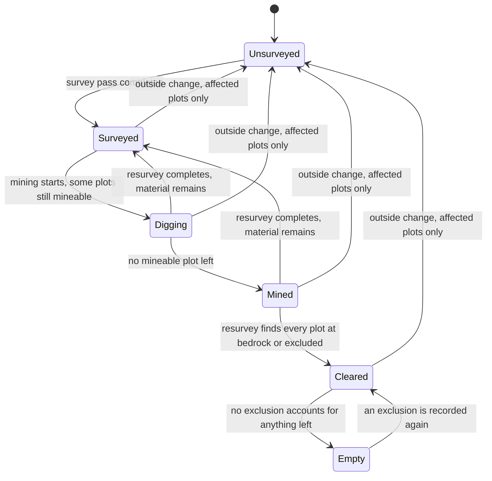
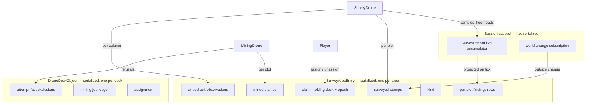
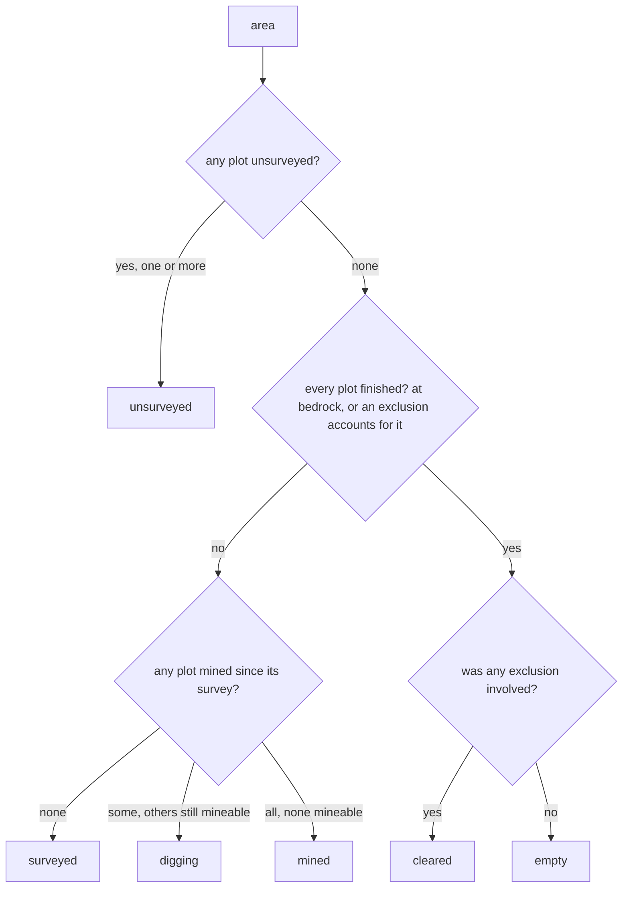
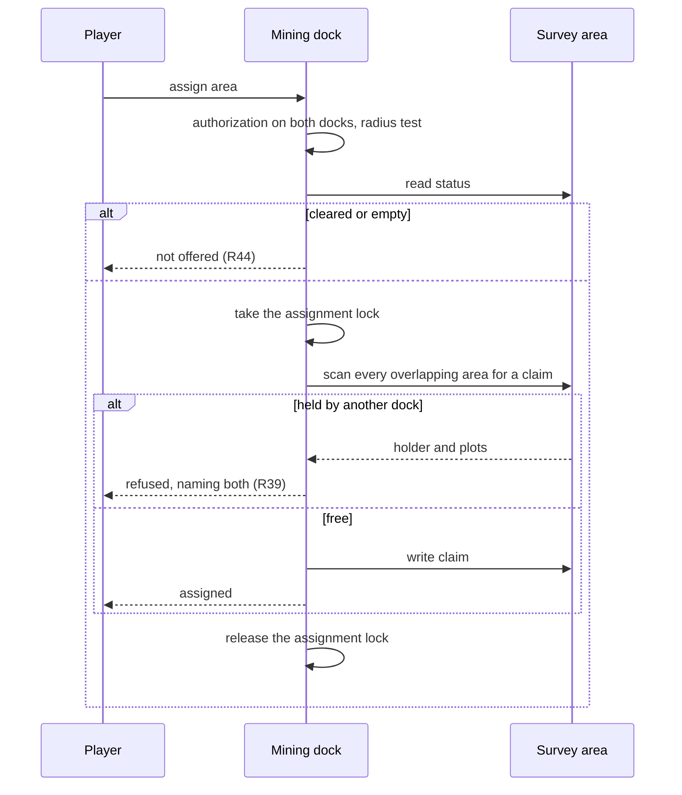
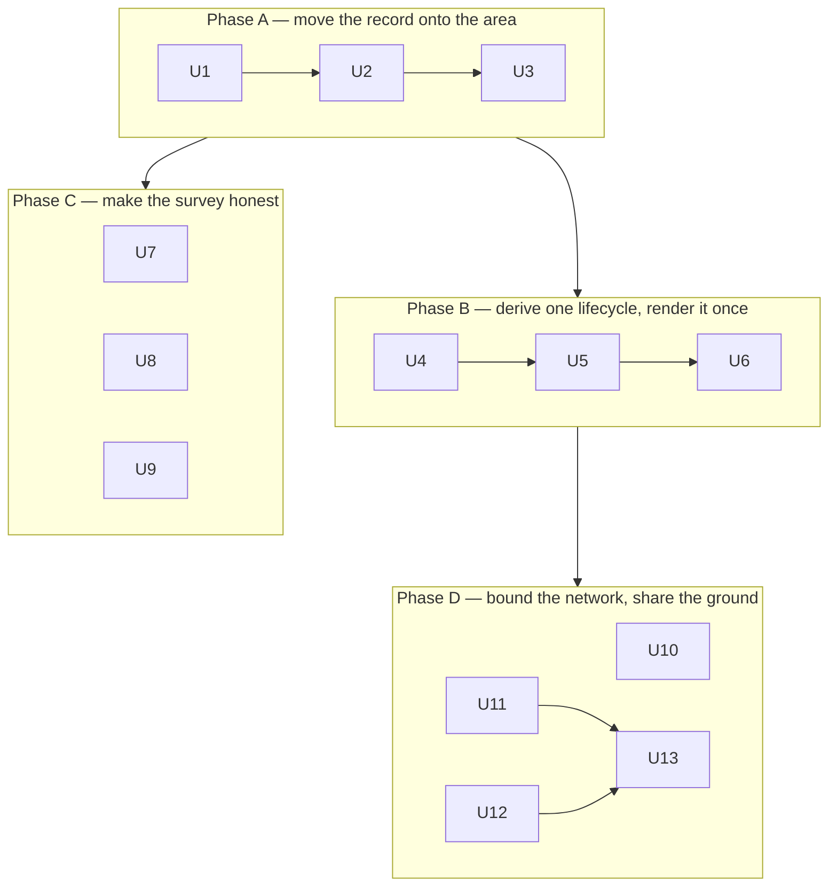

# Shared Area Status - Plan

## Goal Capsule

- **Objective:** Give a survey area one lifecycle — unsurveyed, surveyed, digging, mined, cleared, empty — owned by the area itself rather than by whichever dock is looking at it, and make a resurvey produce findings that reflect the ground as it is now.
- **Product authority:** Observed in live play. The status vocabulary, the colour ramp, the visibility rule, and the resurvey semantics were each chosen against surfaced alternatives during the brainstorm.
- **Active scope:** the shared status model, the resurvey correctness fix, the rule limiting which docks can work one another's areas, and the detection and marking of overlapping areas. The automation checkboxes and multi-drone queue, the landfill drone, and the farming drone are not active scope — all three inherit this model and are planned separately.
- **Means:** move the per-plot ground record onto the area and derive one status from it, rather than exchanging messages between docks (KTD3).
- **Open blockers:** none. The two that shaped this scope are resolved and recorded under Dependencies and Assumptions — the engine publishes a world-change event a mod can subscribe to, and it classifies unmineable ground with a block attribute a survey pass can test.
- **Execution profile:** thirteen units in four phases. Phase A moves records onto the area and is a persistence change every later phase reads; Phase D is independent of Phase C and may land in either order.
- **Stop conditions:** stop and ask before changing what a status means to the player, before adding a `BigButton` to either tab, and before discarding any persisted player data beyond the area findings KTD1 covers and the dock-side mined stamps U2 removes alongside them.
- **Tail ownership:** R40's farming record is defined by the farming plan as the `[farm]` tag, set the moment an area is assigned. Nothing is outstanding, and nothing here blocks on it.

---

## Product Contract

Product Contract preservation: changed — R44 added, resolving the "is a `[cleared]` area still offered" question the Outstanding Questions section flagged and F3 and R19 both already assumed. No other requirement changed in meaning, and no R-ID was renumbered.

### Summary

One shared lifecycle for a survey area, stored on the area, so a mining dock and a survey dock read the same truth about the ground without messaging each other. Alongside it, the resurvey fix that makes the lifecycle honest: a resurvey starts from nothing rather than keeping numbers it can no longer revise.

Together these widen what a survey drone is for. It no longer only prospects what lies underground — it diagnoses the state of an area, which is why its dock is where that area's information centralises.

### Problem Frame

Mining and surveying currently keep separate books on the same ground. A survey area records when each of its plots was surveyed; a mining dock records, on itself, when each plot was dug. The freshness test that decides whether a plot is worth digging compares those two numbers — but no single object holds both. A survey dock therefore cannot say whether an area has been mined out, and a player reading the survey roster sees an area still advertised as full of ore long after a drone emptied it.

The second half of the problem is that a resurvey does not fix this. Within one server session, the live survey record treats a block it has already sampled as done and skips it, so a block whose contents changed cannot revise what was recorded. The drone re-flies the whole area, burns fuel, and writes back the same numbers. Materials that no longer exist keep appearing in the findings. Across a restart the record is empty and the same resurvey behaves correctly, which is why the fault reads as intermittent.

Both halves land on the same surface — the area roster the player actually reads to decide where to dig. A dig plan that lies is worse than no dig plan, because the player acts on it.

A third constraint here is deliberate rather than a repair. A mining dock today finds its owner's survey docks at any distance, so the network of docks has no physical existence — the same problem bounded storage links exist to avoid. Giving dock-to-dock visibility a radius makes that network something a player builds and can see, for the same believability reason. It also gives the mod somewhere to grow: raising the radius is a natural upgrade-module effect, alongside raising the drone cap.

### Key Decisions

- **Mined truth moves onto the area.** Chosen over keeping stamps per dock and publishing events between docks: a block dug by one dock is dug for every dock, and shared state removes most of the messaging the feature seemed to need. Governs R1, R2, R6.
- **The lifecycle occupies one exclusive status slot.** An area is in exactly one ground state, rendered where `[mined]` appears today. Governs R3, R4.
- **`[unreachable]` leaves the colour ramp alongside `[assigned]`.** Chosen over keeping it in the exclusive slot sharing red with `[cleared]`: it is derived from the current trip rather than from the ground, so it can hold over an area in any state, and a red line that might mean either "spent" or "cannot get there" costs the player ground that is still full. Governs R9.
- **`[assigned]` leaves the colour ramp.** Chosen over recolouring `[mined]`: colour means ground state, and "a drone is working this right now" is not a ground state. Governs R9.
- **A resurvey clears before it rebuilds.** Chosen over a shadow pass that swaps in at completion: the readout should never show a mix of readings from two passes, even at the cost of losing the dig plan while the sweep runs. Governs R10, R11, R12.
- **`[cleared]` is re-derived, not sticky.** Chosen over a stored flag with its own un-clear rule: survey is the authority on ground state, so the landfill transition falls out of the same rule instead of needing another. Governs R7, R8.
- **Partly-dug ground needed a name.** `[surveyed]` means not yet re-mined and `[mined]` means fully re-mined, so an area between the two had no status of its own and the rule and its example disagreed about which end it belonged to. `[digging]` is that state. A resurvey returns partly-dug ground to `[surveyed]`, because mining can only take what a survey found. Governs R3, R4, R5.
- **"The drone is finished" and "the ground is exhausted" are different states.** Chosen over one terminal state carrying both meanings: only genuine exhaustion is safe for the landfill work to consume, and a player looking at ore they could unblock must not be told it is spent. Governs R26, R27.
- **Mining reports what it cannot dig; survey stops offering it.** Chosen over recording a mined stamp for ground the drone never touched: a stamp would claim work that did not happen, while an exclusion states the true fact and leaves the next pass free to disagree with it. Governs R18, R19.
- **Docks need two channels, not one.** Chosen over letting the dock-network radius govern everything: the radius is a believability constraint on which docks may *work* together, but two areas can overlap on the ground no matter how far apart their docks are, and that conflict has to be detectable anyway. Governs R34.
- **Assigning claims the ground; working it only reads the claim.** Chosen over deciding the conflict while a drone works: assignment is the moment a player commits, so it is where a collision should be found and reported. A recorded claim also means a drone never has to ask what another dock is doing mid-pass, and it makes the race explicit — two docks assigning the same ground at once cannot both win. Governs R37, R39.
- **Overlap is marked, not prevented.** Chosen over refusing an overlapping edit: blocking the draw pushes the conflict into the map UI, where the player has the least information about what they are colliding with. Marking it leaves the conflict visible, locatable, and resolvable by editing either area. Governs R35, R36, R37.
- **Kind belongs to the area, and land is handed over rather than owned.** Kind says what an area is for, and it is a property of the area so that purpose survives being reassigned. It does not gate who may claim ground — assignment does that, kind-blind — and the player reads it as a tag in brackets rather than as a field of its own. Ground reaching `[empty]` is the moment it becomes available for a different purpose, and the next dock to assign it takes it; no release is negotiated and none is recorded. Governs R30, R31, R32, R33, R40.
- **Drones read plots; players read areas.** Chosen over surfacing the per-plot detail the drones now carry: the roster is one line per area and every requirement that adds per-plot state would otherwise lengthen it. What the drones need to be exact about, the player needs only the gist of. Governs R3, R28.
- **Docks coordinate internally; players stay gated.** Chosen over treating the shared channel as a shared view: the system needs every dock's geometry and observations to see where two areas want the same ground, but a player must not gain sight of another player's areas by placing a dock nearby. The channel exists so the mod can warn a player about a collision, not so it can show them someone else's work. Governs R41, R42.
- **Status is information; offers are a verdict.** Chosen over deriving the lifecycle from only the exclusions that bind the reading dock: an exclusion is an observation, and observations are shared, so every dock reads one status. Whether a refusal stops *you* is a separate, per-dock question that governs offers alone. Governs R19, R26.
- **An exclusion reaches as far as the fact behind it.** Chosen over one shared exclusion set: a refusal about the ground binds every dock, but a refusal about one dock's permit or route is not true of the others — the same distinction that took `[unreachable]` out of the colour ramp. Governs R18, R19.
- **Dock-to-dock visibility gets its own radius.** Chosen over reusing the storage link radius or requiring shared linked storage: this is a believability constraint of the same kind, not the same knob, and it is expected to become an upgrade-module effect later — which a shared constant could not support. Governs R14, R23.
- **Dock enumeration stays owner-based.** Authorization needs an acting player and enumeration has none, so authorization stays on the paths that already have one. Governs R15.
- **Spent ground is not offered to a mining dock.** (session-settled: user-approved — chosen over leaving the offer open: R19's argument that only a survey can lift an exclusion holds only if no mining pass is dispatched to a `[cleared]` area, so leaving it offerable silently breaks the reversibility the exclusion depends on.) Governs R44.

### Requirements

**Shared area lifecycle**

- R1. Per-plot mined stamps are stored on the survey area, alongside its survey stamps, so every dock that can see the area reads one shared record of what has been dug.
- R2. Mining job status stays per mining dock. Two mining docks working one area keep independent job state.
- R3. An area shows exactly one lifecycle status at a time, in the slot where `[mined]` is shown today. An area holding any unsurveyed plot reads unsurveyed, whatever its other plots say — a plot an edit added, or an outside change reset, is unsurveyed, and a resurvey is what returns the whole area to `[surveyed]`, so no mixed status is needed for the gap. Otherwise, when its plots disagree the status is the dominant one: `[surveyed]` while every mineable plot is still untouched, `[digging]` once some plots have been mined since their last survey and others remain mineable, `[mined]` when no plot is mineable and at least one has been mined since its last survey, and `[cleared]` or `[empty]` only when their tests hold for every plot.
- R4. The lifecycle statuses and their line colours are: unsurveyed uncoloured, `[surveyed]` green, `[digging]` magenta, `[mined]` yellow, `[cleared]` red, `[empty]` a mid grey dark enough to read as deliberately coloured rather than as the panel's default text. Grey and no-colour are a lightness difference rather than a hue one, so unlike the rest of the ramp it cannot be judged from the name alone — the chosen value is confirmed against the client's default panel text before it ships. Every state carries a word as well as a colour, so no lifecycle state depends on colour vision to read. `[landfill]` (light blue) and `[filled]` (dark blue) are reserved names in this vocabulary and are not built here.
- R5. A resurvey of partly-dug ground returns the area to `[surveyed]`, whatever was taken from it before. A mining drone may only take what a survey found, so a completed survey resets what is available to dig and the area re-enters the ramp at the top rather than carrying its digging history forward as a status.
- R6. An area reads as `[mined]` when its mined stamps are newer than its survey stamps, meaning it must be resurveyed before it is worth digging again. Mineability follows from the survey alone: a drone digs what the last survey found, so once the digging postdates the survey there is nothing left that the mod knows to be worth digging.
- R7. An area reads as `[cleared]` when nothing remains in it that the mod is able to mine — every plot down at bedrock, the impenetrable layer at the bottom of the world, except where a recorded exclusion under R18 accounts for what is left. Obstructions that block a single column rather than the ground itself — a built block, or dirt holding a plant or a tree — are skipped individually and digging continues beneath them, so they never stop a plot from reaching bedrock.
- R8. `[cleared]` is re-derived from what a survey observes rather than stored as a flag. A survey that finds every plot still down at bedrock restates `[cleared]`; a survey that finds ground standing above bedrock does not, and the area rejoins the ramp.
- R9. `[assigned]` and `[unreachable]` render without a colour of their own and inherit the line's lifecycle colour. Either may appear alongside any lifecycle status, because both describe a drone's current trip rather than the state of the ground.

**Resurvey correctness**

- R10. Newly starting a resurvey clears the area's findings, its live sample record, and its per-plot rests-on-bedrock observations before the drone begins sampling. A pass resuming under R25 is not a new start and does not clear.
- R11. While a resurvey runs, the readout reflects only what the current pass has sampled, so coverage starts at zero and climbs.
- R12. A completed resurvey reports no material that the pass did not observe.
- R13. Clearing an area's findings for a resurvey does not clear its mined stamps.

**Dock-to-dock visibility**

- R14. A mining dock may only work areas belonging to survey docks inside a dedicated dock-network radius, tuned independently of the storage link radius.
- R15. Dock enumeration stays owner-based, and the existing player-authorization checks are unchanged — at assign time on both docks, and re-checked while a drone works.

**Reacting to ground that changed**

- R16. When the ground under a surveyed area changes and the mod's own drones did not make the change, the plots whose ground changed return to unsurveyed and the area's coverage drops accordingly. The rest of the area keeps its findings. This covers map-editor edits, admin commands, and ordinary player digging alike.
- R17. The mod's own mining marks the survey stale through the mined stamps alone. The dug plots keep their findings and their contribution to coverage, and the area reports `[mined]` rather than dropping to unsurveyed — so the player can still see what was there before it was taken. R16's findings-and-coverage reset is reserved for changes the mod did not make. Both states mean the survey no longer describes the ground; they differ in whether the mod knows what changed it, and therefore in what it can still show.

**What mining reports back to survey**

- R18. A mining pass records what it was unable to mine, and the record's reach follows what the refusal is a fact about. Bedrock reached is a fact about the ground: it is recorded on the area, per block, and binds every dock. Property, settlement law, and pathing refusals are facts about one attempt: they are recorded against the dock that hit them, for the whole plot, because the pass stops at the refused layer and learns nothing beneath it.
- R19. A survey excludes what R18 recorded from its findings, so the roster offers only material a drone is actually able to dig. A ground-fact exclusion suppresses material for every dock; an attempt-fact exclusion suppresses it only for the dock that recorded it, so one dock's missing permit or failed route never deletes ore another dock could take. That per-dock scoping governs what a dock is *offered*, not what the area reads: the exclusion itself is shared information and feeds the one status R26 derives.
- R45. An attempt-fact exclusion is lifted by assigning the area to that mining dock again, and by nothing else. Only a mining drone can learn a refusal, by attempting the action in place and capturing the reason, so only a mining attempt can learn that the refusal has gone. The mod is deliberately not told when a permit lapses or a property boundary moves: it neither polls nor re-tests permission, because a player who wants the ground worked says so by assigning a drone to it. Assignment is therefore the retry, and it clears that dock's attempt-fact exclusions for that area before the pass begins. A ground-fact exclusion needs no lift — the survey re-derives at-bedrock from the ground on every pass, so filled ground stops reading at bedrock on its own.

**Editing an area**

- R20. Editing an area's plots preserves the survey stamps, findings, mined record, and exclusions for every plot the edit retains. Only plots the edit adds are unsurveyed and need a pass. This replaces today's behaviour, where any redraw discards the area's findings and coverage wholesale.
- R21. An edit ends an in-flight mining job only when it removes plots that job still has to work. An edit that only adds plots leaves the job running against the plots it retained, so the preservation in R20 is something the player can actually see.
- R22. An edit landing while a survey pass is running keeps that pass alive. Retained plots keep their samples and their place in the sweep, removed plots leave the pass and its coverage denominator, and added plots join the remaining sweep rather than forcing a restart.

**Reporting and upgrading on the radius**

- R23. A mining dock reports a survey dock's areas as out of range whenever the pair falls outside the radius, rather than showing nothing and leaving the player to guess. This covers a dock newly placed too far away as much as a world upgrading into R14.
- R24. A world upgrading into R14 keeps working. Pairs the upgrade separates stop being offered, a drone already working such an area detects the loss and returns to its dock on the same path it takes when an area is destroyed, and the dock reports the assignment as out of range rather than clearing it silently.

**Resuming an interrupted pass**

- R25. A resurvey that stops before finishing keeps what it sampled, so a later pass resumes from where the drone stopped rather than starting over. A resuming pass skips R10's clear and keeps the coverage the stopped pass reached rather than dropping to zero. The area's coverage percentage is what tells the player the survey is incomplete; no separate marker is added for a stalled pass.

**Spent ground versus blocked ground**

- R26. An area reads `[empty]` when every plot is down at bedrock and no exclusion accounts for any material still in it — there is genuinely nothing left to take. `[cleared]` says only that the drone is finished, which may be because it was refused; `[empty]` says the ground itself is exhausted. Both read every recorded exclusion regardless of which dock recorded it, so the area has one status that every dock agrees on. What varies per dock is which plots it is *offered*, never what the area says it is.
- R27. An area whose `[cleared]` rests on an exclusion names the refusal reason where the mining tab already reports reasons — the stop-reason and skip rows, which already word property, settlement-law, unreachable and obstructed refusals — not on the area's roster line, which stays at its budgeted length. Blocked ground never reads as spent ground, and the player can see what they would have to change to unblock it.
- R44. A `[cleared]` or `[empty]` area is not offered to a mining dock for assignment. It stays visible on both tabs and stays assignable to a survey dock, which is the only thing that can return it to the ramp.

**What the roster compresses**

- R28. Per-plot state is what the drones read; the roster compresses it to one line per area, and the two halves of "part-worked" go to the two surfaces that already carry them. *That* an area's plots differ is the lifecycle status: `[digging]` says it for every area in the roster, worked or not. *How much* is the progress row, which reports plots total, worked and skipped for the area being worked — the only area where the quantity is something the player can act on. A mix the status leaves unstated — a partly-surveyed area, say — is reported on the line in the register of the existing `most <ore>` phrase. Nowhere does the roster enumerate plots.
- R29. The Survey tab and the Mining tab render an area with the same fields in the same order: position and name, plot count, the coverage-and-material summary, the lifecycle status, then any uncoloured overlays — ordered `[overlap]`, `[unreachable]`, `[assigned]`, most-blocking first, and capped at two so the line cannot grow without limit. The Mining tab prefixes that block with the owning survey dock's name, because it lists areas from several docks at once and area names are not unique; without it a player can assign the wrong area. The coverage-and-material summary is narrowed by the reading dock's own material filter — the one field convergence deliberately leaves different, because a filter is a display preference rather than something true about the area. Both tabs read one lifecycle, so showing different amounts about the same area would reintroduce the cross-dock disagreement this plan removes.

**What an area is for**

- R30. An area carries a kind — the job it exists for — as a property of the area itself, not of the dock that owns it. Kind reaches the player as a tag in brackets, in the same vocabulary as the rest of the roster line — `[farm]` and its siblings, alongside `[assigned]` and `[overlap]` — never as a field of its own. That tag is how a player knows what an area is for and what to expect when they try to assign a drone to it, which is the reason the tags exist. A dock may list areas of any kind. R34 already makes areas objects two docks compare across the world; an object compared that way has to be able to say what it is for.
- R31. An area's kind can change over its life. Ground that reaches `[empty]` has nothing left to offer its current purpose, so an `[empty]` mining area may be repurposed — and a farming area no longer in use may become a mining area. Kind is a current answer, not a permanent one.
- R32. Changing an area's kind is an explicit action by the area's owner. It is refused while any drone is mid-pass on that area or on an area overlapping it, and the refusal names the reason the same way a refused assignment already does, disclosing no more of another player's area than R36 and R42 permit. The area's findings, mined stamps, and exclusions survive the change exactly as R20 preserves them across an edit.
- R33. `[empty]` states what the ground is fit for next, not only what it has run out of: an `[empty]` area filled with non-polluting material and topped with dirt is good farmland, whatever it was mined for first. Ground contaminated by what it was filled with is unfit for farming until it is decontaminated. The engine already carries a pollution layer with several kinds of ground pollution, and whether a plot is polluted is cheap to read — so this is a check the mod can make rather than a constraint it can only record. The check belongs to a farming drone: neither survey nor mining sensing needs to change for it.

**Overlapping areas**

- R34. Docks exchange area geometry regardless of the dock-network radius. The radius governs which docks may *work* one another's areas; it does not govern overlap detection, because two areas can cover the same ground while their docks sit far apart.
- R35. Creating or editing an area that overlaps another dock's area is never blocked. The overlapping area is marked with an `[overlap]` annotation instead, rendered uncoloured beside its lifecycle status under R9. Refusing the edit would push the conflict into the drawing UI, which is the worse place to resolve it.
- R36. The per-plot detail of an overlap — the centre block of each shared plot — is reported through the mod's existing diagnostic command, not on the panel. That is where "why was that plot skipped" already belongs, and the panel is deliberately kept to one summary row per fact rather than a row per plot. The panel says an overlap exists and the command says exactly where. It also names what the other area is for and whether it currently holds a claim on those plots — what R37 and R39 actually test — so the player can tell whether the block will ever lift and what would lift it. This is the same obligation R27 places on a blocked area: say enough that the player knows what would have to change. It names no more of another player's area than that, per R42.
- R37. Assigning an area claims its plots, and a drone works only plots its own dock has claimed. The claim is recorded at assignment rather than re-derived while the drone works, so a drone never has to ask what some other dock is currently doing. An unassigned area holds no claim, and neither does one whose ground reads `[empty]` — there is nothing left to claim it for. A `[cleared]` area does hold its claim, because the material behind its exclusion may be unblocked later and R19 lets a survey lift it.
- R38. Unassigning an area states what it released — that its plots are no longer held and are free for any dock to claim. The message is unconditional rather than fired only on contested ground, because the claim is what assignment means and a player who does not know they dropped it cannot know they are exposed.
- R39. An assignment that would claim plots another area already holds is refused, and the refusal names which plots and what holds them. Kind plays no part: any assigned area holds its plots against every dock, and any unassigned area is free to a dock of any kind. The single exception is `[empty]` — ground with nothing left to take is assignable even where another area still covers it, which is what lets land pass from one purpose to the next. Claiming is atomic against concurrent assignment: two docks assigning overlapping ground at the same moment cannot both succeed, and the one that loses is told why rather than silently working ground it does not hold.
- R40. A dock working an area records its kind's data on that area, and that record is what tells every other dock what the area is now for. A farm working reclaimed ground writes farming data onto it, so the ground stops being mining ground because the area now says it is farmland — not because a status was held or a release was recorded. This is what makes `[empty]` a waypoint rather than a permanent condition: the next kind's data supersedes it. Handover therefore needs no ceremony, and a later reader should not reintroduce a recorded release to make it work. A kind's data is whatever that kind already needs to keep and no more — for mining it is per-plot stamps, because a pass completes plot by plot and the survey must know which plots went stale; for farming it is the area-level marker alone, because that drone decides from the ground each time it looks. This requirement asks for no new structure, and a record no kind reads would only go stale.

**What docks share and what players see**

- R41. The information drones collect about areas and plots is exchanged between docks internally, so the system can see where two areas want the same ground. This channel is not a player-facing view: what a player may see, edit, and assign stays gated by the authorization rules that govern it today, and one player never gains sight of another's areas by owning a dock near them.
- R42. When a player's action would collide with another player's area, the mod warns them and names the consequence rather than silently blocking or silently proceeding. Drawing a farm across ground another player has assigned for mining warns that the ground is likely to be dug, so the player can negotiate or draw elsewhere. The warning is derived from the internal channel in R41 and states the conflict without exposing the other area's contents.

**Writes by the mod's other drones**

- R43. A write by one of the mod's drones on its own dock's area records that drone's own state rather than falling to R16's reset — `[mined]` for mining under R17, and whatever state the plan that introduces a job kind defines for it. A write is attributed to the area whose kind it serves — a farming write to the farming area, a mining write to the mining area — so ground two areas cover at once, as handed-over plots are, records the state of the work actually being done on it. R16 still applies where a drone changes ground belonging only to a different dock's area, because whether a survey still holds is a question about the ground, not about who changed it.

The lifecycle in R3 through R8, with the transitions the later features will extend:

The diagram shows the area-level status only. R16, R20, and R25 all produce areas whose plots are individually surveyed or not; R3 is what resolves a mixed area to a single status.

### Key Flows

- F1. Dig, then notice it needs resurveying
  - **Trigger:** A mining drone finishes a pass over an assigned area.
  - **Actors:** mining drone, mining dock, survey dock, player.
  - **Steps:** The drone records mined stamps onto the area it was working. The area's mined stamps now postdate its survey stamps. Both docks' rosters show the area yellow and tagged `[mined]` on their next rebuild, without either dock notifying the other.
  - **Covers R1, R6.**

- F2. Resurvey an area that was dug
  - **Trigger:** The player assigns a survey drone to a `[mined]` area.
  - **Actors:** survey drone, survey dock, player.
  - **Steps:** The area's findings and live sample record clear, and the roster line drops to zero coverage while keeping its mined stamps. The drone sweeps and samples. On completion the area carries only what this pass observed, its survey stamps postdate its mined stamps, and it reads green again.
  - **Covers R10, R11, R12, R13.**

- F3. Confirm an area is spent
  - **Trigger:** A resurvey completes over an area whose plots have all been dug to their floor.
  - **Actors:** survey drone, survey dock.
  - **Steps:** The pass observes that every plot sits down at bedrock, or that what remains is covered by a recorded exclusion. The area reads red and tagged `[cleared]`, and no mining dock offers it for assignment. A later fill or map edit raises the ground, and the next survey no longer restates `[cleared]`.
  - **Covers R7, R8.**

### Acceptance Examples

- AE1. **Covers R6.** Given an area surveyed at time 100 and mined at time 200, when either dock rebuilds its roster, then the area shows yellow with `[mined]`.
- AE2. **Covers R12.** Given an area whose findings list iron that a player has since dug out by hand, when a resurvey completes, then iron no longer appears in the findings.
- AE3. **Covers R13.** Given an area mined at time 200, when a resurvey clears its findings and completes at time 300, then the mined stamps from time 200 are still recorded and the area is mineable again because 300 postdates 200.
- AE4. **Covers R7, R8.** Given an area whose every plot has been dug down to bedrock, when a resurvey completes, then the area shows red with `[cleared]`.
- AE5. **Covers R8.** Given a `[cleared]` area that a player has since filled in, when a resurvey completes, then the area no longer reads `[cleared]`.
- AE6. **Covers R3, R9.** Given a `[mined]` area currently assigned to a drone, when the roster renders, then the line is yellow and carries both `[mined]` and an uncoloured `[assigned]`.
- AE7. **Covers R11.** Given an area at 100% coverage, when a resurvey begins, then the roster shows 0% until the new pass samples, and never shows a figure blending both passes.
- AE8. **Covers R14.** Given a survey dock outside the dock-network radius of a mining dock, when that mining dock lists offerable areas, then the distant dock's areas do not appear even though both docks share an owner.
- AE9. **Covers R7.** Given a column inside an area capped by a player-built block, when the mining pass reaches it, then that column is skipped and digging continues beneath it, so the plot still reaches bedrock and the area can still become `[cleared]`.
- AE10. **Covers R18, R19, R26, R27.** Given an area holding one plot the drone is refused under settlement law, when the mining pass finishes and a resurvey completes, then that plot's material is excluded from the findings, the area reads `[cleared]` and does not read `[empty]`, and the settlement-law reason is reported where R27 puts it — the mining tab's stop-reason and skip rows — not on the area's roster line.
- AE11. **Covers R26.** Given an area whose every plot is down at bedrock with no exclusion recorded against it, when a resurvey completes, then the area reads grey with `[empty]` and is the state the landfill work would consume.
- AE12. **Covers R35, R36, R37, R39.** Given a player who draws a mining area overlapping four plots of an assigned farming area, when the area is created, then it is created successfully and both areas carry an uncoloured `[overlap]` annotation naming the four shared plots — the farm keeps working them, because the new area holds no claim until it is assigned. When the player then assigns it, the assignment is refused for those four plots and names the farm as holding them.
- AE13. **Covers R37.** Given a player who draws a farming area over a mining area whose ground reads `[empty]`, when a dock of another kind assigns those plots, then it is refused nothing — the mining area holds no claim — and no release is negotiated and neither area is edited. The second half of this behaviour, that the farming data recorded there is what marks the ground farmland from then on, belongs to R40 and is verified by the farming plan, which owns the record.
- AE14. **Covers R28, R29.** Given an area of 16 plots that is 100% surveyed, richest in iron, currently assigned to a drone, mostly but not entirely mined, when either tab renders it, then one magenta line carries its position and name, its plot count, its coverage-and-material summary, the `[digging]` status, and an uncoloured `[assigned]` — in that order on both tabs, with the Mining tab's copy prefixed by the owning survey dock's name. The status carries that its plots differ; how much has been worked is on the progress row, not the line.
- AE15. **Covers R45.** Given a `[cleared]` area whose blocking settlement claim has since lapsed, when the player assigns it to that mining dock again, then the dock's exclusions for that area are cleared, the drone attempts the plot, and the area returns to the ramp. Resurveying it any number of times in between changes nothing, because a survey cannot test settlement law.
- AE16. **Covers R16.** Given a player who digs one block inside a large surveyed area, when the change is noticed, then only the plots containing that block return to unsurveyed and the rest of the area keeps its findings.

### Scope Boundaries

- The automation checkboxes — per-area auto-resurvey on the survey dock, auto-mine on the mining dock — and the queue that orders work when several mining docks share one survey drone. They consume this lifecycle; they do not shape it.
- The landfill drone, the landfill component, the material filter list, and the `[landfill]` and `[filled]` statuses. Their names are reserved in R4 so the vocabulary does not have to be reopened, but nothing here builds them.
- Mining job scheduling and dispatch. R2 keeps job status exactly where it is; R21 is the one exception, and it only narrows when an edit ends a job.
- Any change to how survey areas are drawn, named, or assigned on the map.
- Upgrade modules that raise the dock radius or the drone cap. The radius is given its own constant so they can exist later; none is built here.
- Reading ground contamination. R33 establishes that fill material determines whether reclaimed ground is farmable and that the engine's pollution layer makes this checkable, but the check itself belongs to a farming drone and is built in the farming plan, not here.

### Dependencies and Assumptions

- The freshness comparison stays a stamp comparison — a plot is worth digging when its survey stamp postdates its mined stamp. R1 moves where one of the two numbers lives; it does not change the test.
- Mined stamps record physical ground history and survive every survey operation. R13 depends on this, and it is the inversion most likely to be coded backwards, because clearing findings and clearing survey stamps are one operation today.
- R7 and R8 assume a survey pass can observe that a plot sits down at bedrock. It cannot today, but the engine makes the test cheap: bedrock carries a dedicated block attribute that vanilla tools already query, the world generator pads every column down to it, and "rests on bedrock" is a single read directly beneath the surface height the sensor records anyway. The survey's fixed sampling depth is not a constraint on this, because the test is at the surface, not below it.
- R16 assumes the engine publishes a world-change event a mod can subscribe to. It does, at the block-write level, so every writer reaches it — drones, players, admin commands, and the map editor alike — and it reports the changed column with its new top height, matching what an area already records. Subscription is from a static engine-level event, so releasing it when a dock is destroyed is a real obligation rather than an optional tidy-up. The event does not name the writer, so the reset path must attribute a change to the mod's own drones before choosing between unsurveyed and `[mined]` under R16 and R17.
- Colour rendering stays markup on the roster line rather than a client-side feature, so the vocabulary in R4 is a server-side string decision.
- An area's destruction is already handled and stays out of scope: drones working a vanished area detect the loss and return to their dock. R20 addresses the edit case only.
- R37's claims have to be recorded somewhere every dock that might collide with them can read. Assignment lives on the consuming dock today, with no back-pointer from an area and no mod-wide registry, so a claim cannot be answered by looking at the area alone. Checking at assignment rather than at plot-pick keeps this off the drone's hot path, but the record still needs a home.
- R29's per-dock narrowing needs a material-filter control on the Mining tab. The filter is settable today only through the survey component's picker and through a command reading the dock's own survey areas, so a dock carrying only a mining drone cannot set one and its summary renders unnarrowed. The decision that the reading dock's filter governs stands; it has no control behind it yet.
- R25 requires the live sample record and the sweep cursor to persist with the area rather than with the session. That reverses a documented design decision — the record is currently session-scoped on purpose and never serialized — and the reversal is safe only because R10 now clears on a newly started resurvey. Without that clear, a persisted record is the stale-findings fault made permanent.
- R16 and R20 require the area's persisted findings to become per-plot rows, with the area totals the roster shows re-derived from them at render time. Today findings are stored as one row per ore type for the whole area, summed across plots before persisting, so there is nothing a per-plot rule could subtract from. This is the largest single piece of work the plan implies and it is easy to miss, because both requirements read as bookkeeping.
- The expected deployment shape is one dock carrying a survey drone alongside several carrying mining drones. Several survey docks must also work, each holding its own information independently — a survey dock is where an area's information centralises, so two survey docks do not merge their views of the same ground.

### Outstanding Questions

Planning resolved nine of the ten questions this section carried. Each answer now lives on the KTD or unit that owns it: the mined-stamp shape (KTD2), the per-plot findings shape and totals (KTD1, U1), whether the status slot is stored (KTD3), which world-change event and how a dock releases it (KTD7, U8), whether bedrock is recorded per column or per plot (KTD4), whether an exclusion is per block or per plot (KTD4, KTD5), whether a `[cleared]` area is offered (R44), the overlap channel's scope (KTD8), and the radius value (KTD9).

Two remain open. Neither blocks implementation.

**Deferred**

- What to call an area now that kind lives on the area rather than the dock. "Survey area" names one kind, not the category. The rename touches every file that mentions the type and every player-facing string, so it is held out of this plan and belongs in its own change.
- The exact grey for `[empty]`. R4 already requires it to be confirmed against the client's default panel text before it ships, and that is settled by looking at the panel in play rather than by choosing a value here.

<!-- ce-section: work-relationships -->
### How This Work Fits Together

This plan owns the shared area status model, the resurvey correctness fix, the dock-network radius, and overlap detection. The breakdown below is how the surrounding work is currently understood, not a committed roadmap — a later plan may revise, split, merge, or discard any of it.

- Automation and queueing — per-area auto-resurvey, auto-mine, and the ordering rule when several mining docks share one survey drone.
  - Depends on this plan: it triggers on the `[mined]` and `[cleared]` transitions defined in R6 and R7, and the mine-until-cleared loop terminates on R7.
  - Still to decide: whether the queue lives on the survey dock, the drone, or a coordinator.
- Landfill drone and landfill component — a sibling of the mining drone that moves material from linked storage into spent ground.
  - Depends on this plan: `[empty]` is what it consumes — genuinely exhausted ground, not merely ground the drone was refused — and R8's re-derivation is what returns a filled area to the ramp without a bespoke un-clear rule.
  - Shares with this plan: the status vocabulary in R4, where `[landfill]` and `[filled]` are already reserved.
  - Can proceed independently of automation and queueing.
  - Still to decide: whether landfilling gets its own drone or reuses the mining drone, and whether an `[empty]` area can be designated a *permanent* landfill. A landfill is a deliberate pollution source that contaminates neighbouring plots as well as its own, so that plan has to distinguish fill that pollutes from fill that does not — sand and dirt reclaim ground, refuse takes it out of use. R33 is where that distinction starts to matter.
- Farming drone — one drone running every farming job, planned in `docs/plans/2026-08-22-0010-feat-farming-drones-plan.md`.
  - Depends on this plan: its `[farm]` and `[flat]` markers are uncoloured annotations of the kind R9 defines, never lifecycle states, and they compete for the two overlay slots R29 caps — `[flat]` yields whenever the room is needed; its redraw behaviour relies on R20; and R43 is what keeps a farming write from being mislabelled or silently unsurveying ground.
  - Shares with this plan: claiming under R37 and R38 is what keeps drones off each other's ground — assignment takes the plots and refuses where another area holds them. Overlap marking under R35 and R36 makes the collision visible; it is not itself the block.
  - Settled by that plan: R40's farming record is the `[farm]` tag, set on assignment and never read back by the drone, which decides from the ground each time. That matches R40's rule that a kind keeps only what it needs — per-plot stamps for mining, an area-level marker for farming — so the two plans agree without either changing.
  - Shares with this plan: R30 puts an area's kind on the area itself, so a farming area is the same kind of object as a mining one and the two are comparable across docks.
  - Still to decide: what to call an area at all, now that "survey area" names one kind rather than the category.

### Sources and Research

- `EcoServerMod/AdvancedElectronics.Navigation/DockReadout.cs` — the existing status markers and colour helpers, and the roster line they are appended to. The `[assigned]`, `[unreachable]`, and `[mined]` vocabulary R3 and R4 replace starts here.
- `EcoServerMod/AdvancedElectronics.Navigation/MiningReadout.cs` — the mining tab's roster, which already reuses the survey tab's markers. Both surfaces have to move together.
- `EcoServerMod/AdvancedElectronics.Navigation/PlotFreshness.cs` — the survey-stamp versus mined-stamp comparison R1 and R6 build on.
- `EcoServerMod/AdvancedElectronics/MiningComponent.cs` — the per-dock mined verdict R1 and R2 split apart, and the owner-based enumeration R14 and R15 constrain.
- `EcoServerMod/AdvancedElectronics/DroneDock.Mining.cs` — where mined stamps live today, and where assign-time authorization is enforced.
- `EcoServerMod/AdvancedElectronics/SurveyAreaEntry.cs` — the area's persisted state, including survey stamps and the findings-clearing path R10 and R13 touch.
- `EcoServerMod/AdvancedElectronics.Navigation/SurveyRecord.cs` — the session-scoped live accumulator whose skip-if-already-sampled behaviour produces the stale-findings fault.
- `EcoServerMod/AdvancedElectronics/DroneDock.cs` — the storage link radius R14 deliberately does not reuse.
- `EcoServerMod/AdvancedElectronics/OreSensorComponent.cs` — the whole survey read path, and where R7's floor test has to be added: it already takes the surface height per column, which is the position the test reads beneath.
- `EcoServerMod/AdvancedElectronics/EcoOreReader.cs` — the block classifier behind that sensor, which today records unmineable rock and ordinary rock identically.
- `EcoServerMod/AdvancedElectronics.Navigation/ShaftPlan.cs` — how a mining pass expresses the floor it reached, the only place floor state exists today.
- `CONCEPTS.md` — definitions for survey area, plot, finding, coverage, drone status, and the area lifecycle, cleared, and dock network terms this work settled.

From the Eco source checkout the reference assemblies are built from, pinned by `EcoRefSha`. Paths are relative to that checkout, not this repo.

- `Server/Eco.World/World.cs:37-39` — the world-change events R16 can subscribe to, including a per-column top-height event. Invoked from the block-write path in the same file, so every writer reaches them.
- `Server/Eco.Simulation/WorldLayers/WorldLayerManager.cs:232` and `Server/Eco.Simulation/Pathfinding/PathManager.cs:47` — engine subscribers to those events from other assemblies, evidence that a mod can subscribe too.
- `Server/Eco.World/Blocks/BlockAttributes.cs:32` and `Server/Eco.World/Blocks/TerrainBlocks.cs:41` — the block attribute marking ground that cannot be mined, and the terrain block carrying it. R7's floor test.
- `Server/Mods/__core__/Tools/DrillItem.cs:93` — vanilla precedent for the same test, paired with a world-floor bound.
- `Server/Eco.WorldGenerator/TerrainGenerator.cs:140-148` — every column is padded to the world bottom with that block, so a floor always exists to be reached.
---

## Planning Contract

### Key Technical Decisions

- KTD1. **Findings become per-plot rows, and existing saved findings are discarded on upgrade.** (session-settled: user-approved — chosen over keeping the old area totals as an unattributed remainder: findings are stored today as one row per ore for the whole area, summed across plots before persisting, so there is nothing to attribute a remainder to and every later per-plot rule would have to read from two shapes.) `OreFindingSnapshot` gains the plot it belongs to; `SurveyAreaEntry.Findings` stays one `ThreadSafeList<OreFindingSnapshot>` but is now keyed by plot as well as ore. The area totals the roster shows are re-derived from those rows at render time. A server that upgrades resurveys once. Serves R16, R20.
- KTD2. **Mined stamps on the area reuse the survey stamps' shape exactly.** `SurveyAreaEntry` gains a second `ThreadSafeList<long>` of flattened `(x, z, stamp)` triples, projected from and rehydrated into a `PlotStampAccumulator` — the same pair of methods `SetSurveyedStamps` and `ReadSurveyedStamps` already implement for the survey side. Nothing new is invented for persistence, and `PlotFreshness.IsMineable` keeps taking two longs. Serves R1, R2, R6, R13.
- KTD3. **The lifecycle status is computed on read, never stored.** A pure function in `AdvancedElectronics.Navigation` takes the area's stamps, its bedrock observations, and its exclusions, and returns one status. Both the roster render and the assignment path call it, which is what keeps R44's offer test and R3's display from drifting apart. Storing it would add a value that has to be invalidated by every writer, and `[cleared]` is derived by definition under R8. Serves R3, R5, R6, R7, R8, R26, R44.
- KTD4. **A bedrock observation and a ground-fact exclusion are one record, written per column.** The survey sensor already reads a column's surface height in `OreSensorComponent.SampleColumn`; the at-bedrock test is a short bounded walk down from that height to the first natural terrain block, because the recorded height is the top solid block and so may be a player-built cap rather than ground. That single record answers both R7's floor test and R18's ground-fact reach, so the two questions the Outstanding Questions section asked separately have one answer. A plot reads as at-bedrock when every column in it does. Serves R7, R8, R18, R26.
- KTD5. **Attempt-fact exclusions stay on the dock and reuse the mining job's existing ledger.** `MiningJob` already records a per-plot `SkipCategory` with a refusal detail, and `RefusalMapping.ToSkipCategory` already sorts property, settlement-law and pretest refusals. The dock persists that ledger's skipped entries past the job's end so R19 can suppress the same plots on the next offer. No second refusal vocabulary is introduced. Serves R18, R19, R27.
- KTD6. **A claim is a record on the area naming the dock that holds it, and the conflict test needs synchronisation the mod does not have yet.** `SurveyAreaEntry` gains the holding dock's object id and the assignment epoch that produced it. R39 requires the test and the write to be atomic, and the assign path is unsynchronised today — the mod contains no lock, no `Interlocked`, and no concurrent collection. This work introduces one lock held across the whole claim test-and-write on the assignment path, not a lock per area entry: the conflict spans every area overlapping the one being assigned, so two docks assigning two different overlapping areas would each take a different per-area lock and neither would serialise against the other. Assignment is a player action the plan already keeps off the drone's hot path, so a single lock costs little in contention. If Eco turns out to serialise interaction RPCs onto one thread the lock is belt-and-braces — remove it then against that engine evidence, never against an absence of observed races. Release falls out of the paths that already run on unassign and on a vanished area; no sweep is added. A claim is keyed to the assignment rather than to the area's geometry, so an edit does not invalidate it — U9 defines what happens to the plots an edit removes. Serves R37, R38, R39.
- KTD7. **The world-change subscription is per dock, on the engine's static event, released in the dock's destroy path.** `World`'s top-block-changed event is fired from the engine's own block-write path, so every writer reaches it. Because the event is static, a dock that subscribes and is then destroyed leaks unless the handler is detached — the same class of half-built-object hazard `docs/solutions/runtime-errors/initialize-exception-leaves-a-half-built-worldobject.md` records. Attribution to the mod's own drones happens in the handler, before the reset chooses between R16 and R17. Serves R16, R17, R43.
- KTD8. **The raw dock enumeration is split from the filters applied to it.** `MiningComponent.OfferedAreas` today enumerates every `DroneDockObject` in the world through `IWorldObjectManager` and then filters on shared ownership, with no distance test. That walk becomes its own method: overlap reads it raw, while `OfferedAreas` applies the owner filter and U10's radius on top. Without the split the two consumers contradict each other — U10 makes the shared method radius-filtered while R34 requires overlap to see past the radius. This answers the channel-scope question without adding a registry the mod has deliberately never had. Serves R34, R35, R41.
- KTD9. **The dock-network radius is its own constant and ships at 60 metres.** (session-settled: user-approved — chosen over reusing the 20-metre storage `LinkRadius`: the storage constant is the vanilla Store's own reach and is bound to a different believability question, and R14 expects the radius to become an upgrade-module effect a shared constant could not support.) Sixty metres is three times the storage link — far enough that a survey dock and its mining docks read as one built network, close enough that the network is something the player places. The number is confirmed in play. Serves R14, R23, R24.
- KTD10. **No control is added to either tab.** R39's refusal rides the refusal-reason string `AssignMiningArea` already returns. R38's release rides a different existing surface — the message the unassign path already sends on every successful unassign — because the assign path's refusal string exists only on a refused assignment and could never carry an unconditional message. The overlap detail in R36 goes to the existing diagnostic command. The Survey tab already declares three `BigButton`s and Mining two, against a stated budget of one — see `docs/solutions/design-patterns/vertical-stack-only-ui-design.md`. This plan does not make that worse. Serves R27, R36, R38, R39.
- KTD11. **Area kind is a serialized enum on the area, defaulting to mining.** An existing save has only mining areas, so the default makes the upgrade silent. Kind is read by the claim path, by R40's data record, and by the roster line, which renders it as an uncoloured tag under R30. Serves R30, R31, R32, R40.
- KTD12. **Every decidable rule lands in `AdvancedElectronics.Navigation`, and the Eco-side components stay thin.** Status derivation, exclusion reach, overlap geometry, and claim conflict are pure functions over plain values, unit-tested in the existing xUnit suite. The Eco-side classes read world state, call those functions, and persist the result. This is the split the repo already runs on and the only reason any of this work is testable without a server.

### High-Level Technical Design

Where each record lives after this work, and who writes it. The first two groups survive a restart; the third does not.

How one status is derived. The ladder runs once and returns the first status that holds; both the render and the offer test call it. "Finished" follows R7: a plot is finished when it is down at bedrock, or when a recorded exclusion accounts for what is left on it — which is why a settlement-law plot with material still standing reads `[cleared]` rather than blocking it.

What happens when a player assigns. One lock spans the overlap scan and the claim write, which is what makes two docks assigning overlapping ground resolve to one winner even when they are assigning different areas.

### Assumptions

- Adding `[Serialized]` members to `SurveyAreaEntry` does not change its serializer contract beyond the `ThreadSafeList` rule the class already documents. Every added collection is a `ThreadSafeList`, and every added scalar has a setter — a computed property carrying `[Serialized]` fails server load with no log line at all, per `docs/solutions/conventions/serialized-needs-a-member-to-write-back-into.md`.
- A dock destroyed while holding a claim is reachable through the paths that already detect a vanished area, so no reconciliation sweep is needed. If live testing shows a claim outliving its dock, the fix is on that existing path rather than a new one.
- Whether Eco already serialises interaction RPCs onto one thread is unverified. If it does, KTD6's lock is belt-and-braces and can be dropped; if it does not, the lock is what R39 rests on. This is an execution-time discovery — write the lock first, and remove it only against evidence from the engine's own dispatch, never against an absence of observed races.
- The engine's top-block-changed event fires once per changed column, not once per block in a bulk edit. If a map-editor paste fires per block, U8 needs a coalescing window; that is an execution-time discovery, not a plan-time one.
- The mining drone can attribute its own writes before the world-change handler sees them. The event does not name its writer, so U8 depends on the mining path marking the column as its own within the same tick.
- Live verification happens in batches against the deployed Steam tree. A restart loop with the user as the iteration step is not a verification strategy here; each live pass exercises several scenarios at once.

### Sequencing

Four phases. Phase A is a persistence change every later phase reads, so it lands first and alone. Phase B and Phase C both sit on Phase A. Phase D touches assignment and enumeration and is independent of Phase C — the two may land in either order.

---

## Implementation Units

| U-ID | Title | Primary files | Depends on |
|---|---|---|---|
| U1 | Per-plot findings rows on the area | `SurveyAreaEntry.cs`, `SurveyRecord.cs`, `DroneDock.cs` | — |
| U2 | Mined stamps move from the dock to the area | `SurveyAreaEntry.cs`, `DroneDock.Mining.cs`, `PlotFreshness.cs` | U1 |
| U3 | The exclusion ledger and its reach | `SurveyAreaEntry.cs`, `DroneDock.Mining.cs`, `MiningJob.cs` | U2, U4 |
| U4 | At-bedrock observation in the survey sensor | `OreSensorComponent.cs`, `SurveyRecord.cs`, `IBlockClassifier.cs` | U1 |
| U5 | Lifecycle derivation as a pure function | `AreaLifecycle.cs` (new), `PlotFreshness.cs` | U2, U3, U4 |
| U6 | One roster line, both tabs | `DockReadout.cs`, `MiningReadout.cs`, `SurveyComponent.cs`, `MiningComponent.cs` | U5 |
| U7 | A resurvey clears; a resumed pass does not | `SurveyRecord.cs`, `SurveyStrategy.cs`, `DroneDock.cs` | U1 |
| U8 | React to ground the mod did not change | `DroneDock.cs`, `SurveyAreaEntry.cs`, `MiningStrategy.cs` | U1, U2 |
| U9 | An edit preserves what it retains | `SurveyAreaEntry.cs`, `DroneDock.cs`, `MiningComponent.cs` | U1, U2, U3, U4 |
| U10 | The dock-network radius | `MiningComponent.cs`, `MiningReadout.cs`, `DroneDock.cs` | — |
| U11 | Area kind and the change action | `SurveyAreaEntry.cs`, `SurveyComponent.cs` | — |
| U12 | Overlap detection over the internal channel | `AreaOverlap.cs` (new), `MiningComponent.cs`, `DroneCommands.cs` | U10, U11 |
| U13 | Claims at assignment | `SurveyAreaEntry.cs`, `DroneDock.Mining.cs`, `MiningReadout.cs` | U5, U11, U12 |

### U1. Per-plot findings rows on the area

**Goal:** Store findings per plot instead of per area, so a later rule can invalidate or preserve one plot's findings without touching the rest.

**Requirements:** R16, R20. Prerequisite for R3's mixed-area resolution.

**Dependencies:** none.

**Files:**
- `EcoServerMod/AdvancedElectronics/SurveyAreaEntry.cs` — `OreFindingSnapshot` gains its plot; `SetFindings` writes rows keyed by plot and ore; `ReadFindings` gains a per-plot read alongside the area read.
- `EcoServerMod/AdvancedElectronics.Navigation/SurveyRecord.cs` — `Findings(areaId)` gains a per-plot projection.
- `EcoServerMod/AdvancedElectronics/DroneDock.cs` — `PersistAssignedAreaFindings` projects the per-plot result; the coverage-zero clobber guard stays.
- `EcoServerMod/AdvancedElectronics.Navigation/SurveyFinding.cs` — carries the plot.
- `EcoServerMod/AdvancedElectronics.Navigation.Tests/SurveyRecordTests.cs`

**Approach:**
1. Add the plot to `SurveyFinding` and to `OreFindingSnapshot`. The snapshot stays a flat `[Serialized]` class of primitives; the plot is two ints, matching how `PlotCoords` already flattens.
2. Change `SurveyRecord.Findings` to emit one finding per (plot, ore) rather than one per ore. The live accumulator already keys its inner dictionary by `PlotCoord`, so this is a projection change, not a data-structure change.
3. Re-derive the area totals the roster shows from the rows at read time. `CoveragePercent` stays a persisted scalar because it is written on the same tick as the rows and has no per-plot consumer.
4. Detect an old save with an explicit marker, not with an absent plot: add a serialized findings-version int to the area, defaulting to 0, and stamp the current version whenever rows are written. An area still reading 0 is an old save whose findings are cleared, per KTD1. The absent-plot test cannot work — the plot is two plain ints on a flat serialized class, so an old row loads as plot (0,0), and plot coordinates are absolute, so (0,0) is a real plot any area near the world origin contains.

**Patterns to follow:** `docs/solutions/architecture-patterns/persist-derived-data-as-serialized-snapshot-on-its-owner.md` — the live-accumulator-plus-flat-snapshot split this extends, including the guard that stops an empty accumulator from clobbering a persisted snapshot.

**Test scenarios:**
- A record holding iron in one plot and copper in another projects two rows, each naming its own plot.
- Two ore types in the same plot project two rows for that plot, not one merged row.
- The area total for an ore equals the sum of that ore's rows across plots.
- An area with rows for three plots, asked for one plot's findings, returns only that plot's.
- An empty accumulator projects no rows, so the persist guard still refuses to overwrite.
- A snapshot round-trip through `From` and `ToSurveyFinding` preserves the plot.
- An area at findings-version 0 has its findings cleared on load; one at the current version keeps them, including when it holds a row for plot (0,0).

**Verification:** the survey tab shows the same coverage and top-ore figures as before the change for a freshly surveyed area, and a per-plot read returns a subset that sums to the area figure.

### U2. Mined stamps move from the dock to the area

**Goal:** Put the mined record where every dock can read it, so a block dug by one dock is dug for all of them.

**Requirements:** R1, R2, R6, R13.

**Dependencies:** U1.

**Files:**
- `EcoServerMod/AdvancedElectronics/SurveyAreaEntry.cs` — a mined-stamp list beside `SurveyedStamps`, with the matching set, read, and record-one methods.
- `EcoServerMod/AdvancedElectronics/DroneDock.Mining.cs` — `RecordMinedPlot` writes to the area; the dock's own `MinedStamps` list is removed.
- `EcoServerMod/AdvancedElectronics/MiningComponent.cs` — the mined verdict reads the area, not the dock. Job status stays per dock, per R2.
- `EcoServerMod/AdvancedElectronics.Navigation.Tests/PlotFreshnessTests.cs`

**Approach:**
1. Mirror `SetSurveyedStamps` and `ReadSurveyedStamps` for the mined side, per KTD2. `PlotStampAccumulator` is unchanged.
2. Redirect `RecordMinedPlot` at the area the job is working, resolved through the existing `MiningAreaRef`.
3. Delete the dock's `MinedStamps`. An old save's dock-side stamps are not migrated — the same one-shot resurvey KTD1 accepts covers them, and the Goal Capsule's stop condition names this discard explicitly so it needs no separate approval.
4. Leave `MiningJob`, its ledger, and `MiningJobAreaId` on the dock untouched. R2 is explicit that two docks working one area keep independent job state.

**Test scenarios:**
- Covers AE1. An area surveyed at 100 and mined at 200 reads as mined from a dock that never worked it.
- A plot mined by dock A is not offered as mineable to dock B.
- Two docks working one area each report their own job progress while agreeing on which plots are mined.
- Clearing an area's findings leaves its mined stamps in place.
- Covers AE3. An area mined at 200 and resurveyed at 300 is mineable again, and the 200 stamp is still recorded.
- A stamp accumulator round-trips through the flattened list without losing a plot.

**Verification:** a mining dock digs an area; a second mining dock that has never worked it, and the survey dock that owns it, both show `[mined]` on their next panel rebuild without any message passing between them.

### U3. The exclusion ledger and its reach

**Goal:** Record what a mining pass could not take, and scope each record to what the refusal is a fact about.

**Requirements:** R18, R19, R27, R45.

**Dependencies:** U2, U4.

**Files:**
- `EcoServerMod/AdvancedElectronics/SurveyAreaEntry.cs` — ground-fact exclusions, shared by every dock.
- `EcoServerMod/AdvancedElectronics/DroneDock.Mining.cs` — attempt-fact exclusions, persisted past the job's end.
- `EcoServerMod/AdvancedElectronics.Navigation/MiningJob.cs` — the skipped ledger becomes readable as an exclusion set.
- `EcoServerMod/AdvancedElectronics/SurveyStrategy.cs` — a pass that observes mineable material at an excluded location drops that exclusion.
- `EcoServerMod/AdvancedElectronics.Navigation.Tests/MiningJobTests.cs`

**Approach:**
1. Every `SkipCategory` value the mining ledger records is an attempt fact — `Unreachable`, `Property`, `SettlementLaw`, `Obstructed` and `Other` alike — recorded per plot against the dock that hit it. A mining pass records no ground facts. `Obstructed` is the classifier's catch-all for a refusal that was neither law nor property, which is R7's single-column obstruction; and bedrock never reaches this ledger at all, because the strategy filters unremovable positions out before submission and advances the layer without recording a skip.
2. The one ground-fact exclusion is the at-bedrock observation U4 writes per column onto the area, per KTD4. This unit persists only the dock half.
3. Filter offers by the union of the area's ground exclusions and the reading dock's own attempt exclusions, per R19. The status derivation in U5 reads every exclusion regardless of holder — that split is the whole point of R26.
4. Lift on assignment, per R45: assigning an area to a mining dock clears that dock's attempt-fact exclusions for it before the pass begins. Nothing else lifts one. Do not infer a lift from observed material — a permit refusal leaves the material exactly where it was, so material proves nothing about whether the refusal still applies, and a survey drone cannot test law or property at all.

**Test scenarios:**
- A settlement-law refusal recorded by dock A does not suppress that plot's material for dock B.
- A bedrock-reached record suppresses that material for every dock.
- Covers AE10. An area with one settlement-law plot reads `[cleared]`, not `[empty]`, and names the reason.
- Covers AE15. A survey observing mineable material at an excluded plot drops the exclusion and the area rejoins the ramp.
- An exclusion set with entries from two docks yields one status but two different offer lists.
- A job that ends without skipping anything leaves no exclusion behind.

**Verification:** an area holding one plot the drone is refused on stops offering that plot to the refused dock, still offers it to a dock with access, and reads `[cleared]` rather than `[empty]` on both tabs.

### U4. At-bedrock observation in the survey sensor

**Goal:** Let a survey pass observe that a column rests on bedrock, which is what `[cleared]` and `[empty]` are tested against.

**Requirements:** R7, R8, R18, R26.

**Dependencies:** U1.

**Files:**
- `EcoServerMod/AdvancedElectronics/OreSensorComponent.cs` — one classifier read at the surface position `SampleColumn` already computes.
- `EcoServerMod/AdvancedElectronics/EcoBlockClassifier.cs` — distinguish the impenetrable block from ordinary rock, which it does not do today.
- `EcoServerMod/AdvancedElectronics.Navigation/IBlockClassifier.cs` — the classification the sensor needs.
- `EcoServerMod/AdvancedElectronics.Navigation/SurveyRecord.cs` — accumulate the observation per column.
- `EcoServerMod/AdvancedElectronics/SurveyAreaEntry.cs` — persist it alongside the findings rows.
- `EcoServerMod/AdvancedElectronics.Navigation.Tests/BlockClassifierContractTests.cs`, `SurveyRecordTests.cs`

**Approach:**
1. `SampleColumn` already reads `GroundHeightAt`, which resolves to the top *solid* block — so a player-built cap becomes the surface and a single read beneath it finds only the dug-out air under the cap. Walk down from that height instead, skipping built blocks and empty space, and test the first natural terrain block for the impenetrable attribute. R7 already draws the line the walk needs: a built block obstructs a column, while dirt holding a plant is still ground. Bound the walk at a stated number of reads so a player-built tower cannot make it unbounded.
2. Record per column, per KTD4. A plot is at bedrock when every column in it is.
3. Persist the observation with the area, and clear it on a newly started resurvey along with the findings, per R10.
4. `EcoBlockClassifier` records unmineable rock and ordinary rock identically today. Splitting them is the change. The engine marks the impenetrable block with a dedicated block attribute that vanilla tools already query, so the classifier asks the engine rather than matching a block name.

**Test scenarios:**
- A column whose surface sits directly on the impenetrable block records at-bedrock.
- A column with one ordinary rock layer above the impenetrable block does not.
- Covers AE9. A column capped by a player-built block, dug out beneath, records at-bedrock — the walk skips the cap and the air under it and reaches the impenetrable block.
- A column under a tall player-built tower stops at the read cap and does not record at-bedrock, rather than walking unbounded.
- A plot of four columns, three at bedrock, does not read as at-bedrock.
- A plot whose every column is at bedrock does.
- Covers AE9. A column capped by a player-built block is skipped by mining and still reaches bedrock beneath it, so its plot can still read at-bedrock.
- A newly started resurvey clears the observations before sampling.

**Verification:** an area dug to the world floor reads every plot as at-bedrock after one survey pass; an area with a metre of rock left does not.

### U5. Lifecycle derivation as a pure function

**Goal:** Produce one status for an area from its stamps, its bedrock observations, and its exclusions, callable from anywhere.

**Requirements:** R3, R5, R6, R7, R8, R26, R44.

**Dependencies:** U2, U3, U4.

**Files:**
- `EcoServerMod/AdvancedElectronics.Navigation/AreaLifecycle.cs` (new) — the status enum and the derivation.
- `EcoServerMod/AdvancedElectronics.Navigation/PlotFreshness.cs` — the per-plot mineable test the derivation calls.
- `EcoServerMod/AdvancedElectronics.Navigation.Tests/AreaLifecycleTests.cs` (new)

**Approach:**
1. Take plain values: per-plot surveyed and mined stamps, per-plot at-bedrock flags, and the assembled exclusion set (step 5 says who assembles it). No Eco type crosses the boundary, per KTD12.
2. Test for unsurveyed plots first and return unsurveyed when any exists, per R3. Only then resolve a mixed area to its dominant status. Without that guard the ladder returns `[mined]` for a partly-edited area, because an unsurveyed plot is not mineable and `[mined]`'s test is that no plot is mineable — the opposite of what R3 intends.
3. Return the status only. The refusal reason R27 renders is looked up separately by the caller, because it belongs to a dock's own exclusions and the status does not.
4. Expose the same function to the offer test, so R44 and R3 cannot disagree.
5. Name where the exclusion set comes from, because no other unit owns it: the caller builds the union of the area's own at-bedrock observation and every dock's attempt-fact exclusions, collected over the world-object enumeration KTD8 defines. Deriving the status from only the reading dock's exclusions is the shortcut that reintroduces the cross-dock disagreement R26 removes. U6 and U13 both call the derivation and so both depend on this gather.

**Test scenarios:**
- Covers AE1. Surveyed at 100, mined at 200, nothing mineable left: `[mined]`.
- Some plots mined since their survey, others still mineable: `[digging]`.
- Every plot mineable and untouched: `[surveyed]`.
- Covers AE4. Every plot at bedrock, one exclusion accounting for what is left: `[cleared]`.
- Covers AE11. Every plot at bedrock, no exclusion: `[empty]`.
- Covers AE5. A `[cleared]` area whose ground now stands above bedrock rejoins the ramp.
- An area with no surveyed plots reads unsurveyed regardless of its mined stamps.
- An area of nine mined-out plots plus one plot an edit added reads unsurveyed, not `[mined]`.
- A resurvey of partly-dug ground returns `[surveyed]`, per R5.
- Exclusions recorded by two different docks both count toward the one status.

**Verification:** every status in the ramp is reachable from a constructed area state, and no input combination returns two statuses or none.

### U6. One roster line, both tabs

**Goal:** Render the lifecycle once, in the same field order on both tabs, with the overlays uncoloured and capped.

**Requirements:** R4, R9, R28, R29, R44.

**Dependencies:** U5.

**Files:**
- `EcoServerMod/AdvancedElectronics.Navigation/DockReadout.cs` — the marker vocabulary, the colour ramp, the shared line builder.
- `EcoServerMod/AdvancedElectronics.Navigation/MiningReadout.cs` — the mining tab's line delegates to that builder and keeps its owning-dock prefix.
- `EcoServerMod/AdvancedElectronics/SurveyComponent.cs`, `EcoServerMod/AdvancedElectronics/MiningComponent.cs` — the snapshots each tab builds gain the status.
- `EcoServerMod/AdvancedElectronics.Navigation.Tests/DockReadoutTests.cs`, `MiningReadoutTests.cs`

**Approach:**
1. Replace the three-marker vocabulary with the ramp in R4. `[mined]` moves from green to yellow; green becomes `[surveyed]`. The existing `AsComplete` helper is the colour seam.
2. `[assigned]` and `[unreachable]` lose their own colours and inherit the line's, per R9. `[overlap]` joins them. Order them most-blocking first and cap at two.
3. Build one line function both tabs call, so the field order in R29 cannot drift. The mining tab prefixes the owning dock's name because area names are not unique and the selector commits by position.
4. Narrow the coverage-and-material summary by the reading dock's own filter — the one field R29 deliberately leaves different.
5. The grey for `[empty]` is confirmed against the client's default panel text before ship, per R4. Nothing else in the ramp needs that check.

**Patterns to follow:** `docs/solutions/design-patterns/vertical-stack-only-ui-design.md` for the row budget the line lives inside; `docs/solutions/best-practices/ship-the-readout-not-just-the-data.md` for treating the readout as part of the feature.

**Test scenarios:**
- Covers AE6. A `[mined]` area currently assigned renders yellow with `[mined]` and an uncoloured `[assigned]`.
- Covers AE14. A 16-plot, fully surveyed, partly mined, assigned area renders one magenta line with position, name, plot count, summary, `[digging]`, then `[assigned]` — identical field order on both tabs, the mining copy prefixed by the owning dock.
- Three overlays on one area render two, in the order R29 fixes.
- An area with no overlays renders none, and the line does not carry a trailing separator.
- Two areas sharing a name render distinguishably on the mining tab and identically on the survey tab.
- Each lifecycle status renders its word as well as its colour.
- A dock with a material filter narrows the summary; the other fields do not change.
- Covers AE7. An area at 100% coverage shows 0% while a resurvey runs, never a blended figure.

**Verification:** the same area, read from its survey dock and from a mining dock, shows the same status and the same fields in the same order; the mining copy differs only by the dock prefix and the reading dock's filter.

### U7. A resurvey clears; a resumed pass does not

**Goal:** Make a resurvey start from nothing, and make an interrupted pass resume instead of restarting.

**Requirements:** R10, R11, R12, R13, R25.

**Dependencies:** U1.

**Files:**
- `EcoServerMod/AdvancedElectronics.Navigation/SurveyRecord.cs` — the record and the sweep cursor become projectable.
- `EcoServerMod/AdvancedElectronics/SurveyStrategy.cs` — distinguish a newly started pass from a resuming one.
- `EcoServerMod/AdvancedElectronics/DroneDock.cs` — persist and rehydrate the live record with the area.
- `EcoServerMod/AdvancedElectronics/SurveyAreaEntry.cs` — hold the projection.
- `EcoServerMod/AdvancedElectronics.Navigation.Tests/SurveyRecordTests.cs`

**Approach:**
1. On a newly started resurvey, clear the area's findings rows, its live sample record, and its at-bedrock observations. Leave the mined stamps — R13 is the inversion most likely to be coded backwards, because clearing findings and clearing survey stamps are one operation today.
2. A resuming pass skips that clear and keeps the coverage the stopped pass reached.
3. Persisting the live record reverses a documented session-scoped decision — `SurveyRecord` states in its own header that it is never serialized. The reversal is safe only because of the clear in step 1; without it, a persisted record is the stale-findings fault made permanent. Record the reversal in the class header rather than leaving the old comment standing.
4. Keep the sampled-block set and the sweep cursor together. Resuming without the cursor re-flies ground the record already treats as done.

**Execution note:** the stale-findings fault is intermittent across restarts, so write the failing case first — a record that already holds a block, re-sampled after that block changed — before touching the clear path.

**Test scenarios:**
- Covers AE2. Findings listing iron a player has since dug out no longer list it after a resurvey completes.
- Covers AE7. Coverage reads zero when a new pass starts and climbs from there.
- A pass interrupted at 40% resumes at 40%, not zero.
- A resumed pass does not re-sample blocks the stopped pass already recorded.
- Covers AE3. A resurvey clears findings and leaves the mined stamps.
- A record round-trips through its projection with its sampled set and cursor intact.
- An empty rehydrated record does not clobber a persisted findings snapshot.

**Verification:** an area surveyed, hand-dug by a player, and resurveyed reports only what the second pass observed; a pass stopped by fuel and restarted finishes without re-flying the ground it already covered.

### U8. React to ground the mod did not change

**Goal:** Return plots to unsurveyed when something outside the mod changes their ground, and keep the mod's own mining out of that path.

**Requirements:** R16, R17, R43.

**Dependencies:** U1, U2.

**Files:**
- `EcoServerMod/AdvancedElectronics/DroneDock.cs` — subscribe on initialize, detach on destroy.
- `EcoServerMod/AdvancedElectronics/SurveyAreaEntry.cs` — reset the affected plots only.
- `EcoServerMod/AdvancedElectronics/MiningStrategy.cs` — mark the mod's own writes so the handler can attribute them.
- `EcoServerMod/AdvancedElectronics.Navigation.Tests/AreaLifecycleTests.cs`

**Approach:**
1. Subscribe to the engine's top-block-changed event, which reports a changed column with its new top height — the shape an area already records. The event is static and fired from the engine's own block-write path, so map-editor edits, admin commands, and player digging all reach it.
2. Attribute the change before choosing the reset. The mod's own mining marks staleness through mined stamps alone and keeps its findings and coverage; anything else resets the affected plots to unsurveyed. Both mean the survey no longer describes the ground; they differ in whether the mod knows what changed it.
3. Reset only the plots containing the changed column. The rest of the area keeps its findings — which is only possible because U1 made findings per plot.
4. Drop those plots from the persisted sample record and clear their at-bedrock observations at the same time. The record is idempotent per exact position, so a plot left in it is skipped by every later pass — a plot marked unsurveyed that the drone will never re-read is the stale-findings fault reintroduced, and now durable, because U7 makes the record survive a restart. The next pass then re-samples exactly those plots and restores them. If targeting individual plots inside the record proves awkward, discarding the whole record on any outside change is the sanctioned fallback: it costs the drone re-flying ground that did not change, and it cannot be got subtly wrong.
5. Detach the handler in the dock's destroy path, per KTD7. A static event holding a destroyed dock is a leak, and the failure will not be attributed to this change when it surfaces.
6. A write by one of the mod's drones on its own dock's area records that drone's own state, attributed to the area whose kind the write serves. R16 still applies where a drone changes ground belonging only to a different dock's area.

**Test scenarios:**
- Covers AE16. One block dug by hand inside a large area resets only its plot; the rest keeps its findings.
- A mining drone's own dig marks the area `[mined]` and leaves its findings and coverage intact.
- A map-editor edit spanning three plots resets exactly those three.
- Coverage drops in proportion to the plots reset, not to zero.
- A change outside every area's plots resets nothing.
- A plot reset by an outside change is re-sampled by the next pass rather than skipped as already-seen.
- A farming write on a farming area does not unsurvey the mining area covering the same ground.

**Verification:** the server log carries the mod's load line after the change — a `[Serialized]` mistake in this unit fails the load silently with no exception — and a hand-dug block inside a surveyed area drops that plot's coverage without disturbing the rest.

### U9. An edit preserves what it retains

**Goal:** Stop a redraw from discarding an area's findings wholesale.

**Requirements:** R20, R21, R22.

**Dependencies:** U1, U2, U3, U4.

**Files:**
- `EcoServerMod/AdvancedElectronics/SurveyAreaEntry.cs` — `SetPlots` preserves rather than clears.
- `EcoServerMod/AdvancedElectronics/DroneDock.cs` — `ClearSurveyData` and `OnAreaEdited` narrow to removed plots.
- `EcoServerMod/AdvancedElectronics/MiningComponent.cs` — an edit ends a job only when it removes plots that job still has to work.
- `EcoServerMod/AdvancedElectronics/SurveyStrategy.cs` — an in-flight pass survives an edit.
- `EcoServerMod/AdvancedElectronics.Navigation.Tests/SurveyAreaTests.cs`, `MiningJobTests.cs`

**Approach:**
1. `SetPlots` currently bumps the epoch and calls `ClearFindings`, which wipes the surveyed stamps along with the findings. Change it to keep the surveyed stamps, findings, mined stamps, at-bedrock observations, and exclusions for every retained plot, and drop only what the edit removed. The surveyed stamp is what makes a plot count as surveyed at all, so omitting it from the list leaves every retained plot reading unsurveyed.
2. Added plots are unsurveyed and need a pass. This is what makes R3's "a plot an edit added counts as unsurveyed" reachable.
3. An edit that only adds plots leaves an in-flight mining job running against the plots it retained. The epoch bump still invalidates a stale `MiningAreaRef`, so the existing redraw-detection path needs narrowing rather than removing.
4. A survey pass landing mid-edit keeps its samples for retained plots, drops removed plots from its coverage denominator, and folds added plots into the remaining sweep.
5. The claim follows the assignment, not the job. An edit leaves a claim standing over the plots the area still holds; plots the edit removed leave the claim with them and are reported free through the same release message R38 requires on unassign. A job ending under step 3 changes nothing about the claim, because assignment already outlives a job.

**Test scenarios:**
- An area of 10 plots edited to 12 keeps the findings for all 10 and marks 2 unsurveyed.
- An area edited to remove 3 plots keeps the other 7 and drops those 3 from coverage.
- An edit that only adds plots leaves a running mining job alive.
- An edit that removes a plot the job still has to work ends the job with the redraw reason.
- An edit that removes a plot the job already worked does not end it.
- A survey pass mid-sweep survives an edit and finishes over the new plot set.
- Retained plots keep their surveyed stamps across an edit, so they stay mineable and do not read as unsurveyed.
- An edit that only adds plots leaves the claim standing, and the added plots join it.
- An edit that removes claimed plots frees exactly those plots and says so, leaving the claim over the rest.
- Retained plots keep their mined stamps and exclusions across an edit.

**Verification:** a player extends a surveyed area on the map and sees the original plots still carrying their findings, with coverage falling only by the share the new plots represent.

### U10. The dock-network radius

**Goal:** Give the dock network a physical extent, and report a pair that falls outside it.

**Requirements:** R14, R15, R23, R24.

**Dependencies:** none.

**Files:**
- `EcoServerMod/AdvancedElectronics/DroneDock.cs` — the radius constant, separate from `LinkRadius`.
- `EcoServerMod/AdvancedElectronics/MiningComponent.cs` — `OfferedAreas` gains the distance filter.
- `EcoServerMod/AdvancedElectronics.Navigation/MiningReadout.cs` — the out-of-range line.
- `EcoServerMod/AdvancedElectronics/MiningStrategy.cs` — a drone over an area that leaves range returns on the vanished-area path.
- `EcoServerMod/AdvancedElectronics.Navigation.Tests/MiningReadoutTests.cs`

**Approach:**
1. Declare the radius as its own constant at 60 metres, per KTD9. It is not the storage `LinkRadius` and must not be folded into it — R14 expects it to become an upgrade-module effect later.
2. Extract the raw world-object walk into its own method, then have `OfferedAreas` apply the owner test and the new distance filter on top of it, per KTD8. U12 reads the raw method, so the radius never reaches overlap detection. Authorization stays on the assign paths that have an acting player, per R15.
3. Report an out-of-range pair rather than hiding it. A dock that shows nothing leaves the player guessing whether the survey dock is too far or has no areas.
4. A world upgrading into the radius keeps working: separated pairs stop being offered, a drone mid-pass detects the loss and returns on the path it already takes for a destroyed area, and the assignment is reported out of range rather than cleared.

**Test scenarios:**
- Covers AE8. A survey dock outside the radius contributes no offerable areas even though both docks share an owner.
- A survey dock inside the radius contributes its areas as before.
- A pair exactly at the radius resolves one way and stays there — the boundary does not flicker.
- An out-of-range pair renders the out-of-range line rather than an empty roster.
- An assignment that goes out of range reports out of range rather than clearing.
- The storage link radius is unchanged by this unit.

**Verification:** two docks placed beyond 60 metres apart do not offer each other areas and say so; moved inside, they do, with no restart in between.

### U11. Area kind and the change action

**Goal:** Let an area say what it is for, so a comparison across docks has something to compare.

**Requirements:** R30, R31, R32.

**Dependencies:** none.

**Files:**
- `EcoServerMod/AdvancedElectronics/SurveyAreaEntry.cs` — the kind, defaulting to mining.
- `EcoServerMod/AdvancedElectronics/SurveyComponent.cs` — the refusal logic only; no control is declared here.
- `EcoServerMod/AdvancedElectronics/DroneCommands.cs` — the command that invokes the change. This is the only way to invoke it.
- `EcoServerMod/AdvancedElectronics.Navigation.Tests/AreaLifecycleTests.cs`

**Approach:**
1. Add the kind as a serialized enum on the area with a mining default, per KTD11. An existing save has only mining areas, so the upgrade is silent.
2. Kind renders as an uncoloured tag in brackets, not as a field of its own, per R30 — the same overlay vocabulary `[assigned]` and `[overlap]` already use. A dock may list areas of any kind, and the tag is what tells the player what each one is for.
3. Changing kind is an explicit act by whoever operates the dock — explicit meaning it never happens as a side effect of other work, not that it carries a permission level of its own. It is refused while any drone is mid-pass on that area or one overlapping it, and that drone-activity refusal is the only gate R32 defines. The refusal names the reason through the string the assign path already returns, per KTD10.
4. The command is the only invocation. Declaring an RPC on the survey component would render a fourth commit button on a tab already over its row budget, against KTD10 — every other Survey-tab action follows that pattern, so the file list alone would lead an implementer there. Repurposing an area is a rare action under R31, which is what makes a command the right home rather than a compromise.
5. Findings, mined stamps, and exclusions survive the change exactly as U9 preserves them across an edit.
6. R33's contamination check belongs to a farming drone and is not built here. This unit only makes the kind exist for it to read.

**Test scenarios:**
- A newly created area is a mining area without anything being set.
- An area loaded from a save with no kind field reads as mining.
- Changing kind while a drone is mid-pass on that area is refused and names why.
- Changing kind while a drone is mid-pass on an overlapping area is refused.
- A completed kind change preserves findings, mined stamps, and exclusions.
- An area's kind renders as a bracketed tag on both tabs, and neither tab gains a control for changing it.

**Verification:** an `[empty]` mining area can be turned into a farming area, keeps everything it recorded, and looks no different on either roster.

### U12. Overlap detection over the internal channel

**Goal:** Find where two areas cover the same ground, mark it, and say where without exposing another player's area.

**Requirements:** R34, R35, R36, R41, R42.

**Dependencies:** U10, U11.

**Files:**
- `EcoServerMod/AdvancedElectronics.Navigation/AreaOverlap.cs` (new) — the geometry test over plain plot coordinates.
- `EcoServerMod/AdvancedElectronics/MiningComponent.cs`, `EcoServerMod/AdvancedElectronics/SurveyComponent.cs` — mark the overlay on both areas.
- `EcoServerMod/AdvancedElectronics/DroneCommands.cs` — the per-plot detail on the existing diagnostic command.
- `EcoServerMod/AdvancedElectronics.Navigation.Tests/AreaOverlapTests.cs` (new)

**Approach:**
1. Run the geometry over the raw dock enumeration KTD8 splits out — not over `OfferedAreas`, which U10 makes radius-filtered. Neither the owner filter nor the radius gates this: two areas can collide however far apart their docks sit, and whoever owns them.
2. Never refuse an overlapping draw. Mark both areas with an uncoloured `[overlap]`, which U6 already orders and caps.
3. Send the per-plot detail — the centre block of each shared plot — to the diagnostic command, not the panel. That is where "why was that plot skipped" already belongs. The detail also names what the other area is for and whether it holds a claim, so the player can tell what would lift the block.
4. The channel is internal. What a player may see, edit, and assign stays gated exactly as today; a dock placed near another player's area grants no sight of it. When an action would collide, warn and name the consequence without exposing the other area's contents.
5. Give R41 a mechanism rather than leaving it as discipline at every call site: a foreign area enters the overlap path only as a geometry projection — its plot coordinates, area id, owning dock id, and whether it holds a claim — built at the enumeration site. No `SurveyAreaEntry` belonging to another owner reaches the geometry test or any render, so the findings, stamps and exclusions it carries cannot leak into a surface meant to say only that two areas collide.

**Test scenarios:**
- Two areas sharing four plots both report those four.
- Two adjacent areas sharing an edge but no plot report no overlap.
- An area overlapping two different areas reports both.
- Covers AE12. A mining area drawn over four plots of an assigned farming area is created, both carry `[overlap]`, and the farm keeps working those plots.
- The diagnostic command names the centre block of each shared plot.
- The warning for a collision with another player's area names the consequence and none of that area's contents.
- The projection handed to the overlap path carries no findings, stamps, or exclusions.
- The overlay appears regardless of the distance between the two docks.

**Verification:** drawing an area across another player's ground succeeds, both areas show `[overlap]`, the diagnostic command locates every shared plot, and nothing about the other player's findings is visible.

### U13. Claims at assignment

**Goal:** Make assignment the moment ground is taken, so a drone never has to ask what another dock is doing.

**Requirements:** R37, R38, R39, R40, R44.

**Dependencies:** U5, U11, U12.

**Files:**
- `EcoServerMod/AdvancedElectronics/SurveyAreaEntry.cs` — the claim record.
- `EcoServerMod/AdvancedElectronics/DroneDock.Mining.cs` — `AssignMiningArea` tests and writes the claim; unassign releases it.
- `EcoServerMod/AdvancedElectronics/SurveyComponent.cs` — the survey side's assign and unassign do the same.
- `EcoServerMod/AdvancedElectronics.Navigation/MiningReadout.cs` — the refusal and release wording.
- `EcoServerMod/AdvancedElectronics.Navigation.Tests/AreaOverlapTests.cs`, `MiningReadoutTests.cs`

**Approach:**
1. Record the claim at assignment, per KTD6: the holding dock and the assignment epoch. The conflict test and the write take one lock on the assignment path, spanning the overlap scan as well as the write, because no synchronisation exists on this path today and the conflict set spans more than one area. Two docks assigning overlapping ground at once cannot both win, and the loser is told why.
2. Test kind-blind. Any assigned area holds its plots against every dock; any unassigned area is free to a dock of any kind. The single exception is `[empty]` — ground with nothing left to take is assignable even where another area still covers it, which is what lets land pass from one purpose to the next.
3. Refuse with the plots and the holder named, through the refusal string `AssignMiningArea` already returns. State the release on the message the unassign path already sends, extended to name the plots it freed — a separate carrier, because the refusal string fires only on a refused assignment while R38's message is unconditional.
4. A dock working an area records its kind's data on it, and that record is what tells every other dock what the area is now for. For mining that is the per-plot stamps U2 already writes. For farming it is an area-level marker the farming plan defines; until then the seam is named and empty. This asks for no new structure.
5. Apply R44 here as well as in the roster: a `[cleared]` or `[empty]` area is not offered to a mining dock. A `[cleared]` area still holds its claim, because its exclusion may lift.

**Test scenarios:**
- Covers AE12. Assigning an area whose plots an assigned farming area holds is refused, naming those plots and the farm.
- Assigning an area overlapping an unassigned area succeeds — an unassigned area holds nothing.
- Covers AE13. A dock of another kind assigns plots of an `[empty]` mining area and is refused nothing, with no release recorded and neither area edited.
- A `[cleared]` area still holds its claim against another dock.
- Unassigning states what it released even when nothing else wanted it.
- Two assignments racing over the same plots produce one success and one refusal, never two successes.
- A `[cleared]` area is not offered to a mining dock and is still assignable to a survey dock.
- Releasing a claim and reassigning is a new claim on the ordinary path, not a resumed one.

**Verification:** a mining dock and a farming dock cannot both hold the same plots; the refusal says which plots and what holds them; and ground that reaches `[empty]` passes to a farm with nothing negotiated between the two docks.

---

## Verification Contract

| Gate | Command | Applies to |
|---|---|---|
| Server build | `dotnet build EcoServerMod/AdvancedElectronics` | every unit; expect zero errors, and read the count as a floor rather than a total |
| Pure-library tests | `dotnet test EcoServerMod/AdvancedElectronics.Navigation.Tests` | U1–U13 |
| Name match | `scripts/validate-name-match.sh` | any unit that renames a world object; none is expected to |
| Package | `scripts/package-release.sh` | before a live pass; never clear `dist/` first |
| Load line | `grep "Loading AdvancedElectronics" <server>/Logs/<newest>.log` | every unit adding a `[Serialized]` member — U1, U2, U3, U4, U7, U8, U11, U13 |

The load-line check is not optional on this plan. A `[Serialized]` attribute on a member with no setter stops the mod loading with a clean build and a silent log, so the absence of that line is the only evidence the failure produces — see `docs/solutions/conventions/serialized-needs-a-member-to-write-back-into.md`.

Live verification runs in batches against the deployed Steam tree, never as a restart loop with the user as the iteration step. One pass per phase is the target:

- **Phase A** — dig an area with one dock, confirm a second dock and the owning survey dock both read `[mined]` without messaging.
- **Phase B** — walk one area through the whole ramp and confirm every status renders its word and colour, and that the `[empty]` grey reads as deliberate against the client's default panel text.
- **Phase C** — hand-dig inside a surveyed area, resurvey it, interrupt a pass and resume it, and extend an area on the map.
- **Phase D** — place two docks beyond and within 60 metres, draw overlapping areas across two players' ground, and race two assignments at the same plots.

## Definition of Done

Global:

- Every requirement R1–R44 is either implemented by a named unit or explicitly deferred in Scope Boundaries. No requirement is silently unaddressed.
- Every acceptance example AE1–AE16 is covered by a test scenario carrying its `Covers AE<N>` link, or by a named live-test case where the behaviour cannot be proven without a server. An example whose second actor belongs to a named downstream plan is covered here for the half this plan owns; the other half is that plan's to verify, and R40's record is the one instance.
- The build is clean, the pure-library suite passes, and the server prints its load line for both assemblies.
- The four live passes above have run and their findings are either fixed or recorded.
- Abandoned code from approaches that did not work is removed rather than left in the diff. This plan reverses a documented design decision in U7 and deletes a persisted field in U2; neither should leave a dead remnant behind.
- `CONCEPTS.md` matches the shipped behaviour for claim, kind, exclusion, and the lifecycle statuses.

Per unit: the unit's own Verification line holds, its test scenarios exist and pass, and no requirement it cites is left partly implemented. A unit that adds a `[Serialized]` member is not done until the load line has been seen.
