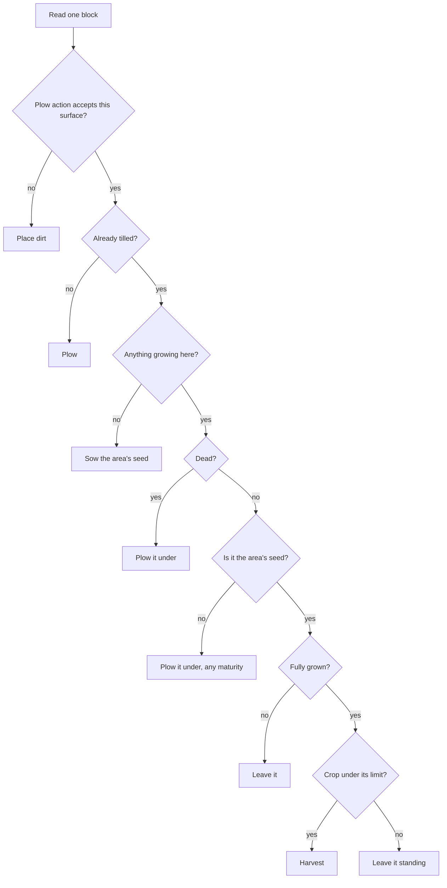
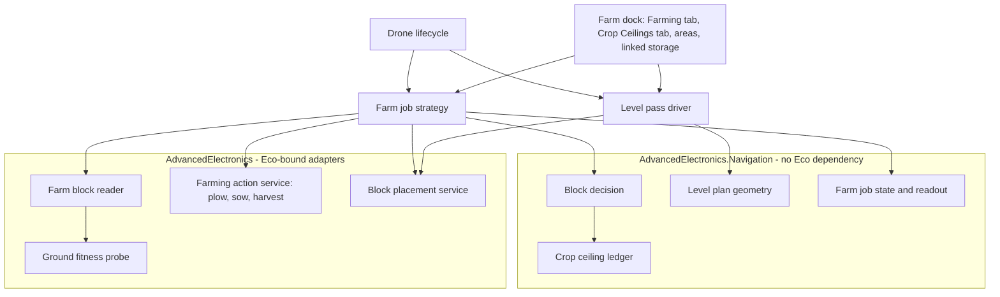

# Farming Drone Family - Plan

## Goal Capsule

- **Objective:** a settlement can hand a drone dock a patch of land and get a farm that runs itself — the ground is prepared, then plowed, sown, and harvested on the crop's own clock without a player intervening, with produce flowing into linked storage and stopping before it spoils.
- **Product authority:** the mod author, from live play on the test server. UX requirements are observed evidence; implementation bends to them.
- **Open blockers:** the shared queue, per-area automation, and multi-area assignment mechanics are being decided in the parallel mining-drone brainstorm and are consumed here, not defined here. Block placement has never been performed by this mod and its authorization path is unproven.

---

## Product Contract

### Summary

One craftable Farm Drone and two dock tabs: Farming, which assigns areas and reports what the drone is doing, and Crop Ceilings, which caps how much of each crop is harvested. The drone reads each block in its assigned areas and derives the action from what that block is — place dirt, plow, sow, harvest, or leave it alone — so farmland is prepared, planted, and gathered continuously without stages, phases, or a per-area status chain.

### Problem Frame

Farming is Eco's most repetitive manual chore. A settlement's food supply asks a player to plow, sow, and harvest the same plots on the crop's clock, indefinitely, and the timing is not optional: harvested produce spoils where standing crops do not, so a player who over-harvests loses food and a player who under-harvests loses the yield.

The mod's existing drones prospect and mine — they turn invisible underground work into a dig plan and then execute it. Nothing yet touches the surface loop that costs a settlement the most attention per season.

The ground work is its own barrier. A farm needs flat, plowable land, and today that means a player hand-digging a hillside before any farming can start at all.

### Key Decisions

- **One Farm Drone doing every farming job** (session-settled: user-directed — chosen over five specialist drones each with its own dock and tab: far fewer buildings and one autonomous loop). Governs R1, R2.
- **The drone decides per block, not per area** (session-settled: user-directed — chosen over a per-area stage chain the drone walks: with one drone there is no work to sequence between machines, and a block's own contents already say what it needs). Governs R13, R14.
- **Only two area markers survive, and neither drives the drone** (session-settled: user-directed — chosen over the full `[farm]`/`[tilled]`/`[planted]`/`[harvested]` chain: the stage marks existed to coordinate separate drones, which no longer exist; `[farm]` and `[flat]` stay because other systems will need them). Governs R6, R7, R8, R11, R12.
- **`[farm]` is set the moment an area is assigned** (session-settled: user-directed — chosen over a mark the drone earns by finishing soil work: an area's purpose is known when a citizen assigns it, not when the ground catches up). Governs R6, R7.
- **An unwanted plant is plowed under whatever its maturity** (session-settled: user-directed — chosen over harvesting a mature unwanted crop first: one rule converts an area to its new crop immediately, at the cost of a standing harvest when a player switches seed). Governs R14.
- **Levelling is a deliverable for people, not a step for the drone** (session-settled: user-directed — chosen over treating a flat surface as farming prep: the drone works irregular ground perfectly well, so the value of levelling accrues to hand and tractor farming, which is early-game help and a way to serve neighbours who do not use drones). Governs R8, R9, R10.
- **A farm releases ground by being unassigned, not by reaching a status** (session-settled: user-approved — chosen over a `[fallow]` retirement marker and over deriving release from an empty area: farmland never finishes the way a mine is exhausted, so there is nothing for a drone to earn, and the scarce overlay slots stay free). Governs R6.
- **Levelling sits outside the routine work, behind a per-area toggle** (session-settled: user-directed — chosen over levelling as ordinary block work: it is the one job with unbounded dig-and-haul cost, and a working farm must never re-level itself). Governs R17, R21.
- **Harvesting stops on per-crop quantity limits** (session-settled: user-approved — chosen over one storage-fill threshold: standing crops do not spoil and harvested ones do, so the ceiling has to be per crop). Governs R27.
- **Block placement is built as its own capability, not inside the farming job** (session-settled: user-approved — chosen over placement local to the job that needed it: the mining plan's deferred backfill and rim-closing need the same verb). Governs R14, R20.
- **`[farm]` ground is defined by what the plow action accepts** (session-settled: user-approved — chosen over a hand-maintained grass-and-dirt block list: nothing drifts from the engine's own rule, and grass regrowing on established farmland never re-triggers the soil work). Governs R14.
- **One crop per area, and a harvest ceiling that belongs to the crop rather than the area** (session-settled: user-approved — chosen over several crops per area and over a ceiling attached to each area: two areas growing corn answer to one ceiling). How ceilings are edited is an implementation choice owned by KTD6, not part of this decision. Governs R24, R25.
- **An area with no crop does nothing; an unset ceiling means no ceiling** (session-settled: user-directed — chosen over the earlier reading in which an unset ceiling was an unconfigured state that suppressed harvesting: a citizen who has not capped a crop wants all of it, so unlimited is the sensible default and only the area's crop is a genuine prerequisite). Governs R26.
- **The existing Harvest Drone becomes the Farm Drone.** A half-built drone already ships in the source running the wrong job with its recipe withheld; finishing it is cheaper than adding a second item beside it. Governs R1.

<!-- ce-section: work-relationships -->
### How This Work Fits Together

This plan owns the farming family: the Farm Drone, the Farming and Crop Ceilings tabs, the farm dock's area editor, and the block decision that drives every farming action. The relationships below are the current understanding, not a committed roadmap.

- Shared area status (`docs/plans/2026-08-21-001-feat-shared-area-status-plan.md`)
  - **Depends on** its area status model: it owns the area's exclusive lifecycle status slot, its bracketed status vocabulary, and its colour ramp, in which green already means surveyed and `[landfill]` and `[filled]` are already reserved.
  - **Shares** that vocabulary — `[farm]` and `[flat]` are non-exclusive annotations of the kind that plan already defines for `[assigned]` and `[unreachable]`: they never occupy the exclusive lifecycle slot and never take a colour from its ramp.
  - **Depends on** its per-plot edit rule, which preserves an area's recorded data for every plot a redraw retains rather than discarding it wholesale.
  - **Depends on** its overlap channel: areas are exchanged between docks regardless of distance, an area drawn over another dock's area is annotated rather than refused, and no drone acts on an overlapping plot while the overlap stands. That hard stop, not the `[farm]` marker, is what keeps mining drones out of farmland.
  - **Depends on** its in-use rule: a drone does not work a plot that also belongs to an in-use area of a different kind. In use means assigned to a dock with work still to do; an unassigned area is not in use, nor is one whose ground reads `[empty]`, while a `[cleared]` area still is, because its exclusion may lift.
  - **Depends on** its superseding rule: a dock working an area records its kind's data there, and that record is what tells every other dock what the ground is now for. Ground stops being mining ground because farming data arrived on it, not because a release was negotiated.
  - **Depends on** its rule that a drone's write on its own dock's area records that drone's own state instead of resetting the plot to unsurveyed, which is what keeps plowing from silently unsurveying ground.
- Mining drone (`docs/plans/2026-08-14-001-feat-mining-drone-plan.md`)
  - **Depends on** its queue, per-area automation, and multi-area assignment work — those mechanics are decided there and consumed here.
  - **Builds** a placement verb the mining plan also lacked when it deferred backfill and rim-closing. Whether it fits those is that plan's call once they have a shape; this plan promises nothing about them.
  - **Shares** the authorization shape — a hand-built action pack, law then property refusal classification, fail-closed invariants.
- Survey drone
  - **Shares** the area model and the map picker; the farm dock gets its own area editor of the same shape.
  - **Can proceed independently of** this work — a farm area never needs a survey.

### Actors

- A1. Settlement citizen — owns or has full access to the dock, draws and assigns farm areas, sets the level-first toggle, the seed selection, and the per-crop limits.
- A2. Farm dock — holds the drone, the area assignments and their configuration, the per-crop ceilings, the linked storage, and both tabs.
- A3. Farm Drone — the roaming world object that performs every farming action.
- A4. Linked storage — the dock's linked containers: the source of dirt and seeds, the destination for produce.
- A5. Settlement law and property authorization — may refuse any dig, placement, plow, sow, or harvest the drone attempts.

### Key Flows

- F1. Claiming ground
  - **Trigger:** A1 draws an area in the farm dock's area editor and assigns it.
  - **Actors:** A1, A2
  - **Steps:** The area is marked `[farm]` on assignment. The citizen picks the seed for it and, when the ground is uneven, turns on its level-first toggle.
  - **Outcome:** the area is designated farmland from the moment it is claimed, before any block has been touched, and any dock whose area overlaps it is annotated accordingly.
  - **Covers R5, R6, R7**

- F2. Preparing uneven ground
  - **Trigger:** an assigned area's level-first toggle is on and no plant is standing in it.
  - **Actors:** A2, A3, A4, A5
  - **Steps:** The drone samples the area's own surface columns to find the median, removes everything above it across the whole area, then fills every column below it — spending its banked spoil before drawing new dirt from linked storage.
  - **Outcome:** the area is flat, marked `[flat]`, and the toggle is cleared so it never levels again.
  - **Covers R17, R18, R19, R20, R21**

- F3. Working the ground
  - **Trigger:** the drone is dispatched to an assigned area.
  - **Actors:** A2, A3, A4, A5
  - **Steps:** For each block, the drone reads what is there and acts: cover it with dirt if the plow will not accept it, plow it if it is bare, sow it if it is tilled, harvest it if it holds a ripe plant of the area's seed and that crop is under its limit, plow it if it holds any other plant, and leave it alone if it holds a plant still growing.
  - **Outcome:** an area converges on planted farmland and stays there, with produce arriving in linked storage as it ripens.
  - **Covers R13, R14, R24, R27**

- F4. Nothing to do
  - **Trigger:** every assigned area is either waiting on growth or unable to proceed for want of a material.
  - **Actors:** A2, A3, A4
  - **Steps:** An area short of dirt or seed is marked blocked with its reason and the drone moves to one that is not. When no area can be worked, the drone returns to the dock and idles — waking when linked storage changes, or when the next crop is due to ripen.
  - **Outcome:** the drone never polls and never stalls the whole farm on one missing material.
  - **Covers R26, R28, R29, R30**

- F5. A refused action
  - **Trigger:** A5 refuses a dig, placement, plow, sow, or harvest the drone attempted.
  - **Actors:** A3, A5
  - **Steps:** The drone stops attempting that action on that block rather than retrying in place, and records the refusal as a law or property refusal distinct from a material stall.
  - **Outcome:** a settlement that outlaws an action stops it, visibly, without the drone thrashing.
  - **Covers R4, R36**

### Requirements

**The drone and its dock**

- R1. A single craftable Farm Drone performs all farming work. The Harvest Drone already in the source becomes it — its withheld recipe is completed, its job kind corrected, and the ore sensor it inherited removed.
- R2. A dock with a Farm Drone slotted shows a Farming tab and a Crop Ceilings tab. There is no per-job tab and no job picker: the second tab is a different kind of setting, not a second job.
- R3. The drone carries the Mining Arm for the levelling dig and the Harvest Arm for plowing, sowing, and harvesting.
- R39. The Farm Drone's own description states that it harvests base yield, without the skill and talent bonuses a citizen's own harvest earns. A player reads it before crafting, which is when the trade-off is worth knowing.
- R4. The Harvest Arm is never crafted, held, or placed, and a settlement's law editor offers it in the tool pickers for the plow, sow, and harvest-or-hunt actions. Block placement likewise names a tool the law editor offers, so a settlement can regulate placement on its own.

**Areas and markers**

- R5. The farm dock has its own area editor, of the same shape as the survey dock's: draw, rename, and delete areas the dock owns.
- R6. Assigning an area to the farm dock marks it `[farm]` at that moment, before any block is touched.
- R7. `[farm]` declares the area farmland. It is this kind's record on the area — what tells every other dock the ground is farmland — and the drone never reads it back. Farming records nothing per plot: the Farm Drone decides from the ground each time, so a stored belief about a plot would have no reader and could only go stale.
- R8. `[flat]` marks an area whose surface is flat enough to farm by hand or by tractor. It is for the people the drone is not: a player without drones yet, or a neighbour who farms manually — neither of whom can work the irregular ground a drone handles fine.
- R9. `[flat]` is re-derived from the ground rather than stored as an achievement. An area that stops being flat stops showing it.
- R10. `[flat]` has the lowest display priority of any overlay. It is hidden whenever a higher-priority tag needs the room and shows again once the room is free. It yields for want of space alone — what it says about the ground stays true and useful while a drone is working the area, because a citizen can farm that ground by hand at the same time.
- R11. Both markers are non-exclusive annotations. Neither occupies the area's lifecycle status slot, neither carries a line colour of its own, and either may show alongside whatever lifecycle status the area holds.
- R12. Neither marker is read by the drone to decide what to do. Both survive a rename, and a redraw re-scopes which blocks the area covers while retaining both markers and the recorded data for every plot the edit keeps.

**The block decision**

- R13. The drone evaluates each block in an assigned area on its own and derives the action from what that block currently is, never from the area's history or markers.
- R14. The block rules, in order of precedence:
  - a surface the plow action will not accept gets dirt placed on it;
  - a plowable, untilled surface is plowed;
  - tilled ground with nothing growing is sown with the seed of the area's crop;
  - a dead plant is plowed under whatever it was: it will never ripen, and nothing else in these rules would ever clear it;
  - a fully grown plant of the area's crop is harvested when that crop is below its ceiling, and left standing when it is at or above it;
  - any plant that is not the area's crop is plowed under, whatever its maturity;
  - a plant of the area's crop that is still growing is left alone.
- R15. A block the drone cannot remove, cannot build on, or cannot reach is skipped with a reason and does not fail the area.
- R16. A citizen may work an area by hand while it is assigned to a drone. The drone reads blocks rather than tracking its own past work, so hand-plowed, hand-sown, and hand-harvested blocks are simply the ground's current state.

**Levelling**

- R17. Each assigned area carries a level-first toggle, off by default, and the drone levels an area only while that toggle is on.
- R18. The level pass refuses to start on an area with any plant standing in it, and reports why.
- R19. The levelling target is the median of the area's own surface heights, sampled by the level pass itself.
- R20. The level pass removes every block above the target across the whole area before it fills any column below the target. Spoil the drone banks in linked storage when its hold fills still counts as its own material, and new dirt is drawn only for the shortfall.
- R21. An area whose level pass completes is marked `[flat]`, and its level-first toggle is cleared.

**Materials, stalls, and stopping**

- R22. Dirt and seeds are drawn only from the dock's linked storage, and produce is unloaded only into it.
- R23. A drone whose hold is full returns to the dock and waits there until an unload succeeds.
- R24. Each area carries exactly one selected crop, chosen from a picker showing every crop the game defines. The drone resolves that crop to its seed and sows only that seed there, even when carrying others. An area's crop is its own: selecting an area shows that area's crop, and choosing a crop replaces the previous choice rather than adding to it.
- R25. The dock holds a harvest ceiling per crop: a quantity at or above which that crop stops being harvested. A crop with no ceiling set is harvested without limit, and setting a ceiling to zero is how a citizen removes it. The ceiling belongs to the crop, not to an area, so every area growing that crop answers to the same one.
- R26. An area with no crop selected is worked not at all — no dirt, no plowing, no harvest — and is reported as awaiting a crop. An unset ceiling is not an unconfigured state to report: it means harvest without limit, which is the default every crop starts at.
- R27. A crop whose quantity across the dock's own linked storage is at or above its configured limit is not harvested, and its ripe plants are left standing.
- R28. An area that cannot be worked for want of a material is marked blocked with its reason, and the drone moves to an area that can be.
- R29. An area whose only remaining work is waiting for a crop to ripen is not blocked, and does not count toward the idle condition for want of material.
- R30. When no area can be worked, the drone idles at the dock and wakes on a change to the dock's linked storage or on the next crop coming due — never on a poll.
- R31. The drone schedules its return to an area from the maturity of that area's least-grown plant, rather than by sweeping its assignments.

**Ground fitness**

- R32. Before sowing a plot the drone asks the engine whether the area's crop can grow there, and does not sow a plot it cannot grow in. Fitness is a property of the plot and the crop together, so a plot unfit for one seed may suit another.
- R33. The drone never remediates unfit ground. Ground becomes workable again on its own terms once the condition that made it unfit has lifted.
- R34. An unfit plot does not stall the area around it — the rest of the area is worked normally.
- R38. An unfit plot is reported with the condition the engine gives — most often ground pollution, but temperature and moisture can refuse a plot too. The readout names the condition rather than calling every refusal contamination.

**Readout**

- R35. The Farming tab lists each assigned area with its markers, its crop, what the drone will do there next, and — when it will do nothing — whether that is a missing crop selection, a missing material, a reached ceiling, growth still running, unfit ground, or plots held by an overlap with another dock's area.
- R36. A refusal by settlement law or property authorization is reported as such, distinguishable from a material stall.
- R37. The readout warns when an action would collide with another player's area and names the consequence, without revealing that area's contents.

### Acceptance Examples

- AE1. **Covers R14.** Given a block holding a corn plant three-quarters grown in an area whose seed is corn, when the drone evaluates it, then nothing happens to that block and the drone moves on.
- AE2. **Covers R14.** Given a block holding fully grown wheat in an area whose seed is corn, when the drone evaluates it, then the wheat is plowed under without being harvested.
- AE3. **Covers R14, R27.** Given ripe corn in a corn area and corn already at its configured limit in linked storage, when the drone evaluates the block, then the corn is left standing and the block is revisited once the limit rises.
- AE4. **Covers R6, R7.** Given a citizen who assigns a freshly drawn area of raw hillside, when the assignment lands, then the area is `[farm]` immediately, before any dirt has been placed.
- AE5. **Covers R18.** Given an area with a standing crop whose level-first toggle a citizen turns on, when the drone next evaluates that area, then the level pass does not run and the tab says why.
- AE6. **Covers R20.** Given an area whose above-target material exceeds the drone's hold, when the level pass runs, then the drone unloads spoil to linked storage mid-pass and later draws that same material back for the fill before requesting new dirt.
- AE7. **Covers R28, R29, R30.** Given one area short of seed and another whose crop is still growing, when the drone evaluates its assignments, then the first is reported blocked, the second is reported as waiting on growth, and the drone idles at the dock until storage changes or the crop comes due.
- AE8. **Covers R4, R36.** Given a settlement law that forbids plowing with the Harvest Arm, when the drone attempts a plow, then the plow does not happen and the tab reports a law refusal rather than a missing material.
- AE9. **Covers R26.** Given an assigned area with no crop selected, when the drone evaluates its assignments, then that area is left entirely untouched and the tab reports it as awaiting a crop.
- AE10. **Covers R25, R27.** Given corn with a ceiling of 300 and 300 corn already in linked storage, and wheat with no ceiling set, when the drone evaluates ripe blocks of each, then the corn is left standing and the wheat is harvested however much is already stored.

### Success Criteria

- A player can leave a farm unattended for a full crop cycle and return to find nothing harvested beyond each crop's configured limit and nothing left standing past maturity under it.
- A settlement can regulate dig, placement, plow, sow, and harvest through its existing law tooling, at whatever granularity the engine's own action types expose.
- A blocked or waiting farm never busy-loops: an idle drone consumes no fuel and makes no dispatch attempts while it waits.
- The Farming tab answers "why is nothing happening?" without the player reading a log or a chat command.
- A player who hand-plows a corner of a farm, or hand-plants a row, does not confuse the drone — it reads the ground, so any hand-edit is simply the new state.

### Scope Boundaries

- The queue, the per-area automation control, and multi-area assignment are defined by the mining-drone work and consumed here.
- Keeping other drones off farmland is not built here and needs no farming-side mechanism: the shared overlap stop already halts both sides on any plot two areas share.
- Mining backfill and rim-closing are not delivered here, and this plan does not claim to have unblocked them. Backfill still has to decide how rock returns to the ground, which is a material question placement does not answer.
- No livestock, fertilizer, irrigation, or crop-rotation planning.
- No multi-slot dock: a dock still holds one drone, and parallel farms mean more docks.
- No new Unity content beyond finishing what the Harvest Drone prefab already ships, including its existing harvest animation state.
- No crop selection advice or yield economics — which crop to grow stays the player's call.

### Dependencies / Assumptions

- Depends on the parallel mining-drone brainstorm for queue, automation, and multi-area assignment. That work takes precedence; this contract states requirements against its outcome.
- Depends on the shared-area-status work for the area's status model, vocabulary, and colours. `[farm]` and `[flat]` are non-exclusive annotations under that plan's own rule for markers describing something other than the ground's mining lifecycle.
- That plan returns plots to unsurveyed when ground changes and the mod's own drones did not make the change, and reports the mod's own mining as mined instead. A farming block write is a third case — the mod's own change, but not mining — so it must neither unsurvey a plot nor read as mined. Whether farming writes inside an overlapping survey area should still invalidate that survey is unresolved and belongs to that plan.
- Farming has no terminal status of its own: farmland never finishes the way a mine is exhausted, so there is no fact for a drone to discover. Claims attach to assignments rather than to areas, so a farm holds ground while it is assigned and holds none once it is not.
- Unassignment ends a claim rather than suspending it. Re-assigning a farm over ground another area has since claimed is a new claim meeting whatever holds that ground now, and needs no separate rule for reversibility.
- The block rule plows under any plant that is not the area's crop, and a citizen may farm an area by hand while a drone is assigned to it. A citizen who hand-plants a different crop inside a farm area therefore loses it to the drone. This is an accepted consequence of one crop per area, not a defect to design around.
- A farm that is unassigned between cycles holds no ground in that window. This plan does not idle farms that way — an assigned area stays assigned while its drone waits on growth, storage, or a limit — so the window opens only when a citizen deliberately stops farming that ground.
- `[flat]` being re-derived means the level pass's result is re-checked against the ground rather than trusted, which costs a surface sample the drone already knows how to take.
- Farmland protection rides entirely on the shared overlap stop. Two consequences follow: a farm needs no protective mechanism of its own, and a farm area drawn over any other dock's area stops the Farm Drone too, on exactly the plots that overlap.
- The survey-then-mine-then-farm progression over one piece of ground works because area kind already separates the two: a mining drone does not work farm areas at all, so mining ground that is being farmed cannot arise by construction. Farming follows mining onto ground whose mining area is no longer in use, and the farming data the drone records is what makes that ground farmland from then on. `[empty]` is a waypoint the next kind supersedes, not a permanent condition.
- Ground fitness is this drone's test to make, not the survey or mining sensing path's. The engine rates a plot for a given species from pollution, temperature, moisture, and salt water together, so the test is per crop rather than a single contamination flag; R32 owns the check and KTD5 owns how it is read.
- A landfill contaminates neighbouring plots, not only its own, and an exhausted area may be designated a permanent landfill. Farms sited beside one will have ground go unfit under them. The landfill work is deferred elsewhere; the siting consequence is recorded here because it lands on farmland.
- The channel over which docks exchange area geometry is internal and never a player-facing view. R37 therefore warns about a collision and names its consequence without exposing another player's area contents, and no farm gains sight of another player's areas by sitting near them.
- Block placement has never been performed by this mod, and `docs/plans/2026-08-14-001-feat-mining-drone-plan.md` deferred backfill for that reason. The action type and pack shape are partly exercised already — the mining removal path constructs a pickup action inside its pack — so what is unproven is the placement direction and a world write in place of a delete, not the whole mechanism.
- Assumed that Eco exposes a plow action and a sow action a law can name a tool for, and that a plant's growth or maturity is readable. The mod today touches plants only to destroy them, so none of this is exercised anywhere in the repo. R14 binds the dirt test to the ground the plow action accepts, so establishing that set is load-bearing rather than incidental.
- A standing plant carries maturity, from zero to one, and nothing else that erodes: no durability, no decay. A fully grown crop left in the ground keeps indefinitely. Spoilage belongs to the harvested item, which is why R27's ceiling is a real spoilage guard — leaving a crop unharvested is the safest way to store it. A plant can still die of ground pollution and become unharvestable or yield nothing, which costs the crop but is not decay. A dead plant never recovers, so R14 clears it rather than waiting on it. Ground turning polluted after sowing is the ordinary way this arises, since R32's gate runs only before sowing.
- How fast produce decays once unloaded follows the player's choice of container and is out of scope. That it decays at all, everywhere including the drone's hold, is not.
- The per-area median surface height persisted on a survey area is written only by a survey pass and zeroed when findings are cleared, so it carries no usable value for a farm area that is never surveyed. R19 therefore has the level pass sample the surface itself, which the mod can already do per column without a survey.
- The dock today observes only its own drone-bay slot — the existing storage subscription spawns and despawns the paired drone and never fires for linked containers. R30 requires a new subscription across the inventories the dock's link resolves, and a release of those subscriptions when the dock is destroyed or the link network changes.
- Un-withholding the Harvest Drone's recipe requires fixing the in-flight arm behaviour recorded as the reason it was withheld, which is client-side work this contract's scope boundary otherwise excludes.
- A law's tool filter matches by exact item membership, so tagging the Harvest Arm makes it selectable in a law editor but does not make it match laws written before it existed.
- Levelling and mining both use the Mining Arm, so a law naming that tool reaches both the Farm Drone's level pass and the Mining Drone.

### Outstanding Questions

**Deferred to implementation**

- Whether two farm docks may hold the same area, and if so what stops both drones working the same blocks. Owned by the shared-area-status plan's claim model, not resolvable here.
- Whether a ceiling row can render the crop's icon beside its name, or whether autogen limits the left column to the member's own name as plain text. The grid works either way; the icon is the open part.
- Whether the level pass's per-dispatch budget (KTD12) is tuned right for a large area. The number is a starting point to observe, not a derived value.

### Sources / Research

- `EcoServerMod/AdvancedElectronics/MiningRemovalService.cs` — the authorization shape every farming action should follow: a hand-built action pack, a re-check change set immediately before performing, law-then-property refusal classification, and fail-closed invariants. Already raises a harvest action when destroying a plant, with no yield attached, and already constructs the pickup half of a block action.
- `EcoServerMod/AdvancedElectronics/MiningArm.cs` — why the Harvest Arm must be a plain, non-hidden, tagged item, and the recorded finding that a hidden category kept the Mining Arm out of law tool pickers.
- `EcoServerMod/AdvancedElectronics/SurveyAreaEntry.cs` — the per-area fields the farm markers join, and the survey-only median surface that R19 deliberately does not reuse.
- `EcoServerMod/AdvancedElectronics/SurveyAreaPicker.cs` — the area editor R5 mirrors for the farm dock, including its rename and delete affordances.
- `EcoServerMod/AdvancedElectronics/EcoWorldSampler.cs` — the per-column surface read the level pass uses to compute its own median.
- `EcoServerMod/AdvancedElectronics/CargoUnloader.cs` and `EcoServerMod/AdvancedElectronics/MiningStrategy.cs` — the linked-storage unload and the wait-docked-when-full behaviour R23 reuses.
- `EcoServerMod/AdvancedElectronics/DroneDock.cs` — the dock's linked-storage components and its existing drone-slot subscription, which R30's wake source must not be mistaken for.
- `EcoServerMod/AdvancedElectronics/HarvesterDrone.cs` — the existing Harvest Drone, its withheld recipe and the reason recorded for withholding it, the inherited ore sensor, and the wrong job kind R1 corrects.
- `EcoServerMod/AdvancedElectronics/JobStrategy.cs` — the seam between drone lifecycle and parked work the block decision plugs into.
- `EcoServerMod/AdvancedElectronics.Navigation/` — the Eco-free navigation and job core; the block decision is a pure function of block state and area configuration and belongs there.
- `docs/plans/2026-08-21-001-feat-shared-area-status-plan.md` — the area status model, vocabulary, and colour ramp this work extends.
- `docs/plans/2026-08-14-001-feat-mining-drone-plan.md` — the deferred placement capability and the single-area assignment model this work builds past.
- `docs/solutions/design-patterns/vertical-stack-only-ui-design.md` and `docs/solutions/runtime-errors/n-editable-members-cannot-share-one-field.md` — the constraints the Farming tab's controls must fit.

---

## Planning Contract

**Product Contract preservation:** changed R32, R33, R38 — engine research showed habitability is rated per plant species from pollution, temperature, moisture, and salt water together, so the original absolute-contamination test could not be built as written. R32 keeps its core intent (test before working, skip what is unfit) and is now per crop; R33 keeps "never remediate" unchanged; R34 keeps "does not stall" unchanged; the split-out reporting rule takes the next unused ID, R38. Every other requirement, actor, flow, acceptance example, and Key Decision is unchanged.

### Key Technical Decisions

- KTD1. **Every farming action is a hand-built `GameActionPack`.** Eco's one-call farm helpers route through a `MultiblockActionContext` carrying a `Player`, and the drone has a stamped `User` who may be offline and never a `Player`. The harvest path is a hard block: it dereferences `player.User` with no null guard. Plow and place are a softer one — their action bodies null-guard every player access, but the context constructors that build their input require a non-null `Player`. Either way no helper is reachable, so all four verbs are hand-built. This is the same conclusion `MiningRemovalService` already reached for digging; farming follows its shape rather than inventing a second one. Governs R14, R20, R24, R27.
- KTD2. **The drone computes harvest yield itself, without skill or talent bonuses** (session-settled: user-approved — chosen over routing through Eco's player-bound yield path: that path needs a `Player` the drone does not have, and base yield is a legible trade for farming nobody has to attend). Yield comes from the species' own resource list and roll; the citizen's skills, talents, and freshness bonuses do not apply. R39 puts this on the drone's description so it reads as a stated trade rather than a defect. Cites R27, R39.
- KTD3. **A block is due for plowing when it is tillable and not already tilled.** `TilledDirtBlock` derives from `DirtBlock` and Eco's `BlockAttribute` is declared `Inherited = true`, so tilled ground still answers yes to a bare tillable test. A single-predicate test would re-plow a planted field forever. Cites R14.
- KTD4. **The ripeness wake is timed, not event-driven** (session-settled: user-approved — chosen over subscribing to a ripeness event: the engine raises none, so there is nothing to subscribe to). The drone reads the remaining maturity hours the engine already tracks on the least-grown plant in an area, sleeps until then, and re-checks on arrival. Arriving early costs a trip, not correctness. Cites R30, R31.
- KTD5. **Ground fitness is asked per species, not measured as absolute pollution** (session-settled: user-approved — chosen over an absolute contamination threshold: Eco rates a plot for one species at a time, and each species carries its own pollution tolerance alongside temperature, moisture, and salt-water ranges). The drone asks the engine to rate the area's crop at the plot and treats a rating below the engine's own minimum-habitability constant as unfit — not merely a zero rating. The engine kills or refuses to spawn plants anywhere under that constant, so a nonzero rating beneath it is lethal ground the drone must not sow. Read the threshold from the engine constant rather than restating its value, so it cannot drift. Cites R32, R38.
- KTD6. **Ceilings are edited as one row per crop on a dedicated tab, and the tab scrolls** (session-settled: user-directed — chosen over a one-crop-at-a-time cursor: seeing every crop's ceiling at once beats stepping through them, and the store screen already establishes scrolling as normal in this game). Each row is a crop's own quantity field, so no two controls share a backing field. The set is sized to cover every crop the game defines with headroom, per the repo's rule that a compile-time pool is sized by real use rather than by a layout preference; a crop added by another mod after build falls to the chat-command overflow. Cites R25.
- KTD7. **The block decision is a pure function in the Eco-free navigation core.** The Eco layer reads a block and fills a facts record — is the surface tillable, is it already tilled, is a plant standing, whose species, is it dead, how grown, is the crop under its ceiling — and the core returns one action. Nothing in the decision touches an Eco type, so every rule in R14 is unit-testable without a server. Instantiates the Key Decision on deciding per block; cites R13, R14.
- KTD8. **Sowing goes through the engine's seed-action helper, which takes a `User`.** It is the one vanilla farm path that never asks for a `Player`: it adds a plant-seeds action to a caller-supplied pack, subtracts the seed from a supplied inventory, and performs as the given citizen. The drone supplies the dock's linked storage as the inventory and the stamped citizen as the seeder. Cites R14, R24.
- KTD9. **Block placement is a standalone service, not a farming-local helper.** It takes positions, a block type, a source inventory, and the stamped citizen, and returns the same refusal classification the removal service returns. Farming is its only consumer here, and the plan makes no claim about what other work will need — whether it suits the mining plan's deferred backfill is for that plan to judge once backfill has a shape. Instantiates the Key Decision on block placement as its own capability; cites R14, R20.
- KTD10. **No mod-side bookkeeping tracks which blocks are tilled.** When a harvest kills the plant, Eco itself reverts the tilled block underneath to plain dirt. The block decision therefore sees bare tillable ground on the next visit and re-plows it without the mod remembering anything. This is what makes R7's "farming records nothing per plot" hold at the block level too. Cites R7, R14.
- KTD11. **Farm areas reuse the existing area entry and a new dock partial.** A farm area is the same serialized area type a survey dock owns, and the dock's farming state lives in a `DroneDock.Farming.cs` partial mirroring the mining one — assigned areas, each area's crop, each area's level-first toggle, and the per-crop ceilings. No parallel area type is introduced. Cites R5, R6, R12.
- KTD12. **The level pass is bounded per dispatch.** The drone removes or fills up to one plot's worth of columns per trip, then yields to the ordinary block work on its other areas. An unbounded pass on a large hillside would otherwise monopolise the drone for a full season. Cites R17, R21.
- KTD13. **The hold reserves nothing.** The drone draws seed and dirt for the trip it is starting, works until the hold is full, and returns — the same full-hold rule the mining strategy already uses. A reserved partition would need a per-verb inventory restriction, and the repo's own finding is that one restriction governs one verb, which does not fit a hold holding produce, seed, and dirt at once. Cites R22, R23.
- KTD14. **The area's crop is chosen with the engine's own tag-filtered item picker.** The survey tab already renders one for its material targets — a picker list constrained by a required tag, costing one row and opening a popup for the selection itself. Farming uses the same control filtered to the game's crop tag. The picker is bound to the area the cursor names rather than declared per area, so one control serves every area and no two controls share a backing field. Selecting a crop replaces the area's previous choice; the picker never accumulates. Cites R24, R5.
- KTD15. **Crop and seed are resolved through the engine's species, not by name.** A citizen picks a crop — the harvested item — and the drone needs the seed that grows it. Each seed declares the species it plants, and each species declares what it yields, so the mod builds the crop-to-seed map once at startup by walking every seed the game defines. Name matching would break on any crop whose seed is not named after it, and on anything another mod adds. A crop the map cannot resolve to a seed cannot be an area's crop, and the picker's tag is broader than the sowable set — it includes wild-harvested things — so this case is normal, not exceptional. Cites R24, R14.

### High-Level Technical Design

The farming work layers the same way the mining work does: a pure decision core, an Eco adapter per engine surface, one job strategy plugged into the existing drone lifecycle, and a dock tab. Only the adapters know Eco types.

Each of the four world-writing verbs builds its own pack, and all four share one shape, established by the mining removal service: fill the engine's own action types with the stamped citizen through the direct citizen-taking overload, add a pretest change set that re-reads the world immediately before performing, assert the fail-closed invariants, perform with no dry-run and no force, then classify a refusal as settlement law before property.

| Verb | Engine action raised | What the pack also carries |
|---|---|---|
| Place dirt | block dropped | remove one dirt item from linked storage; set the block as a post-effect |
| Plow | plow field | set the tilled block as a post-effect; destroy any plant above |
| Sow | plant seeds | subtract one seed from linked storage; spawn the plant as a post-effect |
| Harvest | harvest or hunt | attach the computed yield stacks; add them to the hold; destroy the plant |

### System-Wide Impact

- **A new job kind.** The drone job enum gains a farming member, and the lifecycle's strategy factory gains a third branch. The existing survey and mining branches are untouched, but the factory stops being a two-way test.
- **Two new dock tabs, one of them a new shape.** The Crop Ceilings tab is the first dock surface that scrolls a row per game-defined thing rather than fitting a fixed budget, and it sets the precedent for any later per-thing configuration. The Farming tab stays a readout.
- **A placement verb where there was none.** Block placement did not exist in this mod, and the authorization pass for a world write in the additive direction had never been done. Other work that needs to put a block back now has somewhere to start, without this plan predicting what that work will require.
- **A new dock subscription.** Watching linked storage for the wake in R30 adds the mod's first subscription across inventories the dock does not own. Its release path on dock destruction and on link-network change is the leak risk.
- **Law surface.** A settlement gains four more regulatable verbs against this mod's drones. The Harvest Arm carrying plow, planter, and harvester tags is what puts them in the law editor's tool pickers.

### Risks & Dependencies

- **Placement is unproven.** No world write in the additive direction has ever been performed by this mod. The pretests Eco applies to placement — occupancy, deep-ocean building, block availability — are read from the engine's own placement helper rather than reproduced from memory, and are the most likely source of a silent no-op. U6 is deliberately first among the Eco-bound units so this is discovered early.
- **Produce decays in the drone's hold.** Spoilage attaches to the harvested item, and the hold is a storage like any other, so a drone that harvests and then cannot unload is losing food the whole time it waits. R23 has a full drone wait at the dock for an unload to succeed; that wait has a cost the plan does not otherwise price.
- **Base yield may disappoint.** KTD2 gives the drone an unbonused harvest, and R39 states it on the item so it is not discovered as a surprise. Whether it reads as a fair trade even when stated is a live-play question, not a code question.
- **The sibling plans move underneath this one.** The marker channel, the overlap stop, the in-use rule, and the queue all belong to plans being written in parallel. U11 and U13 consume them and must not reimplement them.
- **Client work is in scope after all.** Un-withholding the Farm Drone's recipe requires fixing the in-flight arm behaviour recorded as the reason it was withheld — Unity work the Scope Boundaries otherwise exclude. U15 carries it.

### Engine Reference

Paths beginning `Server/` refer to the Eco game source in the local Eco checkout, external to this repo, and will not resolve here. Paths beginning `EcoServerMod/` or `docs/` are in-repo.

- **Plow.** Action type `PlowField`, a block add-remove action requiring consumer access, with its tool picker filtered to the `Plow` tag. Vanilla's hoe and the steam tractor's plow both target the `Tillable` block tag and set `TilledDirtBlock`. `Server/Mods/__core__/Tools/HoeItem.cs`, `Server/Mods/__core__/Items/SteamTractorAttachments.cs`, `Server/Eco.Gameplay/GameActions/GameActions.cs`.
- **Tillable ground.** The `Tillable` block attribute and matching tag. `DirtBlock` and `GrassBlock` carry it; frozen soil, ice, snow, ocean sand, and river sand unset it. `TilledDirtBlock` derives from `DirtBlock` and does not unset it — the basis for KTD3. `Server/Eco.World/Blocks/TerrainBlocks.cs`, `Server/Eco.World/Blocks/BlockAttributes.cs`.
- **Sow.** Action type `PlantSeeds`, tool picker filtered to the `Planter` tag. The seed-action helper takes a `User`, a species, a spawn position, and an optional tool, and performs as that citizen — the basis for KTD8. `Server/Eco.Gameplay/Plants/PlantGameActions.cs`. Vanilla requires the block below to be tilled and the spawn block itself to be empty.
- **Harvest.** Action type `HarvestOrHunt`, tool picker filtered to the `Harvester` tag. The plant entity's ripeness gates and its yield calculation both take a `Player` and dereference it — the basis for KTD1 and KTD2. `Server/Eco.Gameplay/Plants/PlantEntity.cs`.
- **Post-harvest soil.** The plant entity reverts a tilled block beneath a killed plant to plain dirt — the basis for KTD10. `Server/Eco.Gameplay/Plants/PlantEntity.cs`.
- **Maturity.** Growth percent lives on the organism; the species carries its pickable-at threshold, post-harvest regrowth, whether harvesting requires ripeness, and whether scything kills. The plant tracks remaining hours to maturity as a public field. No event fires when a plant becomes ripe — the basis for KTD4. `Server/Eco.Simulation/Agents/Plant.cs`, `Server/Eco.Simulation/Types/PlantSpecies.cs`.
- **Habitability.** The species rates a position from the ground-pollution-spread world layer plus temperature, moisture, and salt water, against its own per-species tolerances — the basis for KTD5. `Server/Eco.Simulation/Types/PlantSpecies.cs`, `Server/Eco.Simulation/WorldLayers/WorldLayerNames.cs`. The same class declares a minimum-habitability constant described as the level below which plants die or never spawn, and the growth simulation enforces it twice by collapsing any lower rating to zero. That constant, not zero, is the fitness cutoff. `Server/Eco.Simulation/WorldLayers/LayerInteractions/ProducerSpeciesGrowth.cs`.
- **Placement.** Eco's placement helper carries the pretests U6 must reproduce and raises a block-dropped action when asked. `Server/Eco.Gameplay/GameActions/AtomicActions.cs`.
- **Dirt item.** The block item wrapping `DirtBlock`. `Server/Mods/__core__/Items/LandscapeItems.cs`.
- **The crop tag.** `Crop` is a real tag with a registered definition, carried by 37 harvested items — Corn, Wheat, Beet, Tomato, Beans, Rice, Pumpkin, Taro and the rest, alongside wild-harvested things like mushrooms and flowers. Registered at build time, which is what the picker requires. `Server/Mods/__core__/Systems/TagDefinitions.cs`, `Server/Eco.Shared/SharedTypes/BlockTags.cs`, and the per-item declarations under `Server/Mods/__core__/AutoGen/Food/`.
- **The picker.** A tag-constrained picker list, rendered from a world object component tab and confirmed live in this mod. Its tag filter is evaluated against tags present at build time, so a tag registered at runtime is invisible to it. `EcoServerMod/AdvancedElectronics/SurveyComponent.cs` carries the working precedent and the recorded finding about build-time tags.
- **Crop to seed.** A seed declares the species it plants, and the species declares the resources it yields — the path KTD15 walks. Seeds also carry their own `Crop Seed` tag if the reverse direction is ever wanted. `Server/Eco.Gameplay/Items/SeedItem.cs`, `Server/Eco.Simulation/Types/PlantSpecies.cs`, and the per-seed declarations under `Server/Mods/__core__/AutoGen/Seed/`.

---

## Implementation Units

| Unit | Title | Key files | Depends on |
|---|---|---|---|
| U1 | Farm block facts and the block decision | `AdvancedElectronics.Navigation/FarmBlockDecision.cs` | — |
| U2 | Crop ceiling ledger | `AdvancedElectronics.Navigation/CropCeiling.cs` | — |
| U3 | Level plan geometry | `AdvancedElectronics.Navigation/LevelPlan.cs` | — |
| U4 | Farm job state and readout | `AdvancedElectronics.Navigation/FarmJob.cs`, `FarmReadout.cs` | U1, U2 |
| U5 | Harvest Arm tool item | `AdvancedElectronics/HarvestArm.cs` | — |
| U6 | Block placement service | `AdvancedElectronics/BlockPlacementService.cs` | U5 |
| U7 | Farming action service | `AdvancedElectronics/FarmingActionService.cs` | U5 |
| U8 | Ground fitness probe | `AdvancedElectronics/EcoGroundFitness.cs` | U1 |
| U9 | Farm area state and editor on the dock | `AdvancedElectronics/DroneDock.Farming.cs`, `FarmAreaPicker.cs` | U2 |
| U10 | Farming tab | `AdvancedElectronics/FarmingComponent.cs` | U4, U9 |
| U11 | Farm markers on the shared status channel | `AdvancedElectronics/DroneDock.Farming.cs` | U9 |
| U12 | Level pass driver | `AdvancedElectronics/LevelPassDriver.cs` | U3, U6, U9 |
| U13 | Farm job strategy and lifecycle wiring | `AdvancedElectronics/FarmingStrategy.cs`, `DroneLifecycle.cs` | U4, U6, U7, U8, U9, U12 |
| U14 | Linked-storage wake | `AdvancedElectronics/DroneDock.Farming.cs` | U13 |
| U15 | Harvest Drone becomes the Farm Drone | `AdvancedElectronics/HarvesterDrone.cs` | U13 |
| U16 | Crop Ceilings tab | `AdvancedElectronics/CropCeilingComponent.cs` | U2 |

Units U1 through U4 are pure C# and can be built and tested with no server. U5 through U8 are the Eco adapters, each independently verifiable in a live session. U9 through U15 assemble them.

### U1. Farm block facts and the block decision

**Goal:** the whole of R14 as a pure function, testable with no Eco types.

**Requirements:** R13, R14, R16. Covers AE1, AE2, AE3.

**Dependencies:** none.

**Files:**
- `EcoServerMod/AdvancedElectronics.Navigation/FarmBlockDecision.cs` — create
- `EcoServerMod/AdvancedElectronics.Navigation.Tests/FarmBlockDecisionTests.cs` — create

**Approach:**
1. Define a `FarmAction` enum with one member per R14 outcome plus a leave-alone member.
2. Define a facts record the Eco layer fills per block: whether the surface accepts the plow, whether it is already tilled, whether a plant stands on it, that plant's species identity, whether it is dead, whether it is fully grown, and whether the area's crop is under its ceiling.
3. Write the decision as a single ordered evaluation matching R14's precedence exactly. The order is normative; do not reorder for readability.
4. Species identity is an opaque key the core compares for equality — never an Eco type. The adapter decides what the key is.

**Patterns to follow:** `EcoServerMod/AdvancedElectronics.Navigation/MiningJob.cs` for a pure job type with an outcome enum and no engine dependency; `IBlockClassifier.cs` for the facts-in, classification-out seam shape.

**Test scenarios:**
- Covers AE1. A plant of the area's seed at three-quarters growth returns leave-alone.
- Covers AE2. A fully grown plant of a different species returns plow, and the same species at every maturity below full also returns plow.
- Covers AE3. A fully grown plant of the area's seed returns harvest when under the ceiling and leave-alone when at it.
- A surface the plow does not accept returns place-dirt, even when a plant stands on it.
- Tilled ground with nothing growing returns sow.
- Tillable ground that is already tilled does not return plow.
- Tillable ground that is not tilled returns plow.
- The precedence holds when two rules could fire: an unaccepted surface beats every plant rule.
- A dead plant of the area's own crop, below full growth, returns plow rather than leave-alone. Without the dead rule this case reads as still-growing and holds the plot forever.
- A dead plant of another species also returns plow, reaching the same outcome by either rule.

**Verification:** every R14 clause has at least one test naming its input and its returned action, and the tests pass with no Eco reference in the test project.

### U2. Crop ceiling ledger

**Goal:** the per-crop harvest ceiling of R25 as a pure lookup.

**Requirements:** R25, R27.

**Dependencies:** none.

**Files:**
- `EcoServerMod/AdvancedElectronics.Navigation/CropCeiling.cs` — create
- `EcoServerMod/AdvancedElectronics.Navigation.Tests/CropCeilingTests.cs` — create

**Approach:**
1. Model a ceiling as a crop key and a quantity, where absent or zero means no ceiling. There is no third state to model: R25 makes unlimited the default rather than a setting.
2. Expose one question: given a crop key and the quantity currently stored, may it be harvested? Unconfigured answers no, unlimited answers yes, a quantity answers by comparison.
3. The ledger answers for any crop, including one it holds no entry for, so callers never null-check a missing ceiling.

**Patterns to follow:** `EcoServerMod/AdvancedElectronics.Navigation/HoldLedger.cs` for a small pure ledger type with one question and no engine dependency.

**Test scenarios:**
- Covers AE10. A crop with no row answers no and reports awaiting-a-ceiling; a crop on an unlimited row answers yes at any stored quantity.
- A crop at exactly its configured quantity answers no.
- A crop one below its configured quantity answers yes.
- A crop configured to zero answers no at zero stored.
- Unconfigured and unlimited are distinguishable in the answer, not only in the stored value.

**Verification:** a crop with no entry and a crop with a zero ceiling both answer "harvest it", and a crop at or above its ceiling answers "leave it", from the ledger alone.

### U3. Level plan geometry

**Goal:** the levelling target and the remove-then-fill ordering of R19 and R20, computed from sampled surface heights.

**Requirements:** R19, R20. Covers AE6.

**Dependencies:** none.

**Files:**
- `EcoServerMod/AdvancedElectronics.Navigation/LevelPlan.cs` — create
- `EcoServerMod/AdvancedElectronics.Navigation.Tests/LevelPlanTests.cs` — create

**Approach:**
1. Take a set of columns with their surface heights and return the median target, the columns above it with their excess, and the columns below it with their shortfall.
2. Expose the work as two ordered phases so a caller cannot fill before it has removed — R20's ordering is a property of the plan, not of the driver's discipline.
3. Account banked spoil separately from newly drawn dirt, so the driver can spend what it already removed before requesting more.
4. The plan carries no Eco types and does not know how a column is sampled.

**Patterns to follow:** `EcoServerMod/AdvancedElectronics.Navigation/ShaftPlan.cs` for a pure geometry plan with ordered layers.

**Test scenarios:**
- An odd column count returns the middle height; an even count returns a target consistent with the median rule chosen, and the test names which.
- A perfectly flat area returns no removals and no fills.
- Covers AE6. Removal volume exceeding a stated hold capacity still yields a plan whose fill phase draws banked spoil before new dirt.
- Fill demand exactly equal to banked spoil requests no new dirt.
- Fill demand exceeding banked spoil requests exactly the shortfall.
- The plan refuses to expose fill work before removal work is exhausted.

**Verification:** the ordering invariant of R20 is provable from the plan type alone, without running a driver.

### U4. Farm job state and readout

**Goal:** the per-area status and phrasing behind R28, R29, R35, R36, and R38.

**Requirements:** R28, R29, R31, R35, R36, R37, R38. Covers AE7.

**Dependencies:** U1, U2.

**Files:**
- `EcoServerMod/AdvancedElectronics.Navigation/FarmJob.cs` — create
- `EcoServerMod/AdvancedElectronics.Navigation/FarmReadout.cs` — create
- `EcoServerMod/AdvancedElectronics.Navigation.Tests/FarmJobTests.cs` — create
- `EcoServerMod/AdvancedElectronics.Navigation.Tests/FarmReadoutTests.cs` — create

**Approach:**
1. Define the reasons an area does nothing as one enumeration: no seed selected, missing material, ceiling reached, waiting on growth, unfit ground, law refusal, property refusal, held by an overlap.
2. R29 is a property of that enumeration — waiting-on-growth is not a stall, so the idle test asks whether any area has a reason other than waiting-on-growth or ceiling-reached.
3. Track the next-due time per area from the least-grown plant, per R31, and expose the earliest across areas as the wake time.
4. The readout formats each reason into the phrasing R35 requires. R37's collision warning names the consequence and the plots, never the other area's contents.
5. Law and property refusals stay separate members, so R36's distinction survives into the tab.

**Patterns to follow:** `EcoServerMod/AdvancedElectronics.Navigation/MiningReadout.cs` for skip-category phrasing; `DockReadout.cs` for list formatting and cursor clamping; `MiningJob.cs` for the refusal-stage mapping.

**Test scenarios:**
- Covers AE7. One area short of seed and one waiting on growth: the first reports blocked, the second reports waiting, and the job reports idle-with-a-wake rather than blocked-overall.
- An area whose only reason is waiting-on-growth does not count toward the idle-for-want-of-material condition.
- An area whose only reason is ceiling-reached does not report as blocked.
- A law refusal and a property refusal produce different readout text.
- A missing-material stall and a law refusal produce different readout text.
- The wake time is the earliest next-due across areas, not the first area's.
- An overlap-held area names the plots and the consequence without naming the other area's owner or contents.
- An area with no seed reports awaiting-a-seed, not missing-material.

**Verification:** every reason in R35's list has a distinct rendered string, and R29's exclusion is asserted rather than assumed.

### U5. Harvest Arm tool item

**Goal:** one plain item that a settlement can name in the plow, sow, and harvest law pickers.

**Requirements:** R3, R4. Covers AE8.

**Dependencies:** none.

**Files:**
- `EcoServerMod/AdvancedElectronics/HarvestArm.cs` — create

**Approach:**
1. Declare a plain serialized `Item`, not a tool subclass — the engine's action-fill signature takes an `Item`, and a narrower type buys nothing.
2. Category is a visible tool category, never hidden. The repo's recorded finding is that a hidden category kept the Mining Arm out of a law's tool picker, which is the exact failure R4 forbids.
3. Carry the three tags Eco's action definitions filter their tool pickers by: plow, planter, and harvester.
4. The arm is never crafted, held, or placed. It exists to be named.

**Patterns to follow:** `EcoServerMod/AdvancedElectronics/MiningArm.cs` — mirror its attribute set and its recorded reasoning about the hidden category, changing only the tags and the display name.

**Test scenarios:** covered by U7's live verification, which is where a law picker can actually be opened. No unit test is possible for an attribute-only declaration.

**Verification:** in a live session, the settlement law editor offers the Harvest Arm in the tool picker for the plow, plant-seeds, and harvest-or-hunt actions. Absence from any one of the three is a failure of this unit, not of U7.

### U6. Block placement service

**Goal:** the placement verb this mod has never performed, built for reuse.

**Requirements:** R14, R20, R4. Advances the placement half of R15.

**Dependencies:** U5.

**Files:**
- `EcoServerMod/AdvancedElectronics/BlockPlacementService.cs` — create

**Approach:**
1. Take positions, a block type, the source inventory, the tool, and the stamped citizen; return the same result and refusal-stage shape the removal service returns.
2. Reproduce the pretests Eco's own placement helper applies rather than inventing them: occupancy inside another world object, block availability at the position, and the deep-ocean building restriction. Read them from the engine source, do not recall them.
3. Raise the block-dropped action so a law against block placement applies, and remove the item from the source inventory through the pack's change set so a failed pack does not consume dirt.
4. Set the block in a post-effect, never directly, so nothing is written when the pack refuses.
5. Carry the removal service's fail-closed invariants across unchanged: the pack's flags set, one action per position, no user action with a null citizen, no action with authorization ignored.
6. Classify a refusal as settlement law before property, using the same two service calls.

**Execution note:** this is the unproven verb. Prove one dirt block placed on flat owned ground in a live session before U12 or U13 consume the service.

**Patterns to follow:** `EcoServerMod/AdvancedElectronics/MiningRemovalService.cs` end to end — the hand-built pack, the pre-perform re-read change set, the invariant block, the perform call with neither dry-run nor force, and the law-then-property classification.

**Test scenarios:**
- Placement onto an available position succeeds and consumes exactly one item from the source inventory.
- Placement onto an occupied position refuses and consumes nothing.
- Placement with the source inventory empty refuses before any world write.
- A settlement law forbidding block placement produces a law refusal, not a property refusal.
- Placement on another player's property with no access produces a property refusal.
- A position whose block changed between planning and performing is caught by the pre-perform re-read and refuses.
- A refused pack leaves the world and the inventory both unchanged.

**Verification:** a drone places one dirt block on owned ground in a live session; a law forbidding placement stops it and the refusal reports as a law refusal.

### U7. Farming action service

**Goal:** plow, sow, and harvest as three hand-built packs.

**Requirements:** R14, R24, R27, R32. Covers AE2, AE3, AE8.

**Dependencies:** U5.

**Files:**
- `EcoServerMod/AdvancedElectronics/FarmingActionService.cs` — create

**Approach:**
1. Plow: raise the plow-field action filled with the stamped citizen and the Harvest Arm, set the tilled block in a post-effect, and destroy any plant standing above — raising a harvest action for it with no yield attached, exactly as the removal service already does when digging under a plant. This is R14's plow-under rule and its unwanted-plant rule sharing one implementation.
2. Sow: use the engine's seed-action helper per KTD8, supplying the dock's linked storage as the inventory and the stamped citizen as the seeder, and let it subtract the seed. Test the target the way vanilla does — tilled below, empty above — before adding the action.
3. Harvest: raise the harvest-or-hunt action with the plant's species and the destroying-organism outcome, attach yield stacks the service computes itself per KTD2, add them to the drone's hold through the pack, and destroy the plant as a post-effect.
4. Compute yield from the species' own resource list and roll, with no citizen bonus applied. Do not call the engine's player-bound yield path; it dereferences a player the drone does not have.
5. Read ripeness from the species' own thresholds rather than a single fully-grown flag — the species decides what ripe means for it.
6. All three carry the removal service's invariants and its law-then-property classification unchanged.

**Execution note:** harvest is the verb that fills the hold, and produce spoils there. Prove an unload path works before harvesting at volume.

**Patterns to follow:** `EcoServerMod/AdvancedElectronics/MiningRemovalService.cs` for the pack shape and, specifically, its existing plant-destruction block — it already raises a harvest action with no yield attached and destroys the plant in a post-effect, which is the plow-under case complete.

**Test scenarios:**
- Plowing tillable untilled ground produces tilled ground.
- Plowing ground with a plant on it destroys the plant and yields nothing.
- Covers AE2. Plowing under a fully grown plant of the wrong species yields nothing to the hold.
- Sowing onto tilled ground with the area's seed spawns that species and subtracts one seed from linked storage.
- Sowing with no seed of that species in linked storage refuses and spawns nothing.
- Sowing onto ground that is not tilled refuses.
- Covers AE3. Harvesting a ripe plant of the area's seed adds yield to the hold and destroys or regrows the plant according to the species' own rule.
- Harvesting a plant below its species' ripeness threshold refuses.
- Covers AE8. A law forbidding plowing with the Harvest Arm stops the plow and classifies the refusal as law, not as a missing material.
- A property refusal on any of the three classifies as property, not law.
- A refused pack writes nothing to the world, the hold, or linked storage.

**Verification:** in a live session a drone plows, sows, and harvests one block each; a law against each verb stops it; the tab distinguishes a law refusal from a stall.

### U8. Ground fitness probe

**Goal:** R32's per-crop fitness question, answered by the engine.

**Requirements:** R32, R33, R34, R38.

**Dependencies:** U1.

**Files:**
- `EcoServerMod/AdvancedElectronics.Navigation/IGroundFitness.cs` — create
- `EcoServerMod/AdvancedElectronics/EcoGroundFitness.cs` — create

**Approach:**
1. Declare a seam in the navigation core taking a species key and a position and returning fit or unfit with a reason, so the block decision stays Eco-free.
2. Implement it by asking the engine to rate the species' habitability at the position, per KTD5, and treating anything below the engine's minimum-habitability constant as unfit. Testing for zero alone would pass ground the engine itself treats as lethal.
3. Return the dominant limiting condition as the reason, so R38's readout can name pollution, temperature, or moisture rather than calling everything contamination.
4. The probe never writes. R33's never-remediate rule is enforced by the probe having no write path at all, not by the caller remembering not to.

**Patterns to follow:** `EcoServerMod/AdvancedElectronics/EcoOreReader.cs` and `EcoWorldSampler.cs` — an Eco-bound reader behind a core-declared interface, with the engine's static world surface used directly.

**Test scenarios:**
- The core seam is exercised with a stub returning unfit: the block decision does not return sow for that plot, and the reason reaches the readout.
- The core seam with a stub returning fit: the block decision returns sow.
- An unfit plot in the middle of an area leaves the surrounding plots' decisions unchanged, proving R34 at the decision level.
- Two species stubs disagreeing on the same plot produce different decisions, proving fitness is per crop.
- A stub rating the plot nonzero but below the engine's minimum-habitability constant reports unfit. A test for zero alone passes this case wrongly, which is the failure KTD5 exists to prevent.
- A stub rating the plot exactly at the constant reports fit, pinning which side of the boundary is inclusive.

**Verification:** in a live session, a plot inside a polluted radius is skipped for sowing and the tab names pollution; a plot outside it is sown. Also confirm a plot near the habitability boundary behaves the same way the engine's own plant simulation does there.

### U9. Farm area state and editor on the dock

**Goal:** the dock's farming state and its area editor.

**Requirements:** R5, R6, R12, R17, R24, R25. Covers AE4.

**Dependencies:** U2.

**Files:**
- `EcoServerMod/AdvancedElectronics/DroneDock.Farming.cs` — create
- `EcoServerMod/AdvancedElectronics/FarmAreaPicker.cs` — create
- `EcoServerMod/AdvancedElectronics/DroneDock.cs` — modify

**Approach:**
1. Add a farming partial mirroring the mining one: the areas this dock owns, each area's crop, each area's level-first toggle, and the per-crop ceilings.
2. Per KTD14, the area's crop is chosen with a tag-filtered item picker of the same kind the survey tab uses for its material targets. The picker is bound to whichever area the cursor names, so selecting a different area shows that area's crop, and a new choice replaces the previous one rather than accumulating.
3. Assign marks `[farm]` at that moment, per R6 and AE4 — the write happens in the assignment path, before any drone is dispatched.
4. Mirror the survey dock's area editor for draw, rename, and delete, keeping per-entry status so rename and delete render on the client.
5. A redraw re-scopes the area's plots and keeps the crop, the toggle, and the markers, per R12.

**Patterns to follow:** `EcoServerMod/AdvancedElectronics/DroneDock.Mining.cs` for the partial's shape, the full-access gate, and the stamped citizen; `SurveyAreaPicker.cs` for the map editor, its per-entry editable status, and its empty-dock placeholder.

**Test scenarios:**
- Covers AE4. Assigning a freshly drawn area records `[farm]` before any block work runs.
- Setting a crop on one area does not change another area's crop, and moving the cursor between areas shows each one's own crop.
- Picking a crop for an area writes only that area's crop — the shared-field regression, asserted directly.
- Renaming an area preserves its crop, its toggle, and its markers.
- Redrawing an area preserves the crop, the toggle, and the markers, and re-scopes its plots.
- Deleting an area removes its configuration with it.
- A citizen without full access cannot assign, and the refusal names the reason.

**Verification:** in a live session, the crop picker opens filtered to crops, a choice sticks to the area it was made on, and stepping the area cursor shows each area's own crop.

### U10. Farming tab

**Goal:** the Farming tab of R2 and the readout of R35, R36, R37, and R38. Crop ceilings are U16's tab, not this one.

**Requirements:** R2, R26, R35, R36, R37, R38. Covers AE9.

**Dependencies:** U4, U9.

**Files:**
- `EcoServerMod/AdvancedElectronics/FarmingComponent.cs` — create

**Approach:**
1. One component declaring the tab, present only while a Farm Drone is slotted.
2. Order the surface as the repo's autogen contract requires: a readiness flag guarding every setter so deserialization does not replay as a click, derived display strings rebuilt on refresh, editable properties, and commit buttons declared last.
3. Render the per-area lines from U4's readout rather than formatting them here — the tab displays, the core decides.
4. Report an area with no crop as awaiting a crop, per R26. Do not report an unset ceiling at all — it is the default, not a pending state.
5. Keep to one commit button. The repo's finding is that each big button costs three rows and two-thirds dead width, so repeated actions become state edits.
6. The whole surface is a vertical stack.

**Patterns to follow:** `EcoServerMod/AdvancedElectronics/MiningComponent.cs` for the tab declaration, the readiness guard, the member-name-as-row-label convention, and the button-last ordering; `docs/solutions/design-patterns/vertical-stack-only-ui-design.md` and `docs/solutions/runtime-errors/n-editable-members-cannot-share-one-field.md` for the constraints.

**Test scenarios:**
- Covers AE9. An assigned area with no crop renders as awaiting a crop, and the drone touches nothing there.
- An area whose crop is at its ceiling renders as ceiling reached, distinct from an area waiting on growth.
- Each reason in R35's list renders as its own distinct line.
- A law refusal and a missing-material stall render differently.
- An overlap-held area names the plots and the consequence and does not name the other area's contents.
- The tab is absent when no Farm Drone is slotted.
- A server reload does not replay a stored value as an interaction.

**Verification:** in a live session the tab answers "why is nothing happening?" for each reason without a chat command or a log line.

### U11. Farm markers on the shared status channel

**Goal:** `[farm]` and `[flat]` published as non-exclusive annotations under the sibling plan's model.

**Requirements:** R6, R7, R8, R9, R10, R11, R12. Covers AE4.

**Dependencies:** U9.

**Files:**
- `EcoServerMod/AdvancedElectronics/DroneDock.Farming.cs` — modify

**Approach:**
1. Publish both markers through the shared-area-status plan's annotation channel. This unit consumes that channel; it does not build the overlay, the colour ramp, or the lifecycle slot.
2. `[farm]` is written on assignment and is this kind's record on the area — what tells every other dock the ground is farmland. Nothing in this mod reads it back to decide an action.
3. `[flat]` is re-derived from a surface sample rather than stored, per R9, and carries the lowest display priority, per R10.
4. Neither marker takes a line colour or occupies the lifecycle slot, per R11.

**Approach note:** this unit is ready exactly when the shared-area-status work has merged a callable way to attach a non-exclusive annotation to an area, and not before. The gate is the compiler: if this unit cannot compile against that seam, the channel has not landed, and the answer is to wait and coordinate rather than to build a farming-local marker store. A parallel implementation is the failure this unit exists to avoid, and every other unit can proceed without it.

**Patterns to follow:** the shared-area-status plan's annotation rule for `[assigned]` and `[unreachable]` — the same non-exclusive shape.

**Test scenarios:**
- Covers AE4. Assignment publishes `[farm]` immediately.
- Unassignment removes the claim; the area no longer reads as farmland to another dock.
- `[flat]` disappears when the ground stops being flat, without anything revoking it.
- `[flat]` yields display room to a higher-priority tag and returns when the room is free.
- Both markers survive a rename and a redraw.
- Neither marker changes the area's lifecycle status or its line colour.

**Verification:** on a map with a farm area and a mining area, the farm area shows its lifecycle status and its farm marker at once, and the mining dock reads the ground as farmland.

### U12. Level pass driver

**Goal:** the optional levelling job of R17 through R21.

**Requirements:** R17, R18, R19, R20, R21. Covers AE5, AE6.

**Dependencies:** U3, U6, U9.

**Files:**
- `EcoServerMod/AdvancedElectronics/LevelPassDriver.cs` — create

**Approach:**
1. Run only while the area's level-first toggle is on, per R17.
2. Refuse to start on an area with any plant standing and report why, per R18 — the check is at pass entry, not per block.
3. Sample the area's own surface columns to build U3's plan, per R19. Do not read the median persisted on a survey area; it is written only by a survey pass and is zero for an area that was never surveyed.
4. Remove above target across the whole area before filling below it, taking the ordering from U3's plan rather than enforcing it here.
5. Bank spoil to linked storage when the hold fills and draw it back for the fill before requesting new dirt, per R20.
6. Bound the work per dispatch, per KTD12, and yield to the ordinary block work between chunks.
7. On completion, mark `[flat]` and clear the toggle, per R21.

**Patterns to follow:** `EcoServerMod/AdvancedElectronics/MiningStrategy.cs` for the full-hold return and the unload-then-resume cycle; `EcoWorldSampler.cs` for the per-column surface read.

**Test scenarios:**
- Covers AE5. An area with a standing crop and the toggle on does not level, and the reason reaches the readout.
- Covers AE6. An area whose above-target volume exceeds the hold unloads mid-pass and later draws that same material back before requesting new dirt.
- A completed pass clears the toggle, so a second dispatch does not re-level.
- A pass on an already-flat area completes immediately and marks `[flat]`.
- A pass interrupted by a full hold resumes at the same phase, not from the start.
- A pass that cannot obtain enough dirt for the fill reports missing-material and does not leave the area half-levelled without saying so.
- A bounded dispatch yields before the pass is complete, and other areas' block work runs in between.

**Verification:** a hillside area levels to one height across two or more dispatches in a live session, and the toggle is off afterwards.

### U13. Farm job strategy and lifecycle wiring

**Goal:** the farming job plugged into the existing drone lifecycle.

**Requirements:** R13, R22, R23, R28, R29, R30, R31.

**Dependencies:** U4, U6, U7, U8, U9, U12.

**Files:**
- `EcoServerMod/AdvancedElectronics.Navigation/DroneTool.cs` — modify
- `EcoServerMod/AdvancedElectronics/FarmingStrategy.cs` — create
- `EcoServerMod/AdvancedElectronics/DroneLifecycle.cs` — modify

**Approach:**
1. Add a farming member to the job-kind enum. Do not derive the job from the arm — the repo's rule is that job kind is declared per drone class.
2. Implement the job-strategy interface: next target from U1's decision over the area's blocks, completion and exhaustion from U4's state, parked work performing the chosen action through U6, U7, or U12, and the arrived-home leg unloading through the existing cargo unloader.
3. Rotate areas on a stall, per R28 — a blocked area is skipped, not retried, and the drone moves to one that can be worked.
4. Return home and wait when the hold is full, per R23, reusing the mining strategy's full-hold rule unchanged.
5. Idle at the dock when nothing can be worked, per R30, with the wake coming from U14's storage subscription or U4's next-due time. Never poll.
6. Add the third branch to the lifecycle's strategy factory.

**Execution note:** the drone's mover and lifecycle path is the mod's most fragile asset. Commit before touching `DroneLifecycle.cs`, and keep the survey and mining branches byte-identical.

**Patterns to follow:** `EcoServerMod/AdvancedElectronics/JobStrategy.cs` for the seam's members and its parked-work outcomes; `MiningStrategy.cs` for the target gates, the full-hold handling, and the arrived-home unload; `DroneLifecycle.cs` for the factory branch.

**Test scenarios:**
- The strategy returns no target when every area is blocked, and reports idle rather than complete.
- One blocked area and one workable area: the drone works the second without retrying the first.
- A full hold returns the drone home and it does not head back out until an unload succeeds.
- A partial unload leaves the hold counting as full.
- The survey and mining strategies are still selected for their job kinds after the factory change.
- Covers AE7. A stalled area and a growing area together produce an idle drone with a wake time, not a busy loop.
- The drone makes no dispatch attempt while idle.

**Verification:** a farm runs unattended across a full crop cycle in a live session, with seed pre-stocked — the storage wake arrives with U14, so until then only the growth-timing wake can be exercised end to end; a `dotnet test` run over the navigation suite still passes; the survey and mining drones behave unchanged.

### U14. Linked-storage wake

**Goal:** R30's wake on a storage change, without a poll and without a leaked subscription.

**Requirements:** R30.

**Dependencies:** U13.

**Files:**
- `EcoServerMod/AdvancedElectronics/DroneDock.Farming.cs` — modify

**Approach:**
1. Subscribe across the inventories the dock's link resolves. The dock's existing storage subscription watches only its own drone-bay slot and spawns the paired drone — it will not fire for linked containers and must not be extended to do so.
2. Release the subscriptions when the dock is destroyed and when the link network changes, then re-subscribe against the new set. This release path is the unit's real content.
3. A storage change wakes an idle drone only; it does not interrupt a working one.

**Patterns to follow:** `EcoServerMod/AdvancedElectronics/DroneDock.cs` for the existing drone-slot subscription — as the thing to sit beside, not to modify; `CargoUnloader.cs` for how the linked-storage set is resolved.

**Test scenarios:**
- Adding seed to a linked container wakes an idle drone whose only stall was that missing seed.
- Adding an unrelated item wakes the drone at most once and it returns to idle without dispatching.
- Destroying the dock releases every subscription, and a later storage change raises nothing.
- Changing the link network releases the old subscriptions and establishes new ones against the current set.
- A working drone is not interrupted by a storage change.
- Two docks sharing a container each wake independently.

**Verification:** a drone stalled for want of seed starts within one tick of the seed arriving, with no polling in between; destroying the dock leaves no live subscription.

### U15. Harvest Drone becomes the Farm Drone

**Goal:** R1 — finish the drone already in the source.

**Requirements:** R1, R39.

**Dependencies:** U13.

**Files:**
- `EcoServerMod/AdvancedElectronics/HarvesterDrone.cs` — modify
- `Assets/` — the existing Harvest Drone prefab, for the in-flight arm behaviour only

**Approach:**
1. Correct the job kind: the drone currently declares the survey job.
2. Remove the inherited ore-sensor requirement, which the mining plan already recorded as belonging to this delivery.
3. Complete the withheld recipe on the Robotic Assembly Line, the same Industry-gated bench at the same skill tier as the survey and mining drones. The whole drone family shares one bench and one gate; the Farm Drone is a third drone, not a later tier. The bench and its power draw are most of the real cost, which is what the mod's progression yardstick asks to be weighed.
4. Fix the in-flight arm behaviour recorded as the reason the recipe was withheld. This is client work the Scope Boundaries otherwise exclude, and it is the only Unity change in this plan.
5. Reuse the prefab's existing harvest animation state rather than adding one.
6. Write the base-yield trade into the drone item's description, per R39.

**Execution note:** the name match between the prefab and the server class is a hard gate. Run the name-match script before considering this unit done.

**Patterns to follow:** `EcoServerMod/AdvancedElectronics/MiningDrone.cs` for the job declaration and the drone item shape; `docs/guides/2026-08-unity-working-guide.md` for the animation trigger mapping.

**Test scenarios:**
- The drone reports the farming job, not the survey job.
- A dock with a Farm Drone slotted shows the Farming tab and no Mining tab.
- The drone is craftable on the Robotic Assembly Line at the same skill gate as the survey and mining drones, and not before it.
- The item's description states the base-yield trade before a player crafts it.
- The drone spawns and despawns from the dock bay like the other two.
- The harvest animation plays during a harvest and not during travel.

**Verification:** `scripts/validate-name-match.sh` passes; a player crafts the drone, slots it, and it farms.

### U16. Crop Ceilings tab

**Goal:** the per-crop harvest ceilings of R25, on their own tab.

**Requirements:** R2, R25, R27. Covers AE10.

**Dependencies:** U2.

**Files:**
- `EcoServerMod/AdvancedElectronics/CropCeilingComponent.cs` — create

**Approach:**
1. Declare one quantity field per crop the game defines, each its own backing field, and let the tab scroll. Per KTD6 this is sized by real use rather than by a row budget — the repo's own rule is that fitting real use beats satisfying a layout preference, and the game's store screen already establishes scrolling as ordinary.
2. Zero is the default and means no ceiling, per R25. A citizen removes a ceiling by returning it to zero, so there is no separate clear action and no unconfigured state to render.
3. Order the rows so a citizen can find a crop — alphabetical unless play shows something better.
4. Gate a row's visibility on whether its crop exists in this world, so a row with nothing to act on does not render as a dead one.
5. Provide the chat-command overflow the repo's pool rule requires, for a crop added by another mod after this assembly was built, and say in the tab that it exists.
6. Read and write ceilings through U2's ledger rather than holding a second copy.

**Patterns to follow:** `EcoServerMod/AdvancedElectronics/MiningComponent.cs` for the tab declaration, the readiness guard on every setter, and the button-last ordering; `docs/solutions/design-patterns/vertical-stack-only-ui-design.md` rules 6 and 7 for sizing a compile-time set by real use and gating rows that have nothing to act on; `EcoServerMod/AdvancedElectronics/DroneCommands.cs` for the chat-command shape.

**Test scenarios:**
- Covers AE10. A crop set to 300 with 300 already stored is not harvested; a crop left at zero is harvested however much is stored.
- Setting one crop's ceiling leaves every other crop's ceiling unchanged — the shared-field regression, asserted across a scrolled tab rather than a short one.
- A ceiling set on the tab is the same value the drone reads through the ledger, with no second copy to drift.
- Returning a ceiling to zero restores unlimited harvesting for that crop.
- A server reload preserves every set ceiling and does not replay a stored value as an interaction.
- A crop absent from this world does not render a row.

**Verification:** in a live session, every crop the game defines is reachable on the tab, a ceiling set there changes what the drone harvests on the next trip, and setting one crop does not disturb another.

---

## Verification Contract

| Gate | Command or method | Applies to |
|---|---|---|
| Server build | `dotnet build EcoServerMod/AdvancedElectronics` — zero errors | every unit |
| Core unit tests | `dotnet test EcoServerMod/AdvancedElectronics.Navigation.Tests` | U1, U2, U3, U4, U8 |
| Name match | `scripts/validate-name-match.sh` | U15 |
| Packaging | `scripts/package-release.sh` — writes to `dist/`, never clears it | release only |
| Live session | batched deploy to the test server, per `docs/solutions/workflow-issues/eco-mod-batched-live-testing.md` | U5, U6, U7, U8, U9, U10, U11, U12, U13, U14, U15 |

The navigation suite is the only automated proof available. Everything Eco-bound is verified by a live session, and the repo's rule for that is batching: group the checks a deploy can answer and take them in one pass rather than restarting per change.

One live check gates later work and should be taken early: a single dirt block placed on owned ground (U6). Nothing that fills or covers ground can be trusted before it.

## Definition of Done

Global:
- Every requirement R1 through R38 is either implemented by a named unit or explicitly deferred in Scope Boundaries.
- Every acceptance example AE1 through AE10 has a test or a live check that enforces it.
- The build is clean and the navigation suite passes.
- The survey and mining drones behave exactly as before. A farming change that alters either is a defect.
- Abandoned approaches are removed from the diff — placement and the farm action packs are exploratory work, and the dead ends must not ship.
- `CONCEPTS.md` carries any farming term the plan introduced that a reader would not derive from the code.
- No machine-local absolute path appears in any tracked file or commit message.

Per unit:

| Unit | Done when |
|---|---|
| U1 | every R14 clause has a named test and the decision has no Eco reference |
| U2 | a crop with no ceiling, a zero ceiling, and a reached ceiling all answer correctly from the ledger alone |
| U3 | R20's remove-before-fill ordering is provable from the plan type |
| U4 | every reason in R35 renders distinctly and R29's exclusion is asserted |
| U5 | the law editor offers the Harvest Arm for all three farm actions |
| U6 | a dirt block is placed live, and a law against placement stops it as a law refusal |
| U7 | plow, sow, and harvest each run live and each is stoppable by its own law |
| U8 | an unfit plot is skipped for sowing with the engine's own condition named |
| U9 | an area's crop selection sticks to that area, and the cursor shows each area's own crop |
| U10 | the tab answers "why is nothing happening?" for every reason in R35 |
| U11 | a farm area shows a lifecycle status and a farm marker at once, and another dock reads the ground as farmland |
| U12 | a hillside levels across multiple dispatches and the toggle clears |
| U13 | a farm runs unattended for a full crop cycle with no poll and no busy loop |
| U14 | a seed delivery wakes a stalled drone, and dock destruction leaves no live subscription |
| U15 | the drone is craftable, reports the farming job, and passes the name-match gate |
| U16 | every crop the game defines has a settable ceiling, and a ceiling set there changes what the drone harvests |
