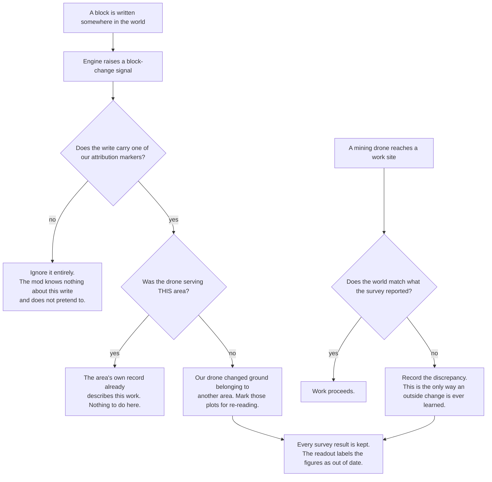
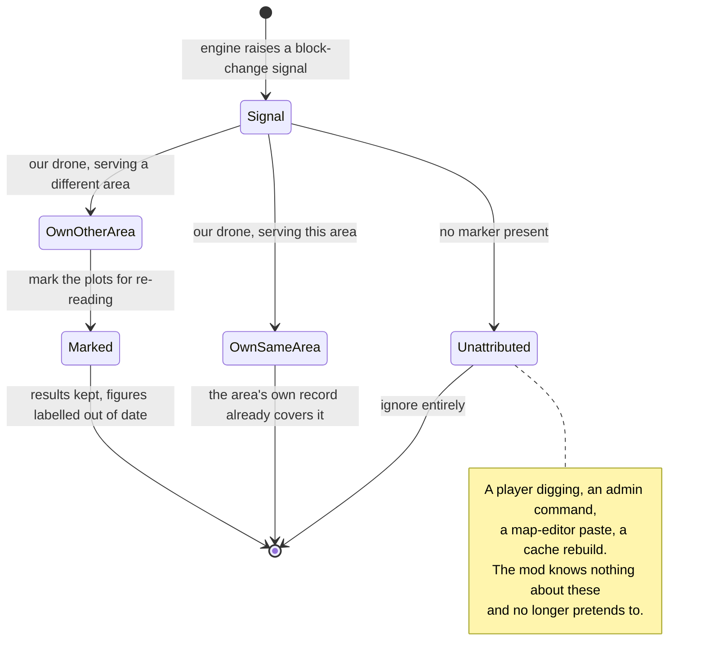

# Ground Change Attribution and Area State - Plan

## How this document is written

This document is written to be read literally. Every term that carries a specific meaning in this project is defined in the Glossary below, and the definitions are repeated wherever confusing two of them would cause a mistake. Sentences are stated in full rather than compressed. Where a rule holds only under a particular circumstance, or only from a particular point of view, the circumstance and the point of view are stated in the same sentence as the rule.

Identifiers such as `R1` or `U3` exist only so that one part of this document can point precisely at another. They are never used as a substitute for saying what the thing is. Wherever an identifier appears in prose, the statement it refers to is restated or summarised alongside it.

---

## Glossary

**Block.** One voxel of world material at one position in three dimensions. A block is the smallest thing a drone's sensor can read and the smallest thing a drone can remove or place.

**Column.** One horizontal position in the world, holding the vertical stack of blocks above and below it.

**Plot.** Eco's own grouping of 5 columns along the X axis by 5 columns along the Z axis, which is **25 columns** in total. This is an Eco concept, not one this mod invented. The engine defines `PropertyPlotLength` as `Chunk.Size / 2` and defines `Chunk.Size` as `10`, so `PropertyPlotLength` is `5`.

**Area.** A group of plots that a player draws on the map and a drone dock owns. Saying "the area is surveyed" is a correct and normal way to speak: it means every block of every plot of that area has been surveyed.

**Survey pass.** One complete run of the survey drone over one area, visiting each plot in turn until every plot has been read.

**Block-change signal.** The notification the Eco engine raises when the topmost block of a column changes. The engine raises it synchronously, on whichever thread performed the block write.

**Write attribution.** A marker the mod sets around its own block writes, saying which drone made the write, which area that drone was serving, and what kind of work it was doing. A write that carries no marker is an **unattributed write**: the mod did not make it, and the mod therefore knows nothing about what it did.

**Attributable to us / unattributed.** A write is attributable to us when one of this mod's drones made it and the marker survived to be read. Every other write — a player digging, an administrator command, a map-editor paste, another mod, or a cache rebuild — is unattributed.

**Marked for re-reading.** A flag stored per plot, meaning the ground of this plot changed after the survey read it, so what the survey recorded about it can no longer be trusted and a survey drone should read it again. This flag exists for the drones' benefit. It never changes the status tag a player sees.

**Status tag.** The bracketed word shown to the player for an area, such as `[unsurveyed]`, `[surveyed]`, `[digging]`, `[mined]`, `[cleared]`, `[empty]` or `[farm]`. Exactly one status tag is shown per area at a time. The bracketed text and its colour are produced by a single pair of switches in `EcoServerMod/AdvancedElectronics.Navigation/DockReadout.cs`, so the internal status value and the text the player reads are the same thing by construction.

**In situ discovery.** A drone finding out, at the place where it is working, that the world does not match what it was told — for example that a block the survey reported is not there, or that a block is there which the survey did not report.

---

## Goal Capsule

- **Objective.** A player can trust what the mod tells them about an area. The mod only ever claims to know about work its own drones did; it does not pretend to know about anything else; and when one of its drones finds at the work site that the world does not match what the survey reported, the player is told that the figures they are looking at are out of date rather than being shown stale numbers presented as current.
- **Means.** Narrow what the block-change listener acts on so that it responds only to writes made by this mod's own drones and ignores every other write; make the reaction preserve what the survey found rather than destroying it; make every read-modify-write on an area's stored data atomic; make the area's status tag reflect mining work from the moment a mining drone is assigned; and have the mining drone record what it discovers at the work site. The technical decisions that own these choices are stated in the Planning Contract below.
- **Product authority.** The mod owner, in session.
- **Execution profile.** Server half only. The decision logic lands in the `AdvancedElectronics.Navigation` assembly, which has no dependency on Eco and is covered by the unit test suite. The wiring lands in the `AdvancedElectronics` assembly, which depends on Eco and has no automated coverage by design; that part is verified on a running server.
- **Stop conditions.** Stop and ask before moving or renaming `HasFullAccess`, `StampedCitizenName` or `StampedCitizenId` on the drone dock, and before changing the constructor of `SurveyArea` or its `EnumeratePlots()` method — another author's committed code depends on all five. Stop if the mod's load line is missing from the server log after any unit that changes stored data.

---

## Product Contract

### Summary

The block-change listener stops reacting to writes the mod did not make. It keeps reacting to writes made by this mod's own drones, because those are the only writes the mod actually knows anything about. When it does react, it marks the affected plots for re-reading instead of destroying what the survey found, and the readout says the figures are out of date. Separately, an area's status tag begins reflecting mining work at the moment a mining drone is assigned, and the mining drone records what it discovers at the work site.

### Problem Frame

**The mod currently claims to know things it does not know.**

The block-change listener reacts to every write in the world. When a write carries no attribution marker — a player digging, an administrator command, a map-editor paste, a cache rebuild — the listener treats it as ground that changed under the survey and deletes the survey results for the affected plots.

That behaviour rests on a premise the mod does not hold. The mod does not monitor the world. It cannot see most of what happens in it: the engine raises a signal only when the topmost block of a column changes, so a player tunnelling underground is invisible to this mechanism entirely. Reacting to the fraction of outside changes that happen to surface, while being blind to the rest, does not produce a current picture. It produces an arbitrary one, and it pays for that with deleted survey results.

The cost is real and it is not hypothetical. One administrator command that rebuilds the world's block caches sends every column in the loaded world through this path with no marker at all, which today deletes every survey result on the server.

**The reaction is also unsafe when it does fire.**

Writing to one of the area's stored lists is not one instantaneous operation. It is three steps: read the whole list, build a replacement from it, store the replacement back. The reaction runs on whichever thread performed the block write, while the dock and other drones write the same lists from their own threads. Two of those sequences at overlapping moments both read the same starting list, both build a replacement, and both store — and whichever stores second silently discards the other's work. This is a race condition, and the only correct remedy is to make the sequence atomic.

**And the area's status tag lags behind reality.**

An area is supposed to hold the `[surveyed]` tag only while it is untouched and waiting for a mining drone to be assigned to it. Today the tag that says mining is under way, `[digging]`, is derived after the fact from evidence left in the ground, so it appears only once plots have actually been dug. Between the moment a mining drone is assigned to an area and the moment it removes its first block, the area still reads `[surveyed]`, telling the player the ground is untouched at exactly the time it is about to stop being untouched.

Nothing in any of this has been observed on a running server, because the mod has never been run live with these features. That is why the failures that matter here are the silent ones.

### Key Decisions

Each entry names a product-level decision and points at the requirements it constrains. The full statement of each rule lives on the requirement, not here.

- KD1. **The mod does not monitor the world for changes it did not make.** The block-change listener acts only on writes attributable to this mod's own drones, and ignores every unattributed write. (session-settled: user-directed — chosen over reacting to every write, which was the previous behaviour: the mod cannot see most outside changes, so reacting to the visible fraction buys an arbitrary picture at the price of deleted survey results.) Governs R1, R2, R3.
- KD2. **Outside changes are learned in situ, by the drone that is there.** It is the mining drone's duty to discover at the work site that a block has appeared or disappeared and that what the survey reported no longer holds. (session-settled: user-directed — this is the same principle already settled for law and property, where only a mining attempt can learn that a refusal has lifted.) Governs R12, R13.
- KD3. **A reaction marks the affected plots for re-reading; it never destroys what the survey found.** (session-settled: user-approved — chosen over deleting the results: keeping them lets a later survey confirm or replace them cheaply, and means a wrong judgement costs redundant work rather than lost data.) Governs R4, R5, R9.
- KD4. **Whether a plot is marked for re-reading changes what the drones do, and never changes the area's status tag.** The tag continues to be derived exactly as it is today. What the player gains instead is a label saying the figures are out of date. (session-settled: user-directed — chosen over recalculating the coverage figure downward: the figures remain an accurate record of what the pass found, so the honest correction is to say they are old rather than to alter them.) Governs R6, R7, R8.
- KD5. **An area holds `[surveyed]` only while it is untouched and no mining drone is assigned to it.** (session-settled: user-directed — this was an original requirement that was deferred and never written into a plan; it is in scope here.) Governs R14, R15, R16, R17, R18.
- KD6. **Every read-modify-write on an area's stored data is atomic.** (session-settled: user-directed — chosen over relying on there being a single writer: there is not, and a read-modify-write sequence without a lock is a race condition whatever the intended access pattern.) Governs R10, R11.

### Actors

- A1. **The Eco engine's block-write path.** Raises a block-change signal synchronously, on whichever thread wrote the block, and only when the topmost block of a column changes.
- A2. **The drone dock that owns an area.** Holds the area's stored data.
- A3. **The survey drone.** Reads plots, and clears a plot's re-reading mark by reading it again.
- A4. **The mining drone.** Works plots, discovers at the work site that the world does not match the survey, and records what it finds.
- A5. **The player.** Changes ground by hand, and reads the area's status tag and figures in the interface.
- A6. **The server administrator.** Can rebuild the world's block caches, and can enable parallel ticking of world objects.

### Requirements

**Group A — What the listener acts on**

- R1. A block write that carries no attribution marker is ignored completely. No plot is marked, no stored data is read or written, and no world read is performed. This covers a player digging, an administrator command, a map-editor paste, another mod's write, and a cache rebuild.
- R2. A block write attributable to one of this mod's drones, made while that drone was serving the area whose plots the write touched, requires no reaction from the listener. The area's own record of that drone's work already describes it.
- R3. A block write attributable to one of this mod's drones, made while that drone was serving a **different** area from the one whose plots the write touched, causes those plots to be marked for re-reading. This holds regardless of what kind of work the drone was doing, because the question is whether the ground changed, not what job the drone was on.
- R11. An exception raised inside the listener never escapes into the engine's block-write path, because an exception escaping there would break ordinary digging for every player on the server.

**Group B — What a reaction does**

- R4. Marking a plot for re-reading destroys nothing. The plot's ore findings, its surveyed timestamp, its bedrock observation, its mined timestamp and its pass record all survive unchanged.
- R5. Marking a plot for re-reading also drops that plot from the drone dock's in-memory record of blocks already sampled during the current survey pass, so that when a drone returns to the plot it genuinely reads the ground again instead of treating its earlier samples as already collected.
- R9. When a survey drone reads a plot that was marked for re-reading, that mark is cleared as part of the same step in which the new reading is recorded.

**Group C — What the player sees**

- R6. Whether a plot is marked for re-reading is answered differently depending on who is asking, and both answers hold at the same time.
  - **From a drone's point of view, for the sole purpose of deciding whether to read the plot again**, a plot marked for re-reading counts as not yet read.
  - **From the player's point of view, in every interface, tooltip, chat command and readout**, the area continues to show the status tag it last earned. Marking a plot for re-reading never changes that tag, and in particular never causes an area to display `[unsurveyed]`.
- R7. Marking a plot for re-reading introduces no new status tag and no new colour, and does not occupy the single status-tag slot an area displays.
- R8. While an area has at least one plot marked for re-reading, every readout that presents that area's survey figures labels them as no longer current, using wording to the effect of "area changed and needs resurveying. old data:" immediately before the figures. The figures themselves are neither recalculated nor hidden — they remain an accurate record of what the survey pass found, and the label is what tells the player they may no longer describe the ground.

**Group D — Concurrency**

- R10. Every sequence that reads one of an area's stored lists, builds a replacement from it, and stores the replacement back is atomic with respect to every other such sequence on the same area, so that no such write can be silently overwritten by another.

**Group E — In situ discovery**

- R12. When a mining drone reaches a plot and finds that the world does not match what the survey recorded for it — a block the survey reported is absent, or a block is present that the survey did not report — the drone records that discrepancy against that plot.
- R13. A recorded discrepancy marks the plot for re-reading, so that the same consequences follow as for any other reaction: the survey results are kept, the drones treat the plot as needing another reading, and the readout labels the figures as out of date.

**Group F — The area's status tag reflects mining work**

- R14. An area displays the `[surveyed]` tag only while all three of the following hold at once: every plot of the area has been surveyed; no plot has been dug since it was surveyed; and no mining drone is assigned to the area.
- R15. Assigning a mining drone to an area changes that area's status tag to `[digging]` immediately, at the moment of assignment, before the drone has removed any block.
- R16. The mining dock is responsible for informing the survey dock that the area is being worked, so that the survey interface displays `[digging]` for that area without the survey dock having to discover it by inspecting the ground.
- R17. When the mining drone finishes working the area, the area's status tag becomes `[mined]`.
- R18. A player reading the survey interface for an area tagged `[digging]` can tell that the results shown may already be out of date because a mining drone is working there, and that once the work finishes the results are likely to differ substantially from what is shown.

### Key Flows

- F1. A player digs by hand inside an area that has been surveyed
  - **Trigger:** The player removes a surface block on a column belonging to a plot that an area covers.
  - **Actors:** The engine's block-write path, the player.
  - **Steps:** The engine raises the signal on the player's own thread. The listener reads the attribution marker, finds none, and returns without touching anything.
  - **Outcome:** Nothing happens. The mod does not know the ground changed, and does not pretend to. The survey results are intact and the area's tag is unchanged. If a mining drone is later assigned to that area, it discovers the discrepancy at the work site, which is flow F4.
  - **Covers R1.**

- F2. A server administrator rebuilds the world's block caches
  - **Trigger:** The administrator runs the cache-rebuild command.
  - **Actors:** The engine, the administrator.
  - **Steps:** The engine raises a signal for every column whose cached height was wrong. Every one of those signals is unattributed, so every one of them is ignored.
  - **Outcome:** No survey result anywhere on the server is affected.
  - **Covers R1.**

- F3. One dock's drone digs ground belonging to another dock's area
  - **Trigger:** A mining drone serving area A removes a block on a plot that also belongs to area B, owned by a different dock.
  - **Actors:** The engine, the mining drone, both docks.
  - **Steps:** The engine raises the signal on the drone's own thread, where the attribution marker is readable. The listener sees that the write is ours and that the drone was serving a different area from B. It marks B's affected plots for re-reading, under the lock, keeping every survey result.
  - **Outcome:** Area B's survey results are still visible, labelled as out of date, and a survey drone will read those plots again.
  - **Covers R3, R4, R5, R6, R8, R10.**

- F4. A mining drone finds the world does not match the survey
  - **Trigger:** A mining drone arrives at a plot and finds a block absent that the survey reported, or present that it did not.
  - **Actors:** The mining drone.
  - **Steps:** The drone records the discrepancy against that plot, which marks the plot for re-reading.
  - **Outcome:** The player sees the area's figures labelled as out of date, and a survey drone will read the plot again. This is the only path by which a change the mod did not make is ever learned.
  - **Covers R12, R13.**

- F5. A mining drone is assigned to a surveyed area and then finishes it
  - **Trigger:** A player assigns a mining drone to an area that currently displays `[surveyed]`.
  - **Actors:** The mining dock and its drone, the survey dock, the player.
  - **Steps:** At the moment of assignment the area's status tag becomes `[digging]`, before any block is removed. The mining dock informs the survey dock, so the survey interface shows `[digging]` too. The drone works the area. When it finishes, the tag becomes `[mined]`.
  - **Outcome:** A player reading the survey interface at any point during the work can see that a mining drone is working the area.
  - **Covers R14, R15, R16, R17, R18.**

### Acceptance Examples

- AE1. **Covers R1.** Given an area displaying `[surveyed]` with recorded ore findings, when a player digs a surface block inside it, then no plot is marked, the findings are unchanged, the tag is unchanged, and no label appears.
- AE2. **Covers R1.** Given several surveyed areas on a server, when the administrator rebuilds the world's block caches, then no area is affected in any way.
- AE3. **Covers R3, R4 and R8.** Given area B with four recorded ore findings on a plot, when a mining drone serving a different area removes a block on that plot, then the plot is marked for re-reading, all four findings are still stored, area B still displays the tag it had, and its figures are presented under a label to the effect of "area changed and needs resurveying. old data:".
- AE4. **Covers R2.** Given a mining drone working the area it is assigned to, when it removes a block, then no plot of that area is marked for re-reading by the listener.
- AE5. **Covers R9 and R5.** Given a plot marked for re-reading, when a survey pass reads it again, then the mark is cleared, the results are replaced by the new reading, and the new reading was genuinely taken from the world rather than served from the previous pass's samples.
- AE6. **Covers R6.** Given an area displaying `[surveyed]` with a plot marked for re-reading, then the area still displays `[surveyed]` and never `[unsurveyed]`.
- AE7. **Covers R10.** Given two writes to two different plots of one area arriving from two different threads, when both are processed, then both plots are marked and neither mark is lost.
- AE8. **Covers R12 and R13.** Given a plot whose survey recorded ore, when a mining drone reaches it and finds no such ore, then the discrepancy is recorded, the plot is marked for re-reading, and the readout labels the area's figures as out of date.
- AE9. **Covers R14 and R15.** Given an area displaying `[surveyed]`, when a mining drone is assigned to it and before that drone removes any block, then the area displays `[digging]`.
- AE10. **Covers R16 and R18.** Given an area a mining drone has just been assigned to, when a player opens the survey interface for it, then the area is shown as `[digging]` there, without the survey dock having inspected the ground.
- AE11. **Covers R17.** Given an area displaying `[digging]`, when the mining drone finishes working it, then the area displays `[mined]`.

### Scope Boundaries

- The mod does not monitor the world, and this plan does not add any mechanism that would. Changes the mod did not make are learned only in situ, by the drone that is there.
- No migration of stored data is required by this plan, because no new stored shape is introduced. The mark for re-reading is the only new stored fact, and an existing world loading with no marks is correct: nothing has been found to need re-reading yet. This is stated explicitly because the standing project rule is that a server administrator must be able to update the mod without breaking an existing world, and here that holds without work.
- Farmland reservation, the claim lifecycle, and the disagreement about which access level may assign and edit areas are separate work, described under How This Work Fits Together below.
- Merging the survey drone and the mining drone into a single drone is not in scope.

#### Deferred to Follow-Up Work

- Pairing this plan's live verification with the outstanding shared-area verification from the earlier plan. A live session is required either way; whether the two are done in one sitting is deferred.
- Splitting `DroneDock.cs` further.

### Dependencies / Assumptions

- The engine raises a block-change signal synchronously on the thread that wrote the block, so the attribution marker is readable inside the listener and only there. Verified against the engine source.
- An area's stored data is written from more than one place: the owning dock's tick, the survey drone's tick, and a mining dock that does not own the area, reached by resolving the area by identifier. This is why atomicity is required rather than assumed. An earlier draft of this plan claimed a single writer and was wrong.
- Parallel ticking of world objects is disabled by default on an Eco server. This plan does not rely on that: the design must remain correct when an administrator enables it.
- Narrowing the listener inverts its failure mode, and that is a deliberate benefit rather than an accident. Previously, if the attribution marker failed to be read, one of our own writes looked unattributed and the plots were deleted. Now the same failure means the write is ignored, and the consequence is a survey that stays slightly out of date until a mining drone discovers the discrepancy at the site — which is the behaviour this plan specifies anyway.

### Sources / Research

Files in this repository, given as paths relative to the repository root:

- `EcoServerMod/AdvancedElectronics.Navigation/GroundChange.cs` — the write-attribution marker, the attribution type, the verdict rules that this plan narrows, and the position-rewind arithmetic that is used elsewhere and must not be disturbed.
- `EcoServerMod/AdvancedElectronics/DroneDock.GroundChange.cs` — the engine subscription and the current reaction.
- `EcoServerMod/AdvancedElectronics/SurveyAreaEntry.cs` — the area's stored lists and the destructive reset this plan stops calling.
- `EcoServerMod/AdvancedElectronics/MiningStrategy.cs` — where the attribution marker is opened for mining, and where in situ discovery must be recorded. It currently records no survey-versus-reality discrepancy at all.
- `EcoServerMod/AdvancedElectronics/FarmingStrategy.cs` — where the attribution marker is opened for farming.
- `EcoServerMod/AdvancedElectronics/SurveyStrategy.cs` — the survey pass and the moment a plot is recorded as read.
- `EcoServerMod/AdvancedElectronics/DroneDock.Mining.cs` — mining assignment, and the only production caller of the status derivation.
- `EcoServerMod/AdvancedElectronics.Navigation/AreaLifecycle.cs` — the derivation of an area's status from per-plot facts.
- `EcoServerMod/AdvancedElectronics.Navigation/DockReadout.cs` — the two switches that turn a status value into its bracket text and its colour.
- `docs/plans/2026-08-21-001-feat-shared-area-status-plan.md` — the requirement this plan narrows is R16 there, whose final sentence extended it to "map-editor edits, admin commands, and ordinary player digging alike". That extension is what this plan removes.
- Commit `33bd5cd` — the previous state of this plan, which assumed the mod watches the world. Kept deliberately so the removed design can be read back.
- `docs/reviews/2026-09-04-shared-area-status/` — the review that raised the concurrency and wipe problems.

Files in the Eco engine source, given as paths relative to the Eco checkout the reference assemblies are built from:

- `Server/Eco.Shared/Voxel/PlotUtil.cs` and `Server/Eco.Shared/Voxel/IChunk.cs` — the plot size, which is 5 by 5 columns.
- `Server/Eco.World/World.cs` — the three places the block-change signal is raised.
- `Server/Eco.Gameplay/Systems/Messaging/Chat/Commands/AdminCommands.cs` — the cache-rebuild command, which notifies by default.
- `Server/Eco.Gameplay/Objects/WorldObjectManager.cs` — world objects are initialised in parallel unconditionally, and ticked in parallel only when an administrator enables that setting.

<!-- ce-section: work-relationships -->
### How This Work Fits Together

This plan owns three things: what the block-change listener reacts to, how outside changes are actually learned, and when an area's status tag starts reflecting mining work. The breakdown below is how the remaining work is currently understood. It is not a committed roadmap.

- Farmland reservation — a stated rule does not reach the farms that citizens actually assign.
  - Can proceed independently of this plan.
- Claim lifecycle — a cleared area cannot be reassigned, and one dock can hold the same area twice.
  - Can proceed independently of this plan.
- Access-level reconciliation — the two halves of the mod disagree about who may assign and edit areas.
  - Still to decide. It is a product question before it is work.
- Live verification of the earlier shared-area work.
  - Enables confidence in all of the above, and cannot be done without a deployed server.
- A single drone that both surveys and mines.
  - Still to decide, and out of scope.

---

## Planning Contract

**Product Contract preservation.** This Product Contract was rewritten wholesale on the product owner's direction, and the requirement identifiers were renumbered rather than preserved, because the previous set no longer had counterparts. The previous version assumed the mod watches the world for outside ground changes; the owner's decision is that it does not, and that outside changes are learned in situ by the drone at the work site. Commit `33bd5cd` holds the previous version in full, together with a statement of what rested on the removed premise. The requirements about the area's status tag and mining assignment carry forward unchanged in meaning from that version, where they were numbered R18 through R21 and R25.

### Key Technical Decisions

- KTD1. **The narrowing is one branch of the existing verdict function, not a new mechanism.** The verdict function already distinguishes an attributed write from an unattributed one. Today an unattributed write returns the verdict that resets plots; it must return a verdict that does nothing. Everything else about the listener stays as it is. (session-settled: user-directed — chosen over removing the listener entirely, which was proposed and rejected: the listener already distinguishes the cases, so the design decision is served by changing what it does with one of them.) Implements KD1, governing R1 and R2.
- KTD2. **A write by one of our drones serving a different area resets nothing and marks instead.** Today that case deletes the plots' survey results. It must mark them for re-reading and keep the results. The distinction by kind of work is removed at the same time: a farming drone flattening ground that a mining area covers changed that ground just as surely as a mining drone would have, so it takes the same branch. Implements KD3, governing R3 and R4.
- KTD3. **Every read-modify-write on an area's stored lists is performed under a lock.** The existing lock used by the claim and assignment paths is the natural candidate, since nothing inside it blocks on anything else. Confirm during implementation that reusing it introduces no ordering between the two uses that could deadlock; if it would, introduce a second leaf lock rather than nesting. Implements KD6, governing R10.
- KTD4. **In situ discovery is recorded by the mining drone at the point where it already tests a block before removing it.** The drone already examines each block against a predicate before submitting a removal; that is the moment it knows what is actually there, and therefore the moment it can compare against what the survey recorded. Implements KD2, governing R12 and R13.
- KTD5. **The out-of-date label lives in the Eco-free readout module, alongside the existing status-word and colour switches.** It is plain text preceding the figures. It is not a status tag: it carries no brackets and takes no status colour. Implements KD4, governing R8.
- KTD6. **The status derivation gains an input saying a mining drone is assigned, and the mining dock supplies it.** Today the digging status is derived only from plots already dug. Implements KD5, governing R14 through R17.
- KTD7. **No stored shape changes, so no migration is required.** The mark for re-reading is the only new stored fact, and an existing world loading with no marks is the correct state: nothing has yet been found to need re-reading. This is recorded as a decision rather than left implicit, because the standing project rule requires a migration whenever stored data changes, and a reader should be able to see that the rule was considered and found satisfied rather than skipped.

### High-Level Technical Design

The listener's decision becomes a three-way test, and only one branch does anything.

The work is divided between the two assemblies as follows. The Eco-free assembly owns the verdict rules, the status derivation and the readout label, so all three are covered by unit tests. The Eco-dependent assembly owns the engine subscription, the area's stored data, the mining drone's in situ comparison, and the communication from the mining dock to the survey dock. No Eco type crosses into the Eco-free assembly.

### Sequencing

U1 and U2 are the narrowing and can land first, independently. U3 depends on U2. U4 depends on U3. U5 is independent. U6 and U7 are independent of everything else. U8 lands last.

### System-Wide Impact

The listener is shared by every dock on the server and runs on the engine's block-write thread. An exception escaping it breaks ordinary digging for every player, which is why that is a requirement rather than an implementation note.

The change to the status tag is visible to every player who reads an area, on every surface that shows one.

No stored shape changes, so no existing world is affected by loading.

### Risks

- Narrowing the listener means the mod stops learning about a class of change it currently learns about. That is the intent, and the compensating mechanism is in situ discovery — but until a mining drone visits a plot, the survey for it can be silently out of date. The label only appears once something has actually been discovered. This is accepted, and it is the behaviour the product owner specified.
- The attribution marker becomes the sole gate. It was already the sole gate; what changes is that its failure mode is now inert rather than destructive. That is an improvement, but it also means a marker that never works would silently disable the whole reaction, and nothing would report that. The live check in U2 exists to catch exactly that.
- In situ discovery adds a comparison to the mining drone's inner loop, which runs per block. Keep the comparison to what the drone already has in hand at that point, and measure before adding any lookup.

---

## Implementation Units

### U1. An unattributed write is ignored

- **Goal.** The block-change listener does nothing at all when a write carries no attribution marker.
- **Requirements.** R1, R2. Implements the decision that the mod does not monitor the world.
- **Dependencies.** None.
- **Files.**
  - `EcoServerMod/AdvancedElectronics.Navigation/GroundChange.cs` (modify)
  - `EcoServerMod/AdvancedElectronics.Navigation.Tests/AreaLifecycleTests.cs` (modify)
- **Approach.**
  1. In the verdict function, change the branch for a write with no attribution marker so that it returns a verdict meaning "do nothing" rather than the verdict that resets plots.
  2. Update the documentation comment on the verdict type. It currently states that an unattributed write means "the mod cannot account for this write, so the plots it touched go back to unsurveyed". That reasoning is exactly what is being reversed, and leaving it in place would tell the next reader the opposite of the rule.
  3. Do not change the branch for a write attributable to one of our drones serving this same area; the area's own record already describes that work.
  4. Do not touch the position-rewind arithmetic or the plot-of-a-column helper that share this file. Both are used elsewhere.
- **Test scenarios.**
  - A write with no attribution marker produces the do-nothing verdict. This covers acceptance examples AE1 and AE2.
  - A write attributable to a drone serving this same area produces the verdict meaning the area's own record covers it. This covers acceptance example AE4.
  - The existing tests that assert an unattributed write resets plots are updated to assert the new rule, and the change to each is deliberate rather than incidental.
- **Verification.** The Eco-free test suite passes, and no test still asserts that an unattributed write resets anything.

### U2. Our drone changing another area's ground marks rather than deletes

- **Goal.** When one of our drones changes ground belonging to an area it was not serving, that area's plots are marked for re-reading and its survey results are kept.
- **Requirements.** R3, R4, R11.
- **Dependencies.** None on other units, but it is the counterpart of U1 and the two together are what make the listener correct.
- **Files.**
  - `EcoServerMod/AdvancedElectronics.Navigation/GroundChange.cs` (modify)
  - `EcoServerMod/AdvancedElectronics/DroneDock.GroundChange.cs` (modify)
  - `EcoServerMod/AdvancedElectronics/SurveyAreaEntry.cs` (modify)
  - `EcoServerMod/AdvancedElectronics.Navigation.Tests/AreaLifecycleTests.cs` (modify)
- **Approach.**
  1. Add a stored list on the area holding the plots marked for re-reading, following the flattened encoding the other per-plot lists already use, with the same trio of helpers those lists have: one to read the whole list, one to replace it, and one to record a single plot.
  2. Remove the distinction by kind of work from the verdict. A drone serving a farming area that flattens ground a mining area covers has changed that mining area's ground, and the mining area's survey no longer describes it. Kind of work is not the question; whether the ground changed is.
  3. Change the listener's reaction so that instead of calling the destructive reset it records the mark. Keep the existing catch-all so no exception escapes into the engine.
  4. Add the new list to the paths that clear an area's results and that handle an edit removing a plot, so a mark cannot outlive the plot it refers to.
- **Test scenarios.**
  - A write attributable to a drone serving a different area of the same kind produces the marking verdict.
  - A write attributable to a drone serving a different area of a different kind also produces the marking verdict, because kind no longer distinguishes.
  - *No automated coverage — Eco-side:* the stored list and the listener's reaction live in the Eco-dependent assembly. Verify live: with two overlapping areas owned by different docks, run a mining drone on one and confirm the other's plots are marked, its findings are still listed, and its tag is unchanged. This covers acceptance example AE3.
- **Verification.** The Eco-free tests pass; the live check behaves as described; the mod's load line appears after a server start.

### U3. The out-of-date label

- **Goal.** While an area has any plot marked for re-reading, its figures are presented under a label saying they are no longer current.
- **Requirements.** R6, R7, R8.
- **Dependencies.** U2.
- **Files.**
  - `EcoServerMod/AdvancedElectronics.Navigation/DockReadout.cs` (modify)
  - `EcoServerMod/AdvancedElectronics.Navigation.Tests/AreaLifecycleTests.cs` (modify)
- **Approach.**
  1. Add the label in the Eco-free readout module, next to the existing status-word and colour switches, so it is covered by the unit test suite.
  2. The label is plain text placed immediately before the figures. It carries no brackets and takes no status colour, so it can never be mistaken for a status tag.
  3. Do not recalculate the coverage figure and do not hide any finding. The figures stay exactly as recorded; the label is the only thing that changes.
- **Test scenarios.**
  - An area with at least one marked plot produces the label ahead of its figures, and its status word and colour are identical to what they would be without the mark. This covers acceptance examples AE3 and AE6.
  - An area with no marked plot produces no label.
  - The label is not bracketed and carries no colour.
- **Verification.** The Eco-free test suite passes, and the label appears and disappears with the mark.

### U4. Marks reach the drones that need them

- **Goal.** A plot marked for re-reading is treated as not yet read by everything that decides what a drone should do, and by nothing that decides what the player sees.
- **Requirements.** R5, R6, R9.
- **Dependencies.** U3.
- **Files.**
  - `EcoServerMod/AdvancedElectronics.Navigation/AreaLifecycle.cs` (modify)
  - `EcoServerMod/AdvancedElectronics/DroneDock.Mining.cs` (modify)
  - `EcoServerMod/AdvancedElectronics/MiningStrategy.cs` (modify)
  - `EcoServerMod/AdvancedElectronics/SurveyStrategy.cs` (modify)
  - `EcoServerMod/AdvancedElectronics.Navigation.Tests/AreaLifecycleTests.cs` (modify)
- **Approach.**
  1. Two separate places ask whether a plot has been surveyed, and both must be updated. The first is the derivation of the area's status. The second is the selection of plots for mining, which reads the surveyed timestamp directly rather than going through that derivation. Updating only the first would leave a mining drone flying to a marked plot and digging for ore recorded from ground that is gone.
  2. Give both an optional input describing which plots are marked. When that input is absent, nothing is marked, so every existing caller and every existing test behaves exactly as before.
  3. Clear a plot's mark from the same place the survey records the plot as surveyed, so reading it again clears the mark in the same step that supersedes it.
  4. Drop a marked plot from the dock's in-memory record of already-sampled blocks at the moment it is marked. That record is de-duplication state, not survey results, so dropping it destroys nothing the requirements protect — and without it the returning drone treats its earlier samples as already collected and never actually re-reads the ground.
- **Test scenarios.**
  - An area whose plots are all surveyed and one of which is marked derives, for drone purposes, the same answer as if that plot had not been surveyed.
  - The same area with the mark cleared derives what it derived before.
  - Passing no marks input reproduces every existing derivation result, with every pre-existing test unchanged.
  - *No automated coverage — Eco-side:* mining plot selection and the sampled-block record live in the Eco-dependent assembly. Verify live that a mining drone does not dig a marked plot, and that a survey drone re-reading a marked plot produces a fresh reading. This covers acceptance example AE5.
- **Verification.** The Eco-free test suite passes including every pre-existing derivation test unmodified.

### U5. Make writes to an area's stored data atomic

- **Goal.** No write to an area's stored lists can be silently discarded by a concurrent write to the same area.
- **Requirements.** R10.
- **Dependencies.** None.
- **Files.**
  - `EcoServerMod/AdvancedElectronics/SurveyAreaEntry.cs` (modify)
  - `EcoServerMod/AdvancedElectronics/DroneDock.GroundChange.cs` (modify)
- **Approach.**
  1. Enumerate every sequence that reads one of the area's stored lists, builds a replacement, and stores it back. The destructive reset is one; the new marking is another; the existing per-plot recorders are others.
  2. Put each under the same lock. The existing lock used by the claim and assignment paths is the natural candidate because nothing inside it blocks on anything else, which makes it a leaf.
  3. Before reusing that lock, confirm that no path already holding it can reach one of these sequences, and that no path holding one of these can reach the claim path. If either is possible, introduce a second leaf lock rather than nesting one inside the other.
  4. Keep the locked region as small as the sequence itself. Do not hold a lock across a world read or across anything that can block.
- **Test scenarios.**
  - *No automated coverage — Eco-side:* the stored lists live in the Eco-dependent assembly. The existing race-simulation test in the suite demonstrates the pattern for the claim path and can be read as a model, but it exercises the claim lock rather than these sequences. Verify live: with two overlapping areas and two docks working simultaneously, confirm that marks recorded from both paths are all present. This covers acceptance example AE7.
- **Verification.** The live check behaves as described, and no read-modify-write on an area's stored lists remains outside a lock.

### U6. The mining drone records what it finds at the site

- **Goal.** When a mining drone finds that the world does not match what the survey recorded, it records that discrepancy, which marks the plot for re-reading.
- **Requirements.** R12, R13.
- **Dependencies.** U2, for the mark to exist.
- **Files.**
  - `EcoServerMod/AdvancedElectronics/MiningStrategy.cs` (modify)
- **Approach.**
  1. The drone already examines each block against a predicate before submitting a removal. That is the moment it knows what is actually present, so that is where the comparison belongs.
  2. Compare what is present against what the survey recorded for that plot. A block the survey reported as ore that is not there, and a block present where the survey recorded nothing, are both discrepancies.
  3. Record the discrepancy against the plot, which marks it for re-reading. One mark per plot is enough; do not record one per block.
  4. Keep the comparison to information the drone already has in hand at that point in the loop. This runs per block, so a lookup added here is paid for on every block the drone touches. Measure before adding one.
- **Test scenarios.**
  - *No automated coverage — Eco-side:* the mining strategy depends on Eco types throughout. Verify live: survey an area, remove some of the surveyed ore by hand so the survey is knowingly wrong, assign a mining drone, and confirm that on reaching the affected plot the drone records the discrepancy, the plot is marked, and the readout labels the area's figures as out of date. This covers acceptance example AE8, and it is the end-to-end demonstration that the in situ mechanism replaces what the listener no longer does.
- **Verification.** The live check behaves as described.

### U7. The status tag reflects mining work from the moment of assignment

- **Goal.** An area displays `[surveyed]` only while untouched and unassigned, `[digging]` from the moment a mining drone is assigned, and `[mined]` once that drone has finished.
- **Requirements.** R14, R15, R16, R17, R18.
- **Dependencies.** None.
- **Files.**
  - `EcoServerMod/AdvancedElectronics.Navigation/AreaLifecycle.cs` (modify)
  - `EcoServerMod/AdvancedElectronics/DroneDock.Mining.cs` (modify)
  - `EcoServerMod/AdvancedElectronics/SurveyComponent.cs` (modify)
  - `EcoServerMod/AdvancedElectronics.Navigation.Tests/AreaLifecycleTests.cs` (modify)
- **Approach.**
  1. Give the status derivation an input meaning "a mining drone is currently assigned to this area". When that input is true, the derivation returns the digging status even if no plot has been dug yet, and must not return the surveyed status.
  2. When the drone finishes and the assignment ends, the derivation returns the mined status, which is what it already does once every plot that could be dug has been dug.
  3. The mining dock supplies the assignment fact to the survey dock rather than the survey dock inspecting the ground. Determine during implementation which existing mechanism carries facts between docks — the claim taken at assignment is the most likely candidate — and use it rather than introducing a second channel.
  4. Make sure the survey interface reads the same derivation, so a player looking at the survey tab sees `[digging]` for an area a mining drone is working.
- **Test scenarios.**
  - An area fully surveyed, with no plot dug and no mining drone assigned, derives the surveyed status.
  - The same area with a mining drone assigned and no plot yet dug derives the digging status. This covers acceptance examples AE9 and AE10.
  - The same area with a mining drone assigned and some plots dug derives the digging status.
  - An area with every diggable plot dug and no drone assigned derives the mined status. This covers acceptance example AE11.
  - Passing no assignment input reproduces every existing derivation result, with every pre-existing test unchanged.
  - *No automated coverage — Eco-side:* the communication between the two docks lives in the Eco-dependent assembly. Verify live: assign a mining drone to a surveyed area and confirm the survey tab shows `[digging]` before any block is removed.
- **Verification.** The Eco-free test suite passes, and the live check behaves as described.

### U8. Remove what the narrowing made dead, and correct what it made untrue

- **Goal.** No code remains whose only purpose was the behaviour that has been removed, and no comment still explains the system in terms of that behaviour.
- **Requirements.** None directly; this unit protects the others from being misread later.
- **Dependencies.** U1, U2, U4.
- **Files.**
  - `EcoServerMod/AdvancedElectronics/SurveyAreaEntry.cs` (modify)
  - `EcoServerMod/AdvancedElectronics/DroneDock.GroundChange.cs` (modify)
  - `EcoServerMod/AdvancedElectronics.Navigation/GroundChange.cs` (modify)
- **Approach.**
  1. Determine whether the destructive reset still has a caller. The area-edit path uses it; if so, keep it and leave that path alone. If it has none, remove it.
  2. The verdict that meant "a write serving a different kind of work" no longer distinguishes anything after U2 removed the distinction by kind. Remove it if nothing else reads it.
  3. Correct every comment that explains the listener as reacting to writes the mod did not make. There are several, and they are load-bearing for the next reader: they currently state the opposite of the new rule and give reasons for it.
  4. Search for justifications phrased in terms of the removed behaviour elsewhere in the code, and correct any that no longer hold.
- **Test scenarios.** *No automated coverage needed — this unit removes dead code and corrects prose. Behaviour is covered by U1 through U7.*
- **Verification.** The existing test suite passes unchanged, and no comment still describes the listener as resetting plots for writes the mod did not make.

---

## Verification Contract

| Gate | Command or check | Applies to |
|---|---|---|
| Build | `dotnet build EcoServerMod/AdvancedElectronics`, expecting zero errors | Every unit |
| Unit tests | `dotnet test EcoServerMod/AdvancedElectronics.Navigation.Tests`. 566 tests passed before this work; every one must still pass except those deliberately updated in U1, plus the new cases | U1, U2, U3, U4, U7 |
| Load line | `grep "Loading AdvancedElectronics" <server>/Logs/<newest>.log` after deploying | U2, and once more at the end |
| Live behaviour | The checks listed in U2, U4, U5, U6 and U7 | U2, U4, U5, U6, U7 |

The load-line check is not optional after U2, which adds a stored list. A stored member the engine rejects fails type registration with a clean build and no log output at all, so the absent line is the only evidence.

## Definition of Done

Global:

- The build is clean, and the Eco-free test suite passes. Every pre-existing test still passes except those U1 deliberately updated, and each of those changes is intentional.
- The mod's load line appears in the newest server log after starting against a world that predates this work.
- Digging by hand inside a surveyed area changes nothing about that area.
- Rebuilding the world's block caches changes nothing about any area.
- No ground change destroys a survey result anywhere in the codebase. Editing or deleting an area still does.
- A mining drone that finds the world does not match the survey records that fact, and the player sees the area's figures labelled as out of date.
- An area displays `[surveyed]` only while it is untouched and no mining drone is assigned to it.
- Every read-modify-write on an area's stored lists is atomic.
- No abandoned or experimental code remains in the diff.
- No comment still describes the listener as reacting to writes the mod did not make.

Per unit:

- U1 — an unattributed write produces the do-nothing verdict, and no test still asserts otherwise.
- U2 — our drone changing another area's ground marks its plots and keeps its results, regardless of what kind of work either area is for.
- U3 — the label appears while any plot is marked and disappears when none is, and it can never be mistaken for a status tag.
- U4 — a marked plot is treated as not yet read by the status derivation and by mining plot selection, is dropped from the sampled-block record, and has its mark cleared when a survey reads it again.
- U5 — no read-modify-write on an area's stored lists remains outside a lock, and no lock nests inside another.
- U6 — a mining drone reaching a plot whose survey is wrong records the discrepancy, and that is demonstrated end to end on a running server.
- U7 — an area with a mining drone assigned displays `[digging]` before any block is removed, the survey interface shows it, and the area displays `[mined]` when the work finishes.
- U8 — nothing remains whose only purpose was the removed behaviour, and no comment still explains the system in terms of it.
