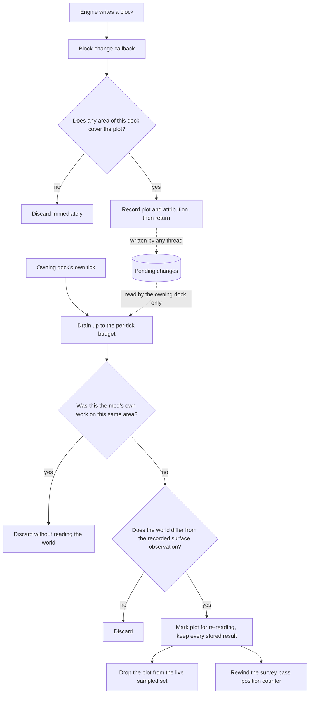
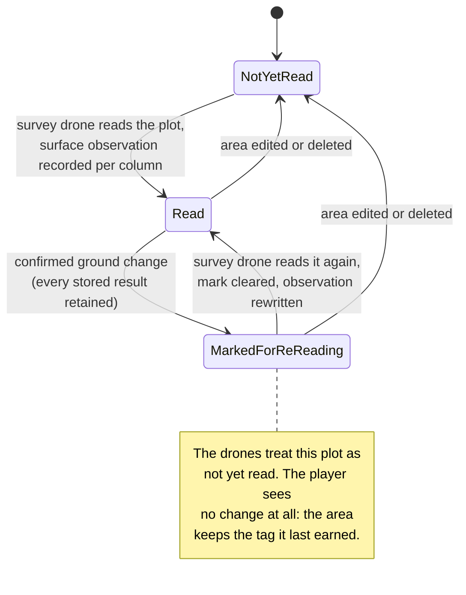

# Ground Change Resolution on the Dock Tick - Plan

## How this document is written

This document is written to be read literally. Every term that carries a specific meaning in this project is defined in the Glossary below, at the point it is first needed, and the definitions are repeated in the places where confusing two of them would cause a mistake. Sentences are stated in full rather than compressed. Where a rule holds only under a particular circumstance or only from a particular point of view, the circumstance and the point of view are stated in the same sentence as the rule.

Identifiers such as `R1` or `U3` exist only so that one part of the document can point precisely at another. They are never used as a substitute for saying what the thing is. Wherever an identifier appears in prose, the statement it refers to is either restated or summarised alongside it.

---

## Glossary

**Block.** One voxel of world material at one position in three dimensions. A block is the smallest thing the drone's sensor can read.

**Column.** One horizontal position in the world, holding the vertical stack of blocks above and below it. The drone's sensor reads a column when it reads the blocks in that stack.

**Plot.** Eco's own grouping of 5 columns along the X axis by 5 columns along the Z axis, which is **25 columns** in total. This is an Eco concept, not one this mod invented. The engine constant that defines it is `PropertyPlotLength`, which the engine sets to `Chunk.Size / 2`, and the engine sets `Chunk.Size` to `10`. Therefore `PropertyPlotLength` is `5`.

**Area.** A group of plots that a player draws on the map and a drone dock owns. Saying "the area is surveyed" is a correct and normal way to speak: it means every block of every plot of that area has been surveyed.

**Survey pass.** One complete run of the survey drone over one area, visiting each plot of that area in turn until every plot has been read.

**Live sampled set.** The drone dock's in-memory working record of which blocks the current survey pass has already sampled. It is not written to disk, and it is empty again after a server restart. Its purpose is to stop the pass from re-reading ground it has already read during that same pass.

**Persisted snapshot.** The copy of survey results stored on the area and written to disk. It survives a server restart.

**Projection.** The act of copying results out of the live sampled set into the persisted snapshot.

**Recorded surface observation.** A value stored per column, describing what the surface of that column looked like at the moment the survey drone read it. Its only purpose is to let the mod later compare the ground as it is now against the ground as it was when it was read, so that a real change can be told apart from a false alarm. An earlier draft of this document called this an "anchor"; that word is not used anywhere in this plan.

**Marked for re-reading.** A flag stored per plot, meaning: the ground of this plot changed after the survey read it, so what the survey recorded about it can no longer be trusted, and a survey drone should read it again. This flag exists for the drones' benefit. It is **not** a thing the player sees, and it does **not** change any tag the player reads. An earlier draft of this document called such a plot "stale"; that word is not used anywhere in this plan.

**Status tag.** The bracketed word shown to the player for an area, such as `[unsurveyed]`, `[surveyed]`, `[digging]`, `[mined]`, `[cleared]`, `[empty]` or `[farm]`. Exactly one status tag is shown per area at a time. The bracketed text and its colour are produced by a single pair of switches in `EcoServerMod/AdvancedElectronics.Navigation/DockReadout.cs`, so the internal status value and the text the player reads are the same thing by construction.

**Block-change signal.** The notification the Eco engine raises when the topmost block of a column changes. The engine raises it synchronously, on whichever thread performed the block write. The engine raises **no** signal for a change that does not move the topmost block, so a player tunnelling underground produces no signal at all.

---

## Goal Capsule

- **Objective.** A survey's results survive whatever happens to the ground around them, and the readout continues to tell the player the truth about those results. A player never loses the record of what a drone found; is told plainly when what they are looking at is no longer current; and never sees a tag claiming the area is untouched when it is not.
- **Means.** Record a block-change signal and return from the engine's callback immediately; resolve the recorded change on the owning dock's own tick; confirm the change against the world before acting on it; mark the affected plot for re-reading rather than deleting what the survey recorded; and make the area's status tag reflect mining work from the moment a mining drone is assigned rather than only after digging has left evidence in the ground. The technical decisions that own these choices are stated in the Planning Contract below.
- **Product authority.** The mod owner, in session.
- **Execution profile.** Server half only. Part of the work lands in the `AdvancedElectronics.Navigation` assembly, which has no dependency on Eco and is covered by the unit test suite. The remainder lands in the `AdvancedElectronics` assembly, which depends on Eco and has no automated coverage by design; that part is verified on a running server.
- **Stop conditions.** Stop and ask before moving or renaming `HasFullAccess`, `StampedCitizenName` or `StampedCitizenId` on the drone dock, and before changing the constructor of `SurveyArea` or its `EnumeratePlots()` method — another author's committed code depends on all five. Stop if the mod's load line is missing from the server log after any unit that changes stored data, rather than continuing on top of a silent initialisation failure.

---

## Product Contract

### Summary

A change to the world's ground stops destroying survey results. The engine's callback records what changed and returns immediately; the dock that owns the area resolves that record on its own tick, confirms the change against the world, and marks the affected plot for re-reading instead of deleting what the survey found. Separately, an area's status tag begins reflecting mining work at the moment a mining drone is assigned to it, rather than only once digging has already changed the ground.

### Problem Frame

Two separate problems are addressed, and they are related because both concern whether what the player reads about an area is still true.

**The first problem is that reacting to a ground change destroys data, and does so unsafely.**

The mod currently reacts to a block-change signal inside the engine's callback. Inside that callback it filters four stored lists on the area, rewinds a position counter, and drops entries from the live sampled set. All of this happens synchronously, on whichever thread wrote the block, with no synchronisation of any kind.

Three costs follow from doing the work there.

The reaction can interleave with itself. Writing to one of these lists is not one instantaneous operation; it is three steps — read the whole list, build a replacement from it, store the replacement back. A player digging arrives on one thread while the owning dock is ticking on another, and both run those three steps at overlapping moments. Both read the same starting list, both build their own replacement, and both store. Whichever stores second wins and the other's work is gone, with no error and no log entry. This is a race condition, and the only correct remedy is to make the three steps atomic.

The reaction cannot reach the survey pass that is currently flying. The position counter that says which plot the pass is on exists in two places: one copy in the flying drone's working memory, and one copy saved on the dock. The reaction rewinds the saved copy, but the flying drone never reads the saved copy again — it keeps counting forward from its own memory. The instruction to turn around is therefore written where nobody reads it.

The reaction destroys data on a judgement it cannot fully make. It decides whether a change was the mod's own work from a marker scoped to the writing thread, and then deletes survey results based on that answer. One administrator command that resets the world's block caches sends every column in the loaded world through this path with no marker at all, which today deletes every survey result on the server.

**The second problem is that the area's status tag lags behind reality.**

An area is supposed to hold the `[surveyed]` tag only while it is untouched and waiting for a mining drone to be assigned to it. Today the tag that says mining is under way, `[digging]`, is derived after the fact from evidence left in the ground: it appears only once plots have actually been dug. So between the moment a mining drone is assigned to an area and the moment it removes its first block, the area still reads `[surveyed]`, which tells the player the ground is untouched at exactly the time it is about to stop being untouched. A player reading the survey interface has no way to know that a mining drone is working there and that the results shown are about to become wrong.

Nothing in either problem has been observed on a running server, because the mod has never been run live with any of these features. That is precisely why the failures that matter here are the silent ones.

### Key Decisions

Each entry below names a product-level decision and points at the requirements it constrains. The full statement of each rule lives on the requirement, not here.

- KD1. **Resolve a ground change on the owning dock's own tick, not inside the engine's callback.** (session-settled: user-directed — chosen over resetting synchronously inside the callback: nothing significant is lost by a delay of one tick, and moving the work onto the dock's tick puts it somewhere the mod controls.) Governs R1, R5, R8.
- KD2. **Confirm the change against the world before acting on it.** (session-settled: user-directed — chosen over capping large bursts of signals and over accepting that a cache reset wipes everything: a cache event that moved no ground then changes nothing, and the judgement rests on observing the world rather than on inferring who wrote the block.) Governs R6, R16.
- KD3. **Mark the plot for re-reading; never destroy what the survey recorded.** (session-settled: user-approved — chosen over confirming and then deleting, and over replacing the write-attribution mechanism with a stored fingerprint: keeping the record is what lets a later survey confirm or replace results cheaply instead of rebuilding them from nothing, and it means a wrong judgement costs redundant work rather than lost data.) Governs R10, R13, R15.
- KD4. **Whether a plot is marked for re-reading changes what the drones do, and never changes the area's status tag.** The tag continues to be derived exactly as it is today, so an area never loses the word it earned. The readout does, however, label the retained figures as no longer current, so the player is told the results may be out of date without any tag changing. (session-settled: user-directed — chosen over recalculating the coverage figure downward: the figures are still an accurate record of what the pass found, so the honest correction is to say they are old rather than to alter them.) Governs R11, R12, R26.
- KD5. **An area holds `[surveyed]` only while it is untouched and no mining drone is assigned to it.** (session-settled: user-directed — this was an original requirement that was deferred and never written down; it is in scope here.) Governs R18, R19, R20, R21.
- KD6. **An existing world must upgrade in place.** (session-settled: user-directed — chosen over relying on a new stored list defaulting to empty: a server administrator must be able to update the mod without breaking the world they already have.) Governs R22.
- KD7. **Write attribution stays as a fast-path optimisation, not as a correctness dependency.** Because the mod now confirms against the world and never destroys results, a missed or wrong attribution costs a redundant world read rather than lost data. Governs R7.

### Actors

- A1. **The Eco engine's block-write path.** Raises a block-change signal synchronously, on whichever thread wrote the block. It raises no signal for a change that does not move the topmost block of a column.
- A2. **The drone dock that owns the area.** The only party permitted to resolve recorded changes for that area.
- A3. **The survey drone.** Reads plots, and clears a plot's re-reading mark by reading it again.
- A4. **The player.** Changes ground by hand, from a thread the mod does not control, and reads the area's status tag in the interface.
- A5. **The server administrator.** Can reset the world's block caches, and can enable parallel ticking of world objects.
- A6. **The mining dock and its mining drone.** Is assigned to an area, works it, and finishes working it. Its assignment and its completion both change what the area's status tag must say.

### Requirements

**Group A — Recording that the ground changed**

- R1. When the engine raises a block-change signal, the mod's callback records the affected plot and returns. Inside the callback the mod performs no read of the world, no comparison against stored results, and no edit to any area's stored results.
- R2. Each recorded entry carries the write attribution exactly as it stood at the moment the callback ran, because that attribution is scoped to the writing thread and cannot be read afterwards.
- R3. The record of pending changes accepts entries written at the same moment from unrelated threads without losing any of them.
- R4. An exception raised inside the callback never escapes into the engine's block-write path, because an exception escaping there would break ordinary digging for every player on the server.
- R5. Only the dock that owns an area resolves recorded changes for that area, and it does so only during its own tick.

**Group B — Deciding whether a recorded change is real**

- R6. A recorded change causes the mod to act only when the current state of the world differs from the recorded surface observation for the affected columns.
- R7. A recorded change attributed to the mod's own work on this same area is discarded without reading the world.
- R8. The amount of resolution work performed in one tick is bounded. Work that does not fit carries over to the following tick rather than extending the current one.
- R9. Under ordinary load, a recorded change is resolved within one tick of the dock that owns the affected area. Ordinary load means a number of pending entries at or below the per-tick bound named in R8.
- R16. A cache event that moves no ground causes no plot to be marked for re-reading, however many columns it signals.
- R17. Two changes to the same area, recorded from different threads, both resolve. Neither is lost.

**Group C — What happens when a change is confirmed**

- R10. A confirmed change marks the affected plot for re-reading and destroys nothing. The plot's ore findings, its surveyed timestamp, its bedrock observation, its mined timestamp and its pass record all survive unchanged.
- R11. Whether a plot is marked for re-reading is answered differently depending on who is asking, and both answers hold at the same time.
  - **From the survey drone's point of view, for the sole purpose of deciding whether to fly back and read the plot again**, a plot marked for re-reading counts as not yet read, so the drone reads it again.
  - **From the player's point of view, in every interface, tooltip, chat command and readout**, the area continues to show the status tag it last earned. Marking a plot for re-reading never changes the tag the player sees, and in particular never causes an area to display `[unsurveyed]`. What the player does gain is the label described in R26, which says the figures shown are no longer current.
- R12. Marking a plot for re-reading introduces no new status tag and no new colour, and does not occupy the single status-tag slot an area displays. The label required by R26 is ordinary readout text accompanying the figures, not a status tag.
- R26. While an area has at least one plot marked for re-reading, every readout that presents that area's survey figures labels them as no longer current, using wording to the effect of "area changed and needs resurveying. old data:" immediately before the figures. The figures themselves are not recalculated and not hidden — they remain an accurate record of what the survey pass found, and the label is what tells the player they may no longer describe the ground.
- R13. When a survey drone reads a plot that was marked for re-reading, that mark is cleared as part of the same step in which the new reading is recorded.
- R14. A survey pass that is already flying returns to a plot that was marked for re-reading behind its current position, rather than waiting for the pass to be dispatched again.
- R15. Deleting an area still destroys everything stored about it, including its results and its re-reading marks. Only the ground-change path stops destroying results.
- R24. Marking a plot for re-reading also drops that plot from the live sampled set, so that when the drone returns to the plot it genuinely reads the ground again instead of treating its previous samples as already collected.

**Group D — The area's status tag reflects mining work**

- R18. An area displays the `[surveyed]` tag only while all three of the following hold at once: every plot of the area has been surveyed; no plot has been dug since it was surveyed; and no mining drone is assigned to the area.
- R19. Assigning a mining drone to an area changes that area's status tag to `[digging]` immediately, at the moment of assignment, before the drone has removed any block.
- R20. The mining dock is responsible for informing the survey dock that the area is being worked, so that the survey interface displays `[digging]` for that area without the survey dock having to discover it by inspecting the ground.
- R21. When the mining drone finishes working the area, the area's status tag becomes `[mined]`.
- R25. A player reading the survey interface for an area tagged `[digging]` can tell that the results shown may already be out of date because a mining drone is working there, and that once the work finishes the results are likely to differ substantially from what is shown.

**Group E — Existing worlds**

- R22. A server administrator can update the mod on a world that already exists and continue playing it. No change in this plan requires resetting a world, and resetting a world means destroying it and starting the server again at day one.
- R23. Every sequence that reads one of the area's stored lists, builds a replacement from it, and stores the replacement back is atomic with respect to every other such sequence on the same area, so that no such write can be silently overwritten by another.

### Key Flows

- F1. A player digs by hand inside an area that has been surveyed
  - **Trigger:** The player removes a surface block on a column belonging to a plot that an area covers.
  - **Actors:** The Eco engine's block-write path, the player, the dock that owns the area.
  - **Steps:** The engine raises the signal on the player's own thread. The mod's callback checks that this dock has areas and that one of them covers the plot, records the plot with no attribution, and returns. On its next tick the owning dock drains that record, reads the current state of the world at the affected columns, finds that it differs from the recorded surface observation, and marks the plot for re-reading. It also drops the plot from the live sampled set and rewinds the survey pass position counter if a pass is flying.
  - **Outcome:** The survey drone will read that plot again. The player still sees the area's last earned status tag and still sees everything the survey found there.
  - **Covers R1, R2, R5, R6, R9, R10, R11, R24.**

- F2. A drone digs ground belonging to the area it is assigned to
  - **Trigger:** A drone owned by this dock removes a block on a plot of the area it is assigned to.
  - **Actors:** The Eco engine's block-write path, the dock, the drone.
  - **Steps:** The engine raises the signal on the drone's own thread, where the write attribution is readable. The callback records the plot together with that attribution. The dock drains the entry, sees that the attributed work served this same area, and discards it without reading the world.
  - **Outcome:** The drone does not cause the ground it is working to be marked for re-reading.
  - **Covers R2, R7.**

- F3. A server administrator resets the world's block caches
  - **Trigger:** The administrator runs the cache-reset command.
  - **Actors:** The engine, the administrator, every dock.
  - **Steps:** The engine raises a signal for every column whose cached height was wrong. Each dock's callback discards every signal for a column no area of that dock covers, and records the rest. The docks drain those records over as many ticks as the per-tick bound requires. Every comparison finds the world unchanged, because correcting a cache moves no blocks.
  - **Outcome:** No plot is marked for re-reading and no survey result is lost.
  - **Covers R6, R8, R16.**

- F4. A mining drone is assigned to a surveyed area and then finishes it
  - **Trigger:** A player assigns a mining drone to an area that currently displays `[surveyed]`.
  - **Actors:** The mining dock and its mining drone, the survey dock, the player.
  - **Steps:** At the moment of assignment the area's status tag becomes `[digging]`, before any block is removed. The mining dock informs the survey dock, so the survey interface shows `[digging]` too. The mining drone works the area. When it finishes, the area's status tag becomes `[mined]`.
  - **Outcome:** A player reading the survey interface at any point during the work can see that a mining drone is working the area and that the survey results shown may already be out of date.
  - **Covers R18, R19, R20, R21, R25.**

### Acceptance Examples

- AE1. **Covers R10 and R11.** Given a plot with four recorded ore findings and a surveyed timestamp, and given an area that currently displays `[surveyed]`, when a player changes the surface of that plot, then the plot is marked for re-reading, all four ore findings are still stored, and the area still displays `[surveyed]` — not `[unsurveyed]`.
- AE2. **Covers R13 and R24.** Given a plot marked for re-reading, when a survey pass reads it again, then the mark is cleared, the plot's results are replaced by the new reading, and the new reading was genuinely taken from the world rather than served from the previous pass's samples.
- AE3. **Covers R16.** Given an area every plot of which has been surveyed, when a cache event raises a signal for every column of the area and none of that ground has moved, then no plot of the area is marked for re-reading.
- AE4. **Covers R7.** Given a drone digging a plot of the area it is assigned to, when the resulting recorded change is resolved, then the plot is not marked for re-reading and no world read was performed for it.
- AE5. **Covers R14.** Given a survey pass whose position counter has already advanced past plot 3, when plot 3 is marked for re-reading, then that same pass returns to plot 3 before it finishes, without being dispatched again.
- AE6. **Covers R17 and R23.** Given two changes to two different plots of one area, recorded from two different threads, when the owning dock resolves them, then both plots are marked for re-reading and neither mark is lost.
- AE7. **Covers R8 and R9.** Given more recorded changes than one tick's bound allows, when the dock ticks, then it resolves up to the bound and the remainder are resolved on following ticks, and no entry is discarded for lack of room.
- AE8. **Covers R6.** Given a plot whose surface block was replaced by a different block at the same height, when the recorded change is resolved and the recorded surface observation still matches the world, then the plot is not marked for re-reading.
- AE9. **Covers R18 and R19.** Given an area displaying `[surveyed]`, when a mining drone is assigned to it and before that drone removes any block, then the area displays `[digging]`.
- AE10. **Covers R20 and R25.** Given an area a mining drone has just been assigned to, when a player opens the survey interface for that area, then the area is shown as `[digging]` there, without the survey dock having inspected the ground.
- AE11. **Covers R21.** Given an area displaying `[digging]`, when the mining drone finishes working it, then the area displays `[mined]`.
- AE13. **Covers R11 and R26.** Given an area displaying `[surveyed]` with a recorded coverage figure and a list of ore findings, when one of its plots is marked for re-reading, then the area still displays `[surveyed]`, the coverage figure and the ore findings are unchanged in value, and the readout presents them under a label to the effect of "area changed and needs resurveying. old data:".
- AE14. **Covers R26.** Given an area whose only marked plot is read again by a survey pass, when that pass records the new reading, then the label is gone from the readout and the figures are presented normally.
- AE12. **Covers R22.** Given a world created and surveyed before this work was installed, when the server is started with this work installed, then the world loads, the mod's load line appears in the log, every previously surveyed area still shows the tag it had, and no area is marked for re-reading merely because it predates the change.

### Scope Boundaries

- Changes below the surface stay invisible to this mechanism. The engine raises a signal only when the topmost block of a column changes, so a player tunnelling underground produces no signal at all. This limitation exists today and this plan does not remove it.
- Farmland reservation, the claim lifecycle, and the disagreement about which access level may assign and edit areas are separate work, described under How This Work Fits Together below.
- Merging the survey drone and the mining drone into a single drone is not in scope. This plan is written so that it does not obstruct that merge, but no requirement here depends on it.

#### Deferred to Follow-Up Work

- Pairing this plan's live verification with the outstanding shared-area verification from the earlier plan. A live session is required either way; whether the two are done in the same sitting is deferred.
- The farming level pass writes ground outside any attribution scope. Because attribution is no longer a correctness dependency, that gap now costs redundant work rather than lost data. The farming half owns the fix.
- Splitting `DroneDock.cs` further. This plan adds one line to it and puts everything else in the partial class that already owns the seam.

### Dependencies / Assumptions

- The engine raises a block-change signal synchronously on the thread that wrote the block, so the write attribution is readable inside the callback and only there. Verified against the engine source.
- An area's stored data is written from more than one place: the owning dock's tick, the survey drone's tick, and — through area resolution by identifier — a mining dock that does not own the area. This is why R23 requires atomicity rather than relying on there being a single writer. An earlier draft of this plan claimed a single writer and was wrong.
- Parallel ticking of world objects is disabled by default on an Eco server. This plan does not rely on that: the design must remain correct when an administrator enables it.

### Sources / Research

Files in this repository, given as paths relative to the repository root:

- `EcoServerMod/AdvancedElectronics/DroneDock.GroundChange.cs` — the engine subscription, the callback, and the current synchronous reaction.
- `EcoServerMod/AdvancedElectronics/SurveyAreaEntry.cs` — the stored per-plot lists and their flattened encodings, the destructive reset, and the clearing of the pass record.
- `EcoServerMod/AdvancedElectronics/DroneDock.cs` — the dock's tick, the throttled readout refresh, the projection into the persisted snapshot, and the opening and closing of a survey pass.
- `EcoServerMod/AdvancedElectronics/DroneDock.Mining.cs` — mining assignment, and the only production caller of the status derivation.
- `EcoServerMod/AdvancedElectronics/MiningStrategy.cs` — plot selection for mining, which reads the surveyed timestamp directly rather than through the status derivation.
- `EcoServerMod/AdvancedElectronics/SurveyStrategy.cs` — the survey pass, the position counter, and the moment a plot is recorded as read.
- `EcoServerMod/AdvancedElectronics.Navigation/GroundChange.cs` — write attribution, the verdict rules, and the position-rewind arithmetic.
- `EcoServerMod/AdvancedElectronics.Navigation/AreaLifecycle.cs` — the derivation of an area's status from per-plot facts.
- `EcoServerMod/AdvancedElectronics.Navigation/DockReadout.cs` — the two switches that turn a status value into its bracket text and its colour.
- `docs/reviews/2026-09-04-shared-area-status/` — the review that raised the first problem.
- `docs/solutions/architecture-patterns/persist-derived-data-as-serialized-snapshot-on-its-owner.md` — the pattern separating a live accumulator from a stored snapshot, including its guard against overwriting stored values with an empty accumulator.
- `docs/solutions/conventions/serialized-needs-a-member-to-write-back-into.md` — why a stored member the engine rejects fails server initialisation with no log output at all.
- `docs/solutions/best-practices/eco-013-server-driven-movement.md` — why a component's own tick is the only surface that repeats.

Files in the Eco engine source, given as paths relative to the Eco checkout the reference assemblies are built from:

- `Server/Eco.Shared/Voxel/PlotUtil.cs` and `Server/Eco.Shared/Voxel/IChunk.cs` — the plot size, which is 5 by 5 columns.
- `Server/Eco.World/World.cs` — the three places the block-change signal is raised. Two are synchronous single-block writes; the third is reached only from a bulk cache rebuild.
- `Server/Eco.Core/Utils/ThreadSafeAction.cs` — signal handlers run synchronously on the calling thread.
- `Server/Eco.Gameplay/Systems/Messaging/Chat/Commands/AdminCommands.cs` — the cache-reset command, which notifies by default.
- `Server/Eco.Gameplay/Objects/WorldObjectManager.cs` — world objects are initialised in parallel unconditionally, and ticked in parallel only when an administrator enables that setting.

<!-- ce-section: work-relationships -->
### How This Work Fits Together

This plan owns two things: what happens when the ground under a survey changes, and when an area's status tag starts reflecting mining work. The breakdown below is how the remaining work is currently understood. It is not a committed roadmap, and a later plan may revise, split or discard any of it.

- Farmland reservation — a stated rule does not reach the farms that citizens actually assign.
  - Can proceed independently of this plan.
  - Writes into the same per-area record this plan extends, so landing this plan first reduces the surface it has to touch.
- Claim lifecycle — an area that has been cleared cannot be reassigned, and one dock can hold the same area twice.
  - Can proceed independently of this plan.
- Access-level reconciliation — the two halves of the mod disagree about who may assign and edit areas.
  - Still to decide. It is a product question before it is work.
- Live verification of the earlier shared-area work — two status colours and several verification sessions.
  - Enables confidence in all of the above, and cannot be done without a deployed server.
- A single drone that both surveys and mines.
  - Still to decide, and out of scope. Nothing in this plan depends on it.

---

## Planning Contract

**Product Contract preservation.** Requirements R1 through R10 and R13 through R17 are unchanged in meaning. R11 and R12 were rewritten on the product owner's direction: the earlier wording said that a plot whose ground changed should be treated as unsurveyed, which would have caused the area to display `[unsurveyed]` and would have destroyed a distinction the interface already makes correctly. R18 through R25 are new and were added on the product owner's direction; they restore requirements that were stated early in the wider effort, then deferred, and never written into a plan. The Outstanding Questions section of the earlier draft was removed because planning resolved every item in it.

### Key Technical Decisions

- KTD1. **The callback records into a pure pending-changes structure, and the owning dock drains it from its own tick.** (session-settled: user-directed — chosen over resetting synchronously inside the callback: nothing significant is lost by a delay of one tick.) This is the technical form of the product decision that ground changes are resolved on the dock's tick, which governs R1, R5 and R8. The engine's `AddToTick` facility fires exactly once and never repeats, so a component's own tick method is the only surface that recurs. The pending structure lives in the Eco-free assembly so that its behaviour is reachable by the unit test suite.
- KTD2. **The callback keeps the two cheap read-only gates it has today, and records only a plot some area of this dock actually covers.** Without this gate, every block written anywhere in the world would allocate an entry in every dock's pending structure and be discarded only after the per-tick bound had paid for it. The gate performs no world read and edits no stored data, so it does not violate R1's prohibition. Governs R1 and R9.
- KTD3. **The recorded surface observation is written at the moment the survey drone finishes reading a plot, in the same step that records the plot as surveyed.** (session-settled: user-approved — chosen over writing it when results are projected into the persisted snapshot: projection runs at most once per second and does nothing once the area has been unassigned, and a pass ends by unassigning the area, so the last plots of every pass would permanently have no observation recorded.) Governs R6.
- KTD4. **The recorded surface observation is stored per column, not per plot.** A plot is 25 columns and the engine signals one changed column at a time, so a single value covering a whole plot cannot answer the question the comparison asks. Storing per column also keeps the comparison honest about what was actually observed, since a column is what the sensor reads. Governs R6 and R16.
- KTD5. **Every read-modify-write sequence on the area's stored lists is performed under a lock, making it atomic.** (session-settled: user-directed — chosen over relying on there being a single writer per area: there is not, and a read-modify-write sequence without a lock is a race condition whatever the intended access pattern.) Governs R17 and R23.
- KTD6. **The per-tick bound is expressed as a number of plots, not as a slice of time.** A count is deterministic, so the bound's behaviour can be pinned by a unit test; a time slice would vary with the cost of a world read and make the same test unreliable. Governs R8.
- KTD7. **The instruction to rewind the survey pass and the reading of that instruction land together, in one unit.** Today the rewind is written inside the code this plan removes, and the flying drone reads its position from its own memory rather than from the shared saved copy. Writing the rewind without changing where it is read leaves it where nobody reads it; changing where it is read without writing the rewind leaves the drone reading a value nobody sets. Either alone leaves the code in a non-working state. Governs R14.
- KTD8. **Both new stored lists ship with a migration that upgrades an existing world in place.** (session-settled: user-directed — chosen over relying on an absent list loading as empty: what matters is not whether the list loads, but what an empty list *means* for a world surveyed before the change. An empty list of recorded surface observations would mean "nothing can be confirmed", which would cause the first cache reset after the upgrade to mark every plot on the server for re-reading.) Governs R22.
- KTD9. **The status tag is driven by mining assignment as well as by evidence in the ground.** Today `[digging]` is derived only from plots already dug. The derivation gains an input saying that a mining drone is assigned, and the mining dock supplies it. Governs R18, R19, R20 and R21.
- KTD10. **Write attribution is kept as a fast-path optimisation and narrowed to one verdict.** It is retained because it avoids a world read on every block a drone moves, which is the highest-volume case on this path. It is narrowed because the helper it currently uses folds together two different non-reset verdicts, and under the decision to confirm against the world the second of those should now fall through to a world read rather than skip. Governs R7.
- KTD11. **When two entries for the same plot are combined before they are drained, and their attributions differ, the combined entry takes the attribution that never causes a world read to be skipped.** Whether a given attribution causes a skip depends on which area is being resolved, so it cannot be decided when the entry is recorded. Collapsing to the value that never skips is the only choice that cannot cause a real outside change to be dropped because it happened to be combined with the mod's own write. Governs R7 and R17.
- KTD12. **The two new stored lists earn their place from this plan alone.** One is how the mod knows whether the ground changed; the other is how it remembers which plots need re-reading. Neither depends on any future merged drone, and neither requires a retirement plan tied to one.

### High-Level Technical Design

A plot gains one new fact — whether it is marked for re-reading — and that fact changes what the drones do without changing what the player sees.

The work is divided between the two assemblies as follows. The Eco-free assembly owns the pending-changes structure, the comparison between a recorded surface observation and the world, the status derivation, and the position-rewind arithmetic — all four are therefore covered by unit tests. The Eco-dependent assembly owns the engine subscription, the world reads, the stored lists, and the communication from the mining dock to the survey dock. No Eco type crosses into the Eco-free assembly.

### Sequencing

The units below are grouped into three phases. Within a phase, units may land in any order unless a unit names a dependency.

**Phase 1 — foundations that nothing else depends on.** U1, U2, U3.
**Phase 2 — wiring that consumes those foundations.** U4 (needs U3), U5 (needs U1, U2, U3), U6.
**Phase 3 — completion.** U8, U9, U7 (needs U5).

### System-Wide Impact

Two new stored members are added to the area. Both are new collections rather than changes to an existing layout, but the silent initialisation failure applies to any stored addition: after each unit that adds one, confirm the mod's load line appears in the newest server log before building anything on top of it.

The engine subscription and its callback are shared by every dock on the server, and the callback runs on the engine's block-write thread. An exception escaping it breaks ordinary digging for every player, which is why that is stated as a requirement rather than left as an implementation note.

The change to the status tag is visible to every player who reads an area, on every surface that shows one.

### Risks

- The drain adds work to a path that runs for every dock on every tick. The cheapest gates run first: a destroyed dock, then a dock with no areas, then the flat check for whether the area has any survey state, then the test of whether the area covers the plot.
- U6 touches the drone's movement path, which has the least tolerance for regression in this mod and no automated coverage. It is deliberately the smallest change that satisfies the requirement, and it changes where a number is read rather than how the drone moves.
- The fidelity of the comparison is bounded by what the engine signals. A change that does not move the topmost block of a column raises no signal, so a column can differ from its recorded observation without the mod ever being told. This limitation exists today; it is restated here because recording an observation per column makes the mechanism look more precise than it is.
- Nothing currently bounds how often a survey pass can be sent backwards. A player digging repeatedly behind a working drone rewinds it on every drain, and the pass could in principle never finish. The bound for this is deferred; it is recorded here so it is not discovered as a surprise.

---

## Implementation Units

### U1. A record of pending ground changes that any thread can write and one thread can drain

- **Goal.** A structure, free of any Eco dependency, that records which plots have changed, accepts entries from any thread, and hands them out in bounded batches to a single draining caller.
- **Requirements.** R1, R3, R8, R17. Implements the technical decisions on draining from the dock's own tick and on expressing the bound as a plot count.
- **Dependencies.** None.
- **Files.**
  - `EcoServerMod/AdvancedElectronics.Navigation/GroundChange.cs` (modify)
  - `EcoServerMod/AdvancedElectronics.Navigation.Tests/GroundChangeTests.cs` (create)
- **Approach.**
  1. Add a pending-changes structure to the existing Eco-free module. Each entry holds the affected plot and the write attribution captured when the entry was recorded.
  2. Adding an entry is safe from any thread. Draining returns at most the configured number of plots and leaves the remainder for the next drain.
  3. Two entries for the same plot recorded before a drain are combined into one, because the engine raises several signals per column when a shaft is dug and the reaction is the same either way.
  4. When two combined entries carry different attributions, the combined entry takes the attribution that never causes a world read to be skipped. This is the rule stated in the eleventh technical decision above, and it exists so that a genuine outside change can never be discarded because it was combined with one of the mod's own writes.
  5. The structure holds no Eco type and no reference to a dock.
- **Patterns to follow.** The pure accumulators already in this assembly, which hold plain data and are driven by Eco-side callers.
- **Test scenarios.**
  - Recording one plot and draining returns that plot with its attribution unchanged.
  - Recording more plots than the bound allows drains exactly the bound's worth and leaves the rest. This covers acceptance example AE7.
  - Draining twice returns the remainder, and then returns nothing.
  - Recording the same plot twice before a drain yields exactly one entry.
  - Recording the same plot with two different attributions before a drain yields one entry carrying the attribution that never skips a world read.
  - Entries added at the same time from several threads all appear in the drained set, with none lost. This covers acceptance example AE6.
  - Draining an empty structure returns nothing and raises no exception.
- **Verification.** The new tests pass, and the assembly still references no Eco type.

### U2. Record a surface observation per column at the moment the plot is read

- **Goal.** Every column the survey drone reads has its surface state recorded at that moment, so that a later change can be confirmed rather than assumed.
- **Requirements.** R6, R16. Implements the technical decisions on when the observation is written and on storing it per column.
- **Dependencies.** None.
- **Files.**
  - `EcoServerMod/AdvancedElectronics/SurveyAreaEntry.cs` (modify)
  - `EcoServerMod/AdvancedElectronics/SurveyStrategy.cs` (modify)
  - `EcoServerMod/AdvancedElectronics.Navigation/GroundChange.cs` (modify)
  - `EcoServerMod/AdvancedElectronics.Navigation.Tests/GroundChangeTests.cs` (modify)
- **Approach.**
  1. Add one stored list on the area holding a surface value per column, following the flattened encoding the other per-column and per-plot lists already use, with the same trio of helpers those lists have: one to read the whole list, one to replace it, and one to record a single entry.
  2. Write an entry at the moment the survey drone finishes reading a plot, in the same place that already records the plot as surveyed. Do not write it during projection into the persisted snapshot: projection is throttled to once per second and does nothing once the area has been unassigned, and a pass ends by unassigning the area, so the last plots of every pass would permanently have no observation.
  3. Reuse the existing convention for a column whose surface was never observed, so that "no observation" is distinguishable from a real surface height rather than colliding with one.
  4. Put the comparison itself in the Eco-free assembly, as a pure function over the recorded observation, the current value read from the world, and whether an observation exists at all. The dock supplies the current value; the pure function decides whether that constitutes a change.
  5. Do not clear this list when the pass record is cleared at the end of a pass. Clear it where survey results are cleared, because it describes the reading and shares the reading's lifetime.
- **Execution note.** Write the pure comparison and its tests before wiring the stored list, so that the rule for a column with no observation is settled by a test rather than by whatever the first caller happens to pass.
- **Test scenarios.**
  - A recorded observation equal to the current surface reports no change. This covers acceptance example AE8.
  - A recorded observation different from the current surface reports a change.
  - A column with no recorded observation reports a change, so that a column which cannot be confirmed errs toward being read again rather than toward trusting results that may be wrong. Note that the migration in U9 is what stops this rule from firing across a whole pre-existing world.
  - The value meaning "never observed" is treated as absence, not as a surface height.
  - Writing observations for the 25 columns of a plot and reading them back returns the same values for the same columns.
  - *No automated coverage — Eco-side:* the stored list on the area and its helpers live in the Eco-dependent assembly, which the test project cannot reference. Their behaviour is verified by the live checks in U5 and by the migration check in U9.
- **Verification.** The pure comparison's tests pass. A server started against an existing world prints the mod's load line.

### U3. Marks recording which plots need re-reading

- **Goal.** An area can record which of its plots changed after being surveyed, without losing anything else, and reading a plot again clears its mark.
- **Requirements.** R10, R12, R13, R15, R24.
- **Dependencies.** None.
- **Files.**
  - `EcoServerMod/AdvancedElectronics/SurveyAreaEntry.cs` (modify)
  - `EcoServerMod/AdvancedElectronics/SurveyStrategy.cs` (modify)
- **Approach.**
  1. Add a second stored list holding the plots marked for re-reading, with the same trio of helpers as the other per-plot lists.
  2. Add a per-plot clear, called from the same place the survey records a plot as surveyed, so that reading a plot again clears its mark in the same step that supersedes it.
  3. Marking a plot changes nothing else on the area: not its ore findings, not its surveyed timestamp, not its mined timestamp, not its bedrock observation, not its pass record.
  4. Marking a plot also drops that plot from the live sampled set. The live sampled set is in-memory de-duplication state, not stored results, so dropping it destroys nothing the requirement protects — and without it the returning drone treats its earlier samples as already collected and never actually re-reads the ground.
  5. Add the new list to the existing paths that clear an area's results and that handle an edit removing a plot, so that a mark cannot outlive the plot it refers to.
- **Test scenarios.**
  - *No automated coverage — Eco-side:* every scenario for this unit concerns the area's stored lists, which live in the Eco-dependent assembly the test project cannot reference. Verify these by the live checks in U5:
    - Marking a plot leaves its ore findings, surveyed timestamp, mined timestamp and bedrock observation unchanged, which is acceptance example AE1.
    - Recording a plot as surveyed clears its mark, which is acceptance example AE2.
    - A marked plot is absent from the live sampled set, so the next visit reads the world.
    - Deleting an area destroys its marks along with everything else.
- **Verification.** The mod's load line appears after a server start against an existing world, and the live checks in U5 behave as described.

### U4. Marks reach every consumer that needs them

- **Goal.** A plot marked for re-reading is treated as not yet read by everything that decides what a drone should do; it never changes the area's status tag; and it causes the readout to label the retained figures as no longer current.
- **Requirements.** R11, R12, R26.
- **Dependencies.** U3.
- **Files.**
  - `EcoServerMod/AdvancedElectronics.Navigation/AreaLifecycle.cs` (modify)
  - `EcoServerMod/AdvancedElectronics.Navigation/DockReadout.cs` (modify)
  - `EcoServerMod/AdvancedElectronics/DroneDock.Mining.cs` (modify)
  - `EcoServerMod/AdvancedElectronics/MiningStrategy.cs` (modify)
  - `EcoServerMod/AdvancedElectronics.Navigation.Tests/AreaLifecycleTests.cs` (modify)
- **Approach.**
  1. There are three separate consumers, and all three must be updated. The first is the derivation of the area's status. The second is the selection of plots for mining, which reads the surveyed timestamp directly rather than going through that derivation; updating only the first would leave a mining drone flying to a marked plot and digging for ore recorded from ground that is gone. The third is the readout, which must label the figures as old data.
  1b. For the readout, add the label required by R26 in the Eco-free readout module, alongside the existing status-word and colour switches, so it is covered by the unit test suite. The label is plain text that precedes the figures; it is not a status tag, it does not go in brackets, and it does not take a status colour. Do not recalculate the coverage figure or hide any finding — the figures stay exactly as recorded, and the label is the only thing that changes.
  2. Give both an optional input describing which plots are marked. When that input is absent, nothing is marked, so every existing caller and every existing test behaves exactly as before.
  3. In the status derivation, treat a marked plot the same way a not-yet-surveyed plot is treated **for the purpose of deciding what the drones do**. This does not change the tag the player sees, because R11 and R12 forbid that, and because the tag an area displays is settled by the requirements in Group D rather than by this input.
- **Test scenarios.**
  - An area whose plots are all surveyed and one of which is marked derives, for drone purposes, the same answer as if that plot had not been surveyed.
  - The same area with the mark cleared derives what it derived before.
  - Passing no marks input reproduces every existing derivation result, with every pre-existing test unchanged.
  - A marked plot in an area that also carries a refusal exclusion still derives the drone-facing answer for a plot needing re-reading, not the answer for spent ground.
  - An area with at least one marked plot produces the label required by R26 ahead of its figures, and the area's status word and colour are byte-for-byte what they were without the mark. This covers acceptance example AE13.
  - An area with no marked plot produces no label. This covers acceptance example AE14.
  - The label is not wrapped in brackets and carries no status colour, so it cannot be mistaken for a status tag.
  - *No automated coverage — Eco-side:* mining plot selection lives in the Eco-dependent assembly. Verify by the live check in U5 that a mining drone does not dig a plot marked for re-reading.
- **Verification.** The full test suite for the Eco-free assembly passes, including every pre-existing derivation test unmodified, and the label appears and disappears with the mark.

### U5. The callback records, and the owning dock resolves on its own tick under a lock

- **Goal.** The engine's callback stops doing work beyond recording, and the dock that owns an area resolves recorded changes for it on its own tick, atomically and within a bound.
- **Requirements.** R1, R2, R4, R5, R6, R7, R8, R9, R10, R14, R16, R17, R23, R24. Implements the technical decisions on draining from the dock's tick, on keeping the cheap gates in the callback, on the lock, on the bound, on landing the rewind with its reader, and on narrowing attribution to one verdict.
- **Dependencies.** U1, U2, U3.
- **Files.**
  - `EcoServerMod/AdvancedElectronics/DroneDock.GroundChange.cs` (modify)
  - `EcoServerMod/AdvancedElectronics/DroneDock.cs` (modify)
- **Approach.**
  1. Reduce the callback to: compute the plot; check that this dock is not destroyed, that it has areas, and that one of them covers the plot; read the write attribution; record one entry; return. Keep the existing catch-all so that no exception escapes into the engine.
  2. Add a drain method to the same partial class, and call it from the dock's tick as a single line, in the same style as the other one-line delegations already there. Call it before the throttled readout refresh, so that a change does not wait for the refresh interval.
  3. For each drained entry, apply the cheapest checks first, in the order the existing callback already uses and documents.
  4. For a matching area, check the attribution verdict first, and skip a world read **only** when the entry records the mod's own work on this same area. Do not reuse the existing helper unchanged: it folds together that verdict and a second verdict meaning "this served a different kind of work", and the second must now fall through to a world read rather than skip, because confirming is cheap and skipping is the unsafe direction.
  5. Otherwise read the current state of the world once for the affected columns and apply the pure comparison from U2. Only a confirmed difference marks the plot.
  6. Marking a plot performs three things together, under the lock required by R23: set the mark, drop the plot from the live sampled set, and — when a survey pass is flying — rewind that pass's position counter so the pass returns to the plot. The rewind must be written here, because the code that used to write it is removed in U7 and U6 changes only where it is read.
  7. Guard every dereference this drain adds. An exception on a dock's tick path is not confined to that dock.
- **Execution note.** No part of this unit is reachable from the test suite. Add a paired diagnostic — what the drain decided, alongside what the area then carries — so that a silent failure to act is visible during the live session rather than looking like nothing happened.
- **Test scenarios.** *No automated coverage — this unit is entirely Eco-side wiring, which the test project deliberately cannot reference. Its decision logic lives in U1, U2 and U4, which are covered.* Verify on a running server:
  - Dig a block by hand inside an area that displays `[surveyed]`. Within about a second the plot is marked, the area's ore findings are still listed, and the area still displays `[surveyed]` rather than `[unsurveyed]`. This covers acceptance example AE1.
  - Run a mining drone over the area it is assigned to. The area is not marked as a result of its own drone's digging. This covers acceptance example AE4.
  - Run the administrator's cache-reset command with several surveyed areas present. No area is marked and no result is lost. This covers acceptance example AE3.
  - Dig a trench spanning many plots at once. The areas resolve over several ticks with no visible tick stall and no plot lost. This covers acceptance example AE7.
  - Dig by hand behind a survey drone that is mid-pass. The drone returns to the dug plot before finishing the pass, and reads it again. This covers acceptance example AE5.
- **Verification.** All five live checks behave as described, and the mod's load line is present.

### U6. The flying survey pass reads its position from the shared saved copy

- **Goal.** A rewind written while a pass is flying actually moves that pass.
- **Requirements.** R14. Implements the technical decision that the rewind's writer and its reader land together.
- **Dependencies.** Must land together with U5, which writes the rewind. Neither is complete alone, and landing either by itself leaves the code in a state where a rewind is written where nobody reads it, or read where nobody writes it.
- **Files.**
  - `EcoServerMod/AdvancedElectronics/SurveyStrategy.cs` (modify)
- **Approach.**
  1. The survey pass currently keeps its position in a private field, advances that field, and publishes the new value to the shared saved copy. Reverse the direction: publish, then take the next position from the shared saved copy rather than from the private field.
  2. That makes a rewind written by another party visible to the pass in flight, which is what the existing rewind arithmetic was written for.
  3. Change only where the position is read. Do not change the order in which plots are visited, the per-column sweep within a plot, or the dispatch lifecycle.
  4. Before considering this unit done, confirm that the drone still behaves correctly when it is parked mid-plot and the position changes underneath it, and that a position beyond the end of the plot list is still clamped as it is today.
- **Execution note.** This is the drone's movement path. Land it as its own commit so it can be reverted on its own.
- **Test scenarios.**
  - Rewinding the shared saved position behind the current position makes the next advance return the rewound position. This covers acceptance example AE5.
  - Rewinding to a position ahead of the current one leaves the position where it is, because the rewind only ever moves backwards.
  - With no rewind, the pass visits every plot exactly once, in the same order as before this change.
  - A position beyond the end of the plot list is clamped, as it is today.
  - *No automated coverage — Eco-side:* the survey strategy itself depends on Eco types throughout. The scenarios above are written against the rewind arithmetic and the shared position record in the Eco-free assembly; the strategy's own behaviour is verified by the live check in U5 and by a full survey pass covering its area as before.
- **Verification.** The Eco-free test suite passes, and a live survey pass covers its area exactly as it did before this change.

### U7. Stop the destructive reset from running on the ground-change path

- **Goal.** The old synchronous reset no longer runs in response to a ground change, and no comment still explains the code in terms of a path that no longer exists.
- **Requirements.** R10, R15.
- **Dependencies.** U5.
- **Files.**
  - `EcoServerMod/AdvancedElectronics/SurveyAreaEntry.cs` (modify)
  - `EcoServerMod/AdvancedElectronics/DroneDock.GroundChange.cs` (modify)
- **Approach.**
  1. After this unit the area-edit path is the reset's only caller. Deleting an area clears everything wholesale through a different method and never reaches the reset. Keep the method for the edit.
  2. Confirm that the rewind arithmetic still inside the reset does not now disagree with the shared saved position that U6 made authoritative. If an edit can leave the two disagreeing, make the edit path write through the same shared record.
  3. Update the comments that justify the reset in terms of reacting to an outside change, including the passage explaining why the rewind lives inside it. That reasoning now belongs to the drain in U5.
  4. Search the code for other justifications phrased in terms of the old synchronous path, and correct any that no longer hold.
- **Test scenarios.** *No automated coverage needed — this unit removes a call and corrects prose. The behaviour it removes is covered by the live checks in U5, and the behaviour it preserves is covered by the existing area-edit tests.*
- **Verification.** The existing test suite passes unchanged, and no comment still describes the ground-change path as resetting plots.

### U8. The status tag reflects mining work from the moment of assignment

- **Goal.** An area displays `[surveyed]` only while it is untouched and unassigned; it displays `[digging]` from the moment a mining drone is assigned; and it displays `[mined]` once that drone has finished.
- **Requirements.** R18, R19, R20, R21, R25. Implements the technical decision that the status derivation gains an assignment input supplied by the mining dock.
- **Dependencies.** None on the other units in this plan.
- **Files.**
  - `EcoServerMod/AdvancedElectronics.Navigation/AreaLifecycle.cs` (modify)
  - `EcoServerMod/AdvancedElectronics/DroneDock.Mining.cs` (modify)
  - `EcoServerMod/AdvancedElectronics/SurveyComponent.cs` (modify)
  - `EcoServerMod/AdvancedElectronics.Navigation.Tests/AreaLifecycleTests.cs` (modify)
- **Approach.**
  1. Give the status derivation an input meaning "a mining drone is currently assigned to this area". When that input is true, the derivation returns the digging status even if no plot has been dug yet.
  2. When that input is true, the derivation must not return the surveyed status. That is the whole point of the requirement: an area holds `[surveyed]` only while untouched and unassigned.
  3. When the mining drone finishes and the assignment ends, the derivation returns the mined status, which is what it already does once every plot that could be dug has been dug.
  4. The mining dock supplies the assignment input to the survey dock rather than the survey dock inspecting the ground to discover it. Determine during implementation which existing mechanism carries that fact between docks — the claim taken at assignment is the most likely candidate — and use it rather than introducing a second channel.
  5. Make sure the survey interface reads the same derivation, so that a player looking at the survey tab sees `[digging]` for an area a mining drone is working.
- **Test scenarios.**
  - An area every plot of which is surveyed, with no plot dug and no mining drone assigned, derives the surveyed status. This is the untouched-and-unassigned case in R18.
  - The same area with a mining drone assigned and no plot yet dug derives the digging status. This covers acceptance examples AE9 and AE10.
  - The same area with a mining drone assigned and some plots dug derives the digging status.
  - An area with every diggable plot dug and no mining drone assigned derives the mined status. This covers acceptance example AE11.
  - Passing no assignment input reproduces every existing derivation result, with every pre-existing test unchanged.
  - *No automated coverage — Eco-side:* the communication between the mining dock and the survey dock lives in the Eco-dependent assembly. Verify live: assign a mining drone to a surveyed area, and before it removes any block, confirm the survey tab shows `[digging]` for that area.
- **Verification.** The Eco-free test suite passes, and the live check above behaves as described.

### U9. Upgrade an existing world in place

- **Goal.** A world created before this work loads, keeps every status tag it had, and does not have every plot marked for re-reading merely because it predates the change.
- **Requirements.** R22. Implements the technical decision that both new stored lists ship with a migration.
- **Dependencies.** U2, U3.
- **Files.**
  - `EcoServerMod/AdvancedElectronics/SurveyAreaEntry.cs` (modify)
- **Approach.**
  1. State the problem precisely, because it is the reason this unit exists. An existing world has no recorded surface observations. The rule in U2 says that a column with no observation reports a change. Without a migration, the first cache event after the upgrade would therefore mark every plot of every surveyed area on the server for re-reading — the exact outcome R16 exists to prevent.
  2. Choose and implement one of two upgrade strategies, and state in the code which was chosen and why. The first is to record observations once, at load, for every plot that carries a surveyed timestamp but no observation. The second is to treat the first encounter with a column that has no observation as "record the current ground as the observation and do not mark the plot", which reaches the same state without a sweep at load.
  3. Gate the upgrade so it runs once and does not repeat, following the existing versioning of stored shapes on this same type.
  4. The list of marks needs no upgrade, because an empty list of marks genuinely means "no plot needs re-reading", which is the correct state for a world nobody has changed since it was surveyed. Say so explicitly in the code so that a later reader does not add a redundant migration for it.
- **Test scenarios.**
  - *No automated coverage — Eco-side:* stored data and its versioning live in the Eco-dependent assembly. Verify live, and treat this as the unit's primary verification:
    - Start the server against a world surveyed before this work. The mod's load line appears, every previously surveyed area shows the tag it had, and no area is marked for re-reading. This covers acceptance example AE12.
    - Run the administrator's cache-reset command on that same upgraded world. No area is marked for re-reading. This is the case the migration exists for, and it is the one that would fail without it.
- **Verification.** Both live checks above behave as described on a world that predates this work.

---

## Verification Contract

| Gate | Command or check | Applies to |
|---|---|---|
| Build | `dotnet build EcoServerMod/AdvancedElectronics`, expecting zero errors | Every unit |
| Unit tests | `dotnet test EcoServerMod/AdvancedElectronics.Navigation.Tests`. 566 tests passed before this work; every one of them must still pass, plus the new cases | U1, U2, U4, U6, U8 |
| Load line | `grep "Loading AdvancedElectronics" <server>/Logs/<newest>.log` after deploying | U2, U3, U9, and once more at the end |
| Live behaviour | The five live checks listed in U5, the assignment check in U8, and the two upgrade checks in U9 | U3, U5, U6, U8, U9 |

The load-line check is not optional after any unit that adds stored data. A stored member the engine rejects fails type registration with a clean build and no log output at all — the absent line is the only evidence — so a later unit built on top of a broken one would be debugged against a silent failure.

## Definition of Done

Global:

- The build is clean, and the Eco-free test suite passes including every pre-existing test unmodified.
- The mod's load line appears in the newest server log after starting against a world that predates this work.
- Every live check listed in U5, U8 and U9 behaves as described.
- No ground change destroys a survey result anywhere in the codebase. Editing or deleting an area still does.
- Every read-modify-write sequence on an area's stored lists is atomic.
- An area displays `[surveyed]` only while it is untouched and no mining drone is assigned to it.
- A world that existed before this work still works, and no administrator has been asked to reset one.
- No abandoned or experimental code remains in the diff. Approaches that did not work out are removed, not left behind a flag or a comment.
- No comment still describes the ground-change reaction as synchronous, or as resetting plots.

Per unit:

- U1 — the pending structure drains within its bound, combines repeated entries, resolves conflicting attributions to the value that never skips a world read, and loses nothing under concurrent recording. The assembly still references no Eco type.
- U2 — an observation exists for every column of every plot the drone finished reading, including the last plots of a pass; the comparison reports no change for a cache event and a change for a real one.
- U3 — a mark costs nothing else on the area, reading a plot again clears it, and a marked plot is absent from the live sampled set.
- U4 — a marked plot is treated as not yet read by both the status derivation and mining plot selection; the readout labels the retained figures as old data while any plot is marked, and stops once none is; the area's status tag is unchanged in every case; passing no marks reproduces every prior result.
- U5 — the callback records and does nothing else; the drain runs on the dock's tick, under the lock, within the bound; the rewind is written; the destructive reset is no longer called from this path.
- U6 — a rewind written behind the flying pass's position is honoured by that pass, and the traversal is otherwise unchanged.
- U7 — the reset's remaining caller is the area edit alone, its rewind does not disagree with the shared position, and its justifying prose matches where it now runs.
- U8 — an area with a mining drone assigned displays `[digging]` before any block is removed, the survey interface shows it, and the area displays `[mined]` when the work finishes.
- U9 — a world that predates this work upgrades in place, keeps its tags, and is not marked for re-reading by the first cache event after the upgrade.
