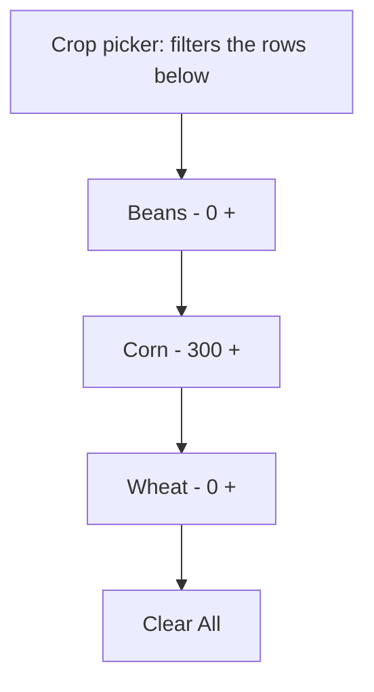

# Crop Ceiling Rows - Plan

## Goal Capsule

- **Objective:** A citizen can see and change every crop's harvest ceiling on the drone dock's Crop Ceilings tab directly, one control per crop, with no separate step to commit a change.
- **Product authority:** The user, from live play of the shipped tab. This corrects the shipped Crop Ceilings tab back toward the farming plan's per-crop-row decision (KTD6 in `docs/plans/2026-08-22-0010-feat-farming-drones-plan.md`), which the implementation departed from.
- **Open blockers:** None.

---

## Product Contract

### Summary

The Crop Ceilings tab becomes a crop picker, then one stepper row per crop, then a Clear All button. Each row is labelled with its crop's name and shows that crop's ceiling as its number. Changing the number applies the ceiling immediately. The picker filters which crop rows are shown, and an empty picker shows every crop.

### Problem Frame

The shipped tab gives the picker a different job. A citizen picks one crop, sets a single shared Ceiling number, and presses Apply Ceiling. The ceilings themselves appear only in a text list above the controls. Reading a crop's ceiling and changing it happen in two different places, and each change needs three actions. The user asked for a list of crops with a selector each, and the tab shipped one selector shared by all crops instead.

### Key Decisions

- **The picker filters the list; it does not choose a crop to edit.** (session-settled: user-directed — chosen over the shipped picker-plus-shared-field-plus-Apply shape: each crop gets its own selector, so the picker's only remaining job is narrowing the list.) Governs R1, R3, R4.
- **A change applies on its own, with no Apply button.** (session-settled: user-directed — chosen over an explicit Apply action: the value in the row is the ceiling, so there is nothing further to confirm.) Governs R6.
- **An empty picker shows all crops.** (session-settled: user-directed — chosen over showing only crops that already have a ceiling, and over showing no rows.) Governs R4.
- **The only button is Clear All, named exactly that.** (session-settled: user-directed — chosen over the shipped "Clear All Ceilings": the tab already says what is being cleared.) Governs R8.
- **The text readout of stored amounts and "holding" marks is removed.** (session-settled: user-approved — chosen over keeping it below the rows: the stepper's own number is the ceiling, and a reached ceiling already shows per area on the Farming tab as ceiling reached.) Governs R9.

### Requirements

**Layout**

- R1. The tab shows, top to bottom: the crop picker, then the crop rows, then the Clear All button.
- R2. Each crop row reads like the stepper line `Corn - 300 +`: the crop's display name on the left and that crop's ceiling as the stepper's value.

**Filtering**

- R3. The picker narrows the rows to the crops picked in it, and changing the picker's selection updates which rows are shown without reopening the tab.
- R4. When nothing is picked, the tab shows a row for every crop the drone can grow.
- R5. The picker's selection is kept per dock, so a citizen reopening the tab sees the same filtered list.

**Editing**

- R6. Changing a row's value sets that crop's ceiling at once, and it changes no other crop's ceiling.
- R7. A value of zero means the crop has no ceiling and is harvested without limit, per R25 of the farming plan.
- R8. A Clear All button returns every crop's ceiling to zero.
- R9. The tab carries no text readout of stored amounts, and no Apply button.

**Access and coverage**

- R10. Only a citizen with full access on the dock can change a ceiling or clear them. A change attempted without it is refused with a message, and the row shows the unchanged ceiling afterwards.
- R11. A crop the drone can grow that has no row on the tab can still be given a ceiling some other way, and the tab says how.

### Layout

### Acceptance Examples

- AE1. **Covers R3, R4.** **Given** the picker is empty, **when** the citizen opens the tab, **then** every growable crop has a row. **When** the citizen then picks Corn and Wheat, **then** only the Corn and Wheat rows remain.
- AE2. **Covers R6, R7.** **Given** Corn's row shows 0, **when** the citizen steps it to 300, **then** the drone stops harvesting corn once linked storage holds 300, and Wheat's ceiling is unchanged. **When** the citizen steps Corn back to 0, **then** corn is harvested without limit again.
- AE3. **Covers R8.** **Given** Corn is at 300 and Wheat at 50, **when** the citizen presses Clear All, **then** both rows show 0.
- AE4. **Covers R10.** **Given** a citizen without full access on the dock, **when** they step a row, **then** they get a refusal message and the row still shows the previous ceiling.

### Scope Boundaries

- The Farming tab is unchanged, including how it reports a reached ceiling per area.
- How ceilings are stored on the dock, and how the drone reads them, is unchanged.
- No stored-quantity or crop-icon display on the rows.

### Dependencies / Assumptions

- A row's label is set when the window opens and does not update while the window stays open (`docs/solutions/runtime-errors/autogen-template-binding-contract.md`, the DynamicTitle finding). A label holding only the crop's name is safe under this. A label holding anything that changes would go stale.
- Showing and hiding controls from a synced bool works on a mod tab (`docs/solutions/conventions/eco-server-only-mod-client-rendering-surfaces.md`). It has only been proven on buttons, not on stepper rows, so R3 needs a live check.
- The set of rows is fixed when the mod is built, while the set of growable crops is built at server start and can include crops from other mods. R11 covers the gap.

### Outstanding Questions

**Deferred to Planning**

- How many row slots to build in, and how slots are matched to crops. The farming plan's rule is to size by real use with headroom (`docs/solutions/design-patterns/vertical-stack-only-ui-design.md`, rules 6 and 7).
- What R11's fallback is. The farming plan named a chat command, and none exists yet.
- The order of rows. The current catalog is alphabetical by display name.

### Sources / Research

- `EcoServerMod/AdvancedElectronics/CropCeilingComponent.cs` — the shipped tab this replaces.
- `docs/plans/2026-08-22-0010-feat-farming-drones-plan.md` — R25 (ceiling meaning) and KTD6 (one row per crop, scrolling).
- `EcoServerMod/AdvancedElectronics/UIShowcaseComponent.cs` — the DynamicTitle and VisibilityParam probe shapes.
