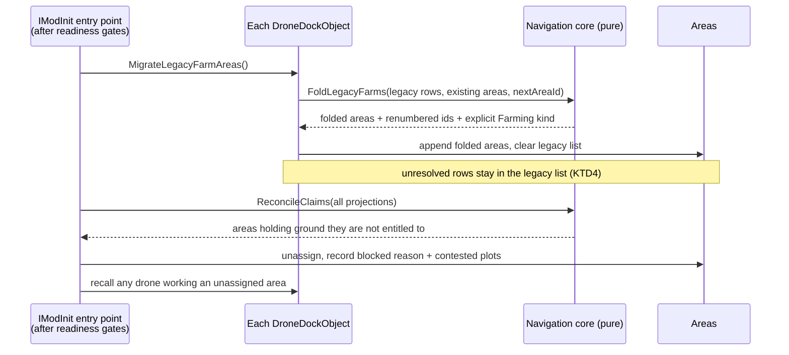
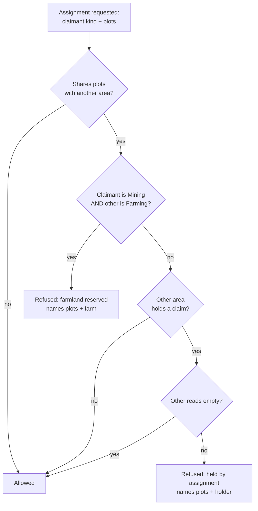

# Cross-Kind Area Conflict - Plan

## Goal Capsule

- **Objective:** a player cannot put a mining drone onto ground a farm is using, and cannot put a farm onto ground a mine holds — in either direction, whichever dock and whichever player owns each side — and ground moves from one purpose to another only by an act that says so.
- **Means:** give a farm the same area identity a mine already has, so the claim machinery that is already written and already correct stops being blind to farms (KTD1).
- **Product authority:** the mod author. There is no live-play evidence behind this: it is a requirements gap carried from the mining and farming plans, whose cross-dock conflict requirements were never delivered.
- **Authority hierarchy:** product behaviour is owned by the R-IDs; implementation mechanism is owned by the KTD-IDs within the constraints of the Rs they cite. A unit overrides neither. Key Decisions, Flows and Acceptance Examples illustrate and govern; they do not amend.
- **Execution profile:** decision logic is written test-first in the Eco-free `AdvancedElectronics.Navigation` assembly. Eco-coupled glue carries no unit tests and is proven in one batched live session, per `docs/solutions/workflow-issues/eco-mod-batched-live-testing.md`.
- **Active scope:** the mining and farming kinds. Landfill is the next kind and is not built here.
- **Stop conditions:** stop and report rather than proceeding if the fold cannot renumber farm ids without touching a survey id that persisted state references (KTD3), or if Eco's loader is found to reject rather than ignore a serialized field with no matching member.
- **Open blockers:** none.

---

## Product Contract

### Summary

Farms become ordinary areas carrying a kind, so the existing claim system covers mining-versus-farming ground conflict in both directions, across docks and across players. An assignment that would take held ground is refused and says which plots and what holds them. Ground changes purpose by an explicit kind change that preserves what the area recorded, and saves that already hold a conflict are reconciled once at load.

### Problem Frame

The rule this work delivers is already written down. `CONCEPTS.md` describes a kind-blind claim, an assignment-time refusal naming the contested plots, and a one-way farmland reservation that holds whether or not the farm is assigned. The logic that implements it exists too, in the Eco-free core, with unit tests covering both directions of the asymmetry on one geometry.

None of it reaches a real farm. A farm made through the Farming tab is a `FarmAreaEntry` on a separate per-dock list, and the world walk that feeds the claim system enumerates survey areas only — and skips any dock without a survey component besides. So the farmland reservation has no reachable input, and the farm-side stall that reports being held by an overlap has no producer at all. Both are live code that can never fire.

The cost is not a degraded experience. It is that the protection the mod claims to offer does not exist: a mining dock can today be pointed at another player's farm and will work it, and nothing in the assignment path objects. Because the enforcement was written and tested, every later reader has reason to believe the case is covered, which is the shape of gap that survives review.

### Key Decisions

- **Farms and mines are one area type carrying a kind, not two types bridged by an adapter.** The parallel type is the defect rather than an inconvenience around it, and unifying makes the existing kind-change path work for farms unchanged. *(session-settled: user-approved — chosen over projecting farms into the claim system from a second type: the adapter leaves two collections to keep in sync forever and needs a bespoke farm-to-mining conversion.)* Governs R17, R18, R19.
- **A kind change or a deletion releases farm ground; unassigning does not.** A farm between harvests is idle, not finished, and must not become claimable exactly when nobody is watching. *(session-settled: user-directed — chosen over letting unassignment release the ground, and over delete-only: delete-only drops the area's record at every purpose change.)* Governs R6, R9, R12.
- **Enforcement sits at assignment and at load, never inside a working pass.** A drone works only what its own dock claimed, so it never has to ask mid-pass what another dock is doing. A kind change counts as an assignment-time act, because it can create a conflict the same way an assignment can. Governs R1, R11, R13.
- **A save already holding a conflict is reconciled once at load rather than marked and left.** Leaving an illegal claim standing means the drone keeps working ground it is not entitled to. *(session-settled: user-directed — chosen over marking the overlap for the player to resolve, and over stalling the drone on arrival: marking leaves the damage running, and stalling would require the mid-pass check this design excludes.)* Governs R13, R14, R15, R16.
- **A dock never collides with itself; the rule targets two docks.** A dock hosts one drone, and the farming and mining interfaces belong to whichever drone is attached, so one dock cannot assign both kinds. Exempting the same dock outright also covers the drone-swap case, where a dock's older unassigned farm would otherwise reserve ground against that same dock's new mining assignment. *(session-settled: user-directed — chosen over enforcing collisions between two areas on one dock: two docks over the same ground is the undesirable case, and another player's dock the most undesirable; one dock cannot reach the state at all.)* Governs R7, R7a.
- **A kind change is refused on an assigned area, not merely on one under a working drone.** Changing the kind under a live claim leaves the area holding ground as an assignment nobody made: the claim carries the old kind's work value, so the area falls out of the new kind's assigned list while still reading as claimed. Releasing the claim silently is worse — it stops a drone as a side effect of an act the player made for another reason. *(session-settled: user-directed — chosen over releasing the claim on the change, and over allowing it: the owner described repurposing as "unassign a farming area and turn that area into a mining area", two steps.)* Governs R11a.
- **Landfill is the next kind, not a third area type.** Building the kind transition generically is what makes the mine-to-landfill-to-farm chain one mechanism.

### Actors

- A1. The dock operator — a player with full access on a drone dock, assigning areas and changing what they are for.
- A2. A second player, whose farm or mine covers some of the same ground from a different dock, possibly far away.
- A3. The server at world load, reconciling claims that persisted from before this work.

### Requirements

**Ground conflict**

- R1. An assignment that would take plots another area holds is refused, and the refusal names the contested plots and what holds them.
- R2. The held test is blind to what the ground is held for: an assigned area of any kind holds its plots against a dock of any kind.
- R3. Ground a farming area covers is held against a mining dock whether or not that farm is currently assigned.
- R4. The asymmetry in R3 runs one way only: a farm may take ground a mine has finished with.
- R5. Mining ground that reads empty holds nothing, so it is claimable even where the mining area still covers it; ground that reads cleared keeps its claim, because the exclusion behind it may lift. This is the exception R4 depends on and it never applies against a farm, which has no exhausted state.
- R6. A farm's hold ends when the farming area is deleted, or when its kind changes to something other than farming.
- R7. Conflict is decided by geometry alone between areas on **different** docks, with no owner test and no distance test, so two areas collide however far apart their docks sit and whoever owns them.
- R7a. Two areas on the same dock never collide. A dock hosts one drone and that drone's tool decides its job, so a dock cannot work two kinds of ground at once; the exemption also covers a dock that still holds an older area of the other kind after a drone swap.
- R8. Every dock holding areas participates in the conflict test, including a dock that only farms.

**Changing what ground is for**

- R9. An area's kind can change over its life, and changing it is an explicit act by whoever operates the dock.
- R10. A kind change preserves what the area recorded — its findings, its worked history, its exclusions, and its farm record.
- R11. A kind change is refused while a drone is working that area or one overlapping it, and the refusal says which dock is working what.
- R11a. A kind change is refused while the area is assigned. Unassigning first is the player's path to repurposing ground, and it is the one the owner described.
- R12. Unassigning an area never changes what it is for.

**Reconciling a save that already conflicts**

- R13. At world load, an assigned area holding plots it is not entitled to under R1 through R8 (R7a included) is unassigned.
- R14. A drone working an area unassigned by R13 returns to its dock.
- R15. An area unassigned by R13 reads as blocked, with the reason recorded where every other assignment failure reason is already written, naming the contested plots and what holds them.
- R16. Reconciliation runs once per load and changes nothing when no area is in conflict.

**One area identity**

- R17. A farm is an area carrying the farming kind, addressed by the same identity and the same per-dock collection as a mining area.
- R18. Existing farms in a saved world survive the change to R17 with their crop, their ceilings, their stall state and their assignment intact.
- R19. A dock has one limit on how many areas it may hold, replacing the separate farm and survey limits.
- R20. Nothing in this work widens or narrows who may see, edit or assign an area.

### Key Flows

- F1. A mining assignment meets a farm
  - **Trigger:** A1 assigns a mining area that overlaps a farm A2 owns.
  - **Actors:** A1, A2
  - **Steps:** The assignment is tested against every area in the world; the farm holds the shared plots regardless of its own assignment state; the assignment is refused and names the plots and the farm.
  - **Outcome:** No claim is taken and no drone is dispatched.
  - **Covers R1, R2, R3, R7, R8.**

- F2. A farm is drawn over a working mine
  - **Trigger:** A1 assigns a farming area overlapping ground a mining area already holds.
  - **Actors:** A1, A2
  - **Steps:** The same test runs from the farming side; the mining area's claim holds; the assignment is refused and names the plots and the mining area.
  - **Outcome:** No claim is taken. Drawing the area was never refused — only assigning it.
  - **Covers R1, R2, R7.**

- F3. Exhausted ground becomes a farm, and a farm becomes a mine again
  - **Trigger:** A1 changes what an area is for.
  - **Actors:** A1
  - **Steps:** The change is refused if a drone is working that area or an overlapping one; otherwise the kind changes, the area keeps everything it recorded, and its hold now answers to the new kind.
  - **Outcome:** The ground passes to its new purpose with no area redrawn and no history lost.
  - **Covers R6, R9, R10, R11.**

- F4. A save that already conflicts is loaded
  - **Trigger:** The world loads with a mining area and a farm overlapping, assigned before this work existed.
  - **Actors:** A3, A1
  - **Steps:** Reconciliation finds the mining area holds ground the farm reserves; it unassigns it; the drone returns to the dock; the area reads blocked with the reason and the contested plots.
  - **Outcome:** A1 finds out on their next visit to the dock, in the place they already go to read why an assignment is not running.
  - **Covers R13, R14, R15, R16.**

### Acceptance Examples

- AE1. **Covers R3.** Given a farm that A2 has unassigned for the winter, when A1 assigns an overlapping mining area, then the assignment is refused and names the farm.
- AE2. **Covers R4.** Given a mining area whose ground reads empty, when A2 assigns an overlapping farm, then the assignment succeeds.
- AE3. **Covers R5.** Given a mining area that reads cleared rather than empty, when A2 assigns an overlapping farm, then the assignment is refused — the exclusion behind cleared may lift.
- AE4. **Covers R6, R12.** Given a farm A2 unassigns, when A1 assigns an overlapping mining area, then the assignment is still refused; and when A2 instead deletes the farm or changes its kind away from farming, then the same assignment succeeds.
- AE5. **Covers R7.** Given two docks far enough apart that neither can work the other's ground, when their areas overlap, then the assignment is still refused.
- AE5a. **Covers R7a.** Given one dock holding an unassigned farming area, when a mining drone is attached to that same dock and an overlapping mining area is assigned, then the assignment succeeds — a dock does not hold ground against itself.
- AE6. **Covers R8.** Given a dock that holds farms and no survey areas at all, when A1 assigns an overlapping mining area from another dock, then the farm still holds its plots.
- AE7. **Covers R11.** Given a drone working an area overlapping a farm, when A2 changes that farm's kind, then the change is refused and names the working dock.
- AE8. **Covers R13, R15.** Given a saved world where an assigned mining area overlaps a farm, when the world loads, then the mining area is unassigned and reads blocked with the contested plots and the farm named.
- AE9. **Covers R16.** Given a saved world with no conflicting areas, when the world loads, then no area's assignment changes.
- AE10. **Covers R18.** Given a saved world holding farms with crops chosen and ceilings set, when the world loads after this change, then each farm keeps its crop, its ceilings and its assignment.

### Scope Boundaries

- Landfill, as a kind and as a drone. The kind transition is built so landfill slots in later; nothing landfill-specific ships here.
- Any change to who may see, edit or assign an area. Access stays Eco's own levels on the dock, per R20.
- A dedicated control for changing an area's kind. The existing chat command is a deliberate choice against the dock tab's row budget, not a gap to fill.
- Re-testing a claim during a working pass. Enforcement is at assignment and at load by decision, not by omission.
- Any rule about which materials a drone may take, which is a separate question from whether it may be on the ground at all.

#### Deferred to Follow-Up Work

- Retiring the legacy `FarmAreas` stand-in member and the `FarmAreaEntry` type. Both stay for as long as pre-fold saves are still being carried forward; removing them is a later release's decision, not this one's.
- Giving kind change a dock-tab control. Out of scope above, and it only becomes worth revisiting if the chat command proves to be a real barrier in play.

<!-- ce-section: work-relationships -->
### How This Work Fits Together

This plan covers cross-kind ground conflict for mining and farming. The breakdown below is how the surrounding work is currently understood, not a committed roadmap.

- Landfill areas and the landfill drone
  - Depends on the kind transition this plan delivers, and adds a third kind rather than a third area type.
  - Enables the mine-to-landfill-to-farm chain end to end; this plan delivers the first and last steps of it only.
  - Still to decide: whether ground that has been landfilled with a polluting material is barred from becoming farmland, and where that fact is recorded.
- Per-area automation and the shared drone queue
  - Can proceed independently of this plan; both consume the area's claim rather than defining it.
- `docs/plans/2026-08-21-001-feat-shared-area-status-plan.md` and `docs/plans/2026-08-22-0010-feat-farming-drones-plan.md`
  - Shares the model this plan enforces. Both named cross-dock conflict handling and neither delivered it; this plan is where that lands.

### Dependencies / Assumptions

- The claim, overlap and farmland-reservation logic in the Eco-free navigation core is correct and stays as written. This work supplies it with farms; it does not redesign it.
- The farm record that must survive R10 and R18 is the crop, the harvest ceilings, the stall state and the assignment. If a farm carries state that has no meaning for a mining area, it is kept rather than dropped, on the same principle that keeps mining findings across a change to farming.
- Reconciliation at load has no player to message, which is why R15 routes the reason to the assignment status surface rather than to chat.
- Changing the per-dock area limit under R19 is player-visible whichever number wins.

### Outstanding Questions

**Deferred to Planning**

- What the single per-dock area limit in R19 should be, given the two limits it replaces are 8 for farms and 10 for survey areas — and what happens to a dock that holds more areas than the surviving limit once its farms and survey areas sit in one collection. Resolved at KTD7.
- What happens to a farm that cannot be converted during the R18 migration. Resolved at KTD4.
- Whether the farm-side blocked reason required by R15 reuses the existing held-by-overlap stall reason, which is declared and rendered but has never had a producer, or whether reconciliation warrants its own reason distinct from a stall the drone hit in the field. Resolved at KTD6.
- Whether the dock's area list stays split into separate tabs for the player once the underlying collection is one, which is presentation rather than product behaviour. Resolved at KTD7.

**Resolved during planning**

- **Does one dock's own farm collide with its own mining area?** No — see R7a. A dock hosts one drone and the farming and mining interfaces belong to whichever drone is attached, so a dock cannot assign both kinds and cannot reach the state. Left unexempted it would still have bitten across a drone swap, because a farm reserves its ground unassigned (R3): a dock's older farm would have reserved ground against that same dock's new mining assignment, and reconciliation would have undone it at load. The exemption is written into the geometry test rather than left to the interface, so it does not depend on the UI staying the only way in.

**Resolve Before Planning**

- None.

### Sources / Research

- `CONCEPTS.md` — `Overlap`, `Claim`, `Kind` and `Exclusion` carry the vocabulary and the rule this plan implements. R2 through R6 restate its existing commitments rather than introducing new ones.
- `EcoServerMod/AdvancedElectronics.Navigation/AreaOverlap.cs` — the claim and overlap logic, including the farmland reservation, which is tested in both directions on one geometry and currently has no reachable input for a farm.
- `EcoServerMod/AdvancedElectronics/MiningComponent.cs` — the world walk feeding the claim system. It enumerates survey areas only, and skips any dock lacking a survey component, which is the second reason behind R8.
- `EcoServerMod/AdvancedElectronics/DroneDock.Farming.cs` — the farm area type and the assignment path that performs no conflict test today.
- `EcoServerMod/AdvancedElectronics/SurveyComponent.cs` and `EcoServerMod/AdvancedElectronics/DroneCommands.cs` — the kind-change path and its mid-pass refusal, and the reasoning for its chat-only surface.
- `EcoServerMod/AdvancedElectronics/FarmingStrategy.cs` and `EcoServerMod/AdvancedElectronics/LevelPassDriver.cs` — the farm-side consumers that follow the area type, and therefore the real extent of R17.
- `docs/solutions/conventions/a-moved-serialized-member-needs-a-stand-in-under-its-old-name.md` — the project's worked migration convention; KTD2, KTD4 and U3 follow it rather than inventing a shape.
- `docs/solutions/conventions/requirecomponent-is-re-enforced-on-every-server-load.md` — why KTD5 relaxes a gate instead of adding a component to farming-only docks.
- `docs/solutions/workflow-issues/a-test-that-builds-the-input-proves-nothing-about-the-producer.md` — the dead-code shape this work is fixing twice; its rule drives the producer sweep in U6 and U9.
- `docs/solutions/workflow-issues/eco-mod-batched-live-testing.md` — the verification profile for the Eco-coupled half.

---

## Planning Contract

**Product Contract preservation:** changed — R7 narrowed to areas on different docks, with new R7a carrying the same-dock exemption, new AE5a, and a new Key Decision recording it. All user-directed in session; every other ID keeps its original meaning. R1 through R20, A1 through A3, F1 through F4 and AE1 through AE10 carry their original IDs and meaning. Planning added two things and rewrote nothing: a `Deferred to Follow-Up Work` subsection under Scope Boundaries, and `Resolved at KTD…` pointers on the four Deferred to Planning questions, with the cap question widened to name the over-cap case planning surfaced.

### Key Technical Decisions

- KTD1. **Fold `FarmAreaEntry` into `SurveyAreaEntry` and keep one per-dock collection, `DroneDockObject.SurveyAreas`.** `SurveyAreas` is declared on the dock itself (`EcoServerMod/AdvancedElectronics/DroneDock.cs:339`), not on `SurveyComponent`, so every dock already has the collection whatever components it carries. *(session-settled: user-approved — chosen over projecting the farm type into the claim system from a second collection: the adapter leaves two collections to keep in sync forever and needs a bespoke farm-to-mining conversion.)* Instantiates the one-area-type Key Decision.
- KTD2. **The migration follows the project's existing serialized-move convention exactly: a stand-in member under the old name, a pure fold in the navigation assembly, and a call site that tolerates running more than once.** The convention is written up at `docs/solutions/conventions/a-moved-serialized-member-needs-a-stand-in-under-its-old-name.md` and already has a worked instance in `EcoServerMod/AdvancedElectronics/DroneDock.Migration.cs`. Covers R18.
- KTD3. **Renumber the farms, never the survey areas, when the two id spaces merge.** `nextAreaId` (`DroneDock.cs:385`) and `nextFarmAreaId` (`DroneDock.Farming.cs:225`) are independent counters that both start at 1, so ids collide by construction rather than by chance. Survey ids are referenced from persisted state elsewhere; farm ids are not. Covers R17, R18.
- KTD4. **A folded farm gets its kind written explicitly, and a farm that cannot be folded keeps its legacy row rather than being dropped.** A row is unfoldable only when its own contents cannot produce a valid area — an empty or malformed plot list, or a fold that threw (U4 step 3). Nothing outside the dock is resolved, so the precedent's cross-object unresolved case cannot arise here, and the branch must not be left open-ended. A kept row covering real plots holds nothing and leaves that ground unprotected until the player re-creates the farm, so U12's dump must show it. `AreaKind.Mining` is `0`, so a folded farm whose kind is left at the type default loads as a mine — the exact silent-failure shape the convention warns about. The unresolved branch keeps the data, as the precedent's unresolved branch does. Covers R18.
- KTD5. **Relax the `Publishes` gate rather than giving farming-only docks a survey component.** `Publishes` requires `HasComponent<SurveyComponent>()` (`MiningComponent.cs:230`). Adding a component instead would collide with the engine's destructive component sweep, which re-runs at every load ahead of any mod migration — see `docs/solutions/conventions/requirecomponent-is-re-enforced-on-every-server-load.md`. Covers R8.
  **Two call sites, not one.** `AllAreaProjections()` calls it directly and `AllPublishedAreas()` calls it as a method group (`.Where(Publishes)`), which a search for `Publishes(` does not find. Relaxing the gate therefore widens the Mining tab's walk as well as the claim input, so U7 owns a sweep of both.
- KTD6. **Give the existing `FarmStallReason.HeldByOverlap` its producer rather than inventing a reason, and add the mining side's missing persisted home.** The farm side already declares, renders and unit-tests that reason with no call site writing it. The mining side computes its blocked reason live (`MiningComponent.cs:441`) and persists nothing per area, so R15 needs a stored field there. Covers R15.
- KTD7. **One cap at 10, and a dock already over it keeps every area but may add none until it is back under.** 10 is the survey cap today; lowering to 8 would put existing docks over the limit for a reason the player never chose. Refusing new areas while over is the same shape as the existing cap refusal, so the surviving behaviour is one rule rather than two. The two tabs stay as the player's view onto the one collection, filtered by kind — presentation is unchanged by R17. Covers R19.
- KTD8. **Reconciliation and migration hang off the mod's existing `IModInit` behind Eco's readiness gates — not off a plugin, and not off a tab refresh.** The existing migration is invoked lazily from `MiningComponent.RefreshAll()`, and R16 requires once-per-load, which no lazy path can promise. A prioritised plugin was the obvious answer and is the wrong one: Eco's own two save migrations reject it in writing for exactly this shape. `Server/Mods/__core__/Migrations/TruckStorageToFlatbedMigration.cs:32` and `UpgradeModuleMigration.cs:51` both carry *"Not a plugin. The serializer's migration hooks run before users load, so hang off IModInit and wait for the user list and world objects"*, and both gate on `UserManager.Initializer`, `WorldObjectManager.Init` and `SettlementCommon.Initializer` through `RunIfOrWhenInitialized`. Plugin priority orders plugins against each other; it does not establish that world objects are initialized, which is the thing this work actually needs. The mod already has an `IModInit` (`EcoServerMod/AdvancedElectronics/ModRegistration.cs`), so this adds a readiness-gated entry point rather than a new registration surface. Covers R13, R16.
- KTD10. **Exactly one side of a collision is undone, chosen deterministically.** For a mining-versus-farming collision the mining side is the offender and the farm is never unassigned — that follows from R3 and R4, which already say the farm is entitled to the ground. Same-dock pairs never reach this rule at all (R7a). For a same-kind collision across two docks neither requirement settles it, so the area with the higher `(owning dock id, area id)` pair is the offender; any total order would do, and the point is that the outcome is identical on every load. `AllPublishedAreas()` walks `IWorldObjectManager.All`, whose order is not stable, so without a rule the same save can undo dock A on one load and dock B on the next. Covers R13.
- KTD9. **`CONCEPTS.md`'s `Farm Marker` entry is corrected as part of this work.** It currently states that two areas sharing ground "stop both their drones on the plots they share, symmetrically, so protection is a property of overlapping geometry rather than of any marker" — which contradicts the `Claim` entry's one-way asymmetry, contradicts `AreaOverlap.cs:480`, and describes a mid-pass stop this design excludes. Leaving it would leave the glossary asserting the opposite of the behaviour being shipped.

### High-Level Technical Design

Two shapes carry badly in prose: what happens once at load, and how a single assignment is decided.

**Load-time sequence.** Migration must complete before reconciliation can judge anything, because an unfolded farm is invisible to the claim test.

**The claim decision.** This is the existing `AreaClaims` logic; the diagram is here because the farmland branch sits deliberately ahead of the held test, which is what makes an unassigned farm still block.

The farmland branch ignores whether the farm holds a claim, and the claimant-already-holds lift does not apply to it. That ordering is already correct in `AreaOverlap.cs:480` and must survive this work unchanged.

### Assumptions

These are the plan's own bets, not decisions the product owner made. Each is cheap to correct before implementation and expensive after.

- The two dock tabs remain as separate player-facing views over one collection, filtered by kind (KTD7). Nothing asked for the tabs to merge, and merging them is a UI decision with its own row-budget consequences.
- A farm's crop, ceilings and stall state move onto the area as the area's own fields rather than into a side table. A side table would reintroduce the two-collection problem this work exists to remove.
- Eco's loader ignores a stored field with no matching member rather than rejecting the document. The convention doc records this as untested and builds for the silent case; this plan inherits that posture, and the stand-in member makes the question moot for the field that matters.
- Reconciliation judges only assignments. An area that overlaps but is unassigned needs no action at load, because holding nothing is already the correct state.

### Sequencing

Four phases, each landing something verifiable. Phases A and B must complete in order; C may start once A lands; D closes.

- **A. Make the fold decidable** — the pure arithmetic and the area's new fields, both unit-tested before anything Eco-coupled moves.
- **B. Migrate and reconcile at load** — the stand-in, the fold's call site, the blocked reason's home, the world walk that can see a farm (U6 and U7 land here, because reconciliation is wrong without them), and the readiness-gated entry point.
- **C. Close the remaining enforcement holes** — the assignment and kind-change paths.
- **D. Surfaces and truth** — one cap, the corrected glossary, and the diagnostic that makes the live session cheap.

---

## Implementation Units

| U-ID | Title | Key files | Depends on |
|---|---|---|---|
| U1 | Pure fold arithmetic for legacy farm rows | `Navigation/LegacyFarmAreas.cs`, tests | — |
| U2 | The farm record moves onto the area | `SurveyAreaEntry.cs` | — |
| U3 | Legacy stand-in and the fold's call site | `DroneDock.Migration.cs`, `DroneDock.Farming.cs` | U1, U2 |
| U4 | Readiness-gated load-time entry point | `ModRegistration.cs`, `DroneDock.Migration.cs` | U3, U5, U7 |
| U5 | Reconciliation decision and its effects | `Navigation/AreaReconciliation.cs`, `DroneDock.Migration.cs`, tests | U6, U7 |
| U6 | The blocked reason gets a home on both sides | `SurveyAreaEntry.cs`, `MiningReadout.cs`, `FarmingStrategy.cs` | U2 |
| U7 | Farms enter the world walk | `MiningComponent.cs` | U2 |
| U8 | Farm assignment takes the claim test | `DroneDock.Farming.cs` | U7 |
| U9 | Kind change and mid-pass refusal cover farms | `SurveyComponent.cs`, `DroneCommands.cs` | U7 |
| U10 | One collection, one cap, two tabs | `FarmAreaPicker.cs`, `SurveyAreaPicker.cs`, `FarmingComponent.cs`, `SurveyComponent.cs` | U3 |
| U11 | Correct the `Farm Marker` glossary entry | `CONCEPTS.md` | — |
| U12 | Diagnostic command and the batched live session | `DroneCommands.cs` | U5, U8, U9, U10 |

### U1. Pure fold arithmetic for legacy farm rows

**Goal:** decide, with no Eco types in play, what a dock's merged area list looks like after its legacy farm rows are folded in.

**Requirements:** R17, R18. Instantiates KTD3 and KTD4.

**Dependencies:** none.

**Files:**
- `EcoServerMod/AdvancedElectronics.Navigation/LegacyFarmAreas.cs`
- `EcoServerMod/AdvancedElectronics.Navigation.Tests/LegacyFarmAreasTests.cs`

**Approach:**
1. Take the legacy rows as flat value tuples carrying **every** `[Serialized]` member of `FarmAreaEntry`, not a chosen subset. There are eighteen (`FarmAreaEntry` spans `DroneDock.Farming.cs:26-178`), and the ones easily missed are the behavioural and in-progress ones: `LevelFirst`, `LevelPassStarted`, `LevelTargetHeight`, `LevelBankedSpoil`, `LastNextAction`, `LastNextDueHours`, `LastDueAtWorldSeconds`, `LastUnfitCondition`, `LastMissingMaterial`, `LastFlat`, plus `Name` and `Epoch`. `LevelFirst` alone decides whether the drone levels ground before planting (`FarmingComponent.cs:125`), so dropping it silently changes what the drone does.
2. Return, per row: the id it should take, the kind it should carry, whether it was assigned, the legacy id it consumed, and every carried member — plus the dock's new `nextAreaId`.
3. Renumber only the incoming farm rows; never return a changed id for an existing survey area (KTD3).
4. State idempotence as the property the signature can actually deliver: a legacy row whose consumed id already appears as a fold marker on an existing area is returned as no change. The fold sees ids and `nextAreaId` only, so "given rows already folded" is not observable without that marker — and without it, a second run mints fresh ids and duplicates every farm.

**Execution note:** write this test-first. It is the one piece of the migration that can be proven before a save is touched.

**Patterns to follow:** `EcoServerMod/AdvancedElectronics.Navigation/LegacyMinedStamps.cs` — a pure fold with a merge rather than a replace, and a trailing-partial-input branch that ignores rather than throws.

**Test scenarios:**
- Covers R18. A dock with three legacy farms and no survey areas folds to three areas with ids 1, 2, 3 and `nextAreaId` 4.
- Covers R18. A dock with survey areas 1 and 2 and legacy farms 1 and 2 folds the farms to ids 3 and 4, and the survey ids are returned unchanged.
- Covers R18. Every folded row carries the farming kind explicitly, never the enum default.
- Covers R18. A row with `LevelFirst` set folds to a row with `LevelFirst` set, and the same for every other carried member.
- Covers R18. The fold carries every `[Serialized]` member of `FarmAreaEntry` onto the folded row — written so that adding a member to the legacy type later fails this test rather than being dropped in silence.
- Covers R18. An assigned legacy row folds to a row flagged assigned.
- Re-running the fold against the original legacy rows **plus the areas the first run produced** returns no changes, because each folded area carries its consumed legacy id as a marker. (Feeding the fold its own output proves nothing about this, which is the producer-versus-input trap the store already documents.)
- A dock with no legacy rows returns an empty change set and an unchanged `nextAreaId`.
- A legacy row whose plot list is empty is returned as a row to keep rather than discarded, so the caller decides.
- A legacy row whose id already exceeds `nextAreaId` does not push `nextAreaId` backwards.

**Verification:** the new test class passes and the existing suite is unchanged.

### U2. The farm record moves onto the area

**Goal:** `SurveyAreaEntry` can hold everything a farm needs, so a folded farm loses nothing and a kind change preserves it.

**Requirements:** R10, R17, R18.

**Dependencies:** none.

**Files:**
- `EcoServerMod/AdvancedElectronics/SurveyAreaEntry.cs`

**Approach:**
1. Add a member for every `[Serialized]` member of `FarmAreaEntry` that has no equivalent already — the full eighteen U1 enumerates, not a chosen subset.
2. Add the fold marker: the legacy farm id this area was folded from, which is what makes U1's idempotence observable and U3's partial fold safe.
3. **Resolve the assignment carrier, which does not exist yet.** A farm's assignment is a per-entry `bool` and a dock may have several assigned at once (`AssignedFarmAreas`). The survey side has no equivalent: `AssignedSurveyAreaId` is one `int` on the dock (`DroneDock.cs:342`), and the area-side claim triple is written only through `RecordClaim(..., bool forMining)` whose `ClaimWorkValue` admits `1` for survey and `2` for mining, with `0` reserved to mean "not recorded" on an upgraded save. Add a third work value for farming and a `RecordClaim` overload taking the work value rather than a bool. Neither existing value is usable: `0` drops the claim so an assigned farm stops holding its plots, and `2` makes `IsClaimedForMining` report a mining drone working a farm.
4. Leave existing members and their names untouched — this unit only adds.

No shape-version stamp is added. The only default-collision hazard here is `AreaKind.Mining = 0`, and KTD4 already answers it by writing the folded row's kind explicitly. A serialized member nothing reads would become permanent migration surface for no benefit.

**Patterns to follow:** `FindingsVersion` in `EcoServerMod/AdvancedElectronics.Navigation/SurveyFinding.cs` for the stamped-version shape; `SurveyAreaEntry.ClaimWorkValue` for how this file already encodes an absent field.

**Test scenarios:** Test expectation: none — `SurveyAreaEntry.cs` is in the Eco-coupled server project, which the test project cannot reference, so this unit takes no unit tests. State the seam in the type's XML doc. The claim-work-value choice made here is exercised through U1's assigned-row test and U12's live session.

**Verification:** the navigation suite still passes, the server project builds with no warnings introduced, and an assigned folded farm holds its plots against another farming dock rather than reading as unclaimed.

### U3. Legacy stand-in and the fold's call site

**Goal:** a save written before this change loads its farms into the new collection, once, without losing a row.

**Requirements:** R17, R18. Instantiates KTD2 and KTD4.

**Dependencies:** U1, U2.

**Files:**
- `EcoServerMod/AdvancedElectronics/DroneDock.Migration.cs`
- `EcoServerMod/AdvancedElectronics/DroneDock.Farming.cs`

**Approach:**
1. Re-declare `FarmAreas` as a stand-in `[Serialized]` member under its exact old name, written by nothing, so an old document's field has somewhere to land.
2. Keep the `FarmAreaEntry` type declared for the same reason — the stored documents are keyed to it.
3. Add `MigrateLegacyFarmAreas()`, which returns early and untouched when the legacy list is empty, calls U1's fold, appends the folded areas under the area lock, and removes each legacy row **individually as it merges** rather than clearing the list. Clearing wholesale would discard any row KTD4 kept; not clearing at all would re-fold every row next load under fresh ids and duplicate every farm.
4. Stop new farm creation from writing the legacy list at all; it writes an area with the farming kind instead.

**Execution note:** mirror the existing `MigrateLegacyMinedStamps` structure closely enough that a reader of one recognises the other, including the early-return-keeps-data discipline.

**Patterns to follow:** `EcoServerMod/AdvancedElectronics/DroneDock.Migration.cs:71` — every early return leaves the legacy data untouched, and the lock is the area's own.

**Test scenarios:**
- Test expectation: the decision logic is covered by U1; this unit's Eco-coupled glue is proven in U12's live session. State the uncovered seam in the migration file's XML doc.

**Verification:** a dock with legacy rows ends with those rows in `SurveyAreas` and an empty legacy list; a dock with none is untouched; running the migration twice changes nothing the second time.

### U4. Readiness-gated load-time entry point

**Goal:** something runs exactly once per world load, after world objects are actually initialized, that can drive migration and reconciliation.

**Requirements:** R13, R16. Instantiates KTD8.

**Dependencies:** U3, U5, U7.

**Files:**
- `EcoServerMod/AdvancedElectronics/ModRegistration.cs`
- `EcoServerMod/AdvancedElectronics/DroneDock.Migration.cs`

**Approach:**
1. Add a readiness-gated entry point on the mod's existing `IModInit`, chaining `UserManager.Initializer`, `WorldObjectManager.Init` and `SettlementCommon.Initializer` through `RunIfOrWhenInitialized` — the shape both of Eco's own save migrations use (KTD8). Do not add a plugin.
2. Walk every `DroneDockObject`, call `MigrateLegacyFarmAreas()` on each, then hand the resulting projections to U5's reconciliation.
3. **Contain per dock.** Catch and log around each dock's fold, and around reconciliation as a whole, leaving that dock's legacy data untouched and continuing with the rest. Moving this work off a tab refresh changes the blast radius of a failure: today a bad dock costs one broken tab refresh, and at load an uncaught exception costs the world load — with no way for a player to reach the dock and fix it, and R16 guaranteeing the same throw on every subsequent attempt.
4. Keep the entry point thin — it sequences, it does not decide.

**Patterns to follow:** `Server/Mods/__core__/Migrations/TruckStorageToFlatbedMigration.cs` and `UpgradeModuleMigration.cs` in the Eco 0.14.1.1 source checkout, which are the first-party instances of this exact shape. Do **not** follow the spike's registration for this — the spike has no `Initialize` and so does not show the part that matters.

**Test scenarios:**
- Test expectation: none for the entry point itself — it is sequencing with no decision logic, and it holds Eco types. Its effects are covered by U1, U5 and the U12 live session.

**Verification:** the server starts, the fold and reconciliation each run exactly once after world objects are initialized, and a world with no legacy data and no conflicts starts indistinguishably from today. A dock that throws during its own fold does not stop the others.

### U5. Reconciliation decision and its effects

**Goal:** at load, an assignment that holds ground it is not entitled to is undone, recorded and reported.

**Requirements:** R3, R4, R5, R13, R14, R15, R16. Instantiates the reconcile-at-load Key Decision.

**Dependencies:** U6, U7.

**Files:**
- `EcoServerMod/AdvancedElectronics.Navigation/AreaReconciliation.cs`
- `EcoServerMod/AdvancedElectronics.Navigation.Tests/AreaReconciliationTests.cs`
- `EcoServerMod/AdvancedElectronics/DroneDock.Migration.cs`

**Approach:**
1. In the navigation assembly, take the full projection set and return the assignments that must be undone, each with the contested plots and the holder — reusing `AreaClaims` rather than restating its rules (per R1 through R8, R7a included).
2. Apply the offender rule (KTD10) so exactly one side of a collision is undone, deterministically. Same-dock pairs never reach it, because U7's exemption removes them before the claim test (R7a). `AreaClaims.Conflicts` is a one-sided query: asked from the mine it names the mine, asked from the farm it names the farm, so without this rule a single collision unassigns both sides.
3. In the Eco-coupled caller, unassign each named area, write the blocked reason into U6's field, and recall a drone working it.
4. Return an empty set when nothing conflicts, so R16's no-op case costs one pass and no writes.

**Execution note:** the decision half is test-first; the effects half is live-session verified.

**Patterns to follow:** `AreaClaims.Conflicts` in `EcoServerMod/AdvancedElectronics.Navigation/AreaOverlap.cs` — pass plot coordinates and projections, never entries.

**Test scenarios:**
- Covers AE8. A mining assignment overlapping a farming area is returned as an assignment to undo, with the shared plots and the farm named.
- Covers AE9. A projection set with no overlaps returns an empty result.
- Covers AE2, R4. A farming assignment overlapping a mining area whose ground reads empty is not returned — the farm is entitled to it.
- Covers R5. A farming assignment overlapping a mining area whose ground reads **cleared** produces a reconciliation where **empty** produces none — and the offender is the mine, per KTD10. AE3 itself is an assignment-time fact and is verified on U8's path, not here: the projection carries `HoldsClaim`, not the status behind it, so at this boundary "assigned farm over cleared mine" is indistinguishable from "assigned farm over assigned mine". Undoing the farm instead would leave the mine standing on farmland, and the next load would undo the mine as well, so reconciliation would never be the fixed point R16 requires.
- Covers KTD10. A mining assignment overlapping an assigned farming area returns exactly one assignment to undo, and it is the mining one.
- Covers KTD10. Two same-kind areas colliding return the same single offender whatever order the projections arrive in.
- Covers R3. A mining assignment overlapping an unassigned farming area is still returned.
- An unassigned area overlapping anything is never returned, because it holds nothing.
- Two mining areas from different docks overlapping each other return exactly one assignment to undo, not two, so reconciliation does not unassign both sides of one collision.
- Running reconciliation over its own output returns empty.

**Verification:** the new test class passes; a save built to contain a known conflict comes up with exactly that assignment undone.

### U6. The blocked reason gets a home on both sides

**Goal:** the reason an assignment was undone is readable where every other assignment failure is read.

**Requirements:** R15. Instantiates KTD6.

**Dependencies:** U2.

**Files:**
- `EcoServerMod/AdvancedElectronics/SurveyAreaEntry.cs`
- `EcoServerMod/AdvancedElectronics.Navigation/MiningReadout.cs`
- `EcoServerMod/AdvancedElectronics/FarmingStrategy.cs`

**Approach:**
1. Add a persisted blocked-reason field on the area for the mining side, which today computes its reason live and stores nothing.
2. Make `FarmStallReason.HeldByOverlap` writable and give the held-plot count a real value to carry. This unit **declares, persists and renders** the reason; U5 is its only writer. Splitting it that way is deliberate: the reason currently has no producer at all, and two units both claiming to write it is how it would end up with none again.
3. Extend the mining readout's stop-reason formatting with the reconciliation case, naming plots and holder.
4. Sweep for producers rather than trusting the type: grep every writer of the stall ordinal and every construction of the blocked reason, in this unit, so the new case cannot be another postponed edit.

**Approach note:** the sweep in step 4 is the point of the unit, not housekeeping. This codebase already shipped a boundary default that silently mislabelled farm areas as mining, and the store's rule for that shape is to make the call sites explicit inside the same change.

**Patterns to follow:** `MiningReadout.FormatStopReason` for the existing reason vocabulary and `MiningReadout.FormatClaimRefusal` for how plots and holders are named.

**Test scenarios:**
- Covers R15. The formatted reconciliation reason names the plot count and the holding area.
- Covers R15. A farm area carrying the held-by-overlap reason renders the existing stall text with a real held-plot count rather than the renderer's defensive minimum.
- An area with no blocked reason renders exactly as it does today.
- The reason survives a save and load round trip.

**Verification:** the readout tests pass, including the existing refusal-string assertions, and no existing reason string changes.

### U7. Farms enter the world walk

**Goal:** every area a dock holds reaches the claim system, whatever kind it is and whatever components its dock carries.

**Requirements:** R2, R3, R7, R7a, R8. Instantiates KTD5 and the same-dock Key Decision.

**Dependencies:** U2.

**Files:**
- `EcoServerMod/AdvancedElectronics/MiningComponent.cs`
- `EcoServerMod/AdvancedElectronics.Navigation/AreaOverlap.cs`
- `EcoServerMod/AdvancedElectronics.Navigation.Tests/AreaClaimTests.cs`

**Approach:**
0. Exempt same-dock pairs in `AreaClaims` (R7a), ahead of the farmland branch. Both the assignment paths and reconciliation read the same rule, so it belongs in the shared decision rather than in each caller. Today `IsSameAreaAs` compares area id *and* owning dock id, which correctly excludes an area from itself but not from its siblings on the same dock.
1. Relax `Publishes` so a dock qualifies by holding areas rather than by carrying a survey component.
2. Leave the projection's contents as they are — id, dock, plots, holds, kind — so nothing downstream gains access to an area's findings.
3. Confirm the claim computation for a farming-kind area reflects R3: a farm holds its plots whether or not it is assigned.
4. **Sweep both call sites and every consumer downstream of them**, in this unit. `Publishes` is reached from `AllAreaProjections()` and, as a method group, from `AllPublishedAreas()` (KTD5) — which feeds the Mining tab's offered list and its out-of-range dock count. Confirm each consumer either filters by kind or is correct for a farming-kind projection, and record the result in the method's XML doc. The out-of-range count is not kind-filtered today, so a farming-only dock would start being counted as a mining dock that is merely too far away.

**Approach note:** do not add a component to farming-only docks instead. The engine re-enforces component declarations destructively at every load, ahead of any mod migration, so that route has a failure mode this one does not.

**Patterns to follow:** the existing projection construction at the enumeration boundary, and its stated reason for projecting there rather than passing entries.

**Test scenarios:**
- Covers AE5a, R7a. Two overlapping areas on the same dock produce no conflict, in both kind orders, and the farmland branch does not fire between them.
- Covers R7. The same two geometries on two different docks do produce a conflict, so the exemption is scoped to the dock and not to the geometry.
- Covers AE6. A dock holding only farming-kind areas contributes projections.
- Covers R3. A farming-kind area that is unassigned still projects as holding its plots.
- Covers R7. Projections carry no owner or distance filtering.
- A destroyed dock contributes nothing.

**Verification:** the existing overlap and claim suites pass unchanged, and a farming-only dock's areas appear in the diagnostic projection dump.

### U8. Farm assignment takes the claim test

**Goal:** assigning a farm is refused when it would take held ground, exactly as assigning a mine already is.

**Requirements:** R1, R2, R4, R5, R7.

**Dependencies:** U7.

**Files:**
- `EcoServerMod/AdvancedElectronics/DroneDock.Farming.cs`

**Approach:**
1. Add the conflict scan and refusal to the farm assignment path, under the same static claim lock the mining and survey paths already share, so scan and write cannot interleave.
2. Return the refusal in the same shape the other two paths return it, naming plots and holder.
3. Leave the existing refusals — area missing, no acting citizen, insufficient access — in place and ahead of the claim test.

**Patterns to follow:** the locked scan-then-write in `EcoServerMod/AdvancedElectronics/DroneDock.Mining.cs` and its counterpart in `DroneDock.cs`; use the same refusal formatter.

**Test scenarios:**
- Test expectation: the refusal decision is covered by the existing `AreaClaimTests` plus U5's new cases; this unit's glue is proven in U12's live session. Note the seam in the method's XML doc.

**Verification:** assigning a farm over held ground is refused with a message naming the plots; assigning one over free ground succeeds; the existing access refusals still fire first.

### U9. Kind change and mid-pass refusal cover farms

**Goal:** a farm can become a mine, and neither direction can change under a working drone.

**Requirements:** R6, R9, R10, R11.

**Dependencies:** U7.

**Files:**
- `EcoServerMod/AdvancedElectronics/SurveyComponent.cs`
- `EcoServerMod/AdvancedElectronics/DroneCommands.cs`

**Approach:**
1. Extend `AreasUnderAWorkingDroneNow()` to yield the area a farming drone is working. It currently yields only the assigned survey and mining areas, so the mid-pass refusal is blind to farming and R11 would still fail after the fold.
2. Run the `AreaClaims.Conflicts` test on the kind change itself, refusing a change that would leave an overlapping assigned area holding ground it would no longer be entitled to. R11 only refuses while a drone is *working*, and `DroneIsWorking` is false for an assigned dock whose drone is docked between passes — so without this, changing a mine's neighbour to farming leaves an assigned mine holding farmland until the next restart, which is the state R13 exists to undo.
3. Confirm `ChangeAreaKind` now reaches folded farms, since they are `SurveyAreaEntry` values in `SurveyAreas`.
3. Confirm the chat command's area lookup finds them for the same reason.
4. Sweep every producer of the working-area enumeration for the same blindness, rather than fixing the one call site.

**Patterns to follow:** the existing refusal wording in `ChangeAreaKind`, which distinguishes this area from an overlapping one.

**Test scenarios:**
- Test expectation: the refusal text and the overlap test are already covered; the enumeration change is Eco-coupled and proven in U12's live session. State the seam in the method's XML doc.

**Verification:** covers AE7 — with a farming drone working an area, changing the kind of an overlapping area is refused and names the working dock; with no drone working, the change succeeds and the area keeps its record.

### U10. One collection, one cap, two tabs

**Goal:** the dock holds one list of areas, with one limit, and the player still sees farms and survey areas where they expect them.

**Requirements:** R17, R19. Instantiates KTD7.

**Dependencies:** U3.

**Files:**
- `EcoServerMod/AdvancedElectronics/FarmAreaPicker.cs`
- `EcoServerMod/AdvancedElectronics/SurveyAreaPicker.cs`
- `EcoServerMod/AdvancedElectronics/FarmingComponent.cs`
- `EcoServerMod/AdvancedElectronics/SurveyComponent.cs`

**Approach:**
1. Point both pickers at `SurveyAreas`, each filtering by the kind its tab shows.
2. Replace the two caps with one limit of 10 over the whole collection.
3. Refuse a new area when the dock is at or over the limit, with the existing cap-refusal wording, so a dock left over the limit by the fold keeps every area and simply cannot add another.
4. Raise both tab cursors' `Range` upper bounds and clamp each against its own kind-filtered count rather than the whole collection. `FarmingComponent.SelectArea` is bound to `MaxFarmAreas` (8) and `SurveyComponent.ViewPosition` to `MaxSurveyAreas` (10), so without this a player cannot address the areas KTD7 promises to keep — the over-cap dock in this unit's own verification is unreachable past ten.
4. Keep name-uniqueness scoped as it is today rather than widening it, unless the existing check already spans the collection.

**Test scenarios:**
- Test expectation: picker behaviour is Eco-coupled UI; covered in U12's live session. The cap arithmetic, if extracted, takes a unit test — otherwise state the seam.

**Verification:** the Farming tab lists only farming-kind areas and the Survey tab only the rest; a dock at 10 refuses an eleventh in both tabs; a dock folded to 12 keeps all 12 and refuses a thirteenth.

### U11. Correct the `Farm Marker` glossary entry

**Goal:** `CONCEPTS.md` stops asserting the opposite of the behaviour that ships.

**Requirements:** supports R3, R4, R11. Instantiates KTD9.

**Dependencies:** none.

**Files:**
- `CONCEPTS.md`

**Approach:**
1. Rewrite the closing paragraph of `Farm Marker`, which currently says two overlapping areas stop both their drones symmetrically and that protection is geometric rather than marker-based.
2. State instead what the `Claim` entry and the code both hold: the hold is one-way in the farmland case, it is decided at assignment rather than mid-pass, and it follows the area's kind.
3. Fix the proposition, not the pointer — do not leave the wrong sentence standing with a cross-reference bolted on.

**Patterns to follow:** the surrounding entries' voice, and the `Claim` entry as the authority this one must agree with.

**Test scenarios:** Test expectation: none — documentation. Verified by reading `Farm Marker` and `Claim` together and finding no contradiction.

**Verification:** `scripts/validate-learnings.py` still passes, and the two entries agree on all three axes: direction, timing, and what carries the hold.

### U12. Diagnostic command and the batched live session

**Goal:** one live session proves the Eco-coupled half, without a restart per question.

**Requirements:** R13, R14, R15, R16, R18.

**Dependencies:** U5, U8, U9, U10.

**Files:**
- `EcoServerMod/AdvancedElectronics/DroneCommands.cs`

**Approach:**
1. Add a diagnostic subcommand that dumps, for every dock: each area's id, kind, assignment, claim state, blocked reason, and whether it holds or is held.
2. Ship it in the same unit as the live session it serves, so the session is one deploy.
3. Build the test save deliberately — a pre-fold world with at least one farm overlapping an assigned mining area, one clean farm, and a dock over the new cap.

**Execution note:** batch every question into one deploy and one restart. Verify the deploy tree before asking for a restart.

**Patterns to follow:** `docs/solutions/workflow-issues/eco-mod-batched-live-testing.md`, and the existing diagnostic subcommands in the same file.

**Test scenarios:**
- Test expectation: none for the command itself — it is a read-only dump. It exists so the scenarios below can be checked in one pass.

**Verification, in one session:**
- A pre-fold save loads; every farm appears in the dock's area list with the farming kind, its crop and its ceilings intact (AE10).
- The overlapping mining assignment is undone, its drone is at the dock, and the area reads blocked with the plots and the farm named (AE8).
- The clean farm is untouched and still assigned — reconciliation touched only the conflicting assignment (R16). AE9's own world-level precondition is verified by U5's no-overlap unit test, not here.
- Assigning a mining area over the farm is refused and names it (AE1).
- Unassigning that farm and retrying the mining assignment is still refused (AE4).
- Assigning a farm over mining ground that reads empty succeeds (AE2); over ground that reads cleared it is refused (AE3).
- A dock whose fold threw still appears in the diagnostic dump with its legacy rows intact, and the rest of the world loaded.
- Changing the farm's kind to mining, then retrying, succeeds — and the area still shows what it recorded (AE4, R10).
- The over-cap dock keeps all its areas and refuses a new one (R19).
- Restarting a second time changes nothing further (R16).

---

## Verification Contract

- `dotnet build EcoServerMod/AdvancedElectronics` — zero errors, and no new warnings.
- `dotnet test EcoServerMod/AdvancedElectronics.Navigation.Tests` — the suite stands at 629 passing today; it must pass with the new classes added and no existing test modified to accommodate a change in behaviour. A test that has to be edited to keep passing is a finding, not a chore.
- `scripts/validate-name-match.sh` — client and server names still agree.
- `scripts/validate-provenance.sh` — every tracked asset still declares a licence.
- `scripts/validate-learnings.py` — the learnings store's frontmatter contract holds after U11.
- `scripts/package-release.sh` — only when cutting a release; it runs the provenance gate itself.
- **Two existing tests were edited, and that is a finding this contract requires be recorded rather than waved through.** `FarmlandIsReservedEvenAgainstTheDockThatHoldsIt` and `AClaimantSkipsGroundItAlreadyHolds` both placed their pair on one dock and asserted a conflict. R7a exempts a dock from itself, so both scenarios became vacuous — `Assert.Single` would have seen zero, not one. Each was re-pointed to the cross-dock geometry where it still proves what it meant, and the first renamed, because its old name asserted the reversed rule. Neither assertion was weakened. R7a is user-directed, so the reversal is intended; the edits are its consequence, not an accommodation of a defect.
- The U12 live session is the acceptance gate for everything Eco-coupled. No unit that names a live-session verification is done on a green build alone.

**Uncovered by automation, by design.** The Eco-coupled half has no unit coverage and will not gain any: the test project references the navigation assembly only. Every unit above that says so names the seam in its own XML doc, so the gap is discoverable from the code rather than from this plan.

---

## Definition of Done

**Global**

- Every requirement R1 through R20, R7a included, is either implemented or explicitly carried by a unit above.
- The full test suite passes, with new tests for U1, U5 and U6's readout formatting — the logic that lives in the Eco-free assembly — and no existing test weakened.
- The U12 live session has been run once and every scenario in it observed.
- A pre-fold save and a fresh world both start clean, and a second restart changes nothing further.
- `CONCEPTS.md` and the code agree about the farmland hold's direction, timing and carrier.
- `MiningReadout.FormatBlockedReason`'s `reconciliationBlock` parameter was added, tested, and removed again within this work: nothing could fill it, because by the time that row renders the dock's assignment is gone and the job carries no area identity. R15 is served by the per-area roster annotation instead. It is named here because a parameter no producer fills is precisely the defect this feature exists to remove.
- Abandoned approaches leave no code behind — no half-wired second collection, no unused projection path, no stall reason added and not produced. This work exists because two such remnants were mistaken for working features; adding a third would be the same defect.
- The legacy stand-in member and `FarmAreaEntry` remain declared and documented as legacy receivers, with a comment saying what would have to be true before they can go.

**Per unit**

- Its test scenarios pass, or its stated seam is recorded in the XML doc where a reader of that method will find it.
- Its verification line is observed, not inferred from a green build.

---

## Risks & Dependencies

- **A folded farm loading as a mine.** `AreaKind.Mining` is `0`, so any row whose kind is not written explicitly reads as mining, silently, and becomes claimable by a neighbour's mining dock. Mitigated by KTD4 and asserted directly in U1's tests; this is the single highest-consequence failure in the plan.
- **Id collision on the fold.** Two counters both starting at 1 guarantee it. Mitigated by KTD3, and by renumbering the side that nothing else references.
- **Running before world objects are initialized.** Reconciling against a half-loaded world would unassign areas whose counterpart had not loaded. A prioritised plugin does not prevent this — priority orders plugins against each other, not against object initialization — which is why KTD8 uses Eco's own readiness gates instead. Worth an explicit assertion in the live session that every dock was seen.
- **A partial fold leaving a dock with areas in both collections.** The unresolved branch keeps legacy data by design (KTD4), so this state is reachable and must read sensibly rather than as duplicate areas. U12's dump is the way to see it.
- **Eco's loader behaviour on an unmatched serialized field is still untested.** Inherited from the convention doc rather than introduced here. The stand-in member makes it moot for `FarmAreas`; it remains an open question for the project generally.

---

## System-Wide Impact

- **Persisted state changes shape.** This is the second serialized move in this codebase and it follows the first one's convention. The standing rule it answers to is that a mod update must never ask a player to reset a world.
- **The claim system gains inputs it never had.** Every consumer of `AllAreaProjections` now sees farming-kind areas. The projection's contents do not change, so no consumer gains access to data it was previously denied — but any consumer that assumed every projection was a mine now needs checking. U7 is where that sweep belongs.
- **Two player-facing limits become one.** A dock that today holds 8 farms and 10 survey areas can hold 18; after this it holds 10. No existing dock loses an area, but the ceiling moves, and that is visible.
- **The glossary changes meaning, not just wording.** U11 reverses a stated behaviour. Anyone who read `Farm Marker` and built on it was reading something the code never did.
